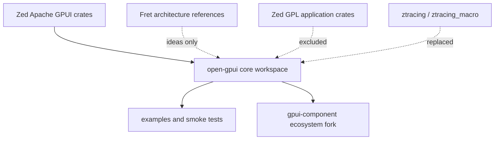

# ADR 0001: Open GPUI Fork Strategy

**Status**: Accepted
**Date**: 2026-06-06

## Context

Open GPUI starts as a new Rust workspace that extracts the GPUI framework lineage from the Zed
repository. Zed still contains the most complete GPUI implementation, but the Zed repository is now
primarily an editor application, not a standalone UI framework project.

The project also has two reference inputs:

- `repo-ref/gpui-component`: an Apache-2.0 component library that currently depends on GPUI crates
  from the Zed git repository.
- `repo-ref/fret`: an experimental Rust UI framework whose architecture work is useful for
  platform/render/runtime/component boundary decisions, but whose implementation should not be
  mixed into the initial GPUI extraction.

The first architectural problem is not implementation velocity. It is preserving a clean license
and dependency boundary while keeping enough API compatibility for the existing GPUI ecosystem.
This does not require a fork-free dependency graph. When an upstream crate lacks behavior that is
necessary for GPUI's renderer, text, or platform backend correctness, Open GPUI may own a focused
fork rather than removing framework functionality.

## Decision

Open GPUI will be built as a clean workspace, not as a direct full-repository fork of Zed.

The first implementation phase will import only the Apache-2.0 GPUI framework dependency closure
from Zed, then make it build independently in this workspace. The initial crate names should remain
compatible with the current GPUI ecosystem where practical, especially for crates consumed by
`gpui-component`.

The initial import set is expected to include:

- `gpui`
- `gpui_platform`
- `gpui_wgpu`
- `gpui_linux`
- `gpui_windows`
- `gpui_macos`
- `gpui_web`
- `gpui_macros`
- `gpui_shared_string`
- `gpui_util`
- `collections`
- `util`
- `http_client`
- `http_client_tls`
- `reqwest_client`
- `media`
- `scheduler`
- `refineable`
- `derive_refineable`

The project must not import Zed's GPL-licensed tracing crates. Any dependency on `ztracing` or
`ztracing_macro` must be replaced with ordinary `tracing`, feature-gated local instrumentation, or
a new Apache-2.0 compatible crate owned by this workspace.

For permissively licensed third-party crates, the preferred order is:

1. Use the crates.io upstream crate unchanged when it preserves required behavior.
2. Adapt Open GPUI code to upstream APIs when that does not regress renderer, text, or platform
   behavior.
3. Own a small Open GPUI fork when the fork carries necessary behavior that upstream lacks or has
   not accepted yet.

Owned forks must preserve the required behavior, keep their delta documented, remain license-clean,
and have focused verification gates. Open GPUI must not drop capabilities merely to avoid carrying
an owned fork.

`gpui-component` will be forked or imported only after the core Open GPUI workspace can build and
run at least one native example. Its first integration target is dependency rewiring and smoke
compatibility, not a broad component redesign.

## Architecture

## Alternatives Considered

### Option A: Clean workspace with selective Apache import

Pros:

- Keeps license boundaries explicit.
- Avoids carrying Zed editor application complexity.
- Preserves a path to crates.io publication.
- Lets `gpui-component` migrate with minimal public API churn.

Cons:

- Requires workspace manifest reconstruction.
- Requires dependency cleanup for crates that were never meant to stand alone.
- Requires careful attribution and license preservation.

Decision: chosen.

### Option B: Full Zed fork followed by deletion

Pros:

- Fastest way to get a compiling snapshot initially.
- Preserves all internal dependency paths during early experiments.

Cons:

- Pulls in GPL application crates and editor-specific infrastructure.
- Makes the repository look like a Zed product fork rather than a UI framework.
- Increases CI, dependency, and maintenance cost.
- Makes license review harder.

Decision: rejected.

### Option C: Start from `gpui-component` and depend on upstream Zed GPUI

Pros:

- Fast component demos.
- Smaller initial code import.

Cons:

- Leaves the core framework controlled by upstream Zed.
- Blocks independent GPUI evolution.
- Makes component work brittle because the framework dependency is still moving elsewhere.

Decision: rejected for the core project. This remains useful only as a temporary compatibility
reference.

## Success Metrics

| Metric | Target | Measurement |
| --- | --- | --- |
| License boundary | No GPL crate in the default workspace dependency graph | `cargo metadata` and manual manifest review |
| Core build | `cargo check --workspace` passes after first import phase | Local command evidence |
| Smoke example | At least one native GPUI example builds and runs | `cargo run -p <example>` |
| Component readiness | `gpui-component` can be rewired without patching core APIs broadly | focused compatibility diff |
| Documentation | Import decisions and license exceptions have ADR coverage | ADR review |

## Risks and Mitigations

| Risk | Severity | Likelihood | Mitigation |
| --- | --- | --- | --- |
| Hidden GPL dependency enters the workspace | High | Medium | Review manifests before import; reject `ztracing` and application crates |
| Zed-specific names leak into public framework API | Medium | High | Run a Zed-name cleanup lane after the first compiling import |
| `gpui-component` requires unstable GPUI internals | Medium | Medium | Keep initial GPUI crate names/API compatible, then migrate deliberately |
| Platform backends increase first-import scope | Medium | High | Import native/web backends as separate lanes after core manifest closure is stable |
| Fret ideas cause scope creep | Medium | Medium | Use Fret as architecture input only until Open GPUI has its own build and examples |

## Consequences

- The repository starts as a virtual Cargo workspace with a minimal facade crate.
- The first substantial code lane is GPUI core import and manifest normalization.
- `ztracing` replacement is a serial blocker for any imported crate that currently depends on it.
- `gpui-component` is intentionally delayed until the core framework has a verified build surface.
- Some dependencies may become Open GPUI-owned forks when that is the cleanest way to preserve
  framework behavior without depending on Zed-controlled fork artifacts.
