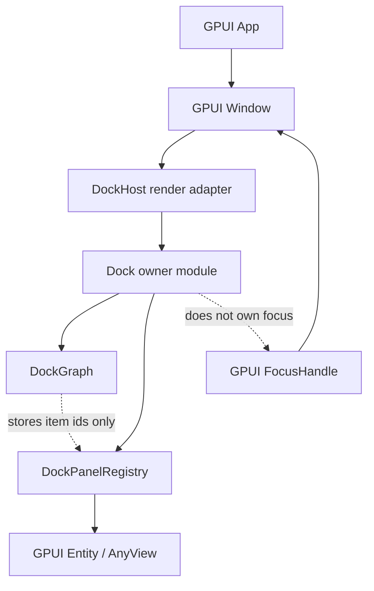
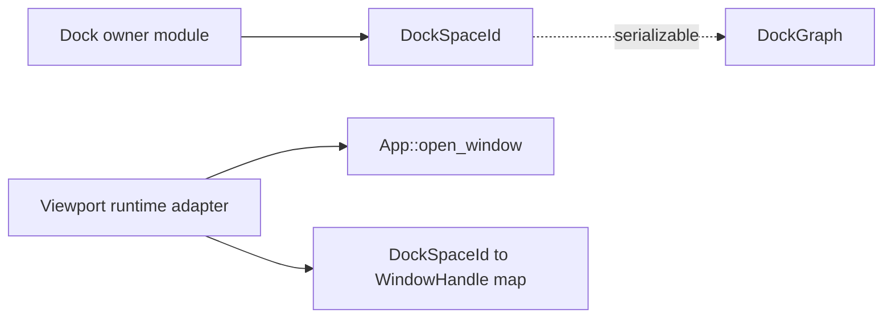

# ADR 0002: Docking GPUI Integration

**Status**: Accepted
**Date**: 2026-06-08

## Context

Open GPUI now has an optional `open-gpui-docking` crate with a pure dock graph, retained host
rendering, panel registration, layout import/export, controller-backed viewports, and a native
multi-viewport dogfood example. Docking interactions include tab activation, rendered drag/drop,
splitter resizing, in-window floating chrome, panel close/reopen policy, and runtime-opened
platform viewports.

GPUI already has authoritative modules for platform windows, input, focus, and retained view
lifecycle:

- `App` owns platform window creation, active window lookup, and window stack queries.
- `Window` owns the draw surface, event routing, hitboxes, pointer capture, frame scheduling, and
  bounds.
- `FocusHandle` and `Focusable` own focus semantics inside a window.
- `Entity`, `AnyView`, and `Render` own retained view state and rendering.
- `WindowOptions::tabbing_identifier` is native window tabbing, not editor-style docking tabs.

Docking needs to use these modules without becoming a second GPUI runtime or a second window
manager.

## Decision

Docking will model logical dock layout separately from GPUI platform windows.

`DockGraph` remains pure data. It stores dock spaces, nodes, tab stacks, split fractions, in-window
floating bounds, and stable `DockItemId` values. It must not store `WindowHandle`, `WindowId`,
`Entity`, `AnyView`, `FocusHandle`, or platform-window state.

`DockPanelRegistry` remains the adapter from `DockItemId` to GPUI panel metadata and retained view
content. A graph can be serialized and tested without this registry.

`DockHost` is a GPUI render adapter for one logical dock space in one GPUI window. Long-term docking
state coordination belongs behind a deeper owner module in `open-gpui-docking`, not in the render
adapter.

GPUI `App` and `Window` remain the only modules that create and manage platform windows. Platform
viewport docking uses a runtime adapter that maps `DockSpaceId` values to GPUI `WindowHandle`
values through `App::open_window`; that mapping stays outside `DockGraph`.

GPUI focus remains authoritative. Dock active-tab state is layout selection, not a second focus
system. Docking interactions may ask GPUI to focus a rendered view, but they must not maintain a
parallel focus table.

Docking tabs and native window tabs remain separate concepts. `DockNode::Tabs` is an editor-style
dock tab stack. `WindowOptions::tabbing_identifier` and platform tab controllers are native
window-tabbing behavior.

In-window floating containers and platform floating windows remain separate concepts. A
`DockNode::Floating` is layout data inside a dock host. A platform floating window is created by
GPUI platform-window machinery.

Implementation note, 2026-06-09: rendered docking interactions now pass through
crate-internal interaction and transaction modules before mutating the graph. Render callbacks
collect pointer facts, the drop resolver produces a resolved target, the workspace transaction
validates and commits that target, and viewport tear-off enters through
`DockViewportRuntimeHandle` before an internal runtime coordinator opens windows and mutates the
graph. The active drop session stores a resolved target from layout facts rather than a tab-only
intent, so preview and commit stay tied to the same resolver output. Splitter and floating pointer
sessions emit crate-private resize/bounds requests that the host commits through
controller/workspace transactions, rather than constructing public `DockAction` values from render
callbacks.
Runtime-opened viewports publish host-local drop scenes so cross-viewport drops route through the
destination host before graph mutation. Item and whole-stack drag payloads share that route, and
successful routed drops activate the destination viewport. Tab close chrome reads descriptor
metadata from `DockPanelCatalog` and commits through the same panel lifecycle transaction used by
programmatic close actions.
Viewport close policy is explicit: retain-on-close preserves layout while removing the runtime
mapping, prevent installs a GPUI should-close veto for runtime-opened windows, and merge-back moves
the closing viewport's content into a configured fallback dock space before cleanup.
GPUI's captured native drag transport is source-owned and generation-bound. GPUI reserves the
exact drag generation before invoking the drag listener, Dock prepares one consumer for that
generation, and drag-start commit activates the GPUI drag and Dock route together. After the source
input transaction and outer application borrow have ended, the native capture owner publishes an
immutable physical callback frame through the GPUI outbox. Each fact retains its original ingress
sequence, signed source client point, client-to-screen point, coherent source geometry, and a
point-scoped native window hit stack. Dock can therefore route a preview and release without raw
pointer delivery to the target HWND.

For release, GPUI invokes the prepared route's generation-frozen locker before any source-window
mouse interceptor or listener. Dock resolves the candidate and stores an immutable opaque
reservation containing the exact route generation and host-scene frame. Post-borrow delivery may
only confirm that reservation; it never performs a second hit test. A redraw may replace the
renderer-owned frame token only when the registration, host binding, runtime context, bounds,
interactive geometry, and complete routing scene remain semantically identical. The frozen
candidate and position do not change. A listener, close, registration replacement, or semantic
scene change fails closed instead of adopting a candidate that did not exist when `MouseUp` was
observed. Resolver panic is captured by the reservation and rethrown only after post-borrow
terminal claim has detached the exact route, so normal cleanup still retires its session and
feedback.

`MouseUp`, capture loss, pointer cancellation, source close, and session shutdown are terminal
facts for that exact route. A terminal claim detaches the route before runtime effects execute, and
cleanup retires its previews, session, and anchor even if resolution or commit panics. An
unavailable, cross-point, incomplete, stale, or incoherent hit observation fails closed rather than
falling through an opaque window or reusing the last preview. The former 16 ms host-local
mouse-button poll is not a fallback authority. Backends advertise `window_hit_stack` only when they
can provide the complete point-scoped observation; other backends return `Unavailable` and cannot
claim cross-window native routing.
Named `DockWorkspace` and `DockController` command methods are the preferred public programmatic
interface for explicit non-move commands such as selection, panel close/reopen, floating, and split
resize. `DockAction` remains available when applications need command objects. `DockOp` is
crate-internal graph mutation machinery, so render code and applications do not need to understand
source/target node ids, zones, and insertion indexes to commit ordinary drag/drop.
Descriptor dock-class metadata and per-space dock-class policy live outside `DockGraph`.
Preview-time resolution can render rejected targets for incompatible routes, and workspace commit
validation applies the same policy before graph mutation for item, tabs-stack, floating-subtree,
open, and empty-space moves. This preserves the graph as pure layout data while still giving
applications editor-like docking zones.
Keep-alive central regions are also dock-space metadata rather than placeholder nodes. When runtime
mutations create a new root in an empty central space, the graph rebinds that metadata to the new
root so panel restore, empty-space drops, tabs moves, and floating subtree promotion recover central
identity without serializing fake empty tabs.

## Architecture

Platform viewport detach is an adapter, not graph state:

## Alternatives Considered

### Option A: Keep docking independent and adapt to GPUI windows

Pros:

- Keeps `DockGraph` serializable and testable.
- Preserves GPUI's existing platform-window and focus modules.
- Allows single-window docking to ship before OS-level detach.
- Keeps `open-gpui-docking` optional.

Cons:

- Requires a docking owner module before interaction work can stay clean.
- Future OS-level detach needs an adapter and additional tests.

Decision: chosen.

### Option B: Store GPUI window handles in `DockGraph`

Pros:

- Looks direct for OS-level detach.

Cons:

- Makes graph serialization platform-dependent.
- Couples layout mutation to GPUI window lifecycle.
- Makes pure graph tests unable to cover the authoritative layout model.

Decision: rejected.

### Option C: Move docking into `crates/gpui`

Pros:

- Gives direct access to GPUI internals.

Cons:

- Makes docking part of the core framework even when applications do not need it.
- Increases public surface before interaction semantics are stable.
- Conflicts with the current optional crate strategy.

Decision: rejected unless a future missing primitive is proven and documented separately.

### Option D: Reuse native window tabbing for docking tabs

Pros:

- Reuses platform behavior on macOS.

Cons:

- Native window tabs and editor-style dock tabs have different semantics.
- It would not work consistently across all GPUI targets.
- It would tie ordinary panel tab stacks to platform-window grouping.

Decision: rejected.

## Consequences

- `DockGraph` and `DockLayout` remain serializable logical state; platform-window mappings,
  placement snapshots, active/hovered window signals, and retained views stay in runtime modules.
- Rendered tab drag/drop, splitter resize, floating drag, panel close, viewport route, and tear-off
  transactions enter through interaction/runtime seams rather than direct graph-shaped render code.
- Tests should continue separating graph layout state, workspace/controller transactions, GPUI
  rendering, and platform-window routing.
- Future work should expand unsupported platform backends where the OS provides reliable button
  state, and add richer focus/accessibility polish without weakening the graph/runtime boundary.
