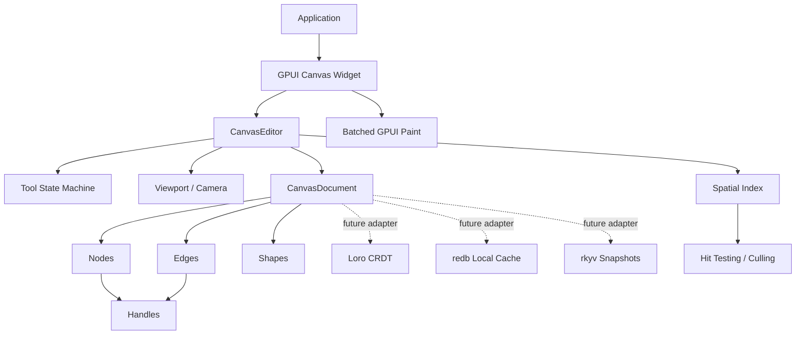

# ADR 0002: Open GPUI Canvas Architecture

**Status**: Accepted
**Date**: 2026-06-08

## Context

Open GPUI needs a reusable canvas foundation for applications that behave like Figma,
draw.io, MarginNote mind maps, Obsidian Canvas, React Flow / Svelte Flow, or xyflow-style node
editors. The crate must serve desktop GPUI applications first, while leaving room for local-first
documents, collaboration, persistence, and large graph performance.

The reference inputs are intentionally split by concern:

- `repo-ref/xyflow`: use the public data model ideas, especially separate `nodes` and `edges`,
  typed node data, endpoint handles, and graph utilities.
- `repo-ref/tldraw`: use the tool state machine, shape-with-bounds model, document records,
  migrations, and local-first mindset.
- JSON Canvas / Obsidian Canvas: use the simple JSON mental model of canvas nodes and edges as an
  interchange format, not as the only storage model.

Open GPUI must not copy xyflow's DOM rendering model. React Flow and Svelte Flow position DOM
nodes absolutely, which is productive for web UI but becomes a performance ceiling for tens of
thousands of nodes. GPUI canvas must be a retained document model plus explicit culling,
hit-testing, and batched paint paths.

## Decision

Create a new workspace crate named `open-gpui-canvas`, imported as `open_gpui_canvas`.

The first version will provide a renderer-aware but renderer-decoupled canvas core:

- A document model with separate node, edge, and shape collections.
- Strong ID newtypes for nodes, edges, shapes, handles, tools, and selections.
- Stable geometry primitives based on GPUI `Point<Pixels>`, `Size<Pixels>`, and
  `Bounds<Pixels>`.
- Handles as invisible, serializable connection points on nodes.
- Edges that reference node handles instead of rendered elements.
- Edge route metadata for straight, polyline, orthogonal, cubic-bezier, and custom routers,
  including manual waypoints, bezier control points, route options, and interaction width.
- A viewport/camera model that is separate from document data.
- A spatial index and hit-test API that can be rebuilt or incrementally updated without changing
  document serialization.
- A JSON Canvas adapter that maps text/file/link/group nodes into `CanvasNode` records and maps
  edge sides into deterministic node handles.
- A small tool state machine inspired by tldraw states such as idle, pointing, translating,
  panning, pinching, connecting, and editing text.
- Optional future adapters for Loro, `rkyv`, and `redb`, kept outside the core MVP unless they are
  feature-gated.

The core crate should not require one GPUI element per canvas object. A GPUI adapter may render
selected controls, text editors, or node widgets through elements, but the document, hit testing,
and default rendering path must be able to paint visible canvas records in batches.

## Architecture

## Data Model

The canonical document is made of records:

- `CanvasDocument`: metadata plus `IndexMap` collections for nodes, edges, and shapes.
- `CanvasNode`: id, kind, position, size, z-index, flags, arbitrary serializable payload, and
  handles.
- `CanvasEdge`: id, kind, source endpoint, target endpoint, z-index, flags, style, route
  metadata, and payload.
- `CanvasShape`: id, kind, bounds, z-index, flags, style, and payload.
- `CanvasHandle`: id, side or local position, role, visibility, and connection permissions.
- `CanvasEndpoint`: node id plus optional handle id.

The distinction between nodes and shapes is intentional. Nodes are semantic graph objects with
handles and optional application payload. Shapes are drawable records with bounds and no required
graph semantics. Applications may build mind-map topics as nodes, freehand strokes as shapes, and
links as edges in the same document.

Route metadata is stored as intent, not as a renderer contract. The core model records route kind,
manual waypoints, optional control points, route-specific options, and interaction width so that
hit testing and persistence remain stable. Actual path generation, obstacle avoidance, arrowhead
rendering, and router plugins remain outside the core document model.

JSON Canvas import/export is implemented as an adapter around the core records. It preserves
`text`, `file`, `link`, and `group` node payload fields in `CanvasNode::data`, maps node and edge
colors into `CanvasStyle`, and maps `fromSide` / `toSide` into deterministic side handles. This
keeps Obsidian-style interchange useful without making JSON Canvas the canonical storage format.

## Tool Model

Tools should be local, explicit, and easy to test:

- `CanvasTool` owns the active mode.
- `CanvasEvent` carries normalized pointer, keyboard, wheel, tick, and cancel events.
- `CanvasEditor::handle_event` dispatches the event to the active tool.
- Tools emit `CanvasCommand` values instead of mutating random state directly.
- Commands are applied through one mutation path, which later enables undo, persistence, and CRDT
  translation.

The first implementation can use an enum-based reducer. A trait-based plugin API can be added once
the built-in state transitions are stable.

## Alternatives Considered

### Option A: Pure data model crate first

Pros:

- Fast to publish.
- Clean serialization contract.
- No GPUI rendering coupling.

Cons:

- Does not prove interaction ergonomics.
- Risks designing a model that is awkward for GPUI hit testing and painting.

Decision: rejected as too shallow for a useful Open GPUI ecosystem crate.

### Option B: GPUI widget with one element per node

Pros:

- Simple mental model for ordinary UI developers.
- Easy to integrate text fields, buttons, and node widgets.
- Similar to xyflow's productive authoring model.

Cons:

- Recreates the DOM-style scaling ceiling.
- Culling and hit testing become secondary rather than architectural.
- Harder to support large local-first documents.

Decision: rejected for the core rendering path. A widget adapter may still host selected node UI.

### Option C: Renderer-aware canvas core plus GPUI adapter

Pros:

- Keeps the document and interaction model reusable.
- Allows batched paint and spatial culling from the start.
- Leaves a path for node widgets without making them the default rendering unit.
- Gives future CRDT and persistence adapters a stable command/document boundary.

Cons:

- More upfront design work.
- Requires careful API boundaries to avoid a large unstable surface.

Decision: chosen.

## Success Metrics

| Metric | Target | Measurement |
| --- | --- | --- |
| Package identity | `open-gpui-canvas` builds as a workspace crate | `cargo check -p open-gpui-canvas` |
| Model correctness | Node, edge, handle, viewport, and hit-test basics are covered | crate unit tests |
| Rendering direction | The default path can render visible records without per-record elements | code review and smoke example |
| Extension path | Applications can define custom payloads without forking core types | serde payload examples/tests |
| Release hygiene | The crate follows Open GPUI package metadata and docs attribution | manifest and README review |

## Risks and Mitigations

| Risk | Severity | Likelihood | Mitigation |
| --- | --- | --- | --- |
| The core API overfits flowchart nodes | High | Medium | Keep shapes, nodes, and edges separate; keep payloads generic or JSON-backed |
| Large graphs still render too slowly | High | Medium | Make culling and hit testing first-class before rich node widgets |
| CRDT choices leak into the base model too early | Medium | Medium | Keep Loro/redb/rkyv behind future adapters and command boundaries |
| GPUI widget APIs force document churn | Medium | Medium | Separate `CanvasDocument`, `CanvasEditor`, viewport state, and adapter caches |
| Unstable public API becomes hard to change | Medium | High | Keep 0.x SemVer explicit and document migration points in changelog |

## Consequences

- `open-gpui-canvas` becomes a separate ecosystem crate, not a submodule hidden inside `open-gpui`.
- The first implementation must include tests for model operations and hit testing before adding
  rich visual polish.
- Future collaboration and persistence work should translate commands or document diffs rather than
  mutate renderer caches directly.
- The public API may remain intentionally small in 0.1 while the crate proves interaction and
  rendering paths through examples.
