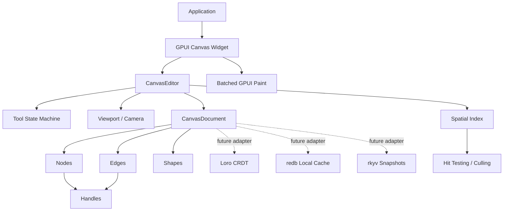

# ADR 0002: Open GPUI Canvas Architecture

**Status**: Accepted
**Date**: 2026-06-08

## Context

Open GPUI needs a reusable canvas foundation for applications that behave like Figma,
draw.io, MarginNote mind maps, Obsidian Canvas, React Flow / Svelte Flow, or xyflow-style node
editors. The crate must serve desktop GPUI applications first, while leaving room for local-first
documents, collaboration, persistence, and large graph performance.

The reference inputs are intentionally split by concern:

- `repo-ref/xyflow`: use the public data model ideas, especially separate `nodes` and `edges`,
  typed node data, endpoint handles, and graph utilities.
- `repo-ref/tldraw`: use the tool state machine, shape-with-bounds model, document records,
  migrations, and local-first mindset.
- JSON Canvas / Obsidian Canvas: use the simple JSON mental model of canvas nodes and edges as an
  interchange format, not as the only storage model.

Open GPUI must not copy xyflow's DOM rendering model. React Flow and Svelte Flow position DOM
nodes absolutely, which is productive for web UI but becomes a performance ceiling for tens of
thousands of nodes. GPUI canvas must be a retained document model plus explicit culling,
hit-testing, and batched paint paths.

## Decision

Create a new workspace crate named `open-gpui-canvas`, imported as `open_gpui_canvas`.

The first version will provide a renderer-aware but renderer-decoupled canvas core:

- A document model with separate node, edge, and shape collections.
- Strong ID newtypes for nodes, edges, shapes, handles, tools, and selections.
- Stable geometry primitives based on GPUI `Point<Pixels>`, `Size<Pixels>`, and
  `Bounds<Pixels>`.
- Handles as invisible, serializable connection points on nodes.
- Edges that reference node handles instead of rendered elements.
- Edge route metadata for straight, polyline, orthogonal, cubic-bezier, and custom routers,
  including manual waypoints, bezier control points, route options, and interaction width.
- A viewport/camera model that is separate from document data.
- A spatial index and hit-test API that can be rebuilt or incrementally updated without changing
  document serialization.
- A `CanvasSpatialIndex` query trait so future R-tree, tile, or GPU-assisted culling indexes can
  plug into query and hit-test call sites without changing document records.
- A JSON Canvas adapter that maps text/file/link/group nodes into `CanvasNode` records and maps
  edge sides into deterministic node handles.
- A persistence boundary based on checkpoints and monotonic transaction logs.
- An explicit snapshot migration boundary with a minimum supported format version and monotonic
  migration table.
- A small tool state machine inspired by tldraw states such as idle, pointing, translating,
  panning, pinching, connecting, and editing text.
- Optional future adapters for Loro, `rkyv`, and `redb`, kept outside the core MVP unless they are
  feature-gated.

The core crate should not require one GPUI element per canvas object. A GPUI adapter may render
selected controls, text editors, or node widgets through elements, but the document, hit testing,
and default rendering path must be able to paint visible canvas records in batches.

The first GPUI adapter follows that rule by building a `CanvasPaintModel` snapshot from a document,
spatial index, and viewport. Its prepaint step queries the visible document bounds through
`SpatialIndex`, and its paint step emits GPUI quads and paths through the low-level `canvas`
callback. It intentionally does not own application state or turn every record into an element;
future overlays can layer selected node widgets on top of this batched base renderer.

The default `SpatialIndex` remains a simple sorted record vector because it is predictable and easy
to verify in the first release. Query call sites also have an object-safe `CanvasSpatialIndex`
visitor trait. That trait deliberately covers query and hit-test traversal, not document mutation
or cache ownership, so future R-tree or tile indexes can be introduced without making
`CanvasEditor` generic too early.

The native smoke example exercises the interaction boundary without expanding the public adapter
surface. The view owns a mutable `CanvasEditor`, snapshots it into `CanvasPaintModel` for each
render, and registers GPUI pointer and wheel listeners from the canvas paint callback where the
actual canvas bounds are known. `CanvasInputMapper` converts window-space GPUI events into
canvas-local `CanvasEvent` values, while mutation remains in the application-owned editor.
The same example tracks focus on the canvas container and dispatches key-down events through
`CanvasInputMapper::key_down_event`, so Delete, Backspace, and Escape use the same reducer path as
application-owned keyboard integrations.

Interaction feedback is also snapshot-based. `CanvasPaintModel` carries a `CanvasPaintInteraction`
copy of selection and tool state, `CanvasPaintFrame` marks selected records and computes transient
selection rectangles or connection previews, and the batched painter draws those overlays after the
base records. This keeps visual affordances visible in native examples without moving mutable
editor state into the renderer or rendering every record as a GPUI element.

Record visibility and interaction lock state are separate. Hidden records are omitted from default
paint and hit-test paths unless explicitly included. Locked records remain visible for culling and
painting, but default hit tests, box selection, endpoint picking, and node translation skip them.
`HitOptions::include_locked` keeps diagnostics and editor-specific inspection tools possible
without making locked records accidentally interactive.
Handle visibility and connection roles are enforced before the connect tool creates an edge.
`CanvasConnectionEndpointRole` and `CanvasHandle` helpers centralize endpoint-role semantics so
built-in tools, custom tools, and rendering adapters do not duplicate source/target rules. Hidden
or non-connectable handles are omitted from default endpoint hit testing, source-only handles cannot
be used as targets, and target-only handles cannot be used as sources. Invalid handle gestures are
ignored at the picking layer rather than allowed to fail later as document mutation errors.
Connection preview rendering uses the same target-picking semantics to snap to valid hovered
endpoints while leaving invalid handles as ordinary pointer positions.

The first tool extensibility boundary is an effect layer rather than a trait plugin system.
Built-in tools compute `CanvasToolEffect` values and `CanvasEditor` applies those effects through
one path for recorded transactions, unrecorded gesture updates, undo commits, selection changes,
viewport changes, and tool-state changes. This keeps the enum-based MVP simple while giving custom
tools and future CRDT adapters a stable mutation vocabulary.
Selection effects include replace, add, remove, toggle, set, and clear operations. This keeps
multi-select behavior available to custom tools and future modifier-key interactions without
requiring each tool to mutate `CanvasSelection` directly.

Keyboard input uses the same reducer path as pointer input. `CanvasKey` and `CanvasKeyModifiers`
keep key events renderer-neutral, while the GPUI adapter maps `KeyDownEvent` into `CanvasEvent`.
The select tool's Delete/Backspace behavior emits a normal recorded transaction, skips locked
records, and lets selection pruning, undo, persistence logging, and future CRDT operation batches
observe the deletion through the same mutation boundary.
The GPUI adapter maps Escape key-down events to `CanvasEvent::Cancel` instead of a plain key event,
so built-in and custom tools have one renderer-neutral cancellation event for active gestures.
Pointer down, pointer move, and pointer up events carry the same modifier shape as key events.
This avoids a parallel modifier model when adding shift-click, additive marquee selection,
constrained dragging, or tool-specific modifier gestures.
The first built-in modifier behavior is shift-click selection toggling. It uses
`CanvasToolEffect::ToggleSelection`, does not create undo history, and does not start a drag.
Shift-drag on blank canvas is additive rather than cumulative: the tool snapshots the base
selection at pointer-down time, unions intersection hits with that baseline while the marquee
moves, and preserves the baseline selection even when the pointer crosses back over empty space.
Pointing and selection states also use that base-selection snapshot as the cancel target, so
aborted blank clicks or marquee gestures restore the pre-gesture selection rather than committing
transient selection mutations.
When the editor is idle, the same Cancel event clears the current selection so Escape acts as a
single dismissal key across active gestures and passive selection states.
Shift-constrained node translation uses pointer-move modifiers, chooses the dominant axis from the
first shifted move, and preserves that axis while Shift remains held so graph layouts can align
nodes without a separate transform mode.

## Architecture

## Data Model

The canonical document is made of records:

- `CanvasDocument`: metadata plus `IndexMap` collections for nodes, edges, and shapes.
- `CanvasNode`: id, kind, position, size, z-index, flags, arbitrary serializable payload, and
  handles.
- `CanvasEdge`: id, kind, source endpoint, target endpoint, z-index, flags, style, route
  metadata, and payload.
- `CanvasShape`: id, kind, bounds, z-index, flags, style, and payload.
- `CanvasHandle`: id, side or local position, role, visibility, and connection permissions.
- `CanvasEndpoint`: node id plus optional handle id.

The distinction between nodes and shapes is intentional. Nodes are semantic graph objects with
handles and optional application payload. Shapes are drawable records with bounds and no required
graph semantics. Applications may build mind-map topics as nodes, freehand strokes as shapes, and
links as edges in the same document.

Route metadata is stored as intent, not as a renderer contract. The core model records route kind,
manual waypoints, optional control points, route-specific options, and interaction width so that
hit testing and persistence remain stable. `CanvasEdgeRouter` turns that intent into
renderer-neutral `CanvasRoutePath` / `CanvasRouteSegment` values. The default router supports
straight and polyline routes through line segments, orthogonal routes through simple midpoint
doglegs, and cubic-bezier routes through control points. `edge_route_path_with_router` and
`edge_bounds_with_router` let applications supply obstacle-aware, port-aware, or preview routers
without changing document serialization. Arrowhead rendering and full obstacle avoidance remain
outside the core document model.

JSON Canvas import/export is implemented as an adapter around the core records. It preserves
`text`, `file`, `link`, and `group` node payload fields in `CanvasNode::data`, maps node and edge
colors into `CanvasStyle`, and maps `fromSide` / `toSide` into deterministic side handles. This
keeps Obsidian-style interchange useful without making JSON Canvas the canonical storage format.

Graph queries are exposed through two explicit paths. `CanvasGraph` is a zero-cache borrowed view
that scans the canonical edge list for incoming, outgoing, incident, neighbor, endpoint, and
directed edge-between queries. `CanvasGraphIndex` is an application-owned adjacency cache for hot
graph traversal. It stores edge endpoints plus outgoing, incoming, and incident edge ID sets,
preserves document edge order, deduplicates self-loop incident edges, and can apply
`CanvasDocumentDiff` by rebuilding only affected node adjacency. This keeps the simple `nodes` /
`edges` data model while giving xyflow-style graph applications a scalable query path without
putting hidden cache state inside `CanvasDocument`.

Document transactions expose two record-level views. `DocumentCommand::record_id`,
`DocumentCommand::record_change`, `CanvasTransaction::record_ids`, and
`CanvasTransaction::record_changes` translate the canonical command stream into ordered intent
changes. `CanvasCommittedMutation` is the semantic view produced by the document mutation journal:
it carries the applied transaction, inverse transaction, actual `CanvasDocumentDiff`, and actual
record changes after document rules have run. A node deletion that removes incident edges therefore
produces node and edge delete changes in the committed mutation, even when the original command
stream only named the node.
`CanvasRecordOperation` and `CanvasRecordOperationBatch` add the transaction sequence,
operation index, optional origin, and transaction metadata around either view. Persistence logs and
future CRDT adapters should consume committed mutation batches when they need actual document
semantics, while command-derived batches remain useful for intent inspection and legacy log entries.

Persistence is defined as a small store trait rather than a concrete database choice. The core
crate can save a `CanvasCheckpoint`, append ordered `CanvasLogEntry` transactions, load entries
after a checkpoint sequence, and compact entries once a newer checkpoint is durable. Replay rejects
non-monotonic sequences so local caches and future collaboration layers share one ordering
contract. `redb`, Loro, and `rkyv` remain adapter choices: `redb` can back a local checkpoint/log
store, Loro can translate transactions or diffs into collaborative operations, and `rkyv` can
optimize snapshots once the public record format stabilizes.

The persistence byte boundary is separate from the typed store boundary. `CanvasPersistenceCodec`
encodes and decodes typed checkpoints and log entries, while `CanvasPersistenceByteStore` only
persists checkpoint bytes and sequence-keyed log-entry bytes. `CanvasJsonPersistenceCodec` is the
default codec and wraps every record in a `CanvasPersistenceEnvelope` containing the codec version,
document format version, record kind, sequence, and payload. `CanvasPersistenceByteStoreAdapter`
turns any byte store plus codec into the existing typed `CanvasPersistenceStore`. This keeps redb
and other local KV stores focused on durability, and leaves a future `rkyv` codec free to replace
the JSON byte format without changing the editor or transaction APIs.

Optional persistence and collaboration adapters have explicit feature boundaries before concrete
dependencies are introduced. `redb-store`, `loro-crdt`, and `rkyv-snapshot` are reserved feature
names, and `CanvasPersistenceAdapterStatus` reports both whether a feature is enabled and whether
the adapter is actually implemented. The default build only implements the in-memory store; enabling
an adapter feature is not treated as proof that a concrete backend exists. This keeps the core crate
honest while leaving a stable place to attach optional dependencies later.

Applications can connect editor mutations to persistence through `CanvasPersistenceCursor` and
`apply_persistent_transaction`. The helper prepares a committed mutation against the current editor
document, appends a monotonic `CanvasLogEntry` through the abstract store, then applies that same
prepared mutation through `CanvasEditor`. This keeps `CanvasEditor` free of concrete storage
ownership while giving future redb, Loro, and `rkyv` adapters one consistent transaction-log entry
point. Unrecorded gesture updates remain outside the persistence log until committed as explicit
transactions.

`save_canvas_checkpoint` complements the log hook by writing a snapshot at the current cursor
sequence and compacting log entries through that sequence. Checkpointing is explicit rather than
automatic so applications can choose their own durability cadence and retry policy.

`apply_persistent_tool_effects` bridges the tool reducer model to the same persistence boundary.
Recorded tool transactions are appended to the log before they are applied, transient
`ApplyUnrecorded` gesture updates remain in-memory, and the final `PushUndo` effect commits the
completed gesture as one forward transaction derived from the editor's current document state.
`handle_persistent_event`, `handle_persistent_event_with_custom_tool`, and
`handle_persistent_event_with_tool_registry` provide the application-level convenience path over
that same boundary. They reduce the active tool event into effects first, then apply the effects
through the persistence runner, so applications can choose either explicit effect orchestration or a
single event-dispatch entrypoint. The editor still does not own the store or cursor; this keeps
redb, Loro, `rkyv`, and application retry policy outside the core editor state.

`undo_persistent_transaction` and `redo_persistent_transaction` close the same loop for editor
history. They peek the next undo or redo transaction, validate it against the current document,
append it to the monotonic log, then call the editor's in-memory undo or redo operation. A store
append failure therefore leaves the editor, history, and cursor unchanged, while successful replay
reconstructs the final document state even though the replay path does not rebuild interactive undo
stacks.

Snapshot evolution is explicit. `CanvasSnapshot::migrate_to_current` and
`migrate_canvas_snapshot` are the only restore path used by `CanvasDocument::from_snapshot`.
Current v1 snapshots migrate as a no-op, future versions are rejected, and versions below the
minimum supported format are rejected before validation. The migration table is intentionally empty
for v1, but tests require future entries to be monotonic and contiguous so redb, Loro, and `rkyv`
adapters do not need to guess which schema they are reading.

## Tool Model

Tools should be local, explicit, and easy to test:

- `CanvasTool` owns the active mode.
- `CanvasEvent` carries normalized pointer, keyboard, wheel, tick, and cancel events.
- `CanvasEditor::handle_event` dispatches the event to the active tool.
- Tools emit `CanvasToolEffect` values instead of mutating editor state directly.
- Effects are applied through one mutation path, which later enables undo, persistence, and CRDT
  translation without binding the core to a trait-object plugin model too early.

The first custom-tool boundary is intentionally reducer-shaped. `CanvasTool::custom` selects an
application-owned tool, `CanvasToolContext` exposes read-only document, viewport, selection,
history, and spatial-index state, and `CanvasToolReducer` returns `CanvasToolEffect` values for the
editor to apply. This avoids giving extensions mutable access to `CanvasEditor`, so undo, selection
retention, spatial-index refresh, persistence logging, and future CRDT translation still pass
through the same effect vocabulary.

`CanvasToolRegistry` is an ergonomic adapter over the same reducer contract. It maps
`CanvasToolId` values to boxed reducers, dispatches the active custom tool, and reports a
`MissingTool` error when an application selects a custom tool that was not registered. Built-in
tools still use the same editor event path, so the registry remains a lookup layer rather than a
second mutation path.

The native smoke example now covers this registry path with an application-defined stamp tool. A
right-click selects `CanvasTool::custom`, dispatches through `CanvasToolRegistry`, inserts a node by
returning `CanvasToolEffect` values, and then returns to the built-in select tool.

## Alternatives Considered

### Option A: Pure data model crate first

Pros:

- Fast to publish.
- Clean serialization contract.
- No GPUI rendering coupling.

Cons:

- Does not prove interaction ergonomics.
- Risks designing a model that is awkward for GPUI hit testing and painting.

Decision: rejected as too shallow for a useful Open GPUI ecosystem crate.

### Option B: GPUI widget with one element per node

Pros:

- Simple mental model for ordinary UI developers.
- Easy to integrate text fields, buttons, and node widgets.
- Similar to xyflow's productive authoring model.

Cons:

- Recreates the DOM-style scaling ceiling.
- Culling and hit testing become secondary rather than architectural.
- Harder to support large local-first documents.

Decision: rejected for the core rendering path. A widget adapter may still host selected node UI.

### Option C: Renderer-aware canvas core plus GPUI adapter

Pros:

- Keeps the document and interaction model reusable.
- Allows batched paint and spatial culling from the start.
- Leaves a path for node widgets without making them the default rendering unit.
- Gives future CRDT and persistence adapters a stable command/document boundary.

Cons:

- More upfront design work.
- Requires careful API boundaries to avoid a large unstable surface.

Decision: chosen.

## Success Metrics

| Metric | Target | Measurement |
| --- | --- | --- |
| Package identity | `open-gpui-canvas` builds as a workspace crate | `cargo check -p open-gpui-canvas` |
| Model correctness | Node, edge, handle, viewport, and hit-test basics are covered | crate unit tests |
| Rendering direction | The default path can render visible records without per-record elements | code review and smoke example |
| Extension path | Applications can define custom payloads without forking core types | serde payload examples/tests |
| Release hygiene | The crate follows Open GPUI package metadata and docs attribution | manifest and README review |

## Risks and Mitigations

| Risk | Severity | Likelihood | Mitigation |
| --- | --- | --- | --- |
| The core API overfits flowchart nodes | High | Medium | Keep shapes, nodes, and edges separate; keep payloads generic or JSON-backed |
| Large graphs still render too slowly | High | Medium | Make culling and hit testing first-class before rich node widgets |
| CRDT choices leak into the base model too early | Medium | Medium | Keep Loro/redb/rkyv behind future adapters and command boundaries |
| GPUI widget APIs force document churn | Medium | Medium | Separate `CanvasDocument`, `CanvasEditor`, viewport state, and adapter caches |
| Unstable public API becomes hard to change | Medium | High | Keep 0.x SemVer explicit and document migration points in changelog |

## Consequences

- `open-gpui-canvas` becomes a separate ecosystem crate, not a submodule hidden inside `open-gpui`.
- The first implementation must include tests for model operations and hit testing before adding
  rich visual polish.
- Future collaboration and persistence work should translate commands or document diffs rather than
  mutate renderer caches directly.
- The public API may remain intentionally small in 0.1 while the crate proves interaction and
  rendering paths through examples.
