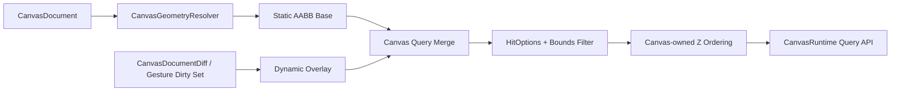

# ADR 0003: Open GPUI Canvas Spatial Index Strategy

**Status**: Accepted
**Date**: 2026-06-08

## Context

`open-gpui-canvas` needs to support large document canvases without copying xyflow's DOM rendering
model. The first release already has the important boundaries:

- `CanvasRuntime` owns runtime caches;
- `CanvasGeometryResolver` owns geometry semantics;
- `SpatialIndex` remains a dev/test correctness oracle and simple fallback model;
- production editor and paint paths query `CanvasRuntime` rather than borrowing a raw
  `SpatialIndex`;
- tests prove hidden, locked, handle, margin, z-order, custom-router, and kind-registry behavior.

The open question is which index strategy should become the long-term default for large canvases.
The candidates are:

- the current sorted-vector index;
- a dynamic R-tree / R*-tree;
- a static packed AABB index;
- a static base plus dynamic overlay hybrid.

## Decision

Keep the current sorted-vector `SpatialIndex` as the 0.1 dev/test oracle and fallback model.

Adopt an internal runtime cache with this shape:

The runtime-owned prototype uses this hybrid shape:

- stable base records for committed document state;
- overlay records for active gesture records and recent diffs;
- stale suppression by semantic `CanvasRecordId`;
- final `HitOptions`, GPUI bounds semantics, precise hit filtering, and z-order ordering in the
  runtime query module;
- no public API that names `rstar`, `static_aabb2d_index`, or another concrete dependency.

The first landed prototype keeps the base and overlay as internal sorted record sets. Concrete index
crates remain dev-only until benchmark data justifies replacing the internal base with a packed
static AABB index or replacing the overlay with a dynamic tree.
The public object-safe index trait was removed before 0.1 because it asked external adapters to
own final query semantics. Future third-party indexes should be coarse candidate providers behind
the runtime query module instead.

## Alternatives Considered

### Option A: Keep sorted-vector index indefinitely

Pros:

- Simple and deterministic.
- Very easy to test and debug.
- No extra dependency or cache invalidation complexity.

Cons:

- Visible query and point hit-test scale linearly with record count.
- Paint-frame culling cost tracks full vector scan cost.

Decision: keep for 0.1, but not treat it as the final large-canvas answer.

### Option B: Replace default with one dynamic R-tree

Pros:

- Strong sparse point-query behavior.
- One structure can handle inserts, removes, and moves.
- Mature Rust crate support through `rstar`.

Cons:

- Bulk rebuild was slower than current vector in the initial grid benchmark.
- Z-order ordering still needs canvas-side sorting.
- Long routed edges can reduce pruning quality.

Decision: do not make it the base default. Use it as the likely dynamic overlay candidate.

### Option C: Replace default with one static AABB index

Pros:

- Best initial rebuild and visible-query measurements.
- Good fit for paint-frame culling of stable documents.
- Simple immutable snapshot behavior.

Cons:

- Cannot update records in place.
- Full per-frame rebuild is too expensive for drag gestures.

Decision: use as the likely stable base, not as the whole strategy.

### Option D: Static base plus dynamic overlay

Pros:

- Matches the canvas workload: large stable background, small active edits.
- Keeps paint-frame queries fast while gestures avoid base rebuilds.
- Gives committed diffs a natural cache update path.

Cons:

- More implementation complexity.
- Needs precise stale-record suppression and overlay merge semantics.
- Current benchmark spike proves correctness but not final runtime performance.

Decision: chosen as the next internal prototype direction.

## Success Metrics

| Metric | Current Baseline | Target | Measurement |
| --- | ---: | ---: | --- |
| Grid visible query | 25.64-30.41 us | Static/hybrid path remains under 10 us | Criterion `spatial_index/grid/query/*` |
| Grid sparse hit test | 37.01-40.43 us | Dynamic/static query remains under 1 us before final ordering | Criterion `spatial_index/grid/hit_test/*` |
| Grid static rebuild | 5.36-6.13 ms current vector | Static base rebuild under 3 ms | Criterion `spatial_index/grid/rebuild/*` |
| Correctness parity | 198 passing tests | No parity regression | `cargo nextest run -p open-gpui-canvas` |
| Public API stability | No concrete index names | Keep dependency names out of public API | API review before release |

## Risks and Mitigations

| Risk | Severity | Likelihood | Mitigation |
| --- | --- | --- | --- |
| Hybrid cache overcomplicates runtime internals | Medium | Medium | Keep current vector default until a diff-fed prototype passes parity and benchmarks. |
| Public strategy knobs freeze the wrong model | High | Medium | Do not expose concrete dependencies or presets until runtime data shows real need. |
| Third-party index semantics differ from GPUI bounds | High | Medium | Treat third-party queries as coarse filters and reapply canvas `Bounds::intersects` / hit semantics. |
| Overlay misses incident edge refreshes | High | Medium | Derive stale sets from committed diffs and graph incidence; keep parity tests for moved/deleted nodes. |
| Benchmark overfits grid layouts | Medium | Medium | Keep dense-overlap, clustered, long-edge, and mixed workloads in the benchmark suite. |

## Consequences

- `rstar` and `static_aabb2d_index` stay as dev-only spike dependencies for now.
- The production runtime now owns a runtime query module over spatial cache internals.
- Public editor and paint paths no longer expose a raw runtime `SpatialIndex` accessor.
- The root crate API no longer re-exports `SpatialIndex`; benchmarks and parity tests reach it
  through the hidden `index` module.
- The next architecture work should benchmark the internal runtime path before adding public index
  selection APIs.
- A future user-facing choice, if needed, should be semantic (`Auto`, `Simple`, `Dynamic`,
  `StaticSnapshot`, `Hybrid`) rather than dependency-specific.

## Related Documents

- `docs/research/canvas-spatial-index.md`
- `docs/research/canvas-spatial-index-benchmark-results.md`
- `docs/plans/2026-06-08-002-perf-canvas-spatial-index-benchmark-plan.md`
