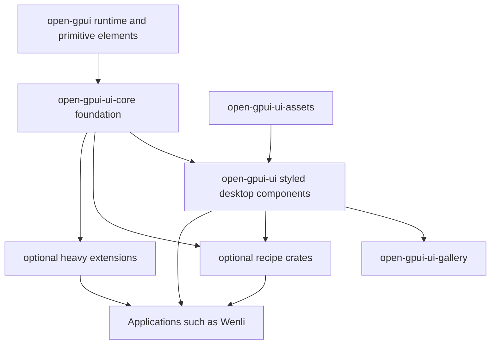

# ADR 0004: Open GPUI Component Library Strategy

**Status**: Proposed
**Date**: 2026-06-15

## Context

Open GPUI currently has a core runtime, low-level GPUI elements, and optional ecosystem crates such
as `open-gpui-docking` and `open-gpui-canvas`. The core crate already provides the mechanisms that a
component ecosystem needs: retained views, entities, actions, focus handles, window lifecycle,
input, text, styling, accessibility integration, and primitive elements such as `div`, `text`,
`img`, `svg`, `canvas`, `anchored`, `list`, and `uniform_list`.

It does not currently provide a first-party application component library. Applications can build
UI directly with GPUI primitives, but each serious application then has to rebuild the same hard
surface area: theme tokens, density, layout conventions, keyboard behavior, focus rules,
accessibility states, overlay layering, menu/navigation behavior, and adaptive layout policy.

Wenli is a representative pressure test. Its reader shell needs top chrome, icon side rails,
document reading surfaces, floating selection toolbars, right-side inspectors, tabs, popovers,
menus, dense lists, thumbnails, and future compact/mobile layouts. This UX is feasible on GPUI, but
it should not require every app to invent its own component foundation.

Open GPUI has three useful local reference inputs:

- `repo-ref/gpui-component`: the best GPUI-native implementation reference. It already contains
  many desktop components, a theme system, assets, virtualized collection widgets, popovers, menus,
  dialogs, inputs, tables, tree, markdown/HTML rendering, charting, docking-adjacent UI, and
  editor-oriented features. Its weakness is shape: the main UI crate is too broad and pulls heavy
  concerns into one component surface.
- `F:/SourceCodes/Rust/fret/crates/fret-ui`: a sibling UI runtime substrate inspired by Zed/GPUI.
  It is useful as architecture research, but it overlaps GPUI's own runtime and should not be
  imported as code.
- `F:/SourceCodes/Rust/fret/ecosystem/fret-ui-kit` and
  `F:/SourceCodes/Rust/fret/ecosystem/fret-ui-shadcn`: useful references for layering. `fret-ui-kit`
  separates reusable UI foundation concerns such as tokens, sizing, adaptive policy, overlay
  helpers, primitives, and fluent authoring. `fret-ui-shadcn` is a taxonomy/recipe layer, not a
  general runtime or mandatory component model.

Mature UI ecosystems point in the same direction:

- Flutter separates runtime/framework layers from Material and Cupertino component libraries.
- Jetpack Compose is built in layers and lets lower layers be used to build custom design systems.
- Radix UI and React Aria show that focus, keyboard navigation, selection, dismiss behavior,
  overlay layering, and accessibility should be reusable primitives rather than duplicated inside
  every styled component.
- React Spectrum shows how a complete design system can sit above separate behavior and state
  layers.
- shadcn/ui shows the value of transferable component taxonomy, composable anatomy, and strong
  defaults, but its source-copy distribution model is not a good default for Rust crates.
- SwiftUI and Apple HIG reinforce that application frameworks need first-class shell patterns,
  navigation, menus, panels, environment, and platform-appropriate behavior.

The strategic question is not which library to copy. The question is what Open GPUI should own so
app authors can build polished desktop and future mobile UI without repeatedly recreating the same
interaction and design-system infrastructure.

## Reference Repositories

The following repositories are the main research inputs for this decision:

- `F:/SourceCodes/Rust/fret`: the strongest local architecture reference. It is useful for
  understanding how a GPUI-inspired UI system can split runtime, foundation, and recipe layers
  without collapsing everything into one component crate.
- `F:/SourceCodes/Rust/fret/ecosystem/fret-ui-kit`: the most useful reference for foundation-level
  concerns such as tokens, sizing, adaptive policy, overlay helpers, and fluent composition.
- `F:/SourceCodes/Rust/fret/ecosystem/fret-ui-shadcn`: a taxonomy and recipe reference, not a
  default model for the whole ecosystem.
- `repo-ref/gpui-component`: the best GPUI-native component implementation seed. It is especially
  useful for concrete control implementations, theme behavior, story/gallery patterns, and desktop
  component anatomy.

The broader open source reference set includes Flutter, Jetpack Compose, Radix UI, React Aria,
React Spectrum, shadcn/ui, and Apple HIG / SwiftUI guidance. These projects are useful as
comparative input for layering, accessibility, adaptive layouts, and polished desktop/mobile shell
patterns. They are references, not direct implementation targets.

## Decision

Open GPUI will provide an official component ecosystem, but it will stay outside the core
`open-gpui` crate.

The component ecosystem will be layered:

The preferred crate names remain tentative until implementation, but the boundaries are decided:

- `open-gpui` remains the runtime and low-level element crate. It may gain missing mechanisms when
  components prove a true runtime gap, but it must not absorb styled desktop components.
- `open-gpui-ui-core` is the foundation layer. It owns design tokens, sizing, density, theme
  access, component identity helpers, controlled/uncontrolled state helpers, focus and
  accessibility helpers, overlay/dismiss/focus-scope primitives, collection navigation helpers, and
  adaptive layout policy.
- `open-gpui-ui` is the default styled component layer. It provides production-quality
  desktop-first components such as buttons, icon buttons, inputs, checkboxes, switches, radio
  groups, sliders, tabs, accordions, popovers, tooltips, dialogs, menus, scroll areas, splitters,
  sidebars, toolbars, forms, tables, trees, command palette, notifications, and status bars.
- `open-gpui-ui-assets` is optional and owns bundled icons, fonts, and other assets. Applications
  must be able to replace or disable bundled assets.
- `open-gpui-ui-gallery` is the documentation, dogfood, and conformance surface. It should act as a
  component catalog, visual regression source, keyboard/accessibility test harness, and teaching
  surface.
- Recipe crates such as `open-gpui-ui-shadcn` may exist later, but they are not the default
  foundation. They should provide taxonomy, composition recipes, and style presets on top of the
  foundation and component crates.
- Heavy capabilities such as rich text, markdown/HTML rendering, code editing, Tree-sitter syntax,
  LSP integration, charting, advanced data grids, and webviews should live in optional extension
  crates. They should not be dependencies of the base component crate.

`gpui-component` should be treated as the main GPUI-native implementation seed, not imported
unchanged. Its theme model, `Root` overlay owner, `Size`/`Sizable` vocabulary, component builders,
popover/tooltip implementations, and story gallery are valuable. Its all-in-one crate shape should
be split before becoming an official Open GPUI surface.

`fret-ui-kit` should be treated as the strongest architecture reference for component ecosystem
boundaries. Its token, sizing, adaptive, overlay, primitive, and fluent-authoring concepts are good
candidates for selective porting. `fret-ui` runtime code should not be copied because it would
create a second UI substrate inside GPUI.

`fret-ui-shadcn` and shadcn/ui should be treated as taxonomy and recipe references. A
shadcn-compatible crate can be useful, but the default Open GPUI component library should be its own
desktop-first design system.

## Required Capabilities

The first-party component model must provide:

- semantic accessibility: stable component IDs, roles, names, descriptions, states, actions, focus
  order, keyboard contracts, and AccessKit integration through GPUI;
- behavior primitives: press, focus, hover, focus scopes, focus restore, overlay portals,
  dismissable layers, outside press, escape handling, roving focus, typeahead, collection
  navigation, selection models, and drag/resize helpers where appropriate;
- token-based styling: semantic colors, typography, spacing, radius, shadow/elevation, density,
  motion, z-index/layering, focus rings, and disabled/hover/pressed/selected states;
- composable anatomy: complex components expose root/trigger/content/item/indicator/overlay parts
  where composition needs them;
- controlled and uncontrolled state: components support application-owned state while providing
  convenient local defaults for simple cases;
- adaptive layout: viewport and panel-size classes, density policy, and future mobile/tablet hooks;
- desktop-first defaults: quiet, dense, productivity-oriented UI rather than a clone of Material,
  Cupertino, or shadcn visuals;
- verification: behavior tests, keyboard tests, accessibility assertions where GPUI supports them,
  and gallery examples for common states;
- application shell primitives: side rails, toolbars, inspectors, split views, command surfaces,
  status bars, and preferences-style sections.

## Initial Scope

The first implementation phase should prove the foundation first: accessibility, focus, overlay,
tokens, sizing, density, and adaptive layout, then a narrow component slice. Fret is the strongest
local reference for this layer, especially where a11y, focus, overlay, and adaptive behavior need
to stay coherent.

- Foundation:
  - accessibility semantics and keyboard contracts;
  - focus ring and accessibility helper APIs;
  - overlay placement, focus restore, outside press, and escape dismissal;
  - theme token registry and default desktop theme;
  - `Size` / density vocabulary;
  - adaptive viewport/panel classification.
- Components:
  - `Button`, `IconButton`, `Toggle`, `Badge`, `Label`;
  - `TextInput`, `Textarea`, `Checkbox`, `Switch`, `RadioGroup`;
  - `Tooltip`, `Popover`, `Dialog`, `Menu`, `ContextMenu`;
  - `Tabs`, `Sidebar`, `Toolbar`, `Splitter`, `ScrollArea`;
  - a minimal `List` / `Tree` / `Table` path backed by GPUI virtualization where needed.
- Documentation and dogfood:
  - component gallery;
  - a Wenli-like reader shell example with top chrome, left rail, reader surface, floating
    selection toolbar, right inspector, and adaptive compact layout.

## Alternatives Considered

### Option A: Official layered component ecosystem

Pros:

- Gives application developers a real productivity path while preserving the core framework
  boundary.
- Separates behavior, styling, assets, recipes, and heavy features.
- Lets Open GPUI reuse `gpui-component` implementation experience without inheriting its current
  dependency shape.
- Lets Open GPUI reuse Fret's layering lessons without importing a competing runtime.
- Provides a future path for mobile/tablet layouts through adaptive foundation APIs.

Cons:

- Requires more initial architecture work than directly importing a component crate.
- Requires a disciplined conformance and documentation surface to avoid drift.
- Introduces more workspace crates and API boundaries.

Decision: chosen.

### Option B: Fork `gpui-component` as the official component library unchanged

Pros:

- Fastest way to get many GPUI-native components.
- Existing code already exercises real GPUI APIs.
- Useful for demos and compatibility.

Cons:

- The current UI crate mixes base controls with heavy editor, markdown, HTML, Tree-sitter, LSP,
  chart, and webview-adjacent concerns.
- The public surface would be hard to stabilize as the official Open GPUI component API.
- It does not by itself answer adaptive layout, foundation primitive, and long-term crate-boundary
  questions.

Decision: rejected as the final architecture. It remains an important implementation source and
porting reference.

### Option C: Copy Fret UI layers wholesale

Pros:

- Fret already encodes many useful decisions around runtime/foundation/recipe separation.
- `fret-ui-kit` has concrete work on tokens, sizing, adaptive policies, overlay helpers, and
  authoring ergonomics.
- The code is available for selective reuse where ownership allows it.

Cons:

- `fret-ui` overlaps GPUI core runtime concepts such as element tree, element context, layout,
  focus, overlays, input, and paint orchestration.
- Copying the runtime would create two UI substrates inside one framework.
- `fret-ui-shadcn` is a recipe/taxonomy surface, not a generic foundation for every GPUI
  application.

Decision: reject wholesale copying. Selectively adapt ideas and small foundation modules where they
fit GPUI's runtime model.

### Option D: Leave components entirely to applications

Pros:

- Keeps Open GPUI small.
- Avoids committing to visual design, accessibility policy, or adaptive layout contracts.

Cons:

- Every application must rebuild the same hard behavior: overlays, focus, keyboard navigation,
  accessibility, selection, and tokens.
- The ecosystem fragments quickly.
- Complex applications such as Wenli would spend too much effort on basic UI infrastructure before
  product work.

Decision: rejected. This is acceptable for a rendering library, but Open GPUI aims to be a usable
application UI framework.

### Option E: Make shadcn the default component surface

Pros:

- Familiar component taxonomy for many frontend developers.
- Strong recipe examples for forms, tables, command palettes, sidebars, and dashboards.
- Good pressure test for composable anatomy.

Cons:

- shadcn is web/Tailwind-oriented; its styling and source distribution assumptions do not map
  directly to Rust crates and GPUI.
- Desktop software such as Wenli needs a quieter, denser, more native-feeling design system.
- A shadcn taxonomy surface can become a very large compatibility promise.

Decision: rejected as the default. Accepted as an optional recipe/taxonomy crate later.

## Success Metrics

| Metric | Target | Measurement |
| --- | --- | --- |
| Core boundary | `open-gpui` does not depend on `open-gpui-ui` | `cargo metadata` and manifest review |
| Foundation usefulness | First overlay, focus, token, and adaptive helpers are reused by at least three components | code review |
| Component slice | First 20 base components build without heavy editor/markdown/Tree-sitter dependencies | `cargo check -p open-gpui-ui` and dependency review |
| Behavior quality | Dialog, menu, popover, tabs, and list-like components have keyboard/focus tests | `cargo nextest run -p open-gpui-ui` |
| Accessibility | Non-trivial components expose role/name/state/action assertions where GPUI supports them | component tests and manual audit |
| Dogfood | A Wenli-like shell can be implemented without app-owned replacements for basic controls | gallery/example review |
| Adaptive readiness | One desktop shell and one compact layout variant share the same component APIs | gallery screenshots or layout tests |
| Documentation | Gallery documents anatomy, states, keyboard behavior, tokens, and examples | docs review |

## Risks and Mitigations

| Risk | Severity | Likelihood | Mitigation |
| --- | --- | --- | --- |
| Component work bloats the core framework | High | Medium | Keep styled components outside `open-gpui`; move only proven runtime gaps into core through separate ADRs. |
| Foundation layer becomes too abstract before components use it | Medium | Medium | Build foundation through the first real component slice, not as a standalone theoretical library. |
| Forking `gpui-component` imports too much dependency weight | High | High | Port components incrementally and split rich text, editor, chart, table, and webview features into optional crates. |
| shadcn taxonomy overfits web UI expectations | Medium | Medium | Treat shadcn as an optional recipe layer; keep default components desktop-first and GPUI-native. |
| Fret ideas create a second runtime inside GPUI | High | Medium | Reuse Fret as architecture input only; do not import `fret-ui` runtime substrate. |
| Accessibility work is deferred behind visual polish | High | Medium | Make accessibility and keyboard behavior part of each component's definition of done. |
| Mobile readiness is ignored until too late | Medium | Medium | Include adaptive viewport/panel classification in the foundation MVP and require compact examples in gallery. |
| API surface stabilizes too early | Medium | High | Keep 0.x APIs explicitly unstable; graduate components only after gallery, tests, and dogfood usage. |

## Consequences

- Open GPUI becomes a framework plus official ecosystem, not only a low-level runtime extraction.
- `gpui-component` should be treated as a porting and compatibility source, not as an unchanged
  official API.
- Fret remains an architecture reference. `fret-ui-kit` concepts are good candidates for
  adaptation; `fret-ui` runtime code is not.
- Wenli is an appropriate dogfood application because its reader shell requires real desktop
  component behavior.
- The default component aesthetic should be quiet, dense, and desktop/productivity-oriented while
  remaining themeable enough for other applications.

## Related Documents and References

- `docs/adr/0001-open-gpui-fork-strategy.md`
- `docs/adr/0002-docking-gpui-integration.md`
- `docs/adr/0002-open-gpui-canvas-architecture.md`
- `repo-ref/gpui-component/README.zh-CN.md`
- `repo-ref/gpui-component/crates/ui/src/lib.rs`
- `repo-ref/gpui-component/crates/ui/Cargo.toml`
- `F:/SourceCodes/Rust/fret/ecosystem/fret-ui-kit/src/lib.rs`
- `F:/SourceCodes/Rust/fret/ecosystem/fret-ui-kit/src/sizing.rs`
- `F:/SourceCodes/Rust/fret/ecosystem/fret-ui-kit/src/adaptive.rs`
- `F:/SourceCodes/Rust/fret/ecosystem/fret-ui-kit/src/ui_builder.rs`
- `F:/SourceCodes/Rust/fret/ecosystem/fret-ui-kit/src/overlay.rs`
- `F:/SourceCodes/Rust/fret/ecosystem/fret-ui-shadcn/src/lib.rs`
- Flutter architecture overview: <https://docs.flutter.dev/resources/architectural-overview>
- Flutter adaptive/responsive design: <https://docs.flutter.dev/ui/adaptive-responsive>
- Jetpack Compose layering: <https://developer.android.com/develop/ui/compose/layering>
- Jetpack Compose Material 3: <https://developer.android.com/develop/ui/compose/designsystems/material3>
- Radix UI Primitives: <https://www.radix-ui.com/primitives>
- shadcn/ui documentation: <https://ui.shadcn.com/docs>
- React Aria: <https://react-spectrum.adobe.com/react-aria/>
- React Spectrum: <https://react-spectrum.adobe.com/react-spectrum/>
- Apple Human Interface Guidelines: <https://developer.apple.com/design/human-interface-guidelines>
