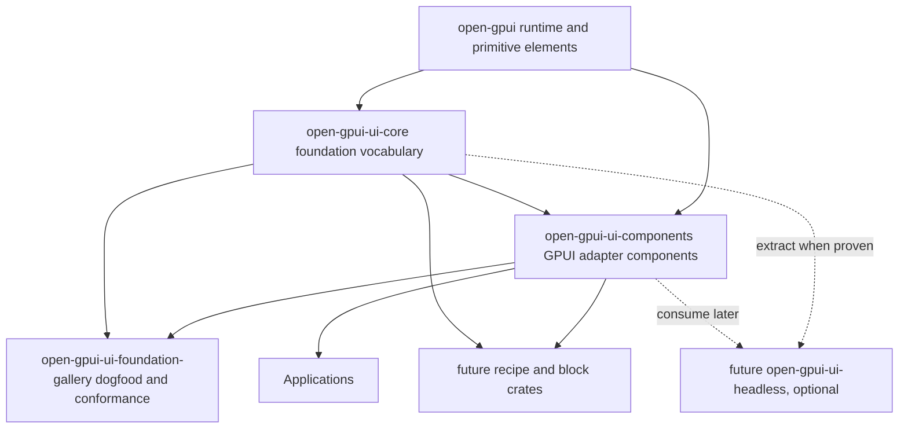
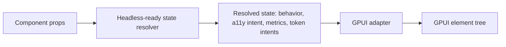

# ADR 0005: Open GPUI Official Component Architecture

**Status**: Proposed
**Date**: 2026-06-15

## Context

ADR 0004 decided that Open GPUI should have an official component ecosystem outside the core
`open-gpui` runtime crate. The first implementation slice now exists:

- `open-gpui-ui-core` owns the first foundation vocabulary for sizing, density, adaptive policy,
  tokens, accessibility/focus re-exports, and overlay helpers.
- `open-gpui-ui-components` owns the first concrete GPUI components: `Button` and `Switch`.
- `open-gpui-ui-foundation-gallery` is the current dogfood surface for foundation and component
  behavior.

This gives the project enough real code to decide the next architecture boundary. The main design
question is whether to build a fully headless component library now, keep only concrete GPUI
components, or take a staged approach.

GPUI is a self-drawn UI engine. Components render into GPUI elements and are responsible for
layout, hitboxes, focus behavior, accessibility metadata, input events, scroll areas, overlays, and
theme resolution. They cannot rely on browser defaults such as native disabled controls, CSS
cascade, DOM `data-state`, or automatic form semantics.

The useful external references point in different directions:

- Radix UI and React Aria show the value of headless behavior, accessibility contracts, controlled
  state, roving focus, overlay dismissal, and component anatomy.
- shadcn/ui shows the value of recipes, examples, and source-level customization, but its
  copy-source distribution model is not a good default for Rust crates.
- DaisyUI and Tailwind show the value of semantic theme tokens, but class-string APIs and CSS
  cascade do not map cleanly to GPUI.
- `repo-ref/gpui-component` is the strongest GPUI-native implementation reference, but it mixes too
  many concerns into one broad UI crate.
- `fret-ui-kit`, `fret-ui-headless`, and `fret-ui-shadcn` are useful local references for splitting
  behavior/state, theme tokens, primitives, and recipes.

## Decision

Open GPUI will use an **adapter-first, headless-ready** component architecture.

The project will not create a standalone, framework-agnostic `open-gpui-ui-headless` crate yet.
Instead, every official component must be designed so that its behavior and resolved state can be
extracted later without rewriting the GPUI renderer.

This means:

- Concrete components remain in `open-gpui-ui-components` for now.
- Each component must expose a testable resolved state type such as `ButtonState` or `SwitchState`.
- Resolved state must contain behavior, semantic state, metrics, and token intents, not GPUI render
  tree details.
- Resolved state should avoid `Window`, `App`, `Context`, `RenderOnce`, `IntoElement`, and concrete
  event callback types.
- GPUI-specific adapters own `div()` trees, focus handles, scroll handles, AccessKit mapping,
  hitboxes, event propagation, cursor behavior, overlay anchoring, and paint/layout details.
- The component architecture must support future extraction of a headless behavior crate once enough
  components prove the shared model.

The immediate crate structure remains:

The desired long-term shape is:

## Component Contract

Every official component should follow this contract unless it has a documented reason not to.

### Public API Shape

- Use Rust builder-style APIs for concrete GPUI components.
- Use explicit enums for variants, sizes, orientations, alignments, and state modes.
- Prefer semantic event names such as `on_activate`, `on_change`, `on_open_change`, and
  `on_selection_change` over input-device-specific names such as `on_click`.
- Support application-owned state for interactive components. Simple value props are acceptable in
  early slices, but the API should not block controlled/uncontrolled support later.
- Keep crate-root re-exports explicit. Avoid `pub use module::*` for public component crates.

### Resolved State

Each component should provide a resolved state or descriptor type that is easy to test without
rendering:

- input state: disabled, selected, checked, pressed, open, invalid, read-only, required;
- activation rules: whether semantic activation should run;
- accessibility intent: role, accessible state, required actions, naming requirements;
- metrics: size-derived layout values;
- token intents: semantic color and style slots;
- component anatomy metadata where relevant.

Resolved state should be renderer-neutral where practical. It may temporarily use `open_gpui`
foundation types while the crate is young, but new state APIs should avoid unnecessary GPUI runtime
types.

### GPUI Adapter Responsibilities

The GPUI component implementation owns:

- `ElementId`, `div()`, `RenderOnce`, `IntoElement`, and fluent style calls;
- focus handles, tab stops, focus-visible rendering, focus restore, and roving focus adapters;
- AccessKit role/action/state mapping;
- hitbox-driven input behavior and event propagation;
- scroll containers and `ScrollHandle` wiring;
- overlay anchoring, portals, dismissal, and escape handling;
- actual color resolution from token intent to renderable colors;
- platform-specific pointer, keyboard, wheel, and accessibility details.

### Theme and Tokens

`ColorIntent` and `ThemeTokens` are the right direction, but token intent is not enough for a
production component library. The next architecture work should add a theme resolver that maps
semantic tokens to concrete colors and supports dark mode, high contrast, disabled state, hover,
pressed, selected, invalid, and focus ring states.

Official components should not depend on fallback RGB values as their real styling mechanism.
Fallbacks are useful for bootstrapping and tests, not the final theme system.

### Accessibility and Focus

Accessibility and focus behavior are part of the component contract, not optional styling.

Components must define:

- accessible role and label expectations;
- disabled, selected, checked/toggled, expanded, invalid, required, and value states where relevant;
- keyboard activation and navigation behavior;
- focus-visible behavior that does not change layout;
- focus restore rules for overlays;
- tab stop and roving focus rules for composite widgets.

Known current gaps:

- The first `Button` and `Switch` components block disabled activation visually and behaviorally,
  but the public GPUI API does not yet expose a complete disabled accessibility state.
- Focus ring styling currently needs a no-layout-shift mechanism before it becomes an official
  component rule.

## Alternatives Considered

### Option A: Concrete GPUI components only

Pros:

- Fastest route to visible components.
- Keeps code close to GPUI's real rendering and input model.
- Avoids premature abstraction and extra crates.

Cons:

- Behavior, accessibility, and styling logic will become entangled with render code.
- Future cross-platform or alternate-renderer reuse becomes expensive.
- Testing relies too much on full rendered elements instead of pure state.

Decision: rejected as the long-term architecture, but accepted as an implementation detail for the
first slices while state resolvers remain extractable.

### Option B: Create a full headless component crate now

Pros:

- Clean theoretical separation from the start.
- Best path for future non-GPUI adapters.
- Pure state and accessibility logic can be tested without renderer setup.

Cons:

- The project currently has too few components to know the correct shared abstractions.
- GPUI-specific focus, hitbox, AccessKit, scroll, and overlay behavior is too important to hide
  behind premature traits.
- Rust adapter traits can become heavier than the components they are meant to simplify.

Decision: rejected for now. Revisit after at least Button, Switch, TextInput/Field,
Checkbox/Radio, Tabs, Menu/Popover, and Dialog prove repeated behavior patterns.

### Option C: Adapter-first, headless-ready components

Pros:

- Ships real GPUI components immediately.
- Keeps behavior and state testable.
- Preserves a future path to `open-gpui-ui-headless`.
- Avoids copying DOM/CSS assumptions into a self-drawn engine.

Cons:

- Requires discipline: every component must keep state resolution separate from rendering.
- Some APIs may need migration when the headless boundary becomes a real crate.
- The short-term crate names may not perfectly match the long-term architecture.

Decision: chosen.

## Success Metrics

| Metric | Target | Measurement |
|--------|--------|-------------|
| Headless-ready coverage | Each new component has a resolved state or descriptor test | Component crate tests |
| Renderer boundary | No resolved state type depends on `Window`, `App`, `Context`, or `RenderOnce` | Code review and `rg` checks |
| Accessibility contract | Each interactive component test covers role and at least one semantic state/action | Component tests |
| Theme readiness | Components use token intents and do not introduce direct hard-coded render colors outside fallback paths | Code review and tests |
| Gallery conformance | Each component has gallery samples for default, disabled, focused or selected, and variant states | Gallery tests and manual dogfood |
| Cross-platform readiness | Platform-specific input/focus/scroll behavior stays inside GPUI adapter code | Code review |

## Risks and Mitigations

| Risk | Severity | Likelihood | Mitigation |
|------|----------|------------|------------|
| Premature headless abstraction slows component delivery | High | Medium | Keep headless as an extraction target, not a new crate yet |
| Concrete GPUI code leaks into state APIs | High | Medium | Review state types for `Window`, `App`, `Context`, `RenderOnce`, and callback types |
| Token intents never become a real theme system | High | Medium | Prioritize theme resolver before broad visual component expansion |
| Accessibility remains visual-only | High | Medium | Add a11y contract tests and GPUI API gaps as explicit follow-up work |
| Focus styles cause layout shift | Medium | Low | Use the shared `FocusRing` primitive plus `focus_ring_shadow`, which paints focus-visible state as an outer GPUI box shadow instead of changing border width |
| Recipes become the de facto component API | Medium | Low | Keep recipes optional; official components stay semver-managed crates |

## Implementation Plan

1. Write a component contract document or module-level guide based on this ADR.
2. Refine `Button` and `Switch` APIs toward semantic events:
   - `on_activate` for Button;
   - `on_change(next_checked, ...)` for Switch.
3. Add a theme resolver layer so `ColorIntent` can resolve through a theme snapshot instead of
   always rendering fallback RGB values.
4. Add a focus ring primitive that does not change layout when focus-visible state changes. Done in
   `open-gpui-ui-components::FocusRing`; GPUI adapters apply it through `focus_ring_shadow`.
5. Implement `TextInput` and `Field` as the next proof point because they force label, help text,
   invalid, required, disabled, focus, and value-state decisions.
6. Add render-level smoke tests or gallery checks for disabled interaction, tab stops, aria state,
   and focus-visible behavior.
7. Revisit `open-gpui-ui-headless` after several components share stable behavior descriptors.

## Open Questions

- Should `open-gpui-ui-core` eventually remove direct `open_gpui` type dependencies from sizing,
  tokens, and accessibility vocabulary?
- Should the first theme resolver live in `open-gpui-ui-core`, `open-gpui-ui-components`, or a
  separate `open-gpui-ui-theme` crate?
- What is the right public disabled accessibility API in GPUI itself?
- Should official components accept external `FocusHandle`s, or should they expose focus commands
  through a component controller?
- Which components should be treated as official primitives versus optional recipes?
