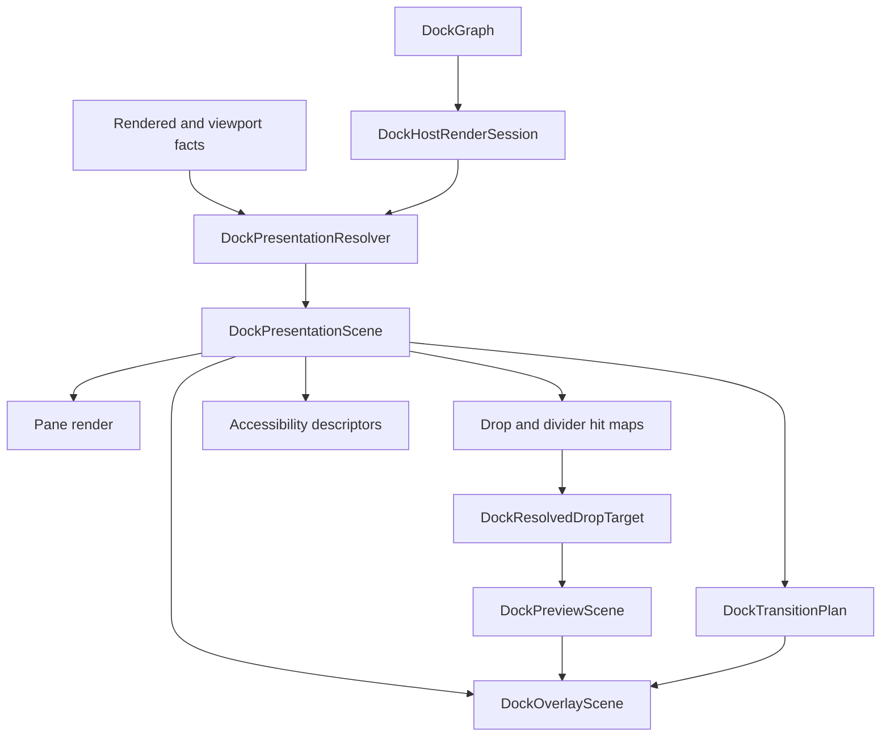

# ADR 0010: Docking Presentation Scene And Motion Model

**Status**: Accepted
**Date**: 2026-06-30

## Context

Open GPUI docking has converged on the right semantic ownership model: `DockGraph` stays pure layout data, GPUI owns platform windows and focus, current drop facts authorize releases, and preview scenes explain target feedback without becoming commit tokens.
Recent work also aligned nested inner-edge behavior with ImGui and hardened multi-viewport route authority.

The remaining UI/UX gaps are presentation-level:

- geometry for panes, tabs, splitters, previews, and route overlays is still split across graph layout, render flex composition, drop target resolution, preview builders, and recorded runtime facts;
- overlay z-order is implicit in render child order;
- center tab insertion preview is less expressive than edge/root split preview;
- layout transitions, zoom/unzoom, focus presentation, corner divider drag, and accessibility bounds lack one shared geometry model.

The user-provided SuperSplit notes describe a useful architecture: keep a tree model for semantics, rasterize it into a flat 2D grid for presentation, render drop indicators as root-level overlays, and plan animation from previous/next scenes.
The local BonSplit reference confirms related split-tab capabilities: controller-owned tab/split commands, flat layout snapshots, tab bar insertion indicators, focus navigation, and zoom as presentation state.

## Decision

Docking will add a crate-private `DockPresentationScene` and related motion/overlay descriptors.

`DockGraph` remains the persistent semantic authority.
It stores dock spaces, splits, tabs, floating containers, central regions, fractions, and stable item ids.
It does not become a flat layout grid and it does not store runtime render, platform, focus, or animation state.

`DockPresentationScene` becomes the shared geometry authority for one rendered dock space.
It is derived from `DockHostRenderSession`, graph layout facts, rendered host scene facts, and viewport facts.
It describes visible panes, tab bars, tab labels, splitters, floating chrome, empty central regions, focus regions, overlay anchors, and accessibility bounds in absolute coordinates.

Root-level overlay rendering becomes explicit data.
Route markers, target preview bodies, active and inactive guide boxes, tab insertion affordances, payload tab previews, payload ghost descriptors, focus rings, and rejected feedback receive stable layer identities.
Render code decorates these layers; it does not recompute target availability or z-order.

Motion is planned from presentation scenes.
`DockTransitionPlan` compares previous and next presentation scenes and describes pane movement, entering/leaving geometry, divider expansion, occlusion masks, tab insertion motion, cross-window receive, tear-off, zoom/unzoom, focus pulse, and reduced-motion degradation.
The first contract is deterministic descriptors and semantic proof; smooth per-frame animation can improve behind that model.

Zoom and focus are presentation state.
Zoom/unzoom must not collapse or rewrite `DockGraph`.
Sibling panes compute egress directions from presentation geometry, preferring an edge they already touch before nearest-edge distance.
Focus descriptors complement GPUI focus rather than creating a second focus authority.

Divider and corner hit testing derive from the same presentation scene.
Single-axis splitters keep existing behavior, while corner junctions may produce two-axis resize requests that still commit through existing split fraction validation.

Accessibility and reduced motion are part of the model.
Docking exposes internal descriptors for panes, tab lists, tab panels, splitters, drop targets, drag sources, and drop destinations.
Platform accessibility mapping can remain incremental, but bounds and roles must not be an afterthought separate from geometry.

## Architecture

## Alternatives Considered

### Option A: Keep Extending DockPreviewScene Only

Decision: rejected.
`DockPreviewScene` is a good target-preview contract, but it does not cover pane geometry, splitters, corner hit maps, zoom/unzoom, focus presentation, or accessibility bounds.

### Option B: Flatten DockGraph Permanently

Decision: rejected.
The existing graph model is the correct semantic authority for persistence, mutation validation, central regions, floating containers, and dock spaces.
Flattening should be a derived presentation operation, not a replacement for layout semantics.

### Option C: Copy BonSplit's Nested AppKit Split Tree

Decision: rejected.
BonSplit is valuable prior art for tab insertion, layout snapshots, focus navigation, and zoom, but it does not cover Open GPUI's n-ary graph, floating containers, platform viewports, or current-facts route authority.

### Option D: Copy SuperSplit's CoreAnimation Model

Decision: rejected.
The transferable idea is the tree-to-flat-scene and scene-to-motion split.
The backend should be GPUI-native, capability-aware, and reduced-motion aware rather than tied to CoreAnimation.

### Option E: Build Pixel-Perfect Preview Styling First

Decision: rejected.
The priority is capability alignment: target semantics, insertion preview, overlay authority, transition descriptors, focus/zoom, divider hit maps, and accessibility.
Styling can improve after the data model is stable.

## Consequences

- Docking render and interaction modules gain a deeper shared private contract instead of adding more local rectangle helpers.
- Tests can assert capabilities through semantic descriptors and small visual-region proof instead of relying on screenshot baselines.
- Obsolete preview/render compatibility paths should be deleted as each scene-owned path replaces them.
- The refactor is intentionally breaking for crate-private modules, but public docking behavior remains stable unless additive APIs are required for user-facing zoom/focus or accessibility commands.
- Future animation work can tune timing and curves without changing drop target, overlay, or accessibility semantics.

## Implementation Notes

The first implementation is descriptor-first. It introduces crate-private presentation, overlay,
transition, zoom/focus, divider hit-map, and accessibility models plus focused tests, and it routes
new preview guide rendering through the overlay scene. It does not promise per-frame animation
fidelity or platform VoiceOver/UIAutomation mapping yet; those adapters should consume the same
descriptors rather than add another geometry authority.

## Related Documents

- `docs/plans/2026-06-30-002-refactor-docking-presentation-scene-motion-plan.md`
- `docs/plans/2026-06-29-003-refactor-docking-preview-scene-authority-plan.md`
- `docs/plans/2026-06-30-001-refactor-docking-platform-hardening-plan.md`
- `docs/adr/0002-docking-gpui-integration.md`
- `repo-ref/bonsplit/README.md`
