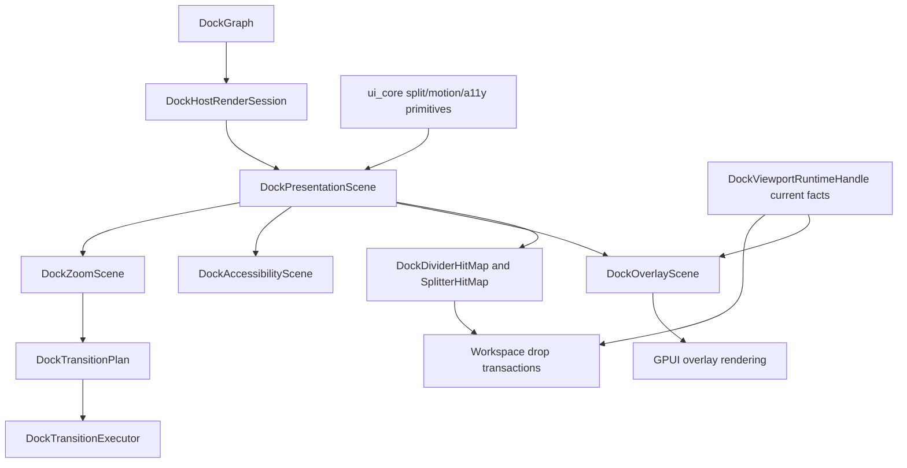

# ADR 0012: Docking Runtime Capability Alignment

**Status**: Accepted
**Date**: 2026-07-01

## Context

ADR 0010 introduced docking presentation, overlay, motion, zoom, divider, and accessibility
descriptors. ADR 0011 moved generic split, motion, and accessibility vocabulary into
`open_gpui_ui_core` while keeping docking semantics in `open_gpui_docking`.

The runtime follow-up proved the current boundary across local previews, routed previews,
multi-viewport cleanup, zoom/focus presentation, splitter and corner drag behavior, native dogfood
proof text, and GPUI-facing accessibility mapping. The implementation also exposed a cleanup
problem: descriptor scaffolding can become misleading if it advertises states the runtime never
constructs.

## Decision

Docking keeps a descriptor-first runtime boundary:

- `DockGraph` remains the persistent semantic authority for spaces, splits, tabs, floating
  containers, central regions, and mutation validation.
- `DockPresentationScene` is the derived geometry authority for one rendered host. It resolves
  panes, tab bars, tab labels, splitter rectangles, focus regions, floating containers, and overlay
  anchors from graph/session facts.
- `open_gpui_ui_core` owns renderer-neutral split, motion, and accessibility primitives. Docking
  consumes those primitives but does not move tab, route, viewport, or graph policies into UI core.
- `DockOverlayScene` owns target-preview semantics: guide boxes, tab insertion, payload tab
  previews, payload ghosts, route markers, and rejected state. Render code decorates those layers
  instead of recomputing availability.
- `DockTransitionExecutor` owns sampled runtime motion for pane clips, dividers, focus rings, zoom,
  and reduced-motion completion. Overlay-scene-to-transition conversion remains a focused
  descriptor proof for tab insertion, payload ghosts, route markers, and rejected state; every-frame
  overlay animation for those drag previews is not yet a shipped runtime guarantee.
- `DockViewportRuntimeHandle` remains the current-facts authority for cross-window releases. Cached
  routed previews are feedback only; release revalidates current target facts and policy.
- GPUI accessibility output maps supported descriptor fields into GPUI element state. Descriptor
  fields that GPUI cannot yet expose, such as generic hints or platform drop-action callbacks, stay
  in the docking accessibility model and are documented as platform gaps.

Descriptor scaffolding must not advertise phantom capabilities. Unused overlay `FocusRing` layers,
unconstructed corner affordance states, and broad module-level dead-code allowances are removed or
narrowed. Test-only descriptor helpers are marked `#[cfg(test)]`. Runtime cleanup that has product
value, such as clearing a zoom target that disappeared from the graph, is wired into the render path
instead of staying as a helper-only unit test.

## Architecture

## Success Metrics

| Metric | Target | Measurement |
| --- | --- | --- |
| Docking local build warnings | No `open-gpui-docking` dead-code warnings from this runtime work | `cargo check -p open-gpui-docking` |
| Runtime capability gates | Presentation, preview, transition, zoom/focus, divider, accessibility, interaction, and resize tests pass | Required nextest gates in `docs/verification.md` |
| Native dogfood proof | Runtime panel names the shipped proof capabilities | `runtime_status_panel_formats_platform_capabilities` |
| Current-facts release authority | Cached routed previews never commit without current target revalidation | `host_viewport_preview_tests` |
| Execution memory | Current state, log, and verification evidence stay valid | Engineering wiki validation |

## Alternatives Considered

### Option A: Keep Render-Local Geometry And Preview Helpers

Decision: rejected. Render-local helpers made hover boxes, target previews, transition descriptors,
and accessibility bounds drift from each other. Descriptor ownership gives tests one semantic source
for capability alignment.

### Option B: Move Docking Layout Into UI Core

Decision: rejected. UI core should own generic split, motion, and accessibility primitives, not
docking concepts such as tabs, route facts, central regions, floating containers, or
multi-viewport release validation.

### Option C: Treat Overlay Transitions As Fully Shipped Animation

Decision: rejected for now. The current runtime proves deterministic descriptors and cleanup
semantics. Drag-preview overlay animation can be productized later, but the docs and proof string
must not imply every-frame-perfect overlay animation before the render path actually schedules it.

### Option D: Preserve Phantom Visual States For Future Styling

Decision: rejected. States such as focused or clamped corner affordances should be added when the
runtime can produce them. Until then, resize clamp behavior belongs in transaction tests rather
than unused visual-state variants.

### Option E: Copy SuperSplit's CoreAnimation Backend

Decision: rejected. The transferable architecture is a flat presentation scene plus root-level
overlay and transition descriptors. Open GPUI should stay GPUI-native, reduced-motion aware, and
platform-capability gated rather than taking a CoreAnimation dependency.

## Risks And Mitigations

| Risk | Severity | Likelihood | Mitigation |
| --- | --- | --- | --- |
| Descriptor proof is mistaken for full animation | Medium | Medium | ADR and verification docs distinguish semantic descriptors from every-frame overlay animation. |
| Accessibility descriptors drift from GPUI mapping | Medium | Medium | Keep descriptor tests and rendered GPUI element tests separate; record unsupported GPUI fields in verification docs. |
| UI core absorbs docking policy | High | Low | ADR 0011 and this ADR keep tab/route/viewport semantics in docking. |
| Cleanup removes useful future hooks too early | Low | Medium | Preserve test-only helpers under `#[cfg(test)]`; add runtime wiring when a helper fixes real state. |
| Stale routed previews mutate graph | High | Low | Release paths revalidate current facts and preview replacement/Escape cleanup tests guard stale state. |

## Consequences

- Future docking UI/UX work should add semantic fields to presentation, overlay, transition, or
  accessibility descriptors before styling render-local rectangles.
- New visual states must be generated by runtime state machines before being added to public or
  crate-private enums.
- `open_gpui_ui_core` remains docking-neutral; docking owns graph mutation, viewport routing,
  central-region policy, and release authority.
- Native dogfood proof text is a capability checklist, not a pixel-parity or every-frame animation
  guarantee.
- Platform accessibility and screenshot/pixel baselines remain follow-up work unless a later plan
  explicitly ships them.

## Related Documents

- `docs/adr/0010-docking-presentation-scene-motion-model.md`
- `docs/adr/0011-docking-split-motion-primitive-boundary.md`
- `docs/plans/2026-06-30-004-refactor-docking-runtime-capability-alignment-plan.md`
- `docs/verification.md`
- `docs/knowledge/engineering/verification/docking-runtime-capability-alignment-20260701.md`
- `repo-ref/bonsplit/README.md`
