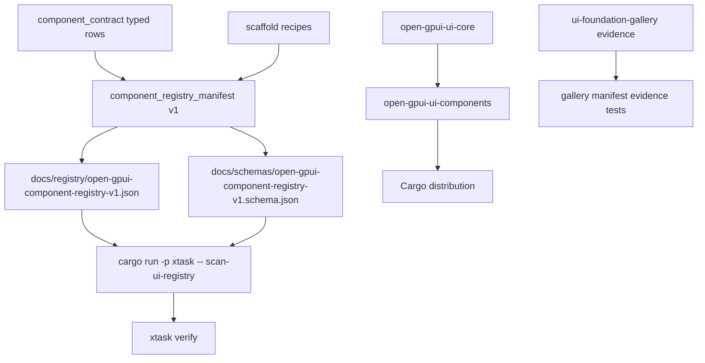

# ADR 0013: Open GPUI Native UI Hybrid Registry

**Status**: Superseded by ADR 0014
**Date**: 2026-07-02

## Context

Open GPUI is building a Rust-first native UI framework from the GPUI fork. The current UI product
surface already has typed component contracts, theme schema artifacts, gallery samples,
accessibility claims, and `xtask` verification gates.

The July 2026 native UI framework research found that modern frontend ecosystems are strongest when
components are discoverable, inspectable, scaffoldable, and locally verifiable. The useful pattern
is not a literal shadcn/ui source registry clone. Rust already has Cargo for package distribution,
and copied source should not become the compatibility authority for official components.

The implementation in `refactor/native-ui-hybrid-registry` proved durable public names for the
manifest API, schema artifacts, scaffold recipe shape, gallery evidence tests, and verification
commands.

## Decision

Open GPUI adopts a Cargo-first hybrid registry architecture for its native UI ecosystem.

- `open-gpui-ui-core` and `open-gpui-ui-components` remain the official distribution surface through
  Cargo.
- `open_gpui_ui_components::component_contract` exposes manifest version 1 through
  `COMPONENT_REGISTRY_MANIFEST_VERSION`, `component_registry_manifest()`, and
  `component_registry_manifest_schema()`.
- The committed registry artifact is `docs/registry/open-gpui-component-registry-v1.json`.
- The committed JSON schema artifact is
  `docs/schemas/open-gpui-component-registry-v1.schema.json`.
- Artifact regeneration uses
  `cargo run -p open-gpui-ui-components --example export_component_registry --quiet` and
  `cargo run -p open-gpui-ui-components --example export_component_registry_schema --quiet`.
- `cargo run -p xtask -- scan-ui-registry` is the focused drift gate for the manifest, schema,
  scaffold recipes, generated file intents, and verification references.
- `xtask verify` runs `scan-ui-registry` before `scan-ui-contract`.
- Scaffold recipes are metadata for `AppOwnedSource`, `CargoDependencySnippet`, or
  `GalleryStorySample` starting points. They are not a second official distribution channel for
  copied component source.
- Gallery catalog rows, story contracts, sample selectors, and runtime probes remain gallery-owned
  evidence. The component crate owns manifest truth and must not import gallery selector constants.

## Architecture

## Alternatives Considered

### Option A: Shadcn-Style Source Registry

Decision: rejected as the primary model. Source-copy ergonomics are useful for app-owned wrappers
and examples, but making copied source the official distribution surface fights Cargo upgrades and
creates unmanaged compatibility drift.

### Option B: Cargo-Only Distribution

Decision: rejected as insufficient. Cargo distributes crates well, but it does not by itself expose
component anatomy, docs tokens, gallery evidence, scaffold intent, theme/a11y claims, or focused
verification commands to tools and agents.

### Option C: Hosted Marketplace First

Decision: deferred. A hosted registry can become valuable after the local manifest, schema, and
verification workflow stabilize. Starting with a service before the local contract is stable would
increase operational surface without improving component correctness.

### Option D: Standalone Headless Crate First

Decision: rejected for the active roadmap. ADR 0008 keeps the current UI crates as the product
boundary. Renderer-neutral state remains important, but the registry does not require
`open-gpui-ui-headless` to ship first.

## Consequences

Positive:

- Component ecosystem metadata now has a deterministic, schema-backed artifact that humans, tooling,
  and AI agents can consume.
- Official component distribution stays idiomatic Rust through Cargo.
- Scaffold recipes can describe high-value app-owned compositions without becoming a package
  manager.
- Gallery evidence is connected to manifest claims without moving gallery-only selectors into the
  product crate.
- Registry drift fails locally through `scan-ui-registry` before broader contract scans run.

Negative:

- Consumers that want source-copy behavior must build on recipe metadata or future tooling; there is
  no public `gpui add` command in this ADR.
- Manifest version 1 is intentionally local and file-based. Hosted publishing, third-party
  registries, and version negotiation remain future work.
- The typed registry remains the source of truth, so adding components still requires updating Rust
  metadata rather than editing JSON by hand.

## Follow-Up Work

- Keep `docs/architecture/native-ui-hybrid-registry.md`, `docs/ui/component-contract.md`, and
  `docs/verification.md` aligned with artifact paths and command names.
- Use `scan-ui-registry` when adding official components, adjacent public surfaces, or scaffold
  recipes.
- Revisit hosted registry or public scaffolding CLI only after manifest version 1 survives several
  real component additions.
- Revisit `open-gpui-ui-headless` only through a new ADR if repeated renderer-neutral contracts make
  the extra crate boundary worth its maintenance cost.

## Related Documents

- `docs/architecture/native-ui-hybrid-registry.md`
- `docs/architecture/native-ui-framework-strategy.md`
- `docs/plans/2026-07-02-002-refactor-native-ui-hybrid-registry-architecture-plan.md`
- `docs/ui/component-contract.md`
- `docs/verification.md`
- `docs/knowledge/engineering/decisions/open-gpui-native-ui-framework-distribution-strategy.md`
- `docs/research/native-ui-framework-design-research.md`
