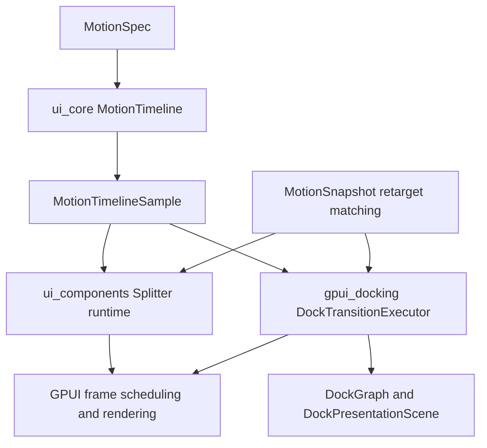

# ADR 0013: UI Motion Runtime Foundation

**Status**: Accepted
**Date**: 2026-07-02

## Context

ADR 0011 moved split and motion vocabulary into `open_gpui_ui_core` but rejected putting animation
execution there immediately. That was the correct boundary while only descriptors were shared.

The next docking and splitter passes exposed duplicated runtime mechanics:

- `ui_components::Splitter` owned local start time, progress sampling, completion, and retarget
  fraction state for programmatic layout changes.
- `gpui_docking::DockTransitionExecutor` owned a second version of active execution, elapsed-time
  sampling, completion, reduced-motion final state, and retarget matching for pane, divider, and
  overlay samples.
- Both adapters needed deterministic tests for sampled progress and reduced-motion behavior.

The reusable part is not GPUI frame scheduling or visual interpolation. The reusable part is the
renderer-neutral runtime contract: timeline state, sampled progress, terminal state, deterministic
elapsed sampling, and stable-identity retarget matching.

## Decision

`open_gpui_ui_core` owns a small renderer-neutral motion runtime foundation:

- `MotionTimeline` starts from a `MotionSpec` and samples deterministic progress from an
  `Instant` or explicit elapsed `Duration`.
- `MotionTimelineSample` reports timeline state, elapsed time, raw progress, eased progress, and
  whether final semantics have been reached.
- `MotionTimelineState` distinguishes immediate, active, completed, and cancelled samples.
- `MotionSnapshot`, `MotionRetargetItem`, `MotionRetargetSet`, and
  `retarget_motion_snapshots` provide stable-identity matching between an interrupted sample set
  and a new target set.
- Reduced motion remains semantic completion, not "no state".

Adapters still own the GPUI and domain-specific parts:

- `open_gpui_ui_components::Splitter` owns pointer input, keyed runtime state, frame requests,
  fraction interpolation, and the rule that pointer drags stay immediate.
- `open_gpui_docking` owns `DockGraph`, `DockPresentationScene`, `DockTransitionPlan`, pane,
  divider, overlay, tab, route, viewport, zoom, focus, and release semantics.
- Docking uses the shared runtime for timeline/progress and stable-identity matching, but it keeps
  pane/divider/overlay sample construction local.
- GPUI windows, render layers, cursor state, and `request_animation_frame` stay out of
  `ui_core`.

This changes ADR 0011's "put animation execution in UI core immediately" alternative: broad
animation execution remains rejected, but the narrow renderer-neutral runtime primitive is now
accepted because both splitter and docking consume it.

## Architecture

## Alternatives Considered

### Keep Per-Adapter Timelines

Decision: rejected.

Two local timeline implementations already drifted in naming, test hooks, completion semantics,
and retarget shape. Keeping them would make reduced-motion and mid-animation retarget fixes more
expensive each time a new layout component ships.

### Move GPUI Frame Scheduling Into UI Core

Decision: rejected.

Only adapters know whether they are rendering inside GPUI, a native example, a test, or a future
backend. The runtime primitive samples time; adapters request frames.

### Move Docking Samples Into UI Core

Decision: rejected.

Panes, dividers, overlays, tab insertion, route markers, payload ghosts, zoom, and focus are
docking semantics. UI core should not learn those concepts.

### Build A Full Public Animation Framework Now

Decision: rejected.

This phase only standardizes deterministic layout motion mechanics. Springs, keyframes,
compositor-backed animation, accessibility announcements, and public animation builders need
separate product and platform decisions.

## Consequences

- Future layout-like components should reuse `MotionTimeline` instead of storing their own
  start-time/progress/completion fields.
- Future retargetable motion should match stable identities with `retarget_motion_snapshots` and
  keep enter/leave policies in the adapter.
- Tests should use deterministic elapsed sampling instead of sleeping or relying on wall-clock
  timing.
- Pointer-coupled interactions should remain direct unless a plan explicitly accepts input lag.
- Reduced-motion support must still produce the final semantic scene or state.
- Native proof surfaces can report capability-level motion summaries without claiming pixel-perfect
  compositor animation.

## Related Documents

- `docs/adr/0011-docking-split-motion-primitive-boundary.md`
- `docs/adr/0012-docking-runtime-capability-alignment.md`
- `docs/plans/2026-07-02-003-refactor-ui-motion-runtime-foundation-plan.md`
- `docs/verification.md`
- `docs/knowledge/engineering/progress/2026-07-02-ui-motion-runtime-foundation.md`
