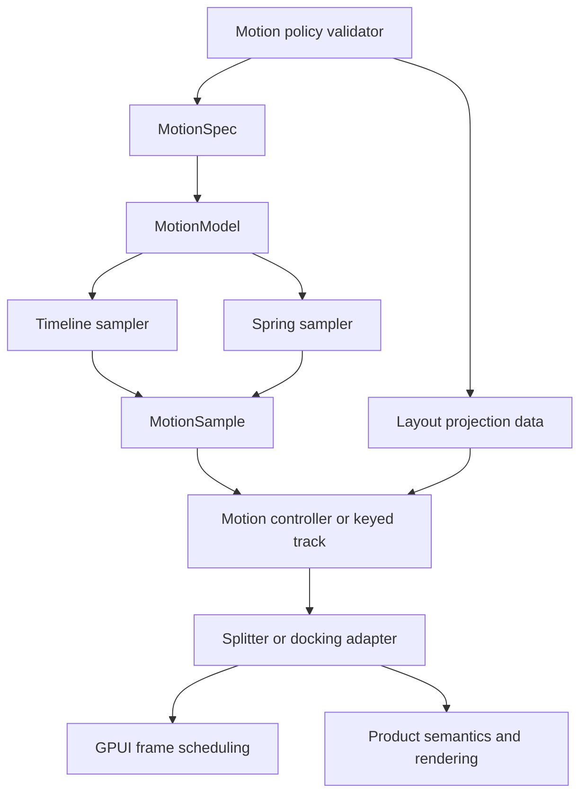

# ADR 0016: UI Motion Spring Foundation

**Status**: Accepted
**Date**: 2026-07-03

## Context

ADR 0015 accepted a narrow renderer-neutral timeline runtime in `open_gpui_ui_core`
and explicitly deferred springs, keyframes, compositor backends, and public animation builders.
That boundary was useful while Splitter and docking only needed deterministic duration/easing
sampling, reduced-motion final semantics, and stable-identity retarget matching.

The next motion gap is narrower than a full animation framework but broader than a timeline:

- layout-like components need interruptible motion that can preserve sampled velocity when a target
  retargets under the same stable identity;
- pane, divider, zoom, and programmatic split transitions need a shared way to describe motion
  demand without moving GPUI frame scheduling into `ui_core`;
- layout projection should describe source-to-target geometry as data so adapters can render
  final-size content with transform/clip-like samples;
- motion quality rules need to be testable before springs become an attractive nuisance for
  pointer drag, keyboard focus, or cross-target docking preview movement.

Motion, React Spring, BonSplit, SuperSplit, ImGui docking, and the existing Open GPUI docking work
all point to the same product boundary: the shared primitive is deterministic motion state and
geometry math. Runtime measurement, window frame requests, accessibility announcements, docking
release authority, and platform compositor execution remain adapter or product responsibilities.

## Decision

`open_gpui_ui_core` now owns the next renderer-neutral motion foundation:

- deterministic spring specs and samplers with position, velocity, rest, cancellation, completion,
  retarget, and reduced-motion semantics;
- a unified motion contract that can represent existing timeline samples and spring samples without
  replacing the timeline model;
- layout projection primitives that describe source rects, target rects, translation, scale,
  correction data, reveal/clip geometry, and final-size content guidance without DOM, CSS, GPUI
  windows, or platform render layers;
- a small controller/frame-demand contract that lets adapters group keyed motion values while
  keeping actual frame scheduling in the adapter;
- motion policy validation for high-frequency input, duration budgets, excessive bounce,
  reduced-motion behavior, and unrelated-target preview interpolation.

Adapters still own product and runtime interpretation:

- `open_gpui_ui_components::Splitter` owns pointer input, fraction mutation, GPUI frame requests,
  and the rule that pointer drags stay immediate. It may use shared timeline or spring primitives
  for programmatic changes only.
- `open_gpui_docking` owns graph, tab, route, viewport, pane, divider, visual affordance, zoom,
  focus, accessibility descriptor, and release semantics. Motion samples are presentation evidence,
  not release authority.
- Docking visual affordance previews stay pinned to the current semantic target when the target
  identity changes. Same-identity retargeting may preserve velocity; unrelated target movement must
  snap semantically and may only animate presence or other non-misleading affordance details.
- GPUI windows, cursor state, compositor APIs, render-layer scheduling, live measurement, and
  public animation builders stay out of `ui_core`.

This supersedes ADR 0015 only for the deferred spring/projection primitive. ADR 0015 remains the
authority for timeline sampling, reduced-motion final semantics, and the adapter-owned frame
scheduling boundary.

## Architecture

## Alternatives Considered

### Keep Springs Adapter-Local

Decision: rejected.

Splitter, docking, and future layout-like components would re-learn the same velocity, rest,
retarget, reduced-motion, and test-clock rules. That repeats the duplication ADR 0015 removed for
timelines.

### Replace Timelines With Springs

Decision: rejected.

Duration/easing timelines are still the right primitive for deterministic committed transitions,
immediate/reduced-motion completion, and simple affordance timing. Springs are a second motion
model, not a replacement.

### Copy Motion Or React Spring APIs

Decision: rejected.

Those projects provide useful prior art for projection, springs, value controllers, and frame-loop
separation. Their DOM measurement, React hooks, CSS transform strings, promise/event surfaces, and
global runtime assumptions do not belong in Open GPUI's renderer-neutral core.

### Build A Native Compositor Backend Now

Decision: rejected.

Platform-backed animation may become important later, but it needs a separate product/platform ADR.
This decision only standardizes deterministic math and adapter contracts.

### Animate Pointer Drag Or High-Frequency Focus By Default

Decision: rejected.

Input-coupled motion must remain direct. A spring that trails the cursor or keyboard focus may look
smooth in isolation while making the interface feel slow or unstable. Future exceptions need an
explicit plan.

## Consequences

- New layout motion code should choose between timeline and spring models deliberately, with policy
  tests for high-frequency and reduced-motion paths.
- Tests should sample elapsed time deterministically and assert position, velocity, terminal state,
  and frame-demand behavior without sleeps.
- Projection helpers should describe geometry data; adapters decide whether to render it as bounds,
  transform, clip, opacity, or an existing final-size reveal path.
- Stable identity is the gate for velocity-preserving retarget. Unrelated semantic targets snap to
  the current target geometry.
- Native proof surfaces may report spring/projection/policy capabilities but must not claim
  compositor parity or pixel-perfect reference matching.

## Related Documents

- `docs/adr/0015-ui-motion-runtime-foundation.md`
- `docs/plans/2026-07-03-004-refactor-ui-motion-spring-foundation-plan.md`
- `docs/knowledge/engineering/progress/2026-07-02-ui-motion-runtime-foundation.md`
- `docs/verification.md`
