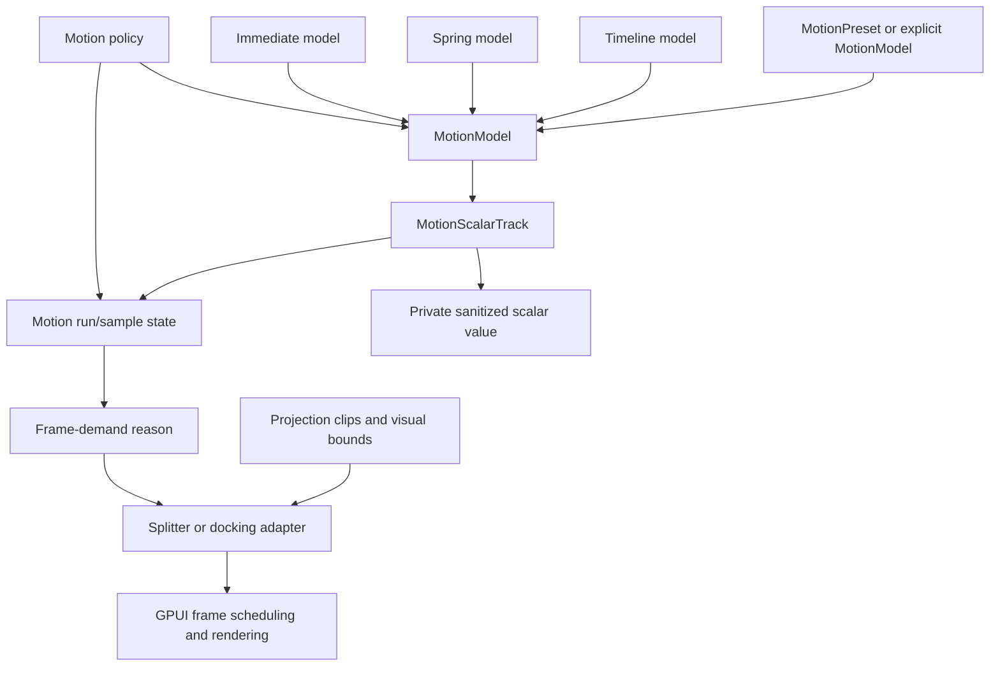

# ADR 0017: UI Motion Value Foundation

**Status**: Accepted
**Date**: 2026-07-04

## Context

ADR 0015 accepted deterministic timeline sampling and adapter-owned frame scheduling. ADR 0016
then accepted deterministic springs, projection data, scalar controllers, and motion policy
validation. That foundation is useful, but the next audit against `repo-ref/motion` exposed several
misleading seams:

- `MotionSpec` can still be interpreted by adapters as a spring request, which risks dropping
  timeline-specific duration and easing fields.
- The shared sample state is named after timelines even though springs and immediate completion now
  use the same shape.
- `MotionPolicy` is more proven in direct tests than in real Splitter or docking construction
  paths.
- `SplitterLayoutTransition` is public even though the real `Splitter` runtime does not yet consume
  it as a behavior contract.
- Projection helpers describe final-size transform/clip-like data, but docking can still convert
  those samples back into old bounds interpolation.
- Reduced-motion preference is not consistently threaded through public Splitter and docking paths.

Motion's value/playback/frame-loop architecture is useful prior art, but Open GPUI should not copy
React hooks, DOM measurement, CSS strings, browser timelines, WAAPI behavior, or a global animation
runtime. The shared primitive for this project remains renderer-neutral layout motion evidence.

## Decision

`open_gpui_ui_core` will deepen its motion foundation around explicit models, scalar value state,
minimal run state, frame-demand reasons, policy gates, and honest projection data.

The accepted boundary is:

- `MotionModel` or a dedicated preset is the input for behavior that may use a spring. `MotionSpec`
  remains the duration/easing timeline contract and must not be a hidden spring selector.
- Shared run/sample naming must cover timeline, spring, immediate, cancellation, and future models
  without pretending every sample is timeline-specific.
- The scalar value primitive remains an internal implementation detail. In the current proof it only
  stores the sanitized source value consumed by `MotionScalarTrack`; previous-frame velocity
  bookkeeping, run owners, subscriptions, and public value mutation stay deferred until a
  first-party adapter proves direct need.
- `MotionScalarTrack`, `MotionScalarController`, `MotionFrameDemand`, `MotionModel`, presets, policy
  gates, projection clips, and projection visual bounds are the public motion contracts consumed by
  Splitter and docking.
- Frame demand may carry minimal update/render reason vocabulary, but GPUI frame scheduling,
  measurement/read phases, render lifecycle, cursor state, windows, and platform compositor work
  remain adapter-owned.
- Motion policy must be called by real Splitter or docking construction/execution paths, not only
  by direct policy tests.
- Projection must be treated honestly: adapters consume final-size clip/reveal data and visual
  bounds; lower-level transform-tree, translation, scale, and scale-correction samples stay
  internal unless a first-party adapter proves direct need.

The deferred boundary is explicit:

- keyframes, repeat policy, pause/seek/speed controls, grouped playback controls, public
  subscribers, dependent/derived value graphs, gesture inertia, scroll-linked animation, and public
  application animation builders are follow-up decisions.
- native compositor or CoreAnimation-backed execution needs a separate product/platform ADR.

Adapters still own product semantics:

- `open_gpui_ui_components::Splitter` owns pointer input, fraction mutation, public Splitter API,
  GPUI frame requests, and the rule that pointer drag remains immediate.
- `open_gpui_docking` owns graph, tab, route, viewport, pane, divider, visual affordance, zoom,
  focus, accessibility facts, and release authority. Motion samples are presentation evidence only.

This supersedes ADR 0016 for explicit model/value/run/policy-gate contracts. ADR 0015 and ADR 0016
remain current for timeline sampling, deterministic springs, projection math, reduced-motion final
semantics, and the adapter-owned scheduling boundary.

## Architecture

## Alternatives Considered

### Copy Motion's Public API Shape

Decision: rejected.

Motion's source is valuable because it separates values, generators, frame processing, playback, and
projection. Its React hooks, variants, DOM style parsing, browser observers, WAAPI integration, and
promise/event surfaces do not belong in a renderer-neutral Rust UI core.

### Add Keyframes And Group Playback Now

Decision: rejected for this round.

Keyframes and richer playback controls are plausible future primitives, but current product gaps are
hidden model conversion, policy not running in adapters, Splitter public-surface honesty, and docking
projection/runtime convergence. Adding unconsumed keyframes would increase API surface before the
existing timeline/spring boundary is proven through real consumers.

### Keep `MotionSpec` As The Implicit Spring Selector

Decision: rejected.

The current helper shape can make custom duration/easing look accepted while the adapter actually
runs a spring. That is worse than a breaking change because callers cannot reason about the model
they asked for.

### Make `ui_core` Own Frame Scheduling

Decision: rejected.

Frame cadence, window invalidation, live measurement, cursor state, and platform scheduling are host
responsibilities. `ui_core` may define deterministic run state and demand reasons; adapters decide
when and how to request frames.

### Keep Unused Public Transition Descriptors

Decision: rejected.

If `SplitterLayoutTransition` is public, it must describe real Splitter behavior. Otherwise it should
be removed from exports and inventory so the public surface does not overpromise.

## Consequences

- Future layout motion code must resolve an explicit model or preset before it runs.
- Future value/run APIs must remain deterministic, test-clock driven, and renderer-neutral.
- Pointer-coupled drag and high-frequency focus stay immediate unless a later ADR accepts input lag.
- Policy gates should be exercised by adapter runtime tests, not only direct unit tests.
- Public APIs that imply unimplemented transition behavior should be deleted or narrowed.
- Native proof surfaces may report value/run/frame/policy capability, but must not claim compositor
  parity or pixel-perfect reference matching.

## Related Documents

- `docs/adr/0015-ui-motion-runtime-foundation.md`
- `docs/adr/0016-ui-motion-spring-foundation.md`
- `docs/plans/2026-07-04-001-refactor-ui-motion-value-foundation-plan.md`
- `docs/knowledge/engineering/progress/2026-07-03-ui-motion-spring-foundation.md`
- `docs/verification.md`
