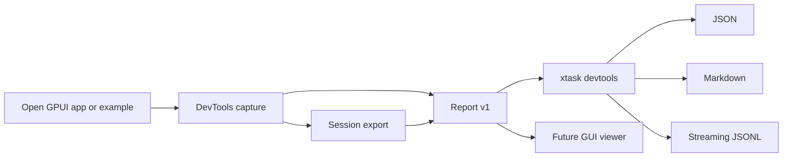

# ADR 0019: Open GPUI DevTools Headless Diagnostics

**Status**: Accepted
**Date**: 2026-07-09

## Context

Open GPUI now has renderer-neutral DevTools captures, local sessions, bounded frame history, diffs,
offline replay exports, GPUI inspector widgets, and Gallery/docking dogfood surfaces. The visible
surfaces are useful for manual inspection, but the higher-leverage contract is not the GUI itself.
Framework users need diagnostics that can be consumed by scripts, tests, CI jobs, editor workflows,
and other local automation without launching a full inspector window.

This decision is architecturally significant because it changes the primary DevTools product shape:
the canonical surface becomes stable artifacts and command-line diagnostics, while GUI views become
viewers over those artifacts.

## Decision

DevTools will prioritize a headless diagnostics surface before expanding the GUI workbench.

The accepted shape is:

- `open-gpui-devtools` owns the renderer-neutral artifact schemas:
  - `open-gpui-devtools-session/v1` for bounded session exports.
  - `open-gpui-devtools-report/v1` for summarized diagnostics and findings.
- `xtask devtools` is the first command-line entry point for consuming artifacts:
  - `report` renders report JSON or markdown from capture/session/report JSON.
  - `diagnose` renders the same report and can fail the process at a chosen severity threshold.
  - `diff` compares two capture-capable artifacts and renders JSON or markdown.
  - `stream` emits retained frames as flushed JSONL or markdown records.
- Artifact input defaults to fail-fast. Passing `--timeout-ms` switches to bounded polling so a
  producer can write an artifact while the consumer waits.
- The first CLI slice consumes offline JSON artifacts. Live attach, app-owned emitters, transport
  sockets, and GUI viewers are follow-up layers that must preserve the same report semantics.

## Alternatives Considered

### Option A: GUI-first workbench

**Pros**: Easier for humans to understand visually; matches the mental model of browser DevTools.

**Cons**: Harder to consume in CI, scripts, editor workflows, and local automation; tends to make the
data contract an implementation detail of the UI.

**Decision**: Rejected as the next priority. GUI remains valuable as a viewer, but it should not own
the primary diagnostic contract.

### Option B: Chrome DevTools Protocol-compatible bridge

**Pros**: Existing tooling ecosystem and familiar protocol vocabulary.

**Cons**: CDP is browser/runtime-specific and command/mutation-oriented. Open GPUI's current contract
is local, read-only, renderer-neutral, and cross-platform UI-runtime focused. A CDP clone would import
remote-debugging semantics before the framework has proven that need.

**Decision**: Rejected for now. DevTools may later expose adapters, but the core protocol remains
Open GPUI-specific.

### Option C: Headless artifact-first diagnostics

**Pros**: Stabilizes the reusable data contract; works in CI and command-line workflows; keeps GUI,
editor, and future live transports as consumers of the same schema.

**Cons**: Less immediately visual; requires report quality and diagnostics rules to carry more of the
debugging experience.

**Decision**: Accepted.

## Success Metrics

| Metric | Target | Measurement |
|---|---:|---|
| Report schema stability | Versioned `open-gpui-devtools-report/v1` exports | Contract tests |
| CLI consumption | JSON, markdown, JSONL outputs available without GUI launch | `xtask devtools` smoke checks |
| Blocking semantics | Fail-fast by default, bounded wait through `--timeout-ms` | CLI tests and docs |
| Diagnostic usefulness | Findings include severity, stable id, message, related target/domain/event, and recommendation | Report contract tests |
| GUI decoupling | GUI inspectors can remain viewers over captures/session frames | No CLI dependency in `open-gpui-devtools` |

## Risks and Mitigations

| Risk | Severity | Likelihood | Mitigation |
|---|---|---|---|
| Reports become raw JSON dumps with weak judgment | High | Medium | Keep findings, severities, and recommendations first-class |
| CLI grows into a second app runtime | Medium | Medium | Keep first slice artifact-only; live attach requires a separate design |
| Artifact schemas drift from GUI inspector state | Medium | Medium | Build both from `DevtoolsCapture`, `DevtoolsSessionFrame`, and `DevtoolsReport` |
| Sensitive data leaks through automation outputs | High | Low | Preserve existing sanitization and redaction before report generation |
| Streaming semantics are over-promised | Medium | Medium | Define current streaming as artifact frame emission; reserve live streams for follow-up |

## Consequences

- `open-gpui-devtools` now includes `DevtoolsReport` as a renderer-neutral reporting layer over
  captures and session frames.
- `xtask` adopts `clap` for maintainable nested command parsing.
- The first useful command-line workflows operate on JSON artifacts rather than launching examples or
  attaching to a running app.
- Future GUI work should consume report/session/capture artifacts instead of inventing a separate
  data model.
- Future live debugging should add producers/transports behind the same report and stream output
  contracts.

## Related Documents

- `crates/devtools/README.md`
- `docs/plans/2026-07-09-005-refactor-devtools-workbench-hardening-plan.md`
- `docs/adr/0012-docking-runtime-capability-alignment.md`
- Chrome DevTools Protocol: https://chromedevtools.github.io/devtools-protocol/
- Playwright Trace Viewer: https://playwright.dev/docs/trace-viewer
- clap derive tutorial: https://docs.rs/clap/latest/clap/_derive/_tutorial/
