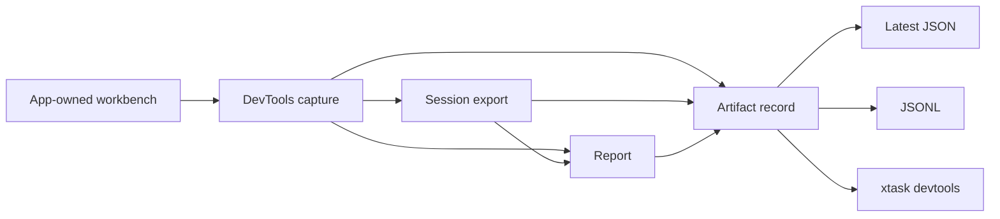

# ADR 0020: Open GPUI DevTools Artifact Pipeline

**Status**: Accepted
**Date**: 2026-07-09

## Context

ADR 0019 established that DevTools' primary automation surface is the artifact contract, not the GUI viewer.
The first headless slice added reports and `xtask devtools` consumers for capture/session/report JSON.
That left the inverse side underspecified: how app-owned workbenches and examples produce artifacts, how command-line tools follow a changing artifact, and how query/assert workflows consume the same facts without depending on a visual inspector.

Open GPUI already has enough data to make this useful:

- `DevtoolsCapture` carries targets, domains, events, compatibility snapshots, and diagnostics.
- `DevtoolsSessionExport` carries bounded sanitized frame history.
- `DevtoolsReport` carries summarized findings with severity and recommendations.
- Gallery and docking-native own live `DevtoolsWorkbench` integrations over real app/runtime facts.

The next layer needs a producer/sink contract and CLI semantics that preserve those boundaries.

## Decision

DevTools will add a headless artifact pipeline around the existing capture/session/report schemas.

The accepted shape is:

- `open-gpui-devtools` owns `open-gpui-devtools-artifact-record/v1`.
- One artifact record wraps exactly one capture, session export, or report payload plus sanitized metadata:
  - producer id
  - optional scenario id
  - optional session id and generation derived from the payload when available
  - monotonic sequence
  - flush reason
  - optional timestamp
  - redacted value count
- Artifact sinks are local and bounded:
  - replace a JSON file
  - atomically replace a latest JSON file
  - append JSONL records
  - write JSONL to any caller-owned writer, including stdout
- Application/example code owns when to refresh runtime facts. DevTools serializes sanitized payloads but does not run a background runtime, mutate UI state, or own docking/GPUI authority.
- `xtask devtools` remains a consumer/orchestrator over artifacts. Future `query`, `assert`, and `follow` commands must use this same artifact record shape instead of inventing command-specific envelopes.

## Consequences

- GUI inspectors remain consumers of the same sanitized facts, not the source of truth.
- CLI and fixture tests can operate on small reproducible records without launching a GUI.
- Follow/watch semantics can advance on artifact sequence, generation, or content identity rather than attaching to a process.
- Report/query/assert commands can retain stable metadata across capture, session, and report inputs.
- The artifact record is intentionally Open GPUI-specific. CDP, DAP, LSP, and SARIF adapters remain possible future exports, not the core protocol.

## Alternatives Considered

### Option A: Make `xtask` own producer output

**Pros**: Fast first implementation for CLI demos.

**Cons**: Puts reusable serialization and write semantics in an application crate; examples and tests would need to duplicate or shell out to `xtask`.

**Decision**: Rejected. The writer contract belongs in `open-gpui-devtools`; `xtask` is only a caller.

### Option B: Introduce a new trace format

**Pros**: Could mirror browser trace tools more closely.

**Cons**: Duplicates the capture/session/report schemas that already exist and forces every consumer to understand another top-level protocol.

**Decision**: Rejected. Records wrap existing artifacts.

### Option C: Use an external diagnostics standard as the core format

**Pros**: SARIF or LSP diagnostics could make CI/editor integrations easier.

**Cons**: Open GPUI DevTools needs UI-specific targets, domains, events, snapshots, diffs, redaction, and bounded session frames. External standards are better as exporters after the native artifact contract is stable.

**Decision**: Deferred.

## Risks and Mitigations

| Risk | Severity | Likelihood | Mitigation |
|---|---|---|---|
| Producers start serializing private runtime structs | High | Medium | Keep metadata narrow and require app-owned allowlisted DTOs |
| Artifact records become an unbounded trace store | Medium | Medium | Keep sinks local and bounded; JSONL append is caller-owned |
| CLI commands invent separate envelopes | Medium | Medium | Route future query/assert/follow through artifact records |
| Sensitive metadata leaks through producer/scenario ids | High | Low | Sanitize metadata through the shared DevTools sanitizer |
| Atomic latest writes behave differently across platforms | Medium | Low | Use sibling temp write plus rename and test on Windows |

## Related Documents

- `docs/adr/0019-open-gpui-devtools-headless-diagnostics.md`
- `docs/plans/2026-07-09-006-feat-devtools-headless-artifact-pipeline-plan.md`
- `crates/devtools/README.md`
- Chrome DevTools Protocol: https://chromedevtools.github.io/devtools-protocol/
- Playwright Trace Viewer: https://playwright.dev/docs/trace-viewer
