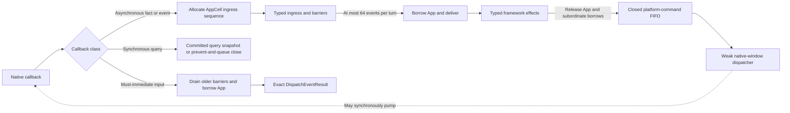

# ADR 0029: Open GPUI Platform Window Mutation Capabilities

**Status**: Accepted
**Date**: 2026-07-25
**Amended**: 2026-07-28 (U25 appearance, activation, ownership, and presentation authority); 2026-08-18 (synchronous mutation terminal pairing)

## Context

The former viewport-level `live_window_move` boolean grouped together several independent
questions: whether a backend reports shared-desktop coordinates, can dispatch a position or size
change, can observe the resulting placement, and can change a particular window state or input
flag. A single boolean could therefore advertise move support when only resize was usable, or
allow callers to infer a native commitment from a request that was only queued.

Native backends also differ materially. Windows can read native window state and perform typed
live size, state, and pointer-input requests, but its existing logical desktop coordinates are
scaled per window and are not comparable across mixed-DPI monitors. macOS consumes initial bounds,
state, and pointer-input configuration. X11 can observe global configure events and consume initial
placement configuration, but its move and resize notifications are not one atomic global
placement observation. Wayland intentionally leaves placement to the compositor: an XDG surface
can consume and observe surface-local size and state configuration, but no Wayland surface can
offer a global position contract.

The callback side of the same boundary previously had a separate authority failure. Native
callbacks attempted `AsyncApp::update_window` directly, so a callback that arrived while another
window update held the application borrow could be logged and dropped. Retrying independently in
each backend could not preserve cross-window order, close and pointer barriers, mutation terminal
delivery, or frame invalidation. Return-valued callbacks were worse: substituting a default
`DispatchEventResult` could change native default handling, while invoking a native command under
the application borrow could synchronously pump another input callback into the same borrow.

Window creation is also reentrant on some platforms. A callback can arrive after the backend has a
native window but before GPUI has committed its `Window` to the registry. Treating that callback as
stale loses real creation-time facts; treating the slot alone as identity can deliver it to a
later window incarnation.

## Decision

GPUI exposes one backend-neutral `PlatformWindowCapabilities` contract with separate creation and
mutation halves. `PlatformWindowCreationCapabilities` reports whether the backend can honor a
non-activating first appearance and a typed transient owner, plus whether the first frame can be
submitted before native visibility. `PlatformWindowMutationCapabilities` separates coordinate
authority from support for position, size, windowed, maximized, fullscreen, minimized, restore
bounds, pointer input, one coherent activation policy, alpha, topmost, and taskbar visibility.
Each mutation property is explicitly unsupported, creation-only, or live; a creation-only claim
requires a native creation path, and a live claim also requires typed dispatch plus a readable
native observation path for the resulting fact.

The coordinate contract is explicit:

- macOS and X11 report `GlobalScreen` because their current facts use one shared desktop coordinate
  space.
- Windows reports `WindowLocal` and leaves live position unsupported until it has a mixed-DPI-safe
  shared desktop coordinate contract. Position and restore-bounds hints remain available at
  creation.
- Wayland reports `WindowLocal` and does not advertise global position.
- A coordinate claim does not imply atomic placement mutation. In particular, X11 must not claim
  one coherent global move-and-resize observation from separate configure handling.
- Wayland XDG creation can request maximized or fullscreen state before its first commit. LayerShell
  windows have no equivalent state request and remain unsupported for those kind-specific
  operations.

Windows advertises `Live` size, windowed, maximized, fullscreen, pointer-input, and
activation-policy support. Position, restore bounds, and alpha are `CreationOnly`; minimized,
topmost, and taskbar visibility are unsupported. It supports non-activating first appearance,
typed transient ownership, and first submission before visibility. Its live backend paths return
typed queued dispatch, guard each placement, pointer-input, or activation-policy generation, read
the resulting native facts, roll back failed multi-step native writes, and emit one
domain-and-generation-bound terminal observation. Fullscreen rollback includes style, bounds,
`WINDOWPLACEMENT`, restore state, display/scale facts, and the `NonRudeHWND` taskbar property;
pointer and activation rollback restore both native state and the committed backend fact.

The remaining native projections advertise creation-only support where the backend consumes the
canonical creation request. They do not upgrade legacy resize, toggle, or boolean setters to
`Live`: those paths do not yet provide typed dispatch, generation ownership, and coherent observed
facts. Windowed, maximized, fullscreen, and minimized are distinct capability properties, so a
backend that cannot create or observe minimized state leaves that property unsupported.
X11 window-manager and Wayland compositor state requests remain requests: the resulting creation
facts may be adjusted and are authoritative only after native observation.

Position, size, each placement state, and restore bounds remain one GPUI placement conflict domain.
Pointer input, coherent activation policy, alpha, topmost, and taskbar visibility each own an
independent domain. The common GPUI authority owns all six monotonic generation streams,
queued versus terminal outcomes, close handling, and the committed fact cache. Every backend
terminal observation carries the exact domain and generation supplied at dispatch. `Window`
rejects a stale generation before committing its facts, so a delayed callback cannot settle a
newer ticket or roll the public cache backward. Before a new request is classified as unchanged,
unsupported, or queued, the backend invalidates older queued work in that domain. Window close
invalidates every backend domain before retained tickets settle as `WindowClosed`.

`WindowMutationRequest` is the complete executable request vocabulary, not merely a diagnostic
matrix. The public placement, pointer-input, activation-policy, alpha, topmost, taskbar, resize, zoom,
minimize, and fullscreen helpers are thin typed wrappers over it. `WindowPlatformFacts` carries
the corresponding committed independent-flag facts. A creation-only value is seeded from window
creation and preserved when a generic native geometry refresh cannot observe that property.
Native backends project their observable capabilities into this authority; they do not introduce
an optimistic parallel fact source.

The public `zoom_window`, `minimize_window`, and `toggle_fullscreen` helpers are state-only typed
wrappers over that placement authority. They return a `must_use` dispatch and do not attach stale
restore geometry to a state transition. The backend trait no longer exposes parallel legacy
commands that can bypass placement generations.

Moved, resized, and external window-state callbacks refresh the committed facts cache. A generic
state-change callback never settles a mutation ticket: only the generation-bound terminal
observation callback can do that.

Every prepared mutation generation has exactly one backend finish path. A queued dispatch retains
the generation until its exact `on_window_mutation_observation` terminal arrives. An unchanged,
unsupported, rejected, or synchronously closed dispatch cannot produce that callback, so GPUI calls
`PlatformWindow::finish_window_mutation_without_observation` exactly once with the same domain,
generation, and terminal. That hook retires backend preparation state without publishing another
fact or manufacturing an observation. A backend must not retain native work or emit a later
terminal for an unobserved finish, and it must not use the hook for a queued request. This pairing
keeps backend-only preparation, including provisional z-order authority, from leaking across a
synchronous classification while preserving the rule that committed facts change only through the
GPUI mutation authority.

The legacy `live_window_move`, `PlatformViewportFlagCapabilities`, and
`viewport_flag_capabilities` surfaces are deleted. Docking and diagnostics consume the one GPUI
matrix rather than mirroring backend-specific booleans. Dock retains terminal failures per window,
domain, request, and relevant committed facts so a rejected or unsupported request is not retried
every frame; a changed target or changed relevant facts permit a new attempt. Placement retry
fingerprints exclude activity, pointer input, and unrelated flag facts. DevTools serializes queued
requests and terminal observations as structured request/fact payloads rather than unstable debug
strings.

Capability projection before opening a window uses its actual creation kind and target
`Option<DisplayId>`; `None` selects the backend's primary or default display. This lets a backend
report display-dependent creation support exactly, including whether an X11 screen exposes a
transparent visual. An unavailable display id is normalized to `None` before both projection and
creation, so a stale saved target falls back to the current default rather than creating a profile
for one screen and a window on another. GPUI captures one immutable `PlatformWindowProfile`
containing the `WindowKind` and resolved creation and mutation capabilities when the window is
registered, keeps it readable while a window update temporarily removes mutable window state from
the registry, and removes it on close. Dock runtime status resolves every viewport window through
that profile instead of applying the backend's `WindowKind::Normal` or primary-display matrix to
heterogeneous windows.

### Appearance, activation, ownership, and presentation

`WindowOptions::focus_on_appearing` is an immutable one-shot first-appearance request. It is never
projected into a permanent no-activate native style and has no live mutation request.
`WindowActivationPolicy` independently carries lifetime `accepts_activation` and
`focus_on_click`; both fields share one request, generation, rollback, committed fact update, and
terminal observation so callers cannot observe a half-applied policy. Pointer-input acceptance is
another independent domain.

`WindowTransientOwner` is an opaque application-bound token for one exact live
`AnyWindowHandle`. GPUI validates the application, full window generation, liveness, and non-self
relationship before native creation. Backends either establish the requested top-level native
relationship and report it in `WindowCreationFacts` or reject it according to their creation
capability; they never guess the active window. Ownership assists native grouping, activation,
minimization, and z-order. It does not imply child-window style or cascading application lifetime.

`WindowPresentationFacts` deliberately separates native creation, latest accepted frame, latest
submitted present, latest submitted non-empty scene, the exact latest present attempt, bounded
initial-presentation settlement, and current native visibility. A draw returns `Submitted`,
`Deferred`, or `Rejected`; only a real renderer submission advances present facts. Windows can
submit the initial frame while hidden and reveals only after that accepted presentation gate.
Backends that must map first declare `AfterVisibility`. Wayland declares
`PresentationEstablishesVisibility` because its first buffer commit both presents content and maps
the toplevel. Visibility never stands in for non-empty presentation.

### Callback delivery and reentrancy

`AppCell` owns the native callback boundary beside `RefCell<App>`. It contains a private typed
event ingress, immutable native-query snapshots, and a private FIFO for the closed set of
pump-sensitive platform commands. This is an implementation boundary, not a public event bus.

The callback taxonomy is exhaustive for `PlatformWindow` and its accessibility callback surface.
A new callback is not valid until this table names its class, return contract, ordering domain,
and stale-window behavior.

| Callback | Class | Immediate return contract | Authority |
| --- | --- | --- | --- |
| `A11yCallbacks::activation` | Asynchronous fact | Return no committed tree; the adapter may retain its temporary placeholder | Set the requested accessibility generation and enqueue a refresh |
| `A11yCallbacks::deactivation` | Asynchronous fact | Unit | Advance requested accessibility state and enqueue a refresh |
| `A11yCallbacks::action` | Asynchronous event | Unit | FIFO action carrying the activation generation |
| `on_request_frame` | Asynchronous event | Unit | Coalesced frame domain with accepted-or-reinvalidated semantics |
| `on_active_status_change` | Asynchronous fact | Unit | Sequenced, non-coalescing activation edges; deactivation-induced pointer cancellation is a barrier |
| `on_modifiers_changed` | Asynchronous fact | Unit | Sequenced, non-coalescing modifier snapshot ordered after its causal activation edge |
| `on_hover_status_change` | Asynchronous fact | Unit | Sequenced, non-coalescing enter/leave facts within the current pointer session |
| `on_resize` | Asynchronous fact | Unit | Coherent placement-fact refresh; callback size and scale are notification hints, not a second fact source |
| `on_moved` | Asynchronous fact | Unit | Coherent placement-fact refresh |
| `on_window_state_change` | Asynchronous fact | Unit | Coherent placement-fact refresh; never settles a mutation ticket |
| `on_window_mutation_observation` | Asynchronous terminal event | Unit | FIFO, non-droppable domain-and-generation terminal observation |
| `on_should_close` | Synchronous decision | Exact decision when idle; otherwise `false` while a close intent is queued | Prevent native destruction until the ordered close decision runs |
| `on_hit_test_window_control` | Synchronous query | Committed `Option<WindowControlArea>` for the full `WindowId`; `None` when absent | Immutable `AppCell` query snapshot; never borrows `App` |
| `on_close` | Asynchronous lifecycle event | Unit | FIFO, non-droppable final close barrier |
| `on_appearance_changed` | Asynchronous fact | Unit | Latest appearance refresh |
| `on_button_layout_changed` | Asynchronous fact | Unit | Latest button-layout refresh |
| `on_move_tab_to_new_window` | Asynchronous event | Unit | FIFO system-tab command into GPUI |
| `on_merge_all_windows` | Asynchronous event | Unit | FIFO system-tab command into GPUI |
| `on_select_previous_tab` | Asynchronous event | Unit | FIFO system-tab command into GPUI |
| `on_select_next_tab` | Asynchronous event | Unit | FIFO system-tab command into GPUI |
| `on_toggle_tab_bar` | Asynchronous event | Unit | FIFO system-tab command into GPUI |
| `on_input` | Must-immediate hybrid input | The exact current handler-derived `DispatchEventResult` | Dedicated synchronous idle-only entry; never queued, replayed, or guessed |

All events delivered through `on_input` remain on the must-immediate path. Key down/up, mouse and
non-client motion, pressure, wheel, and pinch have backends that consult propagation or default
prevention. Button edges, modifier changes delivered through `on_input`, pointer cancellation,
mouse exit, and file drop also remain synchronous and FIFO because that callback contract returns
a disposition, even where one adapter currently ignores it. A backend may use the dedicated
`on_modifiers_changed` asynchronous fact only for a result-independent synthetic resynchronization,
such as the modifier snapshot caused by an activation edge. It remains sequenced and
non-coalescing. Any other queue-eligible input split requires backend-by-backend proof that native
behavior does not consume the result. GPUI never coalesces input after callback entry. Pointer
cancellation is the terminal barrier for its pointer/capture generation.

`PlatformInputHandler` is a related synchronous boundary, not an ingress event. Its editor queries
and IME mutations run as one focused-handler input transaction at the same idle boundary. A
backend must not call it while `App` is borrowed, cache a text answer as a fixed fallback, or replay
an edit later. The hit-test snapshot is deliberately narrower: it contains only committed
non-sensitive window-control facts. Any future immutable IME snapshot must carry the focused
handler, text, geometry, and composition revisions that make its answer valid.

The typed domains have the following normative queue behavior. Coalescing is allowed only against
the adjacent pending tail with the same full `WindowId`, typed domain, and relevant
pointer/session/mutation generation. It therefore never moves an event ahead of an intervening
window or domain event.

| Typed domain | Coalescing or FIFO rule | Barrier rule | Stale-window rule | Terminal rule |
| --- | --- | --- | --- | --- |
| Frame request | Replace an adjacent request and OR `force_render` and `require_presentation` | Close prevents later draw/present | Drop for a retired full `WindowId` | Not terminal; remains pending until accepted or re-invalidated |
| Placement facts (`resize`, `moved`, external state) | Coalesce to one coherent getter refresh | Mutation terminal and close retain their relative order | Drop for a retired ID | Never settles a mutation ticket |
| Activation | FIFO and non-coalescing | Deactivation emits or precedes pointer cancellation; neither activation edge can be coalesced away | Drop for a retired ID | No terminal result |
| Modifier facts | FIFO and non-coalescing | Ordered after the causal activation edge and before later native work | Drop for a retired ID | No terminal result |
| Hover | FIFO and non-coalescing within one pointer session | Pointer cancellation and close end the session; enter and leave edges cannot be folded | Drop for a retired ID or stale pointer session | No terminal result |
| Appearance | Coalesce adjacent refreshes | Close | Drop for a retired ID | No terminal result |
| Window button layout | Coalesce adjacent refreshes | Close | Drop for a retired ID | No terminal result |
| Accessibility refresh | Coalesce adjacent refreshes and read the current requested generation at delivery | Close | Drop for a retired ID | No terminal result |
| Accessibility action | FIFO and non-droppable | Accessibility deactivation/generation change and close | Reject a stale activation generation or retired ID | Delivered at most once |
| System tab command | FIFO and non-droppable | Close and cross-window tab-session barriers | Drop when source, target, or tab-session generation is stale | Delivered at most once |
| Close request | FIFO and non-droppable | Blocks newer input until the decision is applied; rejection releases the barrier | A retired ID is already closed | One decision per queued request |
| Closed lifecycle | FIFO and non-droppable | Final barrier: no newer event may mutate the retired incarnation | Duplicate or retired close is diagnostic-only | Settles retained mutations, removes the window, and retires the ID once |
| Mutation observation | FIFO and non-droppable | Ordered with placement facts and close | Reject a stale full ID, domain, or mutation generation before committing facts | Exactly one accepted terminal per current ticket |
| Immediate input | Native callback order; never mailbox-coalesced | Must first settle older ingress barriers; pointer cancellation and close end their sessions | A missing or retired ID is an invariant failure at callback entry | Returns one exact disposition before native handling continues |

The ingress sequence is application-wide and monotonic. It is allocated before attempting to
borrow `App`, deciding on inline delivery, or coalescing. Inline delivery is legal only while the
queue is empty, no drain owns the queue, and no unresolved barrier exists. A callback created
during delivery is appended with a newer sequence; it never recursively borrows `App`. Coalescing
retains the newer envelope sequence and merges only payload facts explicitly listed above.

Each drain turn processes at most 64 envelopes, then schedules one foreground wake if work remains.
Partial drains preserve sequence and barriers across windows. Diagnostics expose sequence,
callback kind, domain generation, and `pending`, `delivered`, `coalesced`, `stale`, `closed`, or
invariant-failure disposition. They never retain text input, IME contents, file paths,
accessibility labels, or another user payload.

### Reserved window identity

GPUI reserves the full generation-bearing `WindowId` before calling the native constructor and
registers it as `Reserved`, not `Live`. Synchronous callbacks during construction can therefore be
sequenced, but they wait while the outer application transaction owns the borrow.

- On commit, GPUI installs the `Window`, immutable mutation profile, and handles, marks the
  reservation's query snapshot live, then makes queued envelopes eligible in sequence order.
- On rollback, GPUI removes the reservation and query snapshot, retires that exact generation, and
  records its queued envelopes and commands as stale.
- On close, GPUI first invalidates native mutation generations and settles retained tickets, then
  removes the live registry entry and query snapshot.
- Slot reuse always creates a different full `WindowId`; an envelope or command from an older
  generation cannot target the replacement.

`App::open_window`, its fallible transaction, root construction, initial draw, and commit remain
synchronous authorities. There is no asynchronous open-window outbox.

### Pump-sensitive platform commands

Framework and component code may request only this closed command set across the outer application
borrow: `CompleteInitialPresentation { activate }`, `Activate`,
`ShowWindowMenu(Point<Pixels>)`, `StartWindowMove`, and `StartWindowResize(ResizeEdge)`. The
envelope carries its own FIFO sequence, full `WindowId`, and a dispatcher that weakly references
native state. `PlatformWindow` has no direct activation operation that can bypass this boundary.

The caller may enqueue a command while it holds `AppRefMut`, but execution waits until the outer
borrow and every subordinate entity, controller, or viewport-runtime borrow have been released and
older ingress barriers have settled. A callback pumped by the dispatcher then enters an idle
`AppCell`. Commands enqueued while a command is running append to the tail and do not recurse.
Commands for a rolled-back or closed full `WindowId` are dropped before dispatch.

Every dispatcher returns the synchronous terminal
`PlatformWindowCommandOutcome::{Accepted, Rejected}`. Queue admission is not success: each attempt
receives its own terminal diagnostic, and a missing weak native target is `Rejected`. Only an
accepted `CompleteInitialPresentation` publishes `InitialPresentationCompleted`. A rejected
initial-presentation attempt retains the backend's hidden/show intent and receives exactly one
bounded retry, for two attempts total; a second rejection leaves the window unpresented, publishes
`InitialPresentationFailed`, and records `WindowInitialPresentationStatus::Rejected`. Other
rejected commands are terminal and are never retried.

No generic `Box<dyn FnOnce(&mut App)>`, arbitrary native closure, executor task, or callback outbox
may cross this boundary. Model, controller, and Dock operations instead return typed effects;
their owner releases its short borrow before the current `&mut App` applies those effects or
enqueues one of the closed commands.

### Accepted-or-reinvalidated frames

A frame callback is not acknowledged merely because the backend invoked a callback or because
GPUI failed to borrow `App`. A live or reserved full `WindowId` must retain one of two proofs:

1. GPUI accepted a typed frame envelope with a guaranteed foreground wake and will eventually
   evaluate draw/present requirements after older barriers; or
2. the backend kept native damage invalid, or explicitly re-invalidated and scheduled another
   callback after GPUI could not accept the request.

Adjacent frame callbacks may coalesce, but the merged envelope preserves the strongest
`force_render` and `require_presentation` flags. A close barrier makes the request stale and
forbids a later draw. On Windows, validating a paint region cannot be the only record of a callback
that did not reach the accepted path.

Owning-platform CI both checks and tests each native backend package. Windows integration tests
exercise every advertised live domain against native readback, inject a frame-change failure after
the first pointer-style write to prove rollback and rejection, compare creation-time cache seeding
with independent Win32 readback, defer hidden-window placement, and use an external `WM_SIZE`
callback to refresh committed facts without a GPUI mutation request. macOS, X11, and Wayland
currently advertise no live domains. Their package tests assert exact kind-specific
creation-only/unsupported matrices and exercise pure creation projections that are consumed by the
production native constructors, including Wayland's XDG-versus-LayerShell split. Any future `Live`
upgrade must add an owning-runner dispatch, failure, and observation test in the same change.

The Windows real-HWND harness additionally proves that the builder observes a hidden HWND, initial
presentation dispatches only after registry commit with `AppCell` idle, a synchronous WndProc input
returns its exact consumed or propagated disposition, and a rejected first presentation retries
once before completion. Reserved-window WndProc callbacks remain pending until commit and retire as
stale or closed on rollback.

## Consequences

- Callers can distinguish unsupported, creation-only, and live behavior before dispatching a
  request.
- A queued native request is not reported as an applied or committed platform fact.
- A delayed terminal from an older generation cannot replace committed facts or settle a newer
  ticket.
- Backends can expose creation-only or live resize, state, or pointer-input support independently
  without claiming unrelated position or restore-bound guarantees.
- Independent flags can dispatch, supersede, and settle without cancelling unrelated flag work.
- A capability consumer sees one tri-state matrix instead of combining placement facts with a
  second viewport-flag table.
- Wayland remains usable for observable local size and state changes without inventing a
  compositor-global coordinate model.
- Wayland capability lookup is window-kind-specific, so LayerShell never inherits XDG placement
  claims.
- X11 alpha creation support is target-display-specific and becomes unsupported when that screen
  has no transparent visual.
- Multi-viewport diagnostics retain each opened window's actual kind and display-resolved
  capability matrix rather than projecting one backend-wide normal-window answer.
- Windows does not claim cross-window global geometry until mixed-DPI coordinates are comparable.
- Native backend changes must revise both the capability projection and owning-platform
  observation evidence when a claim changes.
- A native callback cannot be discarded solely because `App` is already borrowed.
- Return-valued input cannot substitute a fixed disposition or delayed replay.
- Window creation, close, and slot reuse preserve full-generation callback isolation.
- Pump-sensitive native commands cannot run under the application or a subordinate model borrow.

## Verification

The decision is accepted only while all of these measurable criteria hold:

- every registered `PlatformWindow` and accessibility callback appears in the taxonomy above, and
  native adapters have no callback-local `update_window(...).log_err()` loss path;
- deterministic App-borrow tests inject every asynchronous domain during an update and observe the
  same committed result as idle delivery, including nested callbacks without recursive delivery;
- the bounded drain handles at most 64 envelopes per turn, preserves application-wide sequence
  over partial drains, and schedules another wake while work remains;
- TestPlatform and the owning Windows real-window harness each prove one consumed and one
  propagated input result after command dispatch, with a native-input busy count of exactly zero;
- coalescing tests cover frame option union, appearance, button layout, and placement facts;
  activation, modifier, and hover tests prove FIFO edge preservation, while close, pointer
  cancellation, accessibility action, system-tab command, and mutation terminal tests prove FIFO
  non-loss;
- reserved-window tests deliver construction callbacks after commit and classify every callback
  and command after rollback as stale; a reused slot cannot observe the retired generation;
- a forced frame callback borrow conflict produces a later accepted non-empty presentation or an
  explicit re-invalidation, and no frame presents after close;
- command tests prove the four-value vocabulary, full-ID stale rejection, FIFO nested enqueue, weak
  native lifetime, and absence of a generic closure outbox;
- diagnostics contain callback identity and disposition but no user input, IME text, file path, or
  accessibility content.

## Risks and mitigations

| Risk | Mitigation |
| --- | --- |
| Coalescing erases a lifecycle edge or moves work across windows | Coalesce only the adjacent tail with the same full ID, typed domain, and relevant generation; make cancellation, close, commands, and terminals non-droppable |
| A callback storm starves foreground work | Drain at most 64 envelopes, coalesce only declared fact domains, and reschedule one wake |
| A synchronous query snapshot is stale | Publish only committed revision-bound facts and return conservative `None` or prevent-and-queue close when the revision cannot be proved |
| A platform command extends a native window lifetime or pumps input under a borrow | Store a weak dispatcher, reject stale full IDs, release all owners before FIFO dispatch, and test callback entry |
| A busy hybrid input path silently changes native behavior | Treat it as an invariant failure, count it, and require zero in deterministic and owning-platform tests |
| Diagnostics expose user content | Record only typed kind, sequence, generation, and disposition; prohibit payload serialization |

## Rejected Alternatives

- Keeping `live_window_move` would continue to conflate coordinates, dispatch availability, and
  observation.
- Treating every existing setter as live would advertise requests whose resulting native facts
  cannot be read back.
- Normalizing Wayland to a fabricated global desktop origin would make placement-dependent
  consumers incorrect under compositor control.
- Letting Docking infer capabilities from direct backend getters would duplicate and drift from
  GPUI's committed platform-fact authority.
- Retrying or logging independently in each callback would still lose global order, barriers,
  exactly-once terminals, and frame liveness.
- Making every callback asynchronous would force return-valued input to guess native propagation
  and would make close permission race native destruction.
- A generic closure mailbox or arbitrary command outbox would hide merge, stale, barrier, privacy,
  and lifetime semantics and could grow into a second application executor.
- Running native commands directly while `AppRefMut` is held would permit synchronous native input
  to re-enter the same mutable borrow.

## Related documents

- [Open GPUI Component Contract](../ui/component-contract.md#native-window-callback-boundary)
- [Open GPUI v0.3 UI Migration](../ui/migration-v0.3.md#native-window-callback-and-command-boundary)
- [UI framework authority convergence plan, U24](../plans/2026-07-10-001-refactor-ui-framework-authority-convergence-plan.md#u24-make-platform-event-delivery-reentrancy-safe)
