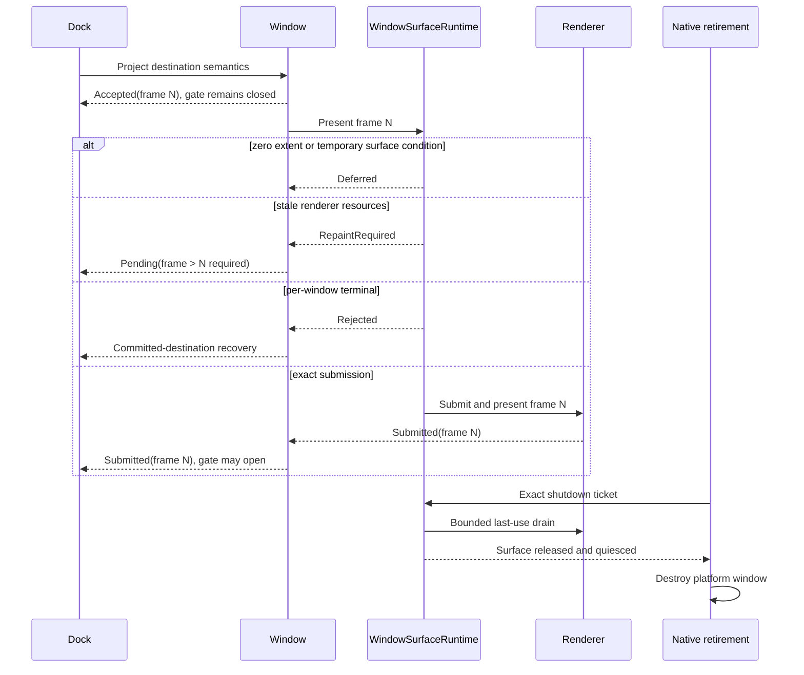

# ADR 0031: Open GPUI Renderer Surface Lifecycle Authority

**Status**: Accepted
**Date**: 2026-08-15

## Context

Open GPUI previously exposed enough renderer outcome information to distinguish a submitted frame
from a temporarily deferred frame, but provisional destination semantics still treated an accepted
GPUI frame as if the renderer had submitted it. A WGPU surface also mixed per-window resize,
zero-extent handling, surface recreation, shared-device waits, and presentation shutdown inside the
renderer body. One window could therefore block other windows sharing the device, a minimized
window could manufacture a synthetic `1x1` presentation, and a renderer rejection did not provide a
typed terminal fact for Dock recovery.

Multi-window docking needs two different authorities:

1. GPUI frame acceptance proves that the candidate semantic tree entered the committed frame
   journal.
2. Renderer submission proves that the exact accepted frame entered that window's presentation
   path.

The interaction gate, focus, activation, and accessibility ownership may use only the second proof.
Backend-specific surface state must remain private to the renderer, while native retirement must
continue to wait for the stronger exact presentation-shutdown ticket.

Dear ImGui's renderer and platform callback ordering is useful behavioral evidence: renderer
resources retire before platform windows, each viewport owns its render target, and usable
suboptimal frames should not be discarded. Its global callback tables, show-before-render ordering,
and backend-owned viewport state do not fit Open GPUI's retained window and transaction model.

## Decision

Open GPUI separates accepted semantic authority from renderer-submitted authority. A provisional
semantic ticket advances through `Pending -> Accepted -> Submitted`, with `Rejected` and
`WindowTerminal` as non-revivable terminal outcomes. Only the exact accepted frame generation may
become `Submitted`. `Deferred` keeps the same accepted authority pending, `RepaintRequired`
invalidates it and requires a newer accepted frame, and `Rejected` enters the current pre- or
post-boundary recovery path without opening interaction.

WGPU owns one private `WindowSurfaceRuntime` per native window. It tracks the desired physical
extent, intent generation, surface generation, configuration receipt, recreation receipt, terminal
state, and exact presentation-shutdown authority. Zero extent is a suspended condition: no
configuration, acquisition, submission, or presentation receipt is produced. Ordinary resize only
records the newest intent and configures at a render-safe point. A usable suboptimal texture is
rendered and presented before the next configuration. Surface loss creates one generation-bound
recreation receipt; an exact recreation failure becomes a renderer-neutral `Rejected` outcome for
that window instead of an endless warning loop.

Presentation shutdown remains a separate stronger protocol. The exact
`WindowPresentationShutdownTicket` stops new surface work, drains the exact last submission with a
bounded acknowledgement, releases surface-bound resources, acknowledges quiescence, and only then
permits native retirement.

## Alternatives Considered

### Keep accepted-frame admission

**Pros**: No new provisional semantic states or Dock bridge.

**Cons**: A `Deferred`, `RepaintRequired`, or rejected renderer attempt can expose input, focus, and
accessibility for content that was never submitted.

**Decision**: Rejected because accepted and submitted frames prove different facts.

### Use one shared-device recovery loop

**Pros**: Fewer per-window state objects and one place to call `device.poll`.

**Cons**: Ordinary resize or one lost surface can block every window, zero extent remains dishonest,
and fixed sleeps or retry counts become semantic policy.

**Decision**: Rejected because native viewports require per-window fault isolation.

### Expose backend surface enums to Dock

**Pros**: Dock could directly distinguish WGPU surface errors.

**Cons**: It leaks WGPU vocabulary into renderer-neutral framework state, duplicates lifecycle
authority, and cannot generalize to DirectX or Metal.

**Decision**: Rejected. Dock consumes only renderer-neutral presentation outcomes.

### Port Dear ImGui renderer callback tables

**Pros**: Closely follows an existing multi-viewport implementation.

**Cons**: Reintroduces global immediate-mode ownership, callback sidecars, and show-before-render
ordering that conflict with retained GPUI entities and exact shutdown tickets.

**Decision**: Rejected; only the lifecycle invariants are adopted.

## Consequences

- Visibility and accepted-frame evidence cannot remove a provisional interaction gate.
- Renderer rejection is terminal for the exact semantic ticket and cannot be revived by a later
  submission.
- Dock enters committed-destination recovery after a post-boundary renderer rejection instead of
  rolling back committed topology or guessing from elapsed time.
- WGPU zero extent produces no synthetic frame, and ordinary resize no longer performs an
  unbounded whole-device wait.
- Surface loss and recreation are generation-bound and isolated to one window.
- Backend-specific surface state remains private; DirectX and Metal can implement the same
  renderer-neutral contract without adopting WGPU enums or implementation structure.
- Release support still requires an owning-platform two-window renderer lifecycle gate. Model and
  package tests do not grant native backend credit.

## Success Criteria

| Criterion | Target | Evidence |
|---|---:|---|
| Interaction admission before exact renderer submission | 0 accepted cases | GPUI provisional semantics tests |
| Zero-extent configure/acquire/submit operations | 0 | `surface_lifecycle::zero_extent_suspends_without_configuring_or_acquiring` |
| Ordinary resize calls to unbounded shared-device `Wait` | 0 | WGPU implementation review and package tests |
| Usable suboptimal frames discarded before presentation | 0 | `suboptimal_frame_remains_usable_and_reconfigures_next_frame` |
| Recreation attempts accepted under a stale generation | 0 | WGPU recreation and resize-supersession tests |
| Package regressions in the implementation gate | 0 | 780 GPUI, 1,354 Docking, and 38 WGPU tests |
| Native release claim | Two real renderer-owned windows converge with empty surface/native census | Owning-platform CI gate; not replaceable by model tests |

## Risks And Mitigations

| Risk | Severity | Likelihood | Mitigation |
|---|---|---|---|
| A renderer reports `Submitted` for the wrong frame | High | Low | Bind submission to exact window, semantic ticket, frame, and placement generations |
| Deferred rendering spins the frame pump | Medium | Medium | Keep typed wake-ups generation-bound and stop presentation-progress throttling after terminal rejection |
| Surface recreation races resize | High | Medium | Use separate intent and surface generations; stale receipts fail closed |
| Shutdown releases a native owner before GPU quiescence | Critical | Low | Retain the exact shutdown ticket and owner until surface release plus quiesced acknowledgement |
| WGPU implementation assumptions leak into other backends | Medium | Medium | Keep `WindowSurfaceRuntime` private and expose only renderer-neutral outcomes |
| Model tests overstate native multi-window support | High | Medium | Require owning-platform two-window renderer lifecycle and empty-census gates before release claims |

## Follow-Up

- Add the real two-window WGPU owning-platform lifecycle scenario required by U31.
- Apply the same renderer-neutral submission and shutdown contract to every backend claiming native
  multi-window release support.
- Complete U32 display-topology and client-geometry convergence before extending exact physical
  placement support beyond Windows.
