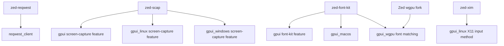

# Zed Fork Dependency Audit

**Date**: 2026-06-06
**Status**: Initial audit
**Related**: [ADR 0001](../adr/0001-open-gpui-fork-strategy.md), [Verification](../verification.md)

## Problem

Open GPUI still depends on a small set of Zed-maintained external forks after the initial clean
workspace import. These forks are intentionally allowed by the current import-boundary scan, but
they remain follow-up debt because they keep framework builds coupled to Zed-controlled git
repositories.

The goal is to replace, justify, or own each fork without weakening the clean license and dependency
boundary established by ADR 0001.

## Current Dependency Map



## Inventory

| Fork | Current source | Reverse dependency evidence | Public candidate | Risk | Recommendation |
| --- | --- | --- | --- | --- | --- |
| `zed-reqwest` | `zed-industries/reqwest.git`, package `zed-reqwest`, version `0.12.15-zed` | `reqwest_client` only | `reqwest = 0.13.4` from crates.io search | Medium | Audit API differences first; likely the best first replacement candidate because the blast radius is isolated to HTTP client construction and body streaming. |
| `zed-scap` | `zed-industries/scap`, package `zed-scap`, version `0.0.8-zed` | `gpui`, `gpui_linux`, `gpui_windows` under `screen-capture` / all-features | `scap = 0.1.0-beta.1` from crates.io search | Medium-high | Treat as a feature-gated migration. Compare frame/capturer API and platform support before changing manifests. |
| `zed-font-kit` | `zed-industries/font-kit`, package `zed-font-kit`, version `0.14.1-zed` | `gpui`, `gpui_macos`, `gpui_wgpu` | `font-kit = 0.14.3` from crates.io search | High | Defer until text/font rendering has stronger coverage; this touches font matching and platform font behavior. |
| `zed-xim` | `zed-industries/xim-rs.git`, package `zed-xim`, version `0.4.0-zed` | `gpui_linux` X11 input method path | `xim = 0.5.0` from crates.io search | Medium-high | Migrate after Linux/X11-focused checks exist; input-method regressions are hard to catch from Windows CI. |
| Zed `wgpu` fork | `zed-industries/wgpu.git`, version `29.0.3` | `gpui_wgpu` | `wgpu = 29.0.3` from crates.io search | High | Defer. The version line matches crates.io, but the fork may carry unpublished patches in rendering internals. Compare lockfile and API behavior before replacing. |

## Evidence Commands

The initial audit used:

```sh
cargo tree --workspace --all-features --target all --edges normal --invert zed-reqwest
cargo tree --workspace --all-features --target all --edges normal --invert zed-scap
cargo tree --workspace --all-features --target all --edges normal --invert zed-font-kit
cargo tree --workspace --all-features --target all --edges normal --invert zed-xim
cargo tree --workspace --all-features --target all --edges normal --invert wgpu
cargo search reqwest --limit 5
cargo search scap --limit 5
cargo search font-kit --limit 5
cargo search xim --limit 10
cargo search wgpu --limit 5
```

## Alternatives Considered

### Option A: Replace all forks immediately

Pros:

- Removes Zed git dependency debt quickly.
- Forces incompatibilities into the open.

Cons:

- High regression risk across rendering, fonts, screen capture, and Linux input methods.
- Current CI only verifies Windows plus Cargo checks; it does not exercise Linux X11, Wayland,
  macOS font behavior, or screen capture runtime paths.

Decision: rejected for now.

### Option B: Replace forks in risk order

Pros:

- Keeps each change reviewable.
- Lets verification coverage grow around each subsystem before changing higher-risk dependencies.
- Preserves momentum while protecting core rendering and platform behavior.

Cons:

- Zed fork debt remains temporarily.
- Requires several small migration commits instead of one broad cleanup.

Decision: recommended.

### Option C: Keep the forks indefinitely and document them as supported dependencies

Pros:

- Lowest immediate engineering cost.
- Preserves imported behavior exactly.

Cons:

- Keeps long-term dependency control outside Open GPUI.
- Weakens the clean-framework positioning from ADR 0001.
- Makes future crates.io publication and supply-chain review harder.

Decision: rejected as a long-term strategy.

## Recommended Work Order

1. **`zed-reqwest`**: inspect the delta between Zed's fork and crates.io `reqwest`; try a focused
   manifest switch in `reqwest_client`; verify with `cargo check -p reqwest_client` and
   `cargo run -p xtask -- verify`.
2. **`zed-scap`**: compare fork API to crates.io `scap`; keep the migration feature-gated and verify
   all-features builds for `gpui`, `gpui_linux`, and `gpui_windows`.
3. **`zed-xim`**: replace only with Linux/X11-focused build evidence. Add a Linux CI lane first if
   practical.
4. **`zed-font-kit`**: defer until text/font tests are stronger because it affects font matching and
   renderer behavior.
5. **Zed `wgpu` fork**: defer until a dedicated renderer compatibility lane can compare behavior
   against crates.io `wgpu = 29.0.3`.

## Success Metrics

| Metric | Target | Measurement |
| --- | --- | --- |
| Zed fork count | Reduced one fork at a time | `rg 'zed-reqwest|zed-scap|zed-font-kit|zed-xim|zed-industries/wgpu' Cargo.toml Cargo.lock` |
| Verification gate | Still passes after each migration | `cargo run -p xtask -- verify` |
| Focused package checks | Targeted crate builds after migration | `cargo check -p <crate>` |
| Runtime risk | No migration without relevant platform/runtime evidence | feature-specific smoke checks or documented limitation |

## Risks and Mitigations

| Risk | Severity | Likelihood | Mitigation |
| --- | --- | --- | --- |
| Public crate API differs from Zed fork | High | Medium | Compare with a focused manifest switch before changing code broadly. |
| Platform-specific regression is missed on Windows CI | High | Medium | Add Linux/macOS or feature-specific CI before migrating platform-sensitive forks. |
| Lockfile churn hides the actual dependency change | Medium | Medium | Commit one fork migration at a time with focused verification evidence. |
| Fork has unpublished behavioral fixes | High | Medium | Inspect fork delta or run compatibility tests before replacement. |

## Open Questions

- Should Open GPUI publish temporary internal forks under its own organization when upstream crates
  are not compatible yet?
- Which runtime checks should be added before touching `font-kit`, `xim`, or `wgpu`?
- Should Linux all-features CI be added before the `scap` and `xim` migrations?
