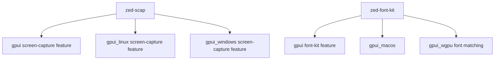

# Zed Fork Dependency Audit

**Date**: 2026-06-06
**Status**: In progress
**Related**: [ADR 0001](../adr/0001-open-gpui-fork-strategy.md), [Verification](../verification.md)

## Problem

Open GPUI still depends on a small set of Zed-maintained external forks after the initial clean
workspace import. The remaining forks are intentionally allowed by the current import-boundary
scan, but they remain follow-up debt because they keep framework builds coupled to Zed-controlled
git repositories.

The goal is to replace, justify, or own each fork without weakening the clean license and dependency
boundary established by ADR 0001.

## Current Dependency Map



## Resolved Forks

| Fork | Resolution | Compatibility note | Evidence |
| --- | --- | --- | --- |
| `zed-reqwest` | Replaced with crates.io `reqwest = "=0.12.15"`. | Zed's fork added per-request `RequestBuilder::redirect_policy`; `reqwest_client` now caches same-config clients with the requested upstream client-level redirect policy when a request carries `RedirectPolicy`. | `cargo check -p reqwest_client`; `cargo nextest run -p reqwest_client` |
| `zed-scap` transitive `windows-capture` drift | Kept `zed-scap`, but pinned the lockfile back to `windows-capture = 1.4.0`. | `zed-scap` declares `windows-capture = "1.3.6"`, which allowed Cargo to select `1.5.0`; `1.5.0` changed the Windows capture API and broke `gpui_windows --all-features`. Version `1.4.0` matches the fork's `Context`, cropped-buffer, and five-argument `WCSettings::new` usage. | `cargo check -p gpui_windows --all-features`; `cargo tree --workspace --all-features --target all --edges normal -i windows-capture@1.4.0` |
| `zed-xim` | Replaced with crates.io `xim = "=0.5.0"`. | Zed's fork exposed a `Client::reset_ic` helper. Upstream `xim 0.5.0` removed that helper but still exposes `ClientCore::send_req` and `Request::ResetIc`, so `gpui_linux` now sends the same XIM reset request directly. | WSL Ubuntu: `cargo check -p gpui_linux --all-features` |
| `zed-font-kit` Git source | Replaced the Git dependency with crates.io `zed-font-kit = "0.14.1-zed"` while keeping the Zed API surface. | This removes `github.com/zed-industries/font-kit` from manifests and lockfile, but it is not an upstream `font-kit` replacement. The published crate uses `dirs = "5.0"` while the previously locked Git rev had `dirs = "6.0"`. | `cargo check -p gpui_wgpu --features font-kit --locked`; `cargo tree --workspace --all-features --target all --edges normal --invert zed-font-kit`; `rg 'zed-industries/font-kit|git\+https://github.com/zed-industries/font-kit' Cargo.toml Cargo.lock crates` |
| Zed `wgpu` fork | Replaced with crates.io `wgpu = "=29.0.3"`. | The public `wgpu`, `naga`, `wgpu-core`, `wgpu-hal`, `wgpu-naga-bridge`, and `wgpu-types` packages are the same version line and are compile-compatible with `gpui_wgpu` and Linux all-features checks. | `cargo check -p gpui_wgpu --locked`; `cargo check -p gpui_wgpu --features font-kit --locked`; WSL Ubuntu: `cargo check -p gpui_linux --all-features --locked`; `cargo run -p xtask -- scan-import-boundary` |

## Inventory

| Fork | Current source | Reverse dependency evidence | Public candidate | Risk | Recommendation |
| --- | --- | --- | --- | --- | --- |
| `zed-scap` | `zed-industries/scap`, package `zed-scap`, version `0.0.8-zed` | `gpui`, `gpui_linux`, `gpui_windows` under `screen-capture` / all-features | `scap = 0.1.0-beta.1` from crates.io search | High | Keep the Zed fork for now. The current crates.io package fails to compile on Windows with its own `windows-capture = 1.5.0` dependency. |
| `zed-font-kit` package | crates.io `zed-font-kit = 0.14.1-zed` | `gpui`, `gpui_macos`, `gpui_wgpu` | `font-kit = 0.14.3` from crates.io | High | The Git source is removed. Defer replacing the Zed package with upstream `font-kit` because current code depends on Zed-only APIs and public/private module behavior. |

## Evidence Commands

The initial audit used:

```sh
cargo tree --workspace --all-features --target all --edges normal --invert zed-reqwest
cargo tree --workspace --all-features --target all --edges normal --invert zed-scap
cargo tree --workspace --all-features --target all --edges normal --invert zed-font-kit
cargo tree --workspace --all-features --target all --edges normal --invert zed-xim
cargo tree --workspace --all-features --target all --edges normal --invert wgpu
cargo search reqwest --limit 5
cargo search scap --limit 5
cargo search font-kit --limit 5
cargo search xim --limit 10
cargo search wgpu --limit 5
```

Additional `zed-scap` migration probe on 2026-06-06:

```sh
cargo update -p zed-scap --precise 0.1.0-beta.1
cargo check -p gpui --all-features
cargo check -p gpui_windows --all-features
cargo check -p gpui_linux --all-features --target x86_64-unknown-linux-gnu
cargo info scap
cargo info windows-capture
```

Result:

- `scap = 0.1.0-beta.1` is the current crates.io release.
- On Windows, `scap` fails before Open GPUI-specific code is checked because it calls
  `windows_capture::frame::Frame::timespan()`, which is not present in `windows-capture = 1.5.0`.
- The same Windows path also calls `WCSettings::new` with the display branch argument order from an
  older `windows-capture` API.
- The Linux cross-check did not run because `x86_64-unknown-linux-gnu` is not installed in this
  Windows toolchain, but the Windows compile failure is already sufficient to block this migration.
- The probe was reverted; `Cargo.toml` and `Cargo.lock` continue to use `zed-scap`.

Follow-up lockfile check:

- The existing `zed-scap` fork also fails with `windows-capture = 1.5.0`, but for a different API
  shape: its Windows path still uses the five-argument `WCSettings::new`.
- `windows-capture = 1.3.6` is too old for the fork because it lacks `capture::Context` and exposes
  `FrameBuffer::as_raw_nopadding_buffer()` instead of `as_nopadding_buffer()`.
- `windows-capture = 1.4.0` matches the fork and restores `cargo check -p gpui_windows --all-features`.

Additional `zed-xim` migration probe on 2026-06-07:

```sh
cargo info xim
cargo update -p zed-xim --precise 0.5.0
cargo tree --workspace --all-features --target all --edges normal --invert xim
wsl -d Ubuntu -- bash -lc 'cd /mnt/f/SourceCodes/Rust/open-gpui; export CARGO_TARGET_DIR=/tmp/open-gpui-target-linux; cargo check -p gpui_linux --all-features'
```

Result:

- `xim = 0.5.0` is the current crates.io release and preserves the `x11rb-client` / `x11rb-xcb`
  feature split used by `gpui_linux`.
- The only compile break was the fork-only `Client::reset_ic` helper. Sending
  `Request::ResetIc` through `ClientCore::send_req` preserves the same protocol request.
- WSL Ubuntu verifies the Linux all-features build. It still emits two pre-existing
  `nightly_coverage` `unexpected_cfgs` warnings from `gpui_linux/src/linux/dispatcher.rs`.

Additional `zed-font-kit` fork delta and migration probe on 2026-06-07:

```sh
cargo search font-kit --limit 5
cargo info font-kit
cargo info zed-font-kit@0.14.1-zed --registry crates-io
cargo tree --workspace --all-features --target all --edges normal --invert zed-font-kit
git diff --name-status v0.14.3 94b0f28166665e8fd2f53ff6d268a14955c82269
git log --oneline --left-right --cherry-pick v0.14.3...94b0f28166665e8fd2f53ff6d268a14955c82269
```

Temporary probe worktrees under `%TEMP%` tested two dependency-only switches. The source-only
migration was then applied to the main workspace:

```sh
# Keep Zed behavior, remove the Git source.
# In gpui, gpui_macos, and gpui_wgpu:
# font-kit = { package = "zed-font-kit", version = "0.14.1-zed", optional = true }
cargo check -p gpui_wgpu --features font-kit
cargo check -p gpui_wgpu --features font-kit --locked

# Replace with upstream Servo font-kit.
# In gpui, gpui_macos, and gpui_wgpu:
# font-kit = { package = "font-kit", version = "0.14.3", optional = true }
cargo check -p gpui_wgpu --features font-kit
```

Result:

- Both `font-kit = 0.14.3` and `zed-font-kit = 0.14.1-zed` are licensed
  `MIT OR Apache-2.0`; license is not the blocker.
- crates.io `zed-font-kit = 0.14.1-zed` is available and preserves the Zed API surface. A temporary
  dependency-only switch passed `cargo check -p gpui_wgpu --features font-kit` on Windows. The
  applied workspace change also passes `cargo check -p gpui_wgpu --features font-kit --locked`.
- The published crates.io `zed-font-kit = 0.14.1-zed` is not byte-for-byte identical to the
  previously locked Git rev `94b0f28166665e8fd2f53ff6d268a14955c82269`: crates.io declares
  `dirs = "5.0"` while that Git rev declares `dirs = "6.0"`. The lockfile now carries
  `dirs = 5.0.1` for `zed-font-kit` and keeps `dirs = 6.0.0` for the rest of the workspace.
- Upstream `font-kit = 0.14.3` is not a drop-in replacement. The same `gpui_wgpu` check fails
  because `font_kit::matching` is private in upstream `font-kit`, while
  `crates/gpui_wgpu/src/cosmic_text_system.rs` calls `font_kit::matching::find_best_match`.
- `gpui_macos` also depends on Zed-only APIs:
  `font_kit::handle::Handle::from_native` in `crates/gpui_macos/src/text_system.rs`, and
  reference-taking `font_kit::font::Font::from_native_font(&new_font)` in
  `crates/gpui_macos/src/open_type.rs`.
- The fork delta against upstream `v0.14.3` touches `src/handle.rs`, `src/loader.rs`,
  `src/loaders/core_text.rs`, `src/sources/core_text.rs`, DirectWrite, FreeType, filesystem source
  paths, tests, and dependency versions.
- Important Zed-side changes include `d97147f Faster OTC font loading (#1)`, native-font handle
  storage, CoreText no-path loading, `core-foundation = 0.10`, `core-graphics = 0.24`, and
  `core-text = 21.0.0`.
- Important upstream-only changes since the shared base include `font-kit = 0.14.3`, a newer
  `pathfinder_simd`, DirectWrite panic avoidance around `dwrote`, CoreText stretch conversion fixes,
  Flatpak font path fixes, and a FreeType SubpixelAA rasterization fix.

Decision:

- Treat Git-source removal and upstream replacement as two separate migrations.
- Git-source removal is complete for `zed-font-kit`: the three manifests now use crates.io
  `zed-font-kit = 0.14.1-zed`.
- Replacing `zed-font-kit` with upstream `font-kit` needs a compatibility lane that either removes
  the Zed-only API usages from Open GPUI or owns a small Open GPUI font-kit fork carrying the needed
  native-handle and public matching behavior.

Additional `wgpu` fork migration probe on 2026-06-07:

```sh
cargo info wgpu@29.0.3 --registry crates-io
cargo tree --workspace --all-features --target all --edges normal --invert wgpu

# Temporary probe worktree:
# In the root workspace manifest:
# wgpu = "=29.0.3"
cargo check -p gpui_wgpu --locked
cargo check -p gpui_wgpu --features font-kit --locked
cargo check -p gpui_wgpu --lib --features font-kit --locked
wsl -d Ubuntu -- bash -lc 'cd /mnt/c/Users/Frankorz/AppData/Local/Temp/open-gpui-wgpu-probe && export CARGO_TARGET_DIR=/tmp/open-gpui-wgpu-probe-linux && cargo check -p gpui_linux --all-features --locked'
cargo run -p xtask -- scan-import-boundary
```

Result:

- crates.io `wgpu = 29.0.3` is available under the same `MIT OR Apache-2.0` license.
- The crates.io packages replace the Zed Git source for `naga`, `wgpu`, `wgpu-core`,
  `wgpu-core-deps-*`, `wgpu-hal`, `wgpu-naga-bridge`, and `wgpu-types`.
- `gpui_wgpu` compiles on Windows with and without the `font-kit` feature after the switch.
- WSL Ubuntu verifies the Linux all-features path through `gpui_linux`; it still emits the
  pre-existing `nightly_coverage` `unexpected_cfgs` warnings from
  `gpui_linux/src/linux/dispatcher.rs`.
- `cargo check -p gpui_wgpu --all-targets --features font-kit` is not a valid migration gate yet
  because `crates/gpui_wgpu/benches/layout_line.rs` includes font assets that are not present in
  this extracted workspace. That failure is unrelated to the `wgpu` API.

Decision:

- Replace the Zed `wgpu` Git fork with crates.io `wgpu = "=29.0.3"`.
- Keep a runtime renderer smoke gate as follow-up debt; this migration establishes compile-level
  compatibility on Windows and Linux, not pixel-output equivalence.

## Alternatives Considered

### Option A: Replace all forks immediately

Pros:

- Removes Zed git dependency debt quickly.
- Forces incompatibilities into the open.

Cons:

- High regression risk across rendering, fonts, screen capture, and Linux input methods.
- Current CI only verifies Windows plus Cargo checks; it does not exercise Linux X11, Wayland,
  macOS font behavior, or screen capture runtime paths.

Decision: rejected for now.

### Option B: Replace forks in risk order

Pros:

- Keeps each change reviewable.
- Lets verification coverage grow around each subsystem before changing higher-risk dependencies.
- Preserves momentum while protecting core rendering and platform behavior.

Cons:

- Zed fork debt remains temporarily.
- Requires several small migration commits instead of one broad cleanup.

Decision: recommended.

### Option C: Keep the forks indefinitely and document them as supported dependencies

Pros:

- Lowest immediate engineering cost.
- Preserves imported behavior exactly.

Cons:

- Keeps long-term dependency control outside Open GPUI.
- Weakens the clean-framework positioning from ADR 0001.
- Makes future crates.io publication and supply-chain review harder.

Decision: rejected as a long-term strategy.

### Option D: Remove Git sources before replacing behavior

Pros:

- Reduces Git dependency and lockfile reproducibility risk without changing font behavior.
- Keeps the first `font-kit` change small: manifests and lockfile only.
- Separates supply-chain cleanup from renderer and platform text behavior changes.

Cons:

- The crate is still named `zed-font-kit`, so Open GPUI still depends on a Zed-published package.
- Does not resolve divergence from upstream Servo `font-kit`.
- Still requires a later compatibility lane for the Zed-only APIs.

Decision: implemented for `zed-font-kit`; keep this pattern for other forks only when a published
crate preserves the required API surface.

## Recommended Work Order

1. **`zed-scap`**: blocked on the current public crate. Revisit after an upstream `scap` release fixes
   the Windows `windows-capture` API mismatch, or after deciding to own a small Open GPUI patch/fork.
   Any retry should verify all-features builds for `gpui`, `gpui_linux`, and `gpui_windows`.
2. **`zed-font-kit` upstream replacement**: defer until a dedicated text/font compatibility lane can
   replace or own Zed-only APIs such as `Handle::from_native`, reference-taking
   `from_native_font`, and public `matching::find_best_match`.
3. **Renderer runtime smoke**: add a focused native renderer smoke before claiming pixel-output
   equivalence for the crates.io `wgpu` migration.

## Success Metrics

| Metric | Target | Measurement |
| --- | --- | --- |
| Zed Git source count | Reduced one Git source at a time | `rg 'github.com/zed-industries/(scap|font-kit)|zed-industries/wgpu' Cargo.toml Cargo.lock` |
| Zed package dependency count | Reduced only after upstream replacement, not source-only migration | `rg 'zed-scap|zed-font-kit' Cargo.toml Cargo.lock` |
| Verification gate | Still passes after each migration | `cargo run -p xtask -- verify` |
| Focused package checks | Targeted crate builds after migration | `cargo check -p <crate>` |
| Runtime risk | No migration without relevant platform/runtime evidence | feature-specific smoke checks or documented limitation |

## Risks and Mitigations

| Risk | Severity | Likelihood | Mitigation |
| --- | --- | --- | --- |
| Public crate API differs from Zed fork | High | Medium | Compare with a focused manifest switch before changing code broadly. |
| Platform-specific regression is missed on Windows CI | High | Medium | Add Linux/macOS or feature-specific CI before migrating platform-sensitive forks. |
| Lockfile churn hides the actual dependency change | Medium | Medium | Commit one fork migration at a time with focused verification evidence. |
| Fork has unpublished behavioral fixes | High | Medium | Inspect fork delta or run compatibility tests before replacement. |

## Open Questions

- Should Open GPUI publish temporary internal forks under its own organization when upstream crates
  are not compatible yet?
- Should Open GPUI create its own font-kit fork namespace before upstream replacement work, given
  that crates.io `zed-font-kit = 0.14.1-zed` is still Zed-published?
- Which runtime checks should be added before replacing `zed-font-kit` with upstream `font-kit`?
- What should the minimum native renderer smoke assert beyond successful `wgpu` compilation?
- Should Linux all-features CI be added as a permanent gate for future Linux dependency changes?
