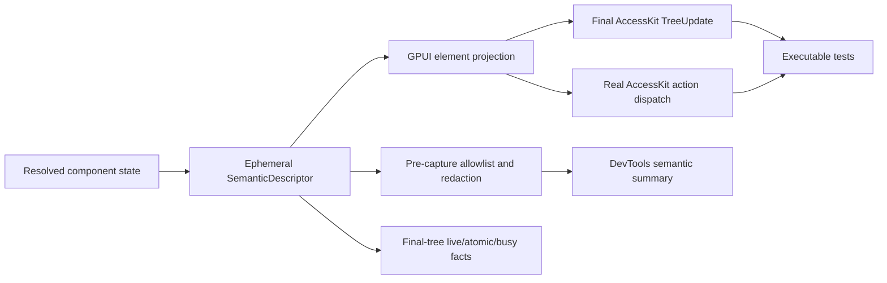

# Decision

Every official Open GPUI component that publishes accessibility semantics derives one ephemeral
`SemanticDescriptor` from its existing resolved state during rendering. The descriptor is a
projection, not independently stored component state. GPUI element attributes, the final AccessKit
tree, supported AccessKit actions, and a redacted DevTools summary consume that same projection.

The final `TreeUpdate` and real action dispatch are the executable evidence boundary. A
renderer-neutral descriptor test is useful policy coverage, but it cannot prove final node
identity, parentage, relations, virtualization removal, modal hiding, or action routing by itself.

# Context

The previous accessibility contract mixed three different concerns:

- component families assembled overlapping ARIA-style facts in local render code;
- `COMPONENT_A11Y_EVIDENCE` and Gallery `COMPONENT_A11Y_CLAIMS` described representative facts in
  static rows that the renderer did not consume;
- tests could pass against those rows without observing the final GPUI accessibility tree or
  dispatching a real platform action.

That arrangement allowed resolved component state, family-local assembly, static evidence, Gallery
claims, final AccessKit nodes, and DevTools output to disagree. It also encouraged row counts in a
manual registry to stand in for a complete producer inventory.

# Authority Flow

Resolved state remains the durable authority for behavior. `SemanticDescriptor` exists only long
enough to project that state into the current render. No adapter, Gallery surface, DevTools probe,
or test fixture may feed semantic facts back into component state.

## Live Regions And Window Announcements

`Role::Status` and `Role::Alert` are declarative semantic regions. `LivePoliteness`, atomicity, and
busy state are projected from resolved component state into the final `TreeUpdate`; they do not
invoke a speech service or move focus. `with_live_text` writes the same text to label and value so
the pinned Windows, macOS, and AT-SPI adapters observe portable content. Explicit `Live::Off` is
preserved as a real value and must not be collapsed into inherited absence.

An application-level notification that has no element owner uses `Window::announce`. The private
per-window queue is bounded, activation-generation-aware, and committed at the same final-tree
boundary as declarative nodes. Equal text requests receive distinct sequence and node identities.
The queue retains an accepted node for one committed generation and then removes it; it never
retains a message history. Requests are focus-independent and diagnostics contain only typed
metadata. The test platform's captured `TreeUpdate` is intentionally the only history allowed to
contain announcement text.

DevTools consumes only the descriptor's allowlisted live priority, atomic, and busy facts. It has no
`TreeUpdate` or queue reader, so announcement text cannot enter capture, session history, diffs,
exports, inspector details, reports, artifacts, or fixtures. Components must use declarative regions
for lifecycle-owned feedback and may call the transient queue only for an explicitly window-global
domain event.

# Final-Tree And Action Boundary

The final-tree boundary has the following rules:

- required, invalid, busy, disabled, selected, checked, expanded, value, relation, collection, and
  modal facts are derived from resolved state once and projected consistently;
- equivalent rerenders preserve the same logical node identity and `NodeId`;
- unmount, virtualization recycle, hidden modal underlay, and relation removal delete obsolete
  nodes and references from the next final tree;
- a removed node cannot receive a stale action, and one logical node identity is never reused for a
  different item;
- Focus, Click, value, selection, and text actions pass through the same policy and disabled gates
  as the component's other supported input paths.

Representative family tests must observe final `TreeUpdate` values and dispatch real actions.
Renderer-neutral `ComponentA11yContract` tests remain supplemental validation of shared vocabulary;
they are not a second runtime authority and do not claim platform screen-reader coverage.

# DevTools Boundary

DevTools receives only allowlisted structural facts and opaque semantic identities. Redaction occurs
before a `DevtoolsCapture` is constructed. Accessible names, descriptions, value text, labels, user
input, clipboard-derived text, and other free-form accessible content are represented only by typed
redacted or summary markers. Capture history, diffs, exports, reports, and fixtures therefore never
become a delayed redaction boundary.

DevTools projections are diagnostic views of the current resolved semantic authority. They cannot
consume `COMPONENT_A11Y_EVIDENCE`, Gallery claims, renderer node IDs, or application-provided text as
an alternate semantic source.

Table redaction is session-owned because exact typed row identity is richer than a public business
id. The adapter maps table, column, and resolved-row identities to opaque ordinals that remain
stable only inside one DevTools session; cell output derives from the opaque row and column
ordinals. It never serializes, formats, debug-prints, or deterministically hashes source identity,
label, cell value, diagnostic source identity, or debug selector. Sanitized diagnostic kinds and
counts remain observable. Every downstream channel consumes the already-redacted projection rather
than reopening Table authority.

# Table As The Multi-Node Contract

Table is the representative multi-node producer because one logical row crosses row-model stages,
pinning regions, virtual windows, edits, callbacks, focus, and semantic nodes. Every row-sensitive
boundary uses an exact typed `TableRowIdentity` rather than an implicit business `TableRowId` or
string; cell-sensitive boundaries use the exact `(TableRowIdentity, TableColumnId)` pair.

Duplicate business ids remain distinct through explicit source-instance identity. Occurrence
identity is valid only in its source snapshot and becomes stale after source replacement or reorder;
retention across snapshots requires a caller-owned instance id. Exact identity drives row and cell
`NodeId`, render keys, edit targeting, callback payloads, debug selectors, pinning, and virtualizer
measurements, so duplicate instances cannot alias.

Logical focus is resolved against the complete final row model. Mounted rows own physical focus
handles; an offscreen focused row transfers the same claim to a stable Table-root proxy. The proxy
may publish Table-level AccessKit focus and continue real keyboard navigation, but it publishes no
stale row node or missing-row actions. A remounted row reclaims focus only while the proxy still
owns the claim. If the identity leaves the final model, focus selects the first remaining row or
clears for an empty model without stealing focus that moved outside Table.

# Deleted Authority

Semantic rows in `COMPONENT_A11Y_EVIDENCE`, Gallery `COMPONENT_A11Y_CLAIMS`, their lookup consumers,
source parser checks, and claim-count completion logic are deleted. They must not be restored under
a new registry, generated manifest, Gallery catalog, DevTools fixture, or documentation table.
Product metadata may remain in the federated component contract, but it cannot claim runtime
semantic behavior.

# Alternatives Considered

## Keep Static Evidence Rows Beside Runtime Semantics

This would preserve inexpensive metadata scans and Gallery bindings. It was rejected because the
rows are not consumed by rendering or action dispatch, drift independently, and turn row count into
a misleading completion metric.

## Store SemanticDescriptor In Component State

This would make the descriptor easy to inspect and reuse. It was rejected because it creates a
second mutable authority whose lifecycle can diverge from resolved component state, mounted GPUI
elements, and the final accessibility tree.

## Test Only Renderer-Neutral Contracts

This would keep tests fast and avoid GPUI windows. It was rejected as the sole evidence boundary
because neutral tests cannot prove adapter mapping, final parentage and relations, stable `NodeId`,
virtualization removal, modal hiding, or real action dispatch. Neutral tests remain a lower layer of
the chosen design.

# Success Criteria

| Requirement | Target | Evidence |
| --- | --- | --- |
| One semantic authority | Every official producer derives semantics from resolved state without stored descriptor state | Source inventory and focused component tests |
| Final projection correctness | Representative action, form, choice, overlay, collection, and Table families assert final `TreeUpdate` facts | GPUI accessibility tests |
| Real action routing | Supported Focus, Click, value, selection, and text actions mutate or emit exactly once; disabled or hidden targets are no-ops | AccessKit action-dispatch tests |
| Stable lifecycle identity | Equivalent rerenders retain `NodeId`; unmounted or recycled identities disappear and reject stale actions | Final-tree lifecycle and virtualization tests |
| No parallel evidence authority | No semantic evidence row, Gallery claim, lookup consumer, or source parser remains | Public-surface, Gallery, and UI-contract absence gates |
| DevTools privacy | Unique free-text canaries never enter capture, history, diff, export, report, or fixture payloads | DevTools redaction tests |
| Table exact identity | Duplicate instances never alias selection, edits, callbacks, focus, nodes, or measurements; focus proxy no-steal and fallback tests pass | Focused Table identity and accessibility tests |

# Risks And Mitigations

| Risk | Severity | Likelihood | Mitigation |
| --- | --- | --- | --- |
| A producer keeps local semantic assembly after migration | High | Medium | Maintain a producer inventory, migrate by family, and add structured absence checks |
| Descriptor and GPUI mapping drift | High | Medium | Centralize projection helpers and assert the final tree, not only the descriptor |
| Stable logical identity accidentally leaks application text | High | Low | Use typed opaque identities and pre-capture redaction; retain free-text canaries |
| Virtualized focus impersonates an unmounted row | High | Medium | Focus the stable Table root, publish no stale row actions, and require real proxy keyboard tests |
| Final-tree tests become slow or brittle | Medium | Medium | Keep policy tests renderer-neutral and reserve window tests for projection, lifecycle, and action boundaries |

# Consequences

- Component resolved state remains renderer-neutral and authoritative; semantic projection does not
  add a persistent state model.
- Final-tree and action tests are required for behavior that static metadata or descriptor tests
  cannot prove.
- DevTools intentionally exposes less accessible free text in exchange for a verifiable privacy
  boundary.
- Table identity-sensitive APIs use explicit typed identities and reject implicit string or
  business-id targeting, which is a deliberate breaking migration.
- Gallery remains a rendered dogfood and selector surface, not a semantic claims registry.
- Future semantic features must extend the resolved-state projection and executable evidence path
  rather than introduce another authority.

# Related Decisions

- [Focus scope and window overlay runtime ownership](focus-scope-window-overlay-runtime.md)
- [Semantic activation authority](semantic-activation-authority.md)
- [Theme scope resolution and deferred capture](theme-scope-resolution.md)
- [ADR 0008: Open GPUI UI Component Productization Roadmap](../../../adr/0008-open-gpui-ui-component-productization-roadmap.md)
- [ADR 0009: Open GPUI Table and Virtualizer Product Shape](../../../adr/0009-open-gpui-table-and-virtualizer-product-shape.md)
- [ADR 0014: Remove Open GPUI Native UI Hybrid Registry](../../../adr/0014-remove-native-ui-hybrid-registry.md)

# Supporting Documents

- [Authority convergence plan](../../../plans/2026-07-10-001-refactor-ui-framework-authority-convergence-plan.md)
- [UI component contract](../../../ui/component-contract.md)
- [v0.3 migration guide](../../../ui/migration-v0.3.md)
- [Verification guide](../../../verification.md)
