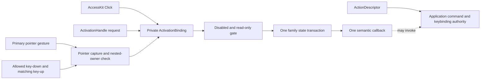

# Decision

Official Open GPUI controls expose semantic activation or value intent, not a physical
`ClickEvent`. Primary-pointer gestures, an allowed unmodified key-up, an AccessKit Click action,
and a programmatic request enter one role-aware activation transaction. That transaction owns one
disabled/read-only gate, one state transition, one callback selection, and one callback delivery.

Semantic activation is not an application command system. It answers whether and how one rendered
control was activated. `ActionDescriptor`, application action identity, keybinding resolution,
command availability, and command dispatch retain their existing ownership. A control may consume
presentation facts from an action or invoke a command from its semantic callback, but activation
does not absorb or duplicate command routing.

`ActivationBinding` is the crate-private GPUI adapter for this decision. It normalizes raw GPUI
events into the public `Activation` and `ActivationSource` vocabulary, while each component family
owns its domain payload and controlled or uncontrolled state transaction. It is not a public
headless abstraction, extension trait, or alternative input API.

# Context

GPUI's generic click behavior cannot define official component semantics. Enter and Space do not
activate every role, a synthetic coordinate click cannot faithfully represent AccessKit or
programmatic activation, and family-local pointer and keyboard handlers can invoke the same public
callback twice. Passing `ClickEvent` through the official API also makes caller logic depend on the
input device instead of the requested domain operation.

The old shape left several independent authorities: public click callbacks, family-local key
handlers, AccessKit click fallbacks, programmatic helpers, and controlled-state callbacks. They
could disagree about disabled gates, event timing, propagation, state ownership, and callback
payloads. Composite families added two more ambiguity sources: a per-item handler competing with a
family fallback, and duplicate logical values resolving to the same target.

# Authority Flow

The pointer and keyboard paths resolve gesture ownership before entering the binding. AccessKit and
programmatic paths dispatch directly and never fabricate a key, pointer position, or click event.
Every accepted source produces the same family payload apart from the typed `ActivationSource`.

# Transaction Contract

An accepted activation follows these rules:

- A standard primary-pointer gesture is armed before dispatch. Cancellation, default prevention,
  a non-standard click, or nested interactive ownership rejects the parent activation.
- Keyboard input arms on an allowed unmodified key-down and dispatches only on the matching key-up.
  Auto-repeat, a focus-owner change, an intervening key sequence, modified input, and default
  prevention invalidate the pending activation. Space default prevention spans key-down through
  key-up for roles that own Space.
- AccessKit Click dispatches directly through the same binding and gate. It does not depend on a
  coordinate-synthesized pointer event.
- `ActivationHandle` dispatches an immediate `Programmatic` source only to its live control in the
  owning window and returns an explicit dispatched, blocked, unavailable, or wrong-window result.
- A consumed physical or semantic gesture produces at most one transaction and one callback. Paths
  that are not accepted do not consume the event and do not mutate state.
- Public `on_activate` callbacks receive the source that entered the transaction. A value-intent
  callback such as `on_change` may intentionally expose only its typed next value when input
  provenance is not a domain fact. Component-specific payloads contain only the minimal domain
  intent, such as the current caller-owned value or selected item.

Uncontrolled controls commit their next state before observers run. Controlled controls do not
speculatively mutate a local projection: they emit one intent against the caller's currently
committed state, and rendering changes only after the caller supplies new state. A controlled
toggle-like callback therefore observes the pre-activation `pressed`, `checked`, or selected value,
not an adapter-owned prediction.

# Normative Role Matrix

| Semantic role or family | Keyboard policy | Timing, repeat, and default | Focus and propagation |
| --- | --- | --- | --- |
| Button, IconButton, button-like Tag, Toast action, Toolbar action | Enter and Space | Activate on an unmodified key-up; ignore repeat; prevent Space scrolling from key-down through key-up | Keep focus unless activation closes the owning surface; stop only the consumed activation path |
| Link and link-like Breadcrumb | Enter only | Activate on an unmodified key-up; Space is not consumed; ignore repeat | Preserve normal focus; modifier or pointer-position semantics require a separately proven raw API |
| Checkbox, Switch, Toggle, Radio, Toolbar toggle | Space only | Activate or change on an unmodified key-up; prevent Space scrolling; ignore repeat | Emit one value intent; disabled and read-only paths neither consume nor change |
| Tabs and Accordion triggers | Enter and Space | Activate on an unmodified key-up; Arrow, Home, and End remain roving-focus navigation | Keep focus on the trigger; automatic Tab selection remains navigation policy, not a second activation |
| Menu, Listbox, and choice rows | Enter; Space only when the owning model defines selection or toggle | Key-up with no repeat; editable search input never enters this path | Skip structural and disabled rows; accepted activation may close through overlay policy |
| Table, Tree, and collection rows | Enter by default; Space only for an explicit selection or toggle contract | Key-up with no repeat; a nested editor or action suppresses row activation | Reveal, focus, selection, and activation remain separate model transactions |
| AccessKit and programmatic entry | Direct semantic action with no synthetic key or coordinates | Immediate transaction with a typed source; exactly once | Apply the same disabled, read-only, nested-ownership, and identity gates as pointer and keyboard entry |

Separators, labels, groups, and other structural items have no activation policy. All keyboard rows
reject modified keystrokes unless a component documents a distinct modifier contract outside
semantic activation.

# Composite Ownership And Identity

Composite families resolve callback and identity authority before binding input:

- An item's explicit handler overrides the family fallback. The fallback is used only when the item
  has no handler, so one activation cannot invoke both.
- Render keys, debug selectors, activation state keys, accessibility identity, and programmatic
  targeting derive from one stable, collision-free item identity rather than string concatenation.
- A business value that does not resolve uniquely is ambiguous. Duplicate items may remain visible,
  but value-based focus, activation, and programmatic lookup fail closed instead of selecting an
  arbitrary occurrence.
- Occurrence identity is explicit and local to the resolved collection snapshot. A retained control
  that requires cross-snapshot identity uses a caller-owned stable instance identity.
- Nested interactive children claim their pointer or keyboard gesture before a parent row can
  activate. Parent rows never infer nested suppression after their callback has already run.

These rules also apply when a composite changes shape during rerender. A stale physical handle or
programmatic binding cannot silently retarget another item with the same display value.

For visible ambiguous occurrences, the GPUI adapter derives one ordered authored-snapshot token
from canonical length-prefixed fields. The opaque SHA-256 token is collision-resistant rather than
a mathematical proof of uniqueness and is shared by the element id, debug selector, accessibility
node path, and activation state key. Nested snapshots carry only the fixed-size opaque child token,
not copied authored text. Authored fields include visible and accessibility metadata plus the
resolved parent occurrence, while controlled runtime state such as focus, selection, pressed, and
disabled does not participate. Closure contents have no stable identity: Toolbar therefore does not
bind a custom tooltip closure to an ambiguous item. Text tooltips remain available because their
authored value participates in the snapshot. A retained behavior that must distinguish otherwise
identical occurrences across snapshots requires a collection API with caller-owned stable instance
identity.

# Public Boundary

`Activation`, `ActivationSource`, role-specific activation payloads, and the optional
`ActivationHandle` are the official semantic boundary. `ActivationBinding`, key arming, raw GPUI
event types, focus-claim checks, pointer capture, and propagation mechanics remain private adapter
details.

The official raw `ClickEvent` callback allowlist is empty. A raw escape hatch may be introduced only
after a concrete consumer census proves that modifier state, click count, button, or pointer
position is part of the component's public domain contract. Such an API must be explicitly named as
raw input, document its consumer, and remain separate from semantic activation; implementation use
of `ClickEvent` inside the GPUI adapter does not create a public exception.

# Deleted Authority And Migration

- Delete public `on_click` callbacks from semantic controls and migrate callers to `on_activate`,
  `on_change`, `on_selection_change`, or another domain-specific intent.
- Delete component-local keyboard, AccessKit, and programmatic callback paths after they enter the
  shared binding.
- Do not retain deprecated aliases, compatibility shims, dual callback delivery, or source-less
  overloads. This is a breaking migration.
- Do not convert AccessKit or programmatic requests into synthetic pointer events.
- Preserve `ActionDescriptor` and application command execution ownership; migrating activation is
  not authorization to rename, duplicate, or delete command APIs.

# Alternatives Considered

## Keep Generic GPUI Click As The Public Contract

This is mechanically simple and exposes every low-level event fact. It was rejected because generic
Enter/Space synthesis cannot satisfy the role matrix, AccessKit and programmatic paths have no
truthful pointer coordinates, and callers become responsible for disabled, repeat, and exactly-once
behavior.

## Make Activation A Public Cross-Renderer Trait

This could make every adapter implement one formal interface. It was rejected because key arming,
focus-claim revisions, pointer capture, AccessKit dispatch, and propagation are GPUI mechanics. A
public trait would expose adapter detail before another renderer proves a shared boundary.

## Merge Semantic Activation Into ActionDescriptor

This could unify control callbacks with application keybindings and commands. It was rejected
because a rendered control's value intent, controlled ownership, nested gesture suppression, and
stable item identity are not command-registration concerns. The merge would create competing
command dispatch and make simple value controls depend on application action infrastructure.

# Success Criteria

| Metric | Target | Measurement |
| --- | --- | --- |
| Public raw-event surface | Zero public `ClickEvent` callback parameters unless a documented census adds an explicit raw exception | Structured public API scan |
| Source parity | Pointer, each allowed key, AccessKit Click, and programmatic request produce the same domain payload exactly once | Real input and AccessKit action tests |
| Role conformance | Every distinct role-matrix row covers allowed and rejected keys, key-up timing, repeat rejection, and Space default behavior where applicable | Semantic activation and navigation tests |
| Ownership correctness | Uncontrolled state commits before observation; controlled callbacks observe committed caller state and cause no hidden mutation | Controlled/uncontrolled component tests |
| Composite safety | Nested children suppress parent activation, item handlers override fallbacks, and ambiguous duplicates fail closed | Choice, Toolbar, Table, Tree, and collection tests |
| Command separation | Existing action/keybinding dispatch remains authoritative and receives no duplicate invocation | ActionDescriptor and command integration tests |

# Risks And Mitigations

| Risk | Severity | Likelihood | Mitigation |
| --- | --- | --- | --- |
| A family chooses the wrong keyboard row | High | Medium | Keep the role matrix normative and require real key-event tests for each distinct row |
| GPUI adapter state leaks into public component APIs | High | Medium | Keep `ActivationBinding` and key/pointer runtime crate-private; expose typed source and domain payloads only |
| Controlled controls display speculative state | High | Medium | Resolve rendering from caller-owned state and test callback observation before owner commit |
| Nested gestures activate both child and parent | High | Medium | Resolve capture and nested ownership before dispatch and cover real nested editor/action paths |
| Duplicate item values target an arbitrary occurrence | High | Medium | Derive every boundary from exact identity and fail closed on ambiguous value lookup |
| Activation duplicates application command routing | Medium | Medium | Keep `ActionDescriptor`, keybinding resolution, availability, and command dispatch outside activation |

# Consequences

- Official callback payloads describe domain intent and remain independent of pointer coordinates.
- Role-specific keyboard behavior is explicit rather than inherited from a generic click adapter.
- AccessKit and programmatic activation are first-class sources with the same policy gates.
- GPUI-specific arming and propagation can evolve without changing the semantic callback contract.
- Breaking migration is intentional: downstream code must choose the semantic callback that matches
  its domain operation rather than compile through an alias.

# Related Decisions

- [ADR 0005: Open GPUI Official Component Architecture](../../../adr/0005-open-gpui-official-component-architecture.md)
- [Focus scope and window overlay runtime ownership](focus-scope-window-overlay-runtime.md)
- [Semantic accessibility and final-tree authority](semantic-accessibility-final-tree-authority.md)
