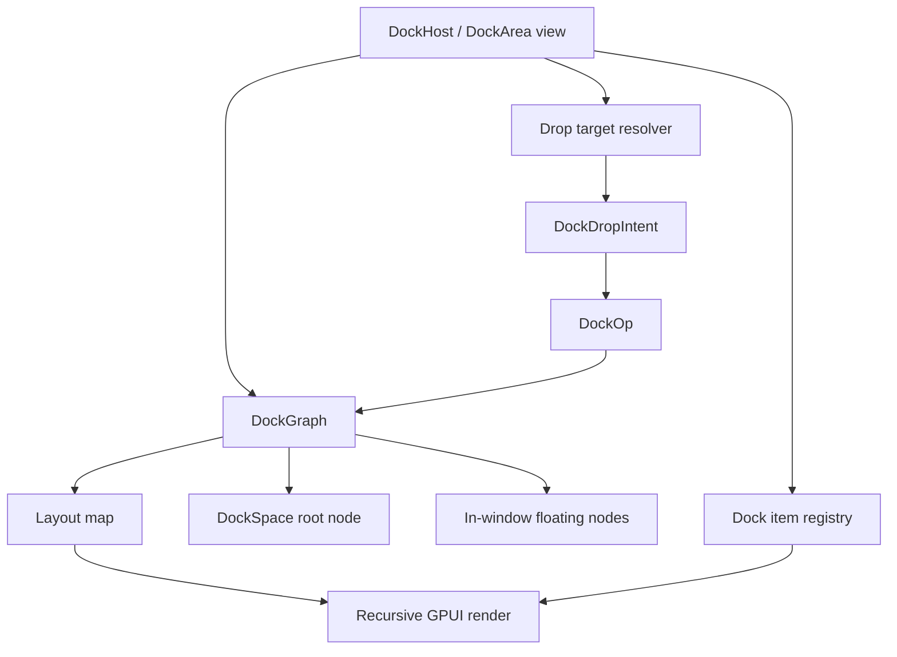

# feat: Add retained docking to GPUI

## Summary

Add a first-class retained docking layer to GPUI, starting with a pure dock graph and single-window dock host that supports tab stacks, edge splits, splitter resizing, tab drag/drop, and in-window floating containers. The first implementation phase intentionally avoids OS-level multi-window tear-off so the core model and GPUI element integration can stabilize before platform routing is introduced.

---

## Problem Frame

Open GPUI currently has strong low-level primitives for layout, retained element state, mouse events, pointer capture, active drags, overlays, and multiple windows. It does not yet have a framework-owned docking model comparable to Dear ImGui docking. The user wants docking behavior informed by both `repo-ref/fret` and Dear ImGui's docking branch.

The best fit is not a direct port of ImGui's internal `DockContext`. GPUI is retained and Rust-native, while ImGui's implementation is immediate-mode and tightly coupled to `ImGuiWindow` lifecycle. `repo-ref/fret` already contains a pure Rust docking graph and operation vocabulary that can be adapted into GPUI, while ImGui should shape the interaction semantics and edge-case expectations.

---

## Requirements

- R1. Provide a pure docking graph that can be tested without rendering or platform windows.
- R2. Represent dock contents as stable panel/item IDs, separate from rendered GPUI views.
- R3. Support tab stacks with active-tab selection, close/removal, reorder, and center-drop merge semantics.
- R4. Support edge docking into left, right, top, and bottom zones using split containers.
- R5. Keep split trees canonical: no empty tabs, no single-child splits, normalized finite fractions, and flattened same-axis splits.
- R6. Support splitter resizing with minimum-size clamping and stable fraction updates.
- R7. Support in-window floating dock containers with bounds, z-order, dragging, and merge-back behavior.
- R8. Resolve drag preview and drop commit through the same pure target/intent logic.
- R9. Provide a GPUI host/view API that can render registered panel views recursively from the dock graph.
- R10. Provide layout export/import and a builder-style default-layout path.
- R11. Include focused unit and interaction tests that can run under existing GPUI test infrastructure.
- R12. Keep OS-level multi-window docking deferred behind explicit future contracts.

---

## Scope Boundaries

In scope:

- Dock graph, operations, layout computation, persistence, and test fixtures inside `crates/gpui_docking`.
- Future supporting hooks inside `crates/gpui` only when the docking crate needs core runtime integration points.
- A single GPUI window containing one or more dock hosts, with in-window floating containers.
- Tab dragging, tab-stack dragging, edge docking, center/tab merge, splitter drag, and drop-preview overlays.
- A native smoke example that demonstrates the feature from the public GPUI API.

Deferred to Follow-Up Work:

- OS-level floating windows and cross-window dock drag routing.
- Platform hovered-window selection, z-order following, and released-outside-window drop completion.
- DPI-aware cross-monitor coordinate conversion for dock tear-off windows.
- Advanced tab overflow menus, document dirty markers, and per-panel close policies beyond the minimal close hook.
- Accessibility-specific dock-tree navigation beyond preserving ordinary GPUI focus behavior for rendered panel views.

Out of scope:

- Importing ImGui's C++ docking context or public API shape.
- Importing `repo-ref/fret/ecosystem/fret-docking` as a crate-level dependency.
- Adding a dependency on GPL Zed application crates or editor-specific docking code.

---

## Key Technical Decisions

- KTD1. Core graph first, UI second: implement `DockGraph` and `DockOp` as pure data before wiring GPUI elements. This mirrors the useful part of `repo-ref/fret/crates/fret-core/src/dock` and gives deterministic tests before interaction work begins.
- KTD2. Use logical dock spaces, not platform windows, as the v1 root key: model roots under a `DockSpaceId` so docking can be embedded in any GPUI view and later mapped to `WindowId` only when OS-level tear-off is added.
- KTD3. Keep panel identity separate from view ownership: the graph stores `DockItemId` values, while a host registry maps IDs to title, metadata, and `AnyView`/builder content. This prevents graph mutation from moving Rust view state directly.
- KTD4. Adapt Fret's N-ary split graph: use `Split { axis, children, fractions }` rather than binary-only splits so repeated edge docking does not create deep same-axis chains.
- KTD5. Share preview and commit resolution: drop target resolution emits a `DockDropIntent`, and commit applies that intent through `DockOp`. This follows the ImGui/Fret lesson that preview geometry must not drift from mutation semantics.
- KTD6. Implement v1 floating as in-window overlays: `Floating` nodes and bounds live under the dock space, rendered absolutely in the same GPUI window. OS windows are a separate platform-routing problem.
- KTD7. Use existing GPUI drag primitives first: tab and splitter interactions should start with `on_drag`, `on_drag_move`, `on_drop`, and `can_drop`, falling back to lower-level `window.on_mouse_event` only where hitbox-level behavior requires it.
- KTD8. Keep docking as an optional crate: `open-gpui-docking` depends on `open-gpui`, while `open-gpui` only exposes minimal core hooks needed by docking and later multi-window routing.

---

## High-Level Technical Design



The graph is the source of truth for structure. The host owns interaction state such as active hover target, drag payload, and splitter-drag state. Rendering reads the graph and registry, computes a layout map, and recursively emits GPUI `div`/`canvas` structure for split containers, tab bars, panel bodies, overlays, and in-window floating frames.

---

## Alternative Approaches Considered

- Directly port ImGui docking internals: rejected because `ImGuiDockContext` is tightly coupled to immediate-mode `ImGuiWindow` lifecycle, frame submission order, and C++ pointer identity.
- Import `repo-ref/fret/ecosystem/fret-docking` wholesale: rejected because that crate is coupled to Fret's runtime, diagnostics, and event substrate. Its interaction policy is useful, but its implementation boundary does not match GPUI.
- Build only a visual dock widget without a pure graph: rejected because persistence, undo/redo, preview/commit parity, and deterministic tests all need a data model independent of rendering.
- Start with OS-level multi-window tear-off: rejected for v1 because GPUI's current drag state is app-level and single-window-friendly, while cross-window docking needs platform hovered-window routing and coordinate policies.

---

## Phased Delivery

- Phase 1: Land U1 and U6 enough to prove graph operations, canonicalization, and layout round-tripping.
- Phase 2: Land U2 with a static host that renders root tabs, splits, and active panel content.
- Phase 3: Land U3 and U4 for tab drag/drop, preview overlays, and splitter resize.
- Phase 4: Land U5 for in-window floating containers.
- Phase 5: Land U7 to make the API smoke-testable through a native example and verification docs.

Current Phase 1 progress:

- Added `open-gpui-docking` as an independent workspace crate.
- Implemented the pure graph, operation vocabulary, canonicalization, layout DTOs, import/export, builder, and JSON operation fixtures.
- Verified invalid item moves are transactional and floating-only dock spaces round-trip through persistence.
- Deferred `DockHost`, rendering, interaction, and OS-level multi-viewport runtime work to later phases.

---

## Output Structure

```text
crates/gpui_docking/src/
  lib.rs
  mod.rs
  ids.rs
  op.rs
  graph.rs
  mutate.rs
  query.rs
  layout.rs
  persistence.rs
  builder.rs
  host.rs
  panel.rs
  drag.rs
  drop_target.rs
  geometry.rs
  splitter.rs
  floating.rs
  overlay.rs
  tests.rs
  interaction_tests.rs
  fixtures/
    dock_op_sequences_v1.json
examples/docking-native/
  Cargo.toml
  src/main.rs
```

The exact split can be adjusted during implementation if GPUI's module boundaries make a smaller shape cleaner. The stable boundary is still core model first, host/rendering second, interaction/persistence after.

---

## Implementation Units

### U1. Core Dock Graph And Operations

**Goal:** Add a pure, public docking model to GPUI with canonical mutation semantics and no rendering dependency.

**Requirements:** R1, R2, R3, R4, R5

**Dependencies:** None

**Files:**

- `crates/gpui_docking/src/mod.rs`
- `crates/gpui_docking/src/ids.rs`
- `crates/gpui_docking/src/op.rs`
- `crates/gpui_docking/src/graph.rs`
- `crates/gpui_docking/src/mutate.rs`
- `crates/gpui_docking/src/query.rs`
- `crates/gpui_docking/src/layout.rs`
- `crates/gpui_docking/src/tests.rs`
- `crates/gpui_docking/src/fixtures/dock_op_sequences_v1.json`
- `crates/gpui_docking/src/lib.rs`
- `crates/gpui_docking/Cargo.toml`
- `Cargo.toml`

**Approach:** Adapt the useful core from `repo-ref/fret/crates/fret-core/src/dock` into GPUI naming and geometry. Replace Fret's `AppWindowId` with `DockSpaceId`, `PanelKey` with `DockItemId`, and Fret geometry types with GPUI `Pixels`, `Point<Pixels>`, `Size<Pixels>`, and `Bounds<Pixels>`. Keep `DockNode::Split`, `DockNode::Tabs`, and `DockNode::Floating` but omit OS-window request ops from the first public surface.

**Patterns to follow:** `slotmap::new_key_type!` use in `crates/gpui/src/window.rs` and `crates/gpui/src/app/entity_map.rs`; Fret canonicalization and op application in `repo-ref/fret/crates/fret-core/src/dock/mutate.rs` and `repo-ref/fret/crates/fret-core/src/dock/apply.rs`.

**Test scenarios:**

- Creating a root tabs node for a dock space stores a non-empty active tab stack.
- Moving an item with `DropZone::Center` inserts it into the target tabs and selects the moved item.
- Moving an item to each edge creates or inserts into a split on the correct axis.
- Repeated same-axis edge docks flatten into one N-ary split rather than nested same-axis splits.
- Closing an active item updates the active index and prunes empty tabs.
- Invalid operations return a typed error or `false` without losing panels.
- Sequence fixtures containing repeated moves and floats preserve unique panel membership and canonical split invariants.

**Verification:** The model can be exercised by unit tests without opening a GPUI window, and every public type compiles under `#![warn(missing_docs)]`.

### U2. Dock Host State And Panel Registry

**Goal:** Add a GPUI-facing host API that renders docked panel content from a graph and registry.

**Requirements:** R2, R9

**Dependencies:** U1

**Files:**

- `crates/gpui_docking/src/host.rs`
- `crates/gpui_docking/src/panel.rs`
- `crates/gpui_docking/src/layout.rs`
- `crates/gpui_docking/src/geometry.rs`
- `crates/gpui_docking/src/mod.rs`
- `crates/gpui_docking/src/host.rs`
- `crates/gpui_docking/src/lib.rs`
- `crates/gpui_docking/Cargo.toml`
- `crates/gpui_docking/src/tests.rs`

**Approach:** Introduce a retained `DockHost` or `DockArea` view that owns `DockGraph`, `DockSpaceId`, panel registry, and transient interaction state. The registry should expose minimal metadata: item ID, title, closable flag, and content renderer. Rendering should recurse through graph nodes: split containers become flex rows/columns, tabs render tab chrome plus active panel body, and floating nodes render as absolute overlays above the root dock space.

**Patterns to follow:** GPUI view rendering in `crates/gpui/src/view.rs`; element lifecycle in `crates/gpui/src/element.rs`; container APIs in `crates/gpui/src/elements/div.rs`.

**Test scenarios:**

- A dock host with one registered panel renders the active panel content.
- A tabs node with multiple registered panels renders one active body and all tab labels.
- A missing registry entry renders a controlled placeholder instead of panicking.
- Split layout computes child bounds matching normalized fractions.
- Re-rendering after `cx.notify` preserves dock graph state across frames.

**Verification:** A simple host can be instantiated in a `TestAppContext`/`VisualTestContext`, drawn, and inspected through existing debug bounds or focused assertions.

### U3. Tab Drag, Drop Target Resolution, And Preview Overlay

**Goal:** Support tab activation, tab reorder, center merge, edge docking, and preview overlays through shared pure resolution logic.

**Requirements:** R3, R4, R8, R9, R11

**Dependencies:** U1, U2

**Files:**

- `crates/gpui_docking/src/drag.rs`
- `crates/gpui_docking/src/drop_target.rs`
- `crates/gpui_docking/src/geometry.rs`
- `crates/gpui_docking/src/overlay.rs`
- `crates/gpui_docking/src/host.rs`
- `crates/gpui_docking/src/panel.rs`
- `crates/gpui_docking/src/tests.rs`
- `crates/gpui_docking/src/interaction_tests.rs`

**Approach:** Define `DockPanelDragPayload` and `DockTabsDragPayload` as GPUI active-drag payloads. Attach `on_drag` to tab labels and tab-bar group handles, use `on_drag_move` on the host to compute the current hover target, and use `on_drop` on the host/tab bars to commit the resolved `DockDropIntent`. Implement direction-pad/edge rectangles in pure geometry helpers so overlay painting and commit logic read the same target.

**Patterns to follow:** `crates/gpui/examples/drag_drop.rs` for GPUI drag payload shape; Fret `repo-ref/fret/ecosystem/fret-docking/src/dock/drop_resolve`; ImGui `DockNodePreviewDockSetup` and `DockNodeCalcDropRectsAndTestMousePos` in `repo-ref/imgui/imgui.cpp`.

**Test scenarios:**

- Clicking a tab updates active tab without starting a drag below the threshold.
- Dragging a tab over another tab bar resolves `DropZone::Center` with a deterministic insert index.
- Dragging a tab over left/right/top/bottom hint rectangles resolves the expected edge zone.
- Preview overlay bounds match the bounds used by the eventual `DockOp`.
- Dropping onto the source tab stack with no meaningful position change is a no-op.
- `can_drop` rejects incompatible payload types without clearing unrelated active drags.

**Verification:** Interaction tests can simulate mouse down, move, and up through `VisualTestContext`; pure resolver tests cover geometry without a window.

### U4. Splitter Resize Semantics

**Goal:** Let users resize split children while preserving canonical fractions and minimum panel sizes.

**Requirements:** R5, R6, R11

**Dependencies:** U1, U2

**Files:**

- `crates/gpui_docking/src/splitter.rs`
- `crates/gpui_docking/src/layout.rs`
- `crates/gpui_docking/src/mutate.rs`
- `crates/gpui_docking/src/host.rs`
- `crates/gpui_docking/src/geometry.rs`
- `crates/gpui_docking/src/tests.rs`
- `crates/gpui_docking/src/interaction_tests.rs`

**Approach:** Render split handles between adjacent split children. Use a splitter drag payload and `on_drag_move` to update fractions through a pure helper that clamps each adjacent pane to a configured minimum size. Start with adjacent-pair updates, then add `SetSplitFractionsMany` only if nested same-axis resizing requires coupled updates during implementation.

**Patterns to follow:** `crates/gpui/examples/data_table.rs` for drag-driven resizing; Fret split fraction updates in `repo-ref/fret/crates/fret-core/src/dock/mutate.rs`; ImGui splitter behavior around `DockNodeTreeUpdateSplitter` in `repo-ref/imgui/imgui.cpp`.

**Test scenarios:**

- Dragging a horizontal splitter changes width fractions and preserves a normalized sum of `1.0`.
- Dragging a vertical splitter changes height fractions and preserves a normalized sum of `1.0`.
- Dragging beyond either side clamps at the configured minimum pane size.
- Non-finite or negative fraction inputs are repaired before storage.
- A splitter drag ending outside the handle still completes because GPUI active-drag routing continues through mouse move/up.

**Verification:** Unit tests validate fraction math; a visual interaction test validates that rendered child bounds change after simulated drag.

### U5. In-Window Floating Containers

**Goal:** Support ImGui-style viewport-disabled floating panels inside the same GPUI window.

**Requirements:** R7, R8, R9, R11, R12

**Dependencies:** U1, U2, U3

**Files:**

- `crates/gpui_docking/src/floating.rs`
- `crates/gpui_docking/src/host.rs`
- `crates/gpui_docking/src/geometry.rs`
- `crates/gpui_docking/src/drop_target.rs`
- `crates/gpui_docking/src/overlay.rs`
- `crates/gpui_docking/src/mutate.rs`
- `crates/gpui_docking/src/tests.rs`
- `crates/gpui_docking/src/interaction_tests.rs`

**Approach:** Store floating containers as `DockFloatingContainer { node, bounds }` in the graph for each dock space. Render them above the dock root in list order, where list order is z-order. Floating title bars start drag payloads that update bounds and call `RaiseFloating`. Drops over a normal dock target merge floating tabs/items back through existing `DockOp` paths.

**Patterns to follow:** Fret in-window floating ops in `repo-ref/fret/crates/fret-core/src/dock/op.rs` and mutation rules in `repo-ref/fret/crates/fret-core/src/dock/mutate.rs`; overlay paint ordering in `crates/gpui/src/window.rs`.

**Test scenarios:**

- Floating one item removes it from the root tabs and creates one floating container with the requested bounds.
- Floating a whole tab stack preserves tab order and active index.
- Dragging floating chrome updates bounds and clamps the frame inside the host bounds.
- Clicking or dragging a floating container raises it above earlier floatings.
- Merging a floating container into a target tabs node moves all panels and removes the floating entry.
- A dock space with no root but with floatings can still accept a center drop to recreate a root tabs node.

**Verification:** Core tests prove graph behavior; interaction tests prove floating chrome movement and z-order.

### U6. Layout Persistence And Default Layout Builder

**Goal:** Provide stable layout export/import and a programmatic layout builder for applications.

**Requirements:** R1, R5, R10, R11

**Dependencies:** U1, U5

**Files:**

- `crates/gpui_docking/src/persistence.rs`
- `crates/gpui_docking/src/builder.rs`
- `crates/gpui_docking/src/mod.rs`
- `crates/gpui_docking/src/tests.rs`
- `crates/gpui_docking/src/fixtures/dock_op_sequences_v1.json`

**Approach:** Adapt Fret's versioned `DockLayout` shape but use GPUI names and dock-space IDs. Validate duplicate IDs, missing children, cycles, empty tabs, invalid active indexes, mismatched split fractions, and missing floating roots. Add a small builder that can create root tabs, split a node, dock items, create in-window floatings, and finish into a canonical graph.

**Patterns to follow:** Fret layout validation in `repo-ref/fret/crates/fret-core/src/dock/layout.rs`; ImGui DockBuilder concepts in `repo-ref/imgui/imgui_internal.h`.

**Test scenarios:**

- Exporting and importing a layout round-trips root tabs, splits, active indexes, and floating bounds.
- Import rejects unsupported layout versions.
- Import rejects cycles and missing node references.
- Import repairs or rejects invalid split fractions according to the chosen validation policy.
- Builder-created layouts match direct graph construction for the same dock tree.
- A default layout can be rebuilt when saved layout validation fails.

**Verification:** Layout JSON can be serialized/deserialized with existing `serde` and `serde_json` dependencies without adding new workspace dependencies.

### U7. Docking Native Example And Verification Docs

**Goal:** Add a runnable smoke example and document the verification gate for docking.

**Requirements:** R9, R11

**Dependencies:** U1, U2, U3, U4, U5, U6

**Files:**

- `examples/docking-native/Cargo.toml`
- `examples/docking-native/src/main.rs`
- `Cargo.toml`
- `README.md`
- `docs/verification.md`
- `crates/gpui/README.md`

**Approach:** Add a separate workspace smoke example instead of relying on `crates/gpui` auto-discovered examples, because `crates/gpui/Cargo.toml` currently has `autoexamples = false`. The example should show three or four panels, tab reorder, edge docking, splitter resize, and in-window floating.

**Patterns to follow:** `examples/smoke-native`; existing examples under `crates/gpui/examples` for visual style and setup.

**Test scenarios:**

- The example builds as a workspace member.
- The example opens a window with a dock host and default layout.
- Manual smoke path: drag a tab to center, edge, splitter, and floating area without panic.
- Documentation lists the focused docking verification commands and expected behavior.

**Verification:** The workspace smoke check includes the new example, and `docs/verification.md` records the docking-specific verification path.

---

## Acceptance Examples

- AE1. Given a dock space with tabs A and B, when B is dragged over the center of another tabs node containing C, then B is inserted into that node and becomes active.
- AE2. Given a dock space with one tabs node, when a tab is dropped on the right edge hint, then the root becomes a horizontal split with the original tabs on the left and the moved tab on the right.
- AE3. Given an existing horizontal split, when another tab is docked to the right of one child, then the graph inserts into the same horizontal split instead of nesting another horizontal split.
- AE4. Given two split children with minimum sizes, when the splitter is dragged past the minimum boundary, then the stored fractions clamp and remain finite and normalized.
- AE5. Given a tab stack, when it is floated inside the window, then the root loses that stack and a floating container renders with the same tab order and active tab.
- AE6. Given a floating container, when it is dropped on a regular tab stack center, then its panels merge into that stack and the floating container is removed.
- AE7. Given a saved layout with a missing node reference, when import runs, then validation fails and the caller can fall back to a default layout builder.

---

## System-Wide Impact

The first implementation affects the public `open_gpui` API, the element/rendering surface, and GPUI examples. It does not require platform backend changes because OS-level tear-off is deferred. The main framework risk is adding a large public API too early; new types should be documented but may be marked experimental in docs until the interaction surface has shipped through at least the native smoke example.

---

## Risks And Dependencies

- Public API churn: docking names and host APIs may need adjustment after the first example. Mitigation: keep the graph API small and expose higher-level builders rather than every helper.
- Drag/drop limitations: GPUI `active_drag` is app-level and adequate for single-window docking, but not enough for OS-level cross-window routing. Mitigation: keep cross-window ops out of v1.
- Layout/test mismatch: preview overlays can drift from commit behavior. Mitigation: route both through `DockDropIntent` and shared geometry helpers.
- Visual polish risk: tab chrome and overlays can become a large design task. Mitigation: first ship utilitarian chrome, then refine after behavior is stable.
- Missing docs lint: `open-gpui` warns on missing docs. Mitigation: every public docking type and method needs concise English docs from the first patch.

---

## Sources And Research

| Source | Relevance |
| --- | --- |
| `docs/adr/0001-open-gpui-fork-strategy.md` | Establishes clean fork strategy and says Fret is an architecture reference, not an initial mixed implementation dependency. |
| `crates/gpui/src/element.rs` | Defines GPUI element lifecycle: `request_layout`, `prepaint`, and `paint`. |
| `crates/gpui/src/elements/div.rs` | Provides `on_drag`, `on_drag_move`, `on_drop`, `can_drop`, styling, hitboxes, and the main container primitive. |
| `crates/gpui/src/window.rs` | Provides pointer capture, draw ordering, active drag painting, mouse dispatch, and test mouse simulation hooks. |
| `crates/gpui/examples/drag_drop.rs` | Shows typed active-drag payloads and drop targets in GPUI. |
| `crates/gpui/examples/data_table.rs` | Shows drag-driven resizing behavior that splitter interactions can mirror. |
| `repo-ref/fret` on `main` at `bd8c129b9` | Local Rust docking reference owned by the user. |
| `repo-ref/fret/crates/fret-core/src/dock` | Best source for graph, ops, canonicalization, layout, persistence, and sequence tests. |
| `repo-ref/fret/ecosystem/fret-docking/src/dock` | Useful for interaction policy, drop resolution, preview geometry, floating behavior, and diagnostics, but too substrate-specific to import directly. |
| `repo-ref/imgui` on `docking` at `2af6dd969` | Local Dear ImGui docking reference. |
| `repo-ref/imgui/imgui.cpp` | Interaction semantics for request processing, drag/drop target setup, preview setup, drop rect hit testing, and splitter behavior. |
| `repo-ref/imgui/imgui.h` and `repo-ref/imgui/imgui_internal.h` | Public docking concepts, DockSpace behavior, flags, and DockBuilder semantics. |
