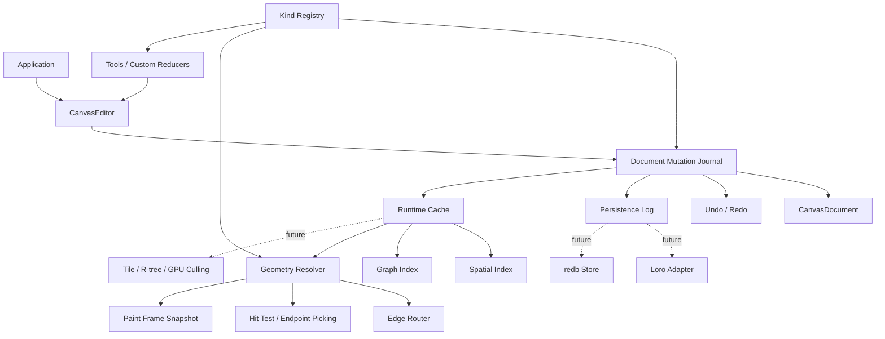

# Refactor Open GPUI Canvas Core Architecture

## Summary

The current canvas crate has a strong MVP foundation, but several seams are still too shallow for a reusable Figma, draw.io, MarginNote, or xyflow-style ecosystem. This plan deepens the mutation journal, editor mutation path, gesture commit model, runtime caches, geometry resolution, and kind registry in that order.

The audit findings are valid. The most urgent issue is not naming or API polish; it is making the committed document change the single source of truth for undo, persistence, indexing, future CRDT adapters, and tests.

---

## Problem Frame

`open-gpui-canvas` currently exposes useful records, tools, culling, JSON Canvas interchange, and persistence contracts. Some public APIs still let callers bypass the invariants that make those pieces safe together.

Two examples show the risk clearly:

- `CanvasDocument::apply_transaction_with_diff` clones the full document, applies the command stream to a draft, diffs the whole document, and swaps it back. This preserves atomicity, but it makes the real changed records a derived afterthought.
- `CanvasTransaction::record_changes` maps from command intent, while `CanvasDocument::remove_node` also removes incident edges. A transaction that removes a node can produce a real document diff with node and edge deletions, but the record operation batch only reports the node deletion.

That gap matters because future Loro, redb, rkyv, audit-log, remote-sync, graph-index, and paint-cache adapters should consume the same semantic change batch. They should not infer truth independently from command intent, final snapshots, or renderer-local cache state.

---

## Requirements

**Mutation And Persistence**

- R1. Document mutation must produce one committed result that includes the applied transaction, inverse transaction, actual document diff, and actual record operation batch.
- R2. Record operation batches must describe semantic document changes, including implicit changes such as incident edge deletion after node removal.
- R3. Persistence, undo, redo, editor mutation, and future CRDT/log adapters must observe changes through the same committed mutation result.

**Editor And Tooling**

- R4. `CanvasEditor` must stop exposing mutable document, index, selection, state, history, and viewport fields as direct public write paths.
- R5. Tool reducers must express user intent without needing to manually pair transient document updates with a separate undo commit.
- R6. Gesture commit and cancel semantics must be testable as first-class behavior for drag, connect, select, and custom tools.

**Runtime And Geometry**

- R7. Runtime caches must own spatial index, graph index, route lookup, connection lookup, and paint-frame snapshot synchronization from document diffs.
- R8. Culling, precise hit testing, endpoint picking, previews, and paint must share one geometry resolution path.
- R9. Router injection must flow through index and paint, not only through selected `CanvasDocument` helper methods.

**Extensibility**

- R10. Kind-specific validation, migration, geometry policy, interaction policy, and default data must live behind a registry boundary instead of being scattered around `kind: String` and `CanvasValue`.
- R11. The core document format must remain open enough for custom records and JSON Canvas interchange while giving registered kinds stronger contracts.
- R12. Loro, redb, and rkyv must remain future adapters until the mutation journal and runtime cache seams are stable.

---

## High-Level Technical Design

The refactor introduces deeper internal modules without forcing every concept into a public trait immediately. Public compatibility wrappers can remain during the pre-1.0 transition, but the core flow should move to committed mutation results and runtime snapshots.

The intended steady-state path is:

1. A command, tool intent, undo, redo, or persistence replay asks the editor to mutate.
2. The mutation journal validates and applies the mutation against a draft.
3. The journal returns a committed mutation containing the inverse transaction, actual diff, and actual record operations derived from before/after state.
4. The editor updates selection, history, runtime caches, and persistence from that one committed mutation.
5. Paint receives a bounded frame snapshot from runtime caches instead of cloning the whole editor document on the hot path.

---

## Key Technical Decisions

- **KTD1. Make committed mutation results the source of truth:** Command intent is useful for replay, but actual before/after document semantics are what indexes, persistence, undo, and future CRDT adapters need.
- **KTD2. Keep the first journal module internal and concrete:** The initial goal is locality and correctness. A public adapter interface should be extracted after tests prove the committed result shape.
- **KTD3. Encapsulate `CanvasEditor` before widening extension APIs:** Public fields make every later invariant optional. Accessors and snapshots should replace direct writes before custom tools grow more powerful.
- **KTD4. Treat gestures as sessions, not loose effects:** `ApplyUnrecorded` plus `PushUndo` leaks transaction staging details to tool authors. A gesture module should own begin, update, commit, and cancel semantics.
- **KTD5. Put runtime caches behind one owner:** `CanvasSpatialIndex` is a useful query seam, but cache synchronization belongs beside graph index, route cache, connection lookup, and paint snapshots.
- **KTD6. Centralize geometry resolution before adding richer routers:** Custom routers are not truly supported while index, preview, hit testing, and paint can disagree about route and endpoint semantics.
- **KTD7. Add kind registry after mutation and geometry stabilize:** Registry policy depends on reliable mutation and geometry hooks. Starting with registry would spread contracts across unstable paths.
- **KTD8. Preserve storage flexibility:** Keep `kind: String` and `CanvasValue` as the persisted open model, then layer registered validation and policy on top for applications that want stronger contracts.

---

## Implementation Units

### U1. Document Mutation Journal Module

- **Goal:** Create a deeper module that applies transactions atomically and returns the actual committed change envelope.
- **Files:** `crates/canvas/src/document.rs`, `crates/canvas/src/changes.rs`, `crates/canvas/src/persistence/store.rs`, `crates/canvas/src/lib.rs`, new `crates/canvas/src/journal.rs`.
- **Design:** Introduce an internal committed mutation type with the applied transaction, inverse transaction, `CanvasDocumentDiff`, and `CanvasRecordOperationBatch` derived from the actual before/after diff. Keep current transaction helpers as compatibility wrappers over the journal.
- **Tests:** Add tests in `crates/canvas/src/journal.rs` or adjacent module tests covering node removal producing node and incident edge delete operations, update operations preserving transaction metadata, failed transactions leaving the document unchanged, and inverse application restoring the previous document.
- **Verification:** `cargo nextest run -p open-gpui-canvas journal changes document persistence`.

### U2. CanvasEditor State Encapsulation

- **Goal:** Make editor consistency mandatory by removing direct public mutation paths for document, viewport, tool, state, index, selection, and history.
- **Files:** `crates/canvas/src/tool.rs`, `crates/canvas/src/persistence/store.rs`, `crates/canvas/src/gpui.rs`, `examples/smoke-native/src/main.rs`, `crates/canvas/README.md`.
- **Design:** Make editor fields private, add narrow read accessors and explicit mutation methods, and route all document-changing behavior through the committed mutation path from U1. Keep snapshot constructors for paint and examples.
- **Tests:** Update tool/editor tests to assert selection pruning, history pushes, index updates, and persistence logging still happen after transactions, undo, redo, and delete-key flows.
- **Verification:** `cargo nextest run -p open-gpui-canvas tool persistence gpui`.

### U3. Gesture Commit Module

- **Goal:** Replace loose transient-update effects with a first-class gesture session that owns update, commit, and cancel semantics.
- **Files:** `crates/canvas/src/tool.rs`, `crates/canvas/src/persistence/store.rs`, `crates/canvas/src/lib.rs`, new `crates/canvas/src/gesture.rs`.
- **Design:** Introduce gesture effects or a gesture controller that records the gesture baseline, applies transient updates through one path, commits a validated inverse only when the current document matches the gesture, and cancels by restoring the baseline. Keep compatibility for existing built-in tools while migrating custom-tool examples to the safer API.
- **Tests:** Cover node translation commit, translation cancel, stale `PushUndo` rejection or removal, persistence treating gesture commit as one logged change, and custom tool gesture usage without direct inverse construction.
- **Verification:** `cargo nextest run -p open-gpui-canvas tool persistence`.

### U4. Runtime Cache And Frame Snapshot Module

- **Goal:** Move spatial index, graph index, route lookup, connection lookup, and paint-frame snapshot ownership into one runtime cache module.
- **Files:** `crates/canvas/src/index.rs`, `crates/canvas/src/graph.rs`, `crates/canvas/src/gpui.rs`, `crates/canvas/src/tool.rs`, `crates/canvas/benches/large_canvas.rs`, new `crates/canvas/src/runtime.rs`.
- **Design:** Add a `CanvasRuntime` or equivalent owner that rebuilds from a document and applies committed diffs. Paint should request a visible frame snapshot from runtime instead of cloning the whole editor document and index.
- **Tests:** Cover runtime cache rebuild, incremental diff sync for nodes, edges, shapes, incident edge removal, graph queries after mutations, and paint-frame culling staying bounded for large documents.
- **Verification:** `cargo nextest run -p open-gpui-canvas runtime graph index gpui` and `cargo check -p open-gpui-canvas --benches`.

### U5. Geometry Resolution Module

- **Goal:** Make route, endpoint, hit, preview, culling, and paint semantics come from one geometry resolver.
- **Files:** `crates/canvas/src/routing.rs`, `crates/canvas/src/index.rs`, `crates/canvas/src/gpui.rs`, `crates/canvas/src/tool.rs`, `crates/canvas/src/document.rs`, new `crates/canvas/src/geometry/resolve.rs` or `crates/canvas/src/resolve.rs`.
- **Design:** Centralize endpoint position resolution, route path resolution, edge bounds, precise edge hit areas, connection endpoint picking, and preview snapping. Thread router policy into index and paint through runtime rather than calling the default router in paint.
- **Tests:** Cover default polyline, orthogonal, cubic-bezier, and custom router paths across bounds, hit testing, paint, and preview. Add tests for source-only and target-only handles using the same endpoint picker in tool and GPUI preview.
- **Verification:** `cargo nextest run -p open-gpui-canvas routing index gpui tool`.

### U6. Schema And Kind Registry

- **Goal:** Add a registry seam for per-kind validation, migration, defaults, geometry policy, interaction policy, and import/export behavior.
- **Files:** `crates/canvas/src/document.rs`, `crates/canvas/src/json_canvas.rs`, `crates/canvas/src/gpui.rs`, `crates/canvas/src/tool.rs`, `crates/canvas/src/lib.rs`, new `crates/canvas/src/schema.rs`.
- **Design:** Keep persisted `kind: String` and `CanvasValue`, but allow applications to register kind handlers inspired by xyflow type registries and tldraw `ShapeUtil` / schema records. Start with validation, defaults, and geometry hooks before adding richer edit policy.
- **Tests:** Cover unknown kinds remaining loadable, registered node/shape/edge kinds validating data, migrations transforming old data, geometry hooks overriding default bounds or handles, and JSON Canvas adapter preserving unknown extra payload.
- **Verification:** `cargo nextest run -p open-gpui-canvas schema json_canvas document`.

### U7. Documentation And Migration Notes

- **Goal:** Keep the pre-1.0 public story coherent while the architecture deepens.
- **Files:** `crates/canvas/README.md`, `docs/adr/0002-open-gpui-canvas-architecture.md`, optional new ADR `docs/adr/0003-open-gpui-canvas-mutation-runtime-registry.md`.
- **Design:** Update docs to say record operation batches come from committed mutations, editor state is encapsulated, gestures are sessions, runtime owns cache snapshots, and registry is the extension seam for kind behavior.
- **Tests:** Documentation examples should compile through normal crate checks where possible.
- **Verification:** `cargo check -p open-gpui-canvas --examples` if examples are package-scoped, otherwise `cargo check -p smoke-native`.

---

## Scope Boundaries

**In Scope**

- Deep internal refactors that remove shallow seams and concentrate invariants.
- Breaking public API changes inside `open-gpui-canvas` while it is still pre-1.0.
- Compatibility wrappers when they reduce churn without preserving unsafe mutation paths.
- Focused tests that prove consistency across mutation, persistence, runtime caches, geometry, and registry.

**Deferred For Later**

- Concrete Loro CRDT adapter.
- Concrete redb persistence store.
- Concrete rkyv zero-copy snapshot format.
- R-tree, tile, or GPU culling implementation.
- Full obstacle-avoidance routing.
- Multi-user presence, remote cursors, or collaborative conflict UI.

**Out Of Scope**

- Copying xyflow's DOM layout/rendering model.
- Turning every canvas record into a GPUI element.
- Replacing the existing nodes, edges, shapes storage model.
- Designing every final public trait before the internal modules prove their shape.

---

## System-Wide Impact

This refactor changes the crate's center of gravity. Today, `CanvasDocument`, `CanvasEditor`, `SpatialIndex`, GPUI paint, persistence helpers, and tool effects each own part of the consistency story. After the refactor, committed mutations and runtime cache snapshots should carry that story.

The main downstream impact is API tightening. Existing code that reads state can move to accessors and snapshots. Existing code that writes state directly must move to editor methods, transactions, or gesture sessions. That is the right trade-off for a foundational canvas crate because direct mutable access makes correctness optional.

---

## Risks And Dependencies

- **Risk: One large PR becomes unreviewable.** Mitigation: land U1 and U2 first, then migrate gesture/runtime/geometry/registry in separate commits or PR slices.
- **Risk: Compatibility wrappers keep the old unsafe behavior alive.** Mitigation: wrappers may preserve names, but they must call the new invariant-preserving paths.
- **Risk: Runtime cache ownership becomes generic too early.** Mitigation: keep `CanvasRuntime` concrete first and retain object-safe query traits for replacement indexes.
- **Risk: Registry becomes overdesigned.** Mitigation: start with validation, defaults, migration, and geometry hooks; defer advanced interaction policy until tools need it.
- **Risk: Clone removal changes paint behavior.** Mitigation: use the existing large-canvas regression and benchmark before and after U4.
- **Dependency: Reference projects live outside the canvas worktree.** The implementation should use `repo-ref/xyflow` and `repo-ref/tldraw` from the main repository when deeper source comparison is needed.

---

## Acceptance Examples

- AE1. When a transaction removes node `a` and edge `a-b` is incident to it, the committed mutation contains a node delete and an edge delete in its actual record operation batch.
- AE2. When a transaction fails validation halfway through, the document, history, selection, runtime caches, and persistence cursor remain unchanged.
- AE3. When a select-tool translation is cancelled, the document returns to the original node positions and no undo entry or persistence log entry is created.
- AE4. When a select-tool translation is committed, the undo stack and persistence log receive one committed mutation representing the gesture.
- AE5. When a custom router is installed, edge bounds, culling, hit testing, preview snapping, and paint use the same resolved route.
- AE6. When a registered kind validates required data, invalid records fail through the mutation path and unknown kinds remain loadable as open records.

---

## Sources And Research

- Current mutation and diff path: `crates/canvas/src/document.rs`.
- Current command-derived record operation path: `crates/canvas/src/changes.rs`.
- Current public editor fields, tool effects, and gesture state: `crates/canvas/src/tool.rs`.
- Current persistence helper behavior: `crates/canvas/src/persistence/store.rs`.
- Current spatial index and hit testing: `crates/canvas/src/index.rs`.
- Current graph index: `crates/canvas/src/graph.rs`.
- Current GPUI paint snapshot and endpoint preview behavior: `crates/canvas/src/gpui.rs`.
- Current routing policy: `crates/canvas/src/routing.rs`.
- Current architecture decision: `docs/adr/0002-open-gpui-canvas-architecture.md`.
- Current crate usage guide: `crates/canvas/README.md`.
- Reference direction from xyflow: separated nodes, edges, handles, typed node data, and change records.
- Reference direction from tldraw: state-node tools, schema/migration records, and `ShapeUtil`-style per-kind geometry and policy.
