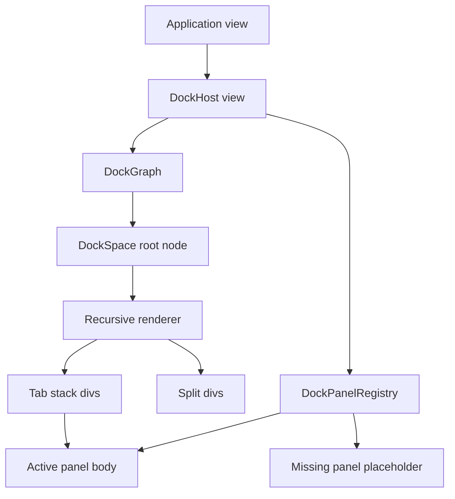

# feat: Add static docking host rendering

## Summary

Add the second docking phase by introducing a retained `DockHost` view and panel registry in `open-gpui-docking`. The host should render an existing `DockGraph` as root tabs, split containers, tab bars, and active panel content without implementing drag/drop, splitter resizing, or floating overlays yet.

---

## Problem Frame

Phase 1 landed a pure graph, operation vocabulary, canonicalization, layout DTOs, and builder. Applications still cannot mount that graph into GPUI because there is no host view that maps `DockItemId` values to rendered panel views. Phase 2 should close that gap with the smallest useful rendering layer: a stable registry, recursive node rendering, predictable missing-panel behavior, and visual tests that prove the host can draw real GPUI content.

The plan keeps the host static on purpose. Interactive tab activation, tab drag/drop, preview overlays, splitter dragging, in-window floating chrome, and OS-level multi-window behavior stay deferred so the host API and rendering boundary can settle first.

---

## Requirements

- R1. Provide a public `DockHost` or equivalent retained view that owns a `DockGraph`, one `DockSpaceId`, and a panel registry.
- R2. Let applications register panel metadata and content separately from the pure graph, keyed by `DockItemId`.
- R3. Render root tabs, nested splits, tab bars, and the active panel body from canonical `DockNode` trees.
- R4. Render a controlled missing-panel placeholder when the graph references an unregistered item.
- R5. Preserve graph state across render frames and allow external code to mutate the graph before notifying the host.
- R6. Expose stable test hooks for host, tab, panel, and split regions so visual tests can inspect rendered bounds through GPUI debug selectors or an equivalent host-owned lookup.
- R7. Keep Phase 2 non-interactive: no tab click handlers, drag/drop, splitter dragging, floating overlay chrome, or platform-window routing.
- R8. Verify the host through focused GPUI visual tests and keep the pure graph tests passing.

---

## Scope Boundaries

In scope:

- Static host state and rendering inside `crates/gpui_docking`.
- A panel registry that can render `AnyView` or equivalent GPUI content for each `DockItemId`.
- Recursive rendering for `DockNode::Tabs` and `DockNode::Split`.
- Empty-root and missing-panel placeholders that never panic.
- Visual tests using GPUI test infrastructure.

Deferred to follow-up work:

- Tab click activation and close-button behavior.
- Tab reorder, drag/drop, drop-target resolution, and preview overlays.
- Splitter handles and resize mutation.
- Rendering and moving in-window floating containers.
- Native docking smoke example unless implementation discovers the host API needs manual validation before Phase 3.
- OS-level multi-window docking and cross-window drag routing.

Out of scope:

- Moving graph ownership back into `crates/gpui`.
- Replacing GPUI layout primitives with a custom layout engine.
- Porting Fret's declarative docking surface or ImGui internals wholesale.

---

## Key Technical Decisions

- KTD1. Keep graph and UI in one crate boundary: `open-gpui-docking` already depends on `open-gpui`, so host rendering belongs in the docking crate while `crates/gpui` stays untouched unless a missing primitive is proven.
- KTD2. Registry stores renderable panel roots, not graph nodes: `DockGraph` remains pure and only stores `DockItemId`; the registry maps those IDs to title, close policy metadata, and GPUI content.
- KTD3. Render active tab content only: Phase 2 should display all tab labels but mount only the active panel body, matching the graph's active index and avoiding hidden view lifecycle questions until interaction work needs them.
- KTD4. Use GPUI flex layout for split rendering first: split children should be flex items with shares derived from normalized fractions. Absolute placement remains available for later overlays and diagnostics, but static splits do not need a custom layout element.
- KTD5. Missing panels are first-class render states: a graph can outlive panel registration, so the host renders a deterministic placeholder instead of dropping the tab or panicking.
- KTD6. Test hooks are separate from public element identity: Phase 3 interaction work needs reliable hit targets, but GPUI `debug_selector` is test-support-only and `DockNodeId` is a runtime slotmap key. Phase 2 should expose deterministic debug hooks for tests without treating those hooks as serialized layout or public API.

---

## High-Level Technical Design



`DockHost` is the retained state holder and render entry point. Rendering starts from `DockGraph::root(space)` and descends through split and tabs nodes. Tabs render chrome from registry metadata and resolve active content through the registry. If a root is absent, the host renders an empty dock-space placeholder; if a panel is missing, it renders a missing-panel placeholder inside the active body.

---

## Output Structure

```text
crates/gpui_docking/src/
  host.rs
  panel.rs
  render.rs
  host_tests.rs
```

The exact split can change during implementation if a smaller module shape is cleaner. The stable boundary is that public host and registry types stay separate from the pure graph model.

---

## Implementation Units

### U1. Panel Registry And Host State

**Goal:** Add the public types that let applications bind dock item IDs to renderable GPUI panel content.

**Requirements:** R1, R2, R4, R5

**Dependencies:** Phase 1 graph model

**Files:**

- `crates/gpui_docking/src/panel.rs`
- `crates/gpui_docking/src/host.rs`
- `crates/gpui_docking/src/lib.rs`
- `crates/gpui_docking/src/host_tests.rs`

**Approach:** Introduce a `DockPanelRegistry`-style type keyed by `DockItemId` with panel title, close policy metadata, and renderable GPUI content. Introduce `DockHost` state that owns the `DockGraph`, target `DockSpaceId`, registry, and basic host options. Re-registering an existing panel should replace the previous registration and return it, matching ordinary map insertion semantics. Expose narrow accessors for graph reads/mutations so applications can apply `DockOp` before calling GPUI notification APIs.

**Patterns to follow:** `crates/gpui/src/view.rs` for `AnyView` as an element; `repo-ref/fret/ecosystem/fret-docking/src/dock/declarative/registry.rs` for the registry/host split; `crates/gpui_docking/src/builder.rs` for builder-style API shape.

**Test scenarios:**

- Creating a host with one graph item and one registered panel stores the graph, space, title, and renderable view.
- Registering a panel with the same `DockItemId` replaces the previous registration and returns it.
- Looking up an unregistered graph item returns missing-panel metadata rather than panicking.
- Mutating the host graph with `DockOp::SetActiveTab` updates the graph state without recreating the registry.

**Verification:** Public types compile under `#![warn(missing_docs)]`, and host state tests can construct a host without opening a platform window.

### U2. Recursive Static Renderer

**Goal:** Render tabs, splits, and active panel bodies from a canonical dock tree.

**Requirements:** R3, R4, R5, R7

**Dependencies:** U1

**Files:**

- `crates/gpui_docking/src/host.rs`
- `crates/gpui_docking/src/render.rs`
- `crates/gpui_docking/src/panel.rs`
- `crates/gpui_docking/src/lib.rs`
- `crates/gpui_docking/src/host_tests.rs`

**Approach:** Implement `Render` for `DockHost`. The root host renders a full-size flex container, then recurses through `DockNode::Split` and `DockNode::Tabs`. Horizontal splits render row flex containers; vertical splits render column flex containers. Tab stacks render a tab bar from panel metadata and an active panel body from the registry. Floating nodes are not rendered in Phase 2 except through a controlled deferred placeholder if encountered.

**Patterns to follow:** `examples/smoke-native/src/main.rs` for simple `Render` and `div()` composition; `crates/gpui/src/styled.rs` for flex APIs; `crates/gpui/src/elements/div.rs` for parent element behavior.

**Test scenarios:**

- A single-root tabs graph renders the active panel body for the active item.
- A multi-tab stack renders every tab label and only the active panel body.
- Changing the active index in the graph and notifying the host changes the rendered active body.
- A missing active panel renders the missing-panel placeholder with the missing item ID.
- A graph with no root renders an empty dock-space placeholder without dropping registry entries.

**Verification:** Visual tests can draw the host and inspect output through rendered text or stable selectors; pure graph tests remain unchanged.

### U3. Split Layout And Test Selectors

**Goal:** Make static split rendering measurable and stable enough for later interaction work.

**Requirements:** R3, R6, R8

**Dependencies:** U2

**Files:**

- `crates/gpui_docking/src/render.rs`
- `crates/gpui_docking/src/host.rs`
- `crates/gpui_docking/src/host_tests.rs`

**Approach:** Derive flex shares from the same cleaned fraction semantics used by graph layout computation. Stamp test-support debug selectors on host root, split containers, tabs nodes, tab labels, and panel bodies where a static selector is enough. For node- or item-specific assertions, keep a host-owned debug lookup that maps `DockSpaceId`, `DockNodeId`, and `DockItemId` to the emitted selector string for the current graph instance instead of requiring tests to guess dynamic selector names. Do not serialize these hooks or promote them to public layout identity.

**Patterns to follow:** `crates/gpui/src/app/test_context.rs` for `VisualTestContext::debug_bounds`; `crates/gpui/src/elements/anchored.rs` and list tests for debug-bounds inspection; `crates/gpui_docking/src/graph.rs` for fraction normalization behavior.

**Test scenarios:**

- A horizontal split in a fixed-size host produces left and right panel bounds matching normalized fractions within a small pixel tolerance.
- A vertical split in a fixed-size host produces top and bottom panel bounds matching normalized fractions within a small pixel tolerance.
- Mismatched or unnormalized split fractions render with repaired shares rather than collapsing a child.
- Test hooks for host, tab label, and panel body resolve to the same regions across two draws of the same graph.

**Verification:** Visual tests assert rendered bounds through debug selectors instead of relying on screenshots.

### U4. Visual Test Harness And Regression Coverage

**Goal:** Add focused host-rendering tests without broadening Phase 2 into interaction testing.

**Requirements:** R4, R5, R8

**Dependencies:** U1, U2, U3

**Files:**

- `crates/gpui_docking/src/host_tests.rs`
- `crates/gpui_docking/src/lib.rs`
- `crates/gpui_docking/Cargo.toml`

**Approach:** Add a dedicated `host_tests` module with small test panel views and builder helpers. Use GPUI test context APIs to construct a host view, draw it in a fixed window or element space, and inspect the resulting bounds or rendered state. Keep interaction simulation out of this module; Phase 3 will add mouse and drag coverage separately.

**Patterns to follow:** `crates/gpui/src/app/test_context.rs` for `add_window_view`, `draw`, and `debug_bounds`; `crates/gpui/src/elements/list.rs` tests for fixed-size draw assertions; `crates/gpui_docking/src/tests.rs` for compact fixture style.

**Test scenarios:**

- Host construction and draw succeeds for a default editor layout generated by Phase 1 builder APIs.
- Active panel body persists across two draws when no graph mutation occurs.
- A graph mutation followed by host notification updates the rendered active body.
- Missing registry entries do not panic and do not remove items from the graph.
- Split bounds remain stable across redraws with unchanged fractions.

**Verification:** The docking package's normal unit and visual test suite proves both the pure graph and static host behavior.

---

## Acceptance Examples

- AE1. Given a dock host with one registered panel, when the host renders, then the panel's content is visible inside the active tab body.
- AE2. Given a tab stack with three items and the second item active, when the host renders, then all three labels are visible and only the second panel body is mounted.
- AE3. Given a horizontal split with fractions `0.25` and `0.75`, when the host renders in a fixed-width test area, then the child bounds reflect those shares within layout rounding tolerance.
- AE4. Given a graph item with no registered panel, when the host renders that item as active, then a missing-panel placeholder is visible and the graph remains unchanged.
- AE5. Given an externally mutated active tab index, when the host is notified and redrawn, then the new active panel body is rendered without rebuilding the host registry.

---

## Risks & Dependencies

- `AnyView` lifecycle may push the registry toward storing existing view handles rather than rebuild closures. Start with the smallest stable API and add builder helpers only when tests show the ergonomics gap.
- Flex shares may not map perfectly to exact pixel fractions when children have chrome, padding, or min sizes. Keep assertions tolerant and separate split container bounds from panel body bounds.
- Test selectors can become accidental public API. Document them as testing/debug hooks unless the implementation intentionally promotes them.
- Rendering floatings too early would blur Phase 2 with later overlay work. Encountered floating nodes should be preserved in graph state and either skipped or rendered as a clearly deferred placeholder.

---

## System-Wide Impact

The preferred implementation should not modify `crates/gpui`. Phase 2 consumes existing public GPUI APIs: `Render`, `AnyView`, `div()`, style helpers, and test contexts. If implementation discovers a missing primitive in `open-gpui`, that should be isolated as a small supporting hook with a separate rationale instead of blending framework changes into host rendering.

---

## Sources & Research

- `docs/plans/2026-06-08-001-feat-docking-plan.md` defines Phase 2 as a static host that renders root tabs, splits, and active panel content.
- `crates/gpui/src/view.rs` shows `AnyView` is cloneable and implements `IntoElement`, making it suitable for registered panel roots.
- `crates/gpui/src/elements/div.rs` and `crates/gpui/src/styled.rs` provide the flex and parent-element APIs for recursive host rendering.
- `crates/gpui/src/app/test_context.rs` provides visual test APIs for drawing elements and reading debug bounds.
- `repo-ref/fret/ecosystem/fret-docking/src/dock/declarative/registry.rs` supports the registry/host separation but is not a direct implementation target.
- `repo-ref/fret/docs/docking-arbitration-checklist.md` highlights that docking hosts should stay mounted and panel roots should be registered before host build.
