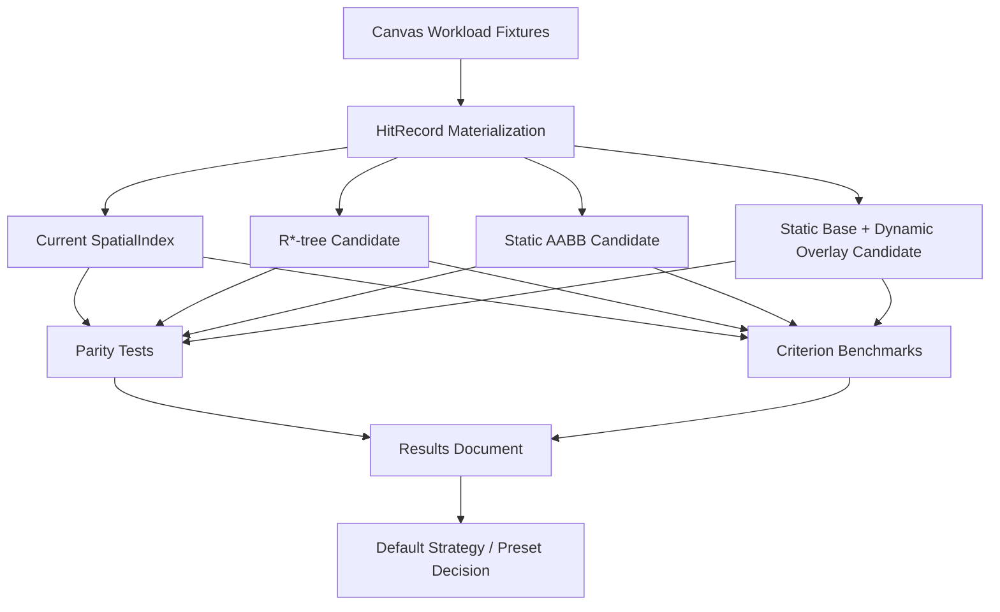

# perf: Benchmark Canvas Spatial Index Strategies

## Summary

This plan adds a benchmark spike for `open-gpui-canvas` spatial indexing before replacing the
current `SpatialIndex` or exposing user-selectable index options. The spike compares the existing
sorted-vector index against dynamic R*-tree, static AABB, and hybrid overlay candidates using the
same canvas workloads, then records a decision for the next implementation phase.

---

## Problem Frame

`open-gpui-canvas` currently uses a simple sorted-vector `SpatialIndex`. It is deterministic and
well-covered, but it will not be the final answer for very large canvases. The next step should be
data-driven because canvas workloads mix visible AABB culling, z-ordered hit testing, hidden and
locked filtering, handle visibility, long routed edges, and transient drag updates.

The important product decision is not whether `rstar` or `static_aabb2d_index` is more appealing in
isolation. The important decision is which indexing strategy should become the default for a
general-purpose GPUI canvas, and whether users should get semantic workload presets after the data
shows meaningful trade-offs.

---

## Requirements

**Benchmark Coverage**

- R1. The benchmark must compare every candidate against the current `SpatialIndex` on identical
  document fixtures and query inputs.
- R2. The benchmark must include grid, dense-overlap, clustered, long-edge, and mixed
  node/edge/shape workloads.
- R3. The benchmark must measure rebuild time, visible query time, hit-test time, paint-frame
  culling time, and simulated drag-update cost.
- R4. The drag workload must measure 1, 10, and 100 selected nodes moving across 120 frames.

**Correctness**

- R5. Candidate indexes must preserve `HitOptions` semantics for hidden records, locked records,
  handles, and margin expansion.
- R6. Candidate indexes must preserve z-order hit-test ordering and visible-query target parity
  against the current index.
- R7. Candidate indexes must respect geometry produced by `CanvasGeometryResolver`, including
  registered kind geometry and custom edge routers.

**Architecture**

- R8. The spike must not expose concrete crate names such as `rstar` in public runtime or editor
  APIs.
- R9. New third-party index crates must stay in dev-only or non-default feature scope until a
  default strategy is chosen.
- R10. Any future user-facing choice must be a semantic workload strategy such as `Auto`,
  `Simple`, `Dynamic`, `StaticSnapshot`, or `Hybrid`, not a dependency-specific switch.
- R11. A fully custom user-provided index adapter remains deferred until cache ownership, diff
  application, z-order, and geometry semantics can be specified without freezing the wrong API.

**Decision Output**

- R12. The spike must produce a results document with measurements, correctness findings, dependency
  constraints, and a recommendation for the next implementation phase.

---

## Key Technical Decisions

- KTD1. **Keep the current index as the oracle:** The sorted-vector `SpatialIndex` remains the
  correctness baseline because existing tests already prove its filtering and ordering semantics.
- KTD2. **Benchmark before changing defaults:** Replacing the default index without query and drag
  measurements would optimize for a generic data structure rather than the canvas workload.
- KTD3. **Prototype candidates outside the public API:** Candidate adapters should live in benches,
  integration tests, or non-default feature scope so the spike does not commit the ecosystem to a
  concrete crate.
- KTD4. **Prefer semantic presets over dependency names:** If users need control, the public API
  should describe workload intent. Dependency choices can change underneath those presets.
- KTD5. **Treat hybrid as a candidate, not a foregone conclusion:** A static base plus dynamic
  overlay likely fits canvas behavior, but it must win on data and complexity before becoming the
  default.
- KTD6. **Defer custom index adapters:** A custom adapter API would need to own diff application,
  stale-record suppression, geometry resolver integration, and z-order behavior. Publishing that
  too early would make later runtime changes harder.

---

## High-Level Technical Design

The spike should separate three layers:

- workload fixtures that build representative `CanvasDocument` values;
- candidate adapters that index `HitRecord` values and expose the same query and hit-test behavior
  as `CanvasSpatialIndex`;
- result reporting that converts measurements and correctness findings into a follow-up
  implementation decision.

---

## Implementation Units

### U1. Workload Fixtures And Benchmark Shape

**Goal:** Expand the current large-canvas benchmark into reusable workloads that represent
flowchart, whiteboard, mind-map, and dense-overlap canvas usage.

**Requirements:** R1, R2, R3, R4.

**Dependencies:** None.

**Files:**

- `crates/canvas/benches/large_canvas.rs`
- `crates/canvas/benches/spatial_index_strategies.rs`
- `crates/canvas/Cargo.toml`

**Approach:** Keep the existing `large_canvas` benchmark as the release baseline and add a focused
`spatial_index_strategies` benchmark for strategy comparison. The new benchmark should build
workloads for grid nodes, dense overlapping nodes, clustered graphs, long routed edges, and mixed
nodes/edges/shapes. It should include static queries, hit tests, paint-frame culling, and simulated
drag updates.

**Patterns to follow:** Existing benchmark setup in `crates/canvas/benches/large_canvas.rs`.

**Test scenarios:**

- Test expectation: none for Criterion-only workload generation. Correctness coverage lands in U2
  so benchmark helpers do not become the test oracle.

**Verification:** The benchmark suite builds and reports measurements for each workload and each
operation category.

### U2. Candidate Correctness Parity Tests

**Goal:** Add integration tests that compare candidate query and hit-test outputs against the
current `SpatialIndex` oracle before performance numbers are trusted.

**Requirements:** R1, R5, R6, R7.

**Dependencies:** U1.

**Files:**

- `crates/canvas/tests/spatial_index_strategies.rs`
- `crates/canvas/Cargo.toml`
- `crates/canvas/src/index.rs`
- `crates/canvas/src/runtime.rs`

**Approach:** Build candidate adapters over `HitRecord` fixtures and compare their visible query
targets, hit-test targets, and ordering against `SpatialIndex`. Cover `HitOptions` combinations for
hidden records, locked records, handles, and margin expansion. Use documents with registered kind
geometry and custom edge routers so candidate indexes cannot accidentally bypass
`CanvasGeometryResolver`.

**Patterns to follow:** Existing index correctness tests in `crates/canvas/src/index.rs` and
runtime geometry tests in `crates/canvas/src/runtime.rs`.

**Test scenarios:**

- Querying a viewport in a grid workload returns the same target IDs as `SpatialIndex`.
- Querying with `include_locked = false` excludes locked records in every candidate.
- Querying with `include_handles = false` excludes handles even when handle bounds intersect.
- Hit testing overlapping records returns the same topmost-first target order as `SpatialIndex`.
- Hit testing with a positive margin includes records whose dilated bounds contain the point.
- Candidate indexes include edge bounds produced by a custom router.
- Candidate indexes include node bounds produced by a registered kind.

**Verification:** Candidate parity tests pass before benchmark results are considered actionable.

### U3. Dynamic R*-tree Candidate

**Goal:** Prototype a dynamic R*-tree candidate and measure whether incremental updates beat
rebuild-oriented strategies for editing-heavy canvases.

**Requirements:** R3, R4, R5, R6, R8, R9.

**Dependencies:** U1, U2.

**Files:**

- `crates/canvas/Cargo.toml`
- `crates/canvas/benches/spatial_index_strategies.rs`
- `crates/canvas/tests/spatial_index_strategies.rs`
- `docs/research/canvas-spatial-index-benchmark-results.md`

**Approach:** Add `rstar` in dev-only scope or a non-default feature for the spike. The candidate
should index `HitRecord` envelopes and keep result ordering outside the tree so z-order semantics
remain controlled by canvas code. Measure full rebuilds, insert/remove/update style changes, hit
tests, and visible viewport queries.

**Patterns to follow:** `docs/research/canvas-spatial-index.md` candidate notes for `rstar`.

**Test scenarios:**

- A moved node and its incident edge update produce the same visible and hit-test results as the
  oracle after each simulated frame.
- A deleted node removes node, handle, and incident edge records from candidate results.
- A dense-overlap hit test returns z-order results matching the oracle after tree updates.

**Verification:** The candidate passes parity tests and benchmark output separates rebuild,
incremental update, query, and hit-test costs.

### U4. Static AABB Candidate

**Goal:** Prototype a static 2D AABB candidate and measure whether packed immutable indexes are
better for large mostly-static canvas documents.

**Requirements:** R3, R5, R6, R8, R9.

**Dependencies:** U1, U2.

**Files:**

- `crates/canvas/Cargo.toml`
- `crates/canvas/benches/spatial_index_strategies.rs`
- `crates/canvas/tests/spatial_index_strategies.rs`
- `docs/research/canvas-spatial-index-benchmark-results.md`

**Approach:** Add `static_aabb2d_index` in dev-only scope or a non-default feature for the spike.
The candidate should focus on immutable build and query performance. If `packed_spatial_index`
becomes viable under the workspace Rust version, include it as an optional comparison; otherwise
record the Rust-version blocker instead of forcing adoption.

**Patterns to follow:** `docs/research/canvas-spatial-index.md` candidate notes for static AABB and
packed spatial indexes.

**Test scenarios:**

- Static candidate visible-query targets match the oracle across grid, clustered, and long-edge
  workloads.
- Static candidate hit-test targets match the oracle after applying canvas-side z-order filtering.
- Rebuilding the static candidate after a committed diff produces the same results as rebuilding
  the oracle.

**Verification:** The candidate passes parity tests and benchmark output separates build cost from
query cost.

### U5. Hybrid Overlay Simulation

**Goal:** Simulate a static base index plus dynamic overlay to test the likely long-term canvas
strategy without exposing it as a public runtime option yet.

**Requirements:** R3, R4, R5, R6, R10, R11.

**Dependencies:** U3, U4.

**Files:**

- `crates/canvas/benches/spatial_index_strategies.rs`
- `crates/canvas/tests/spatial_index_strategies.rs`
- `docs/research/canvas-spatial-index-benchmark-results.md`

**Approach:** Keep a static base for stable records and a small dynamic overlay for records changed
by simulated gestures. Query results should merge base and overlay records, suppress stale base
records by `CanvasRecordId`, deduplicate targets, and apply the same z-order filtering as the
baseline. Measure overlay sizes for 1, 10, and 100 selected-node drags.

**Patterns to follow:** The runtime cache ownership model in `crates/canvas/src/runtime.rs` and the
gesture session model in `crates/canvas/src/gesture.rs`.

**Test scenarios:**

- Moving one selected node suppresses the stale base node and returns only the overlay position.
- Moving a node with incident edges suppresses stale edge bounds and returns updated overlay edge
  bounds.
- Moving 100 selected nodes still preserves target parity with the oracle after every simulated
  frame.
- Clearing the overlay after commit and rebuilding the base returns the same targets as the oracle.

**Verification:** Hybrid simulation passes parity tests and reports overlay merge cost separately
from static base query cost.

### U6. Results Document And Strategy Decision

**Goal:** Turn benchmark and parity results into a concrete recommendation for the next phase:
keep simple, adopt dynamic, adopt static snapshot, adopt hybrid, or expose semantic presets.

**Requirements:** R8, R9, R10, R11, R12.

**Dependencies:** U3, U4, U5.

**Files:**

- `docs/research/canvas-spatial-index-benchmark-results.md`
- `docs/research/canvas-spatial-index.md`
- `docs/adr/0003-open-gpui-canvas-spatial-index-strategy.md`
- `crates/canvas/README.md`

**Approach:** Record measurements, correctness outcomes, dependency constraints, and complexity
costs. If one strategy wins clearly, recommend it as the next implementation plan. If trade-offs
remain workload-dependent, recommend semantic presets and define what each preset means without
naming dependency crates in the public API.

**Patterns to follow:** Existing ADR style in `docs/adr/0002-open-gpui-canvas-architecture.md` and
research style in `docs/research/canvas-spatial-index.md`.

**Test scenarios:**

- Test expectation: none for documentation-only output. The source data comes from U2 through U5
  parity tests and benchmarks.

**Verification:** The results document contains enough data for an implementer to write the next
implementation plan without re-running option discovery.

---

## Scope Boundaries

### In Scope

- Benchmark harnesses for current, dynamic, static, and hybrid strategies.
- Dev-only or non-default dependency experiments.
- Correctness parity tests against the current `SpatialIndex`.
- A results document and ADR-level recommendation.
- A recommendation on whether user-facing semantic presets are warranted.

### Deferred to Follow-Up Work

- Replacing the production default `SpatialIndex`.
- Adding public `CanvasRuntimeOptions` or `CanvasIndexStrategy`.
- Exposing custom user-provided index adapters.
- Tile renderer invalidation, GPU-assisted culling, and level-of-detail rendering.
- Nearest-handle or alignment-specific point indexes.

### Out of Scope

- Exposing concrete index crate names in public APIs.
- Copying a web DOM rendering model for canvas nodes.
- Changing the canonical document model or geometry resolver semantics.

---

## System-Wide Impact

The spike should not change default runtime behavior. Its impact is on future direction: it creates
the data needed to decide whether `CanvasRuntime` should keep a simple index, adopt a stronger
default internally, or expose semantic workload presets. Keeping the candidates outside the public
API protects downstream users while the implementation team measures real workloads.

---

## Risks And Dependencies

- **Benchmark bias:** A grid-only benchmark would overfit flowchart-like documents. Mitigation:
  include dense, clustered, long-edge, and mixed record workloads.
- **Correctness drift:** A faster candidate could silently drop handle, lock, or z-order semantics.
  Mitigation: parity tests must pass before performance numbers are used.
- **Dependency lock-in:** Adding a candidate as a normal dependency would make it look adopted.
  Mitigation: use dev-only or non-default scope during the spike.
- **Rust version mismatch:** `packed_spatial_index` currently requires Rust `1.89`. Mitigation:
  record it as a candidate only if the workspace can support that requirement.
- **Premature public API:** Exposing custom index adapters too early would freeze cache semantics.
  Mitigation: keep public choices out of scope until the results document is complete.

---

## Acceptance Examples

- AE1. Given a 100k-node grid document, every candidate reports the same visible target set as the
  current `SpatialIndex` for the same viewport.
- AE2. Given overlapping records with distinct z-index values, every candidate hit test returns the
  same topmost-first ordering as the current `SpatialIndex`.
- AE3. Given hidden handles and locked nodes, every candidate respects the same `HitOptions`
  filtering as the current `SpatialIndex`.
- AE4. Given a custom router that changes edge bounds, every candidate indexes the routed bounds
  produced by `CanvasGeometryResolver`.
- AE5. Given a 120-frame drag of 100 selected nodes, the hybrid simulation returns the same targets
  as the oracle while reporting overlay merge cost separately.
- AE6. Given completed benchmark results, the ADR recommends a default strategy or semantic preset
  surface without naming concrete third-party crates in public API names.

---

## Sources And Research

- Current spatial index and hit-test semantics: `crates/canvas/src/index.rs`.
- Runtime cache ownership: `crates/canvas/src/runtime.rs`.
- Paint-frame culling path: `crates/canvas/src/gpui.rs`.
- Existing benchmark baseline: `crates/canvas/benches/large_canvas.rs`.
- Existing spatial-index research: `docs/research/canvas-spatial-index.md`.
- Architecture context: `docs/adr/0002-open-gpui-canvas-architecture.md`.
- Candidate crate docs:
  - `rstar`: <https://docs.rs/rstar/latest/rstar/>
  - `static_aabb2d_index`: <https://docs.rs/static_aabb2d_index/latest/static_aabb2d_index/>
  - `packed_spatial_index`: <https://docs.rs/packed_spatial_index/latest/packed_spatial_index/>
  - `geo-index`: <https://docs.rs/geo-index/latest/geo_index/>
