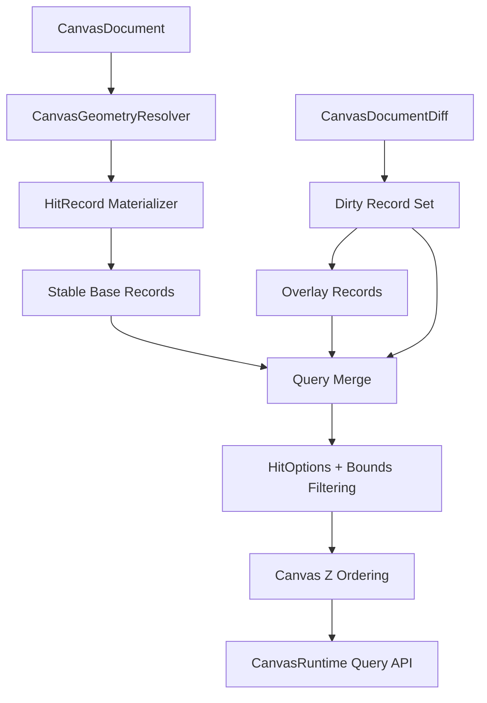

# feat: Add Runtime-Owned Hybrid Canvas Spatial Cache

## Summary

This plan moves the spatial-index benchmark result into production internals by adding a
runtime-owned hybrid spatial cache prototype. The public canvas API remains stable while
`CanvasRuntime` gains the internal structure needed for static-base plus dynamic-overlay indexing.

---

## Problem Frame

The benchmark spike showed that a static AABB index is a strong fit for stable paint-frame queries,
while a dynamic overlay is the likely answer for active edits. The current runtime still owns a
single sorted-vector `SpatialIndex`, so the next step is to prototype the hybrid shape behind
`CanvasRuntime` without freezing public strategy knobs or leaking dependency names.

The design must keep canvas-owned semantics intact: `CanvasGeometryResolver` remains the source of
record geometry, `HitOptions` filtering and z ordering remain canvas behavior, and committed
document diffs must drive cache refreshes.

---

## Requirements

**Runtime Ownership**

- R1. `CanvasRuntime` must remain the only production owner of spatial, graph, and edge-geometry
  runtime caches.
- R2. The hybrid cache must stay internal to the crate and must not expose concrete strategy or
  third-party dependency names in public APIs.
- R3. Existing callers that rebuild or update `CanvasRuntime` must keep using the same public
  methods.

**Hybrid Cache Semantics**

- R4. The runtime cache must support a stable base plus overlay records, with stale suppression by
  `CanvasRecordId`.
- R5. Query and hit-test results must preserve `HitOptions`, half-open GPUI bounds behavior, and
  z-order ordering.
- R6. The cache must materialize records through `CanvasGeometryResolver`, including custom edge
  routers and `CanvasKindRegistry` geometry hooks.
- R7. Committed diffs must refresh nodes, handles, shapes, edges, and incident edges without
  rebuilding an oracle index just to discover overlay records.

**Performance And Future Optionality**

- R8. The first production prototype may keep the sorted-vector base implementation, but the module
  boundary must make a future packed static AABB base and dynamic R-tree overlay a local change.
- R9. Tests and benches must compare the runtime hybrid path against the current `SpatialIndex`
  oracle before any default strategy is changed.
- R10. User-facing strategy presets such as `Auto` or `Hybrid` remain deferred until runtime data
  proves they are needed.

---

## Key Technical Decisions

- KTD1. **Prototype behind runtime internals:** The cache should be reachable through
  `CanvasRuntime::query`, `query_with_options`, and `hit_test`, not through a new public strategy
  API.
- KTD2. **Keep current `SpatialIndex` as oracle and fallback:** The sorted-vector index is still the
  correctness baseline, and the first hybrid prototype can reuse its record materialization while
  isolating base/overlay ownership.
- KTD3. **Make semantic record IDs explicit:** Stale suppression and overlay replacement should use
  `CanvasRecordId` derived from `HitTarget`, so node moves suppress node and handle records while
  graph incidence refreshes affected edges.
- KTD4. **Drive overlay records from diffs:** Runtime cache updates should consume
  `CanvasDocumentDiff` plus the current document, not rebuild a full index to extract changed
  records.
- KTD5. **Keep third-party candidates dev-only:** `rstar` and `static_aabb2d_index` stay in tests
  and benches until the hybrid cache has production parity and measured value.
- KTD6. **Let runtime choose rebuild thresholds internally:** If the overlay grows too large, the
  runtime may compact back into a stable base as an internal heuristic rather than exposing knobs.

---

## High-Level Technical Design

The first implementation should add an internal spatial-cache module that owns base records, overlay
records, and stale record IDs. `CanvasRuntime` delegates query and hit-test behavior to that cache.
The base can initially use sorted records, while the module names and data flow prepare for replacing
the base storage with a packed static index later.

---

## Implementation Units

### U1. Internal Spatial Cache Module

**Goal:** Add an internal module that can materialize `HitRecord` values, map targets to semantic
record IDs, and merge stable base records with overlay records.

**Requirements:** R2, R4, R5, R6, R8.

**Files:**

- `crates/canvas/src/spatial_cache.rs`
- `crates/canvas/src/index.rs`
- `crates/canvas/src/lib.rs`

**Approach:** Move shared record materialization out of `SpatialIndex` into reusable internal
helpers. Add a `CanvasSpatialCache` or equivalent internal type with base records, overlay records,
and stale IDs. Keep external `SpatialIndex` behavior intact by reusing the same materializer.

**Test scenarios:**

- `crates/canvas/src/spatial_cache.rs`: querying the cache returns the same target order as
  `SpatialIndex` for base-only records.
- `crates/canvas/src/spatial_cache.rs`: overlay records replace stale base records with the same
  semantic ID.
- `crates/canvas/src/spatial_cache.rs`: hit testing returns topmost-first ordering after base and
  overlay records are merged.
- `crates/canvas/src/spatial_cache.rs`: hidden, locked, handle, and margin options match
  `SpatialIndex`.

### U2. Runtime Diff Integration

**Goal:** Route `CanvasRuntime` rebuilds and committed diffs through the new internal cache while
preserving current public methods.

**Requirements:** R1, R3, R4, R6, R7.

**Files:**

- `crates/canvas/src/runtime.rs`
- `crates/canvas/src/spatial_cache.rs`
- `crates/canvas/src/tool.rs`

**Approach:** Replace the runtime-owned `SpatialIndex` field with the internal cache and keep a
compatibility accessor only if it is still needed by crate internals. Diff application should derive
dirty IDs from inserted, updated, removed, and incident records, then refresh overlay records through
the resolver.

**Test scenarios:**

- `crates/canvas/src/runtime.rs`: applying an inserted node diff makes runtime hit testing find the
  node without a full runtime rebuild.
- `crates/canvas/src/runtime.rs`: moving a node refreshes node, handle, and incident edge query
  records.
- `crates/canvas/src/runtime.rs`: removing a node suppresses its node and handle records and removes
  incident edge records.
- `crates/canvas/src/runtime.rs`: custom router and kind registry updates still affect runtime
  query and hit-test results after diffs.

### U3. Public API Guardrails And Paint Path

**Goal:** Keep GPUI paint and editor interactions on runtime-owned queries without exposing hybrid
  internals.

**Requirements:** R1, R2, R3, R5, R10.

**Files:**

- `crates/canvas/src/gpui.rs`
- `crates/canvas/src/tool.rs`
- `crates/canvas/src/lib.rs`

**Approach:** Audit direct `SpatialIndex` dependencies in editor and paint code. Prefer
`CanvasRuntime` query methods for interaction and paint paths. Avoid adding public constructors that
accept partial cache state.

**Test scenarios:**

- `crates/canvas/src/gpui.rs`: paint-frame culling uses runtime query output and keeps hidden,
  handle, and selection behavior unchanged.
- `crates/canvas/src/tool.rs`: pointer hit testing after a committed gesture sees refreshed runtime
  records.
- API review confirms no public type or method names a concrete third-party index strategy.

### U4. Runtime Hybrid Parity Tests And Bench Hooks

**Goal:** Extend the existing spatial-index parity and benchmark harness so the runtime prototype is
checked against the oracle.

**Requirements:** R5, R6, R7, R9.

**Files:**

- `crates/canvas/tests/spatial_index_strategies.rs`
- `crates/canvas/benches/spatial_index_strategies.rs`
- `docs/research/canvas-spatial-index-benchmark-results.md`

**Approach:** Add a runtime-hybrid candidate in the existing test harness by exercising
`CanvasRuntime` queries after rebuilds and diffs. Benchmark the runtime path separately from
bench-only `rstar` and static AABB candidates.

**Test scenarios:**

- `crates/canvas/tests/spatial_index_strategies.rs`: runtime query targets match `SpatialIndex`
  across grid, dense-overlap, clustered, long-edge, and mixed-kind fixtures.
- `crates/canvas/tests/spatial_index_strategies.rs`: runtime hit tests preserve z-order parity.
- `crates/canvas/tests/spatial_index_strategies.rs`: runtime diff updates match oracle rebuilds
  during drag-like node moves.
- `crates/canvas/benches/spatial_index_strategies.rs`: runtime query, hit-test, and drag-update
  benchmarks build and run under Criterion.

---

## Scope Boundaries

- The plan does not replace the production default with `rstar` or `static_aabb2d_index`.
- The plan does not add public `CanvasIndexStrategy`, `CanvasRuntimeOptions`, or user-selectable
  presets.
- The plan does not attempt CRDT, redb, or snapshot persistence changes.
- The plan does not optimize GPU culling or tile rendering.
- The plan allows internal cache compaction heuristics only when needed to keep overlay growth
  bounded.

---

## System-Wide Impact

This change affects the canvas runtime consistency boundary. Runtime cache invalidation must stay
aligned with committed mutation diffs, graph incidence, geometry resolution, hit testing, paint
culling, and editor interaction frames. The public crate surface should look almost unchanged, while
internal runtime ownership becomes deeper.

---

## Risks & Dependencies

- **Risk: Hybrid cache complexity hides consistency bugs.** Mitigation: keep `SpatialIndex` as the
  oracle and add parity tests for deleted nodes, incident edges, handles, custom routers, and kind
  geometry.
- **Risk: The prototype only wraps the current vector and gives no performance win.** Mitigation:
  treat this unit as the ownership and invalidation layer; performance comes when the base storage is
  swapped behind the internal module.
- **Risk: Overlay records grow without bound.** Mitigation: add an internal compaction threshold or
  rebuild path before exposing the prototype as the default long-term strategy.
- **Risk: Public API accidentally freezes internals.** Mitigation: keep new types crate-private and
  review `pub use` plus exported method signatures before commit.

---

## Sources / Research

- `docs/adr/0003-open-gpui-canvas-spatial-index-strategy.md`
- `docs/research/canvas-spatial-index-benchmark-results.md`
- `docs/research/canvas-spatial-index.md`
- `docs/plans/2026-06-08-002-perf-canvas-spatial-index-benchmark-plan.md`
- `crates/canvas/src/runtime.rs`
- `crates/canvas/src/index.rs`
- `crates/canvas/src/resolve.rs`
- `crates/canvas/tests/spatial_index_strategies.rs`
- `crates/canvas/benches/spatial_index_strategies.rs`
