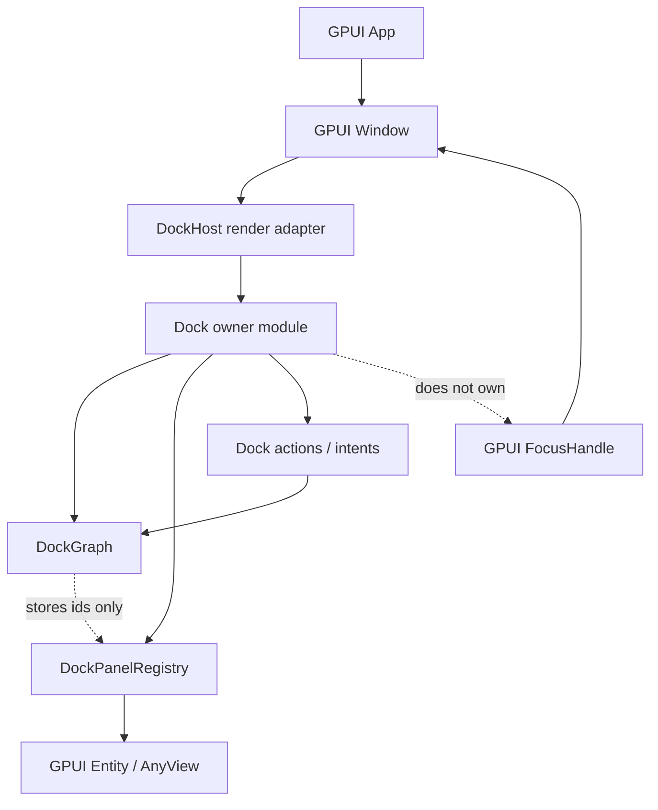
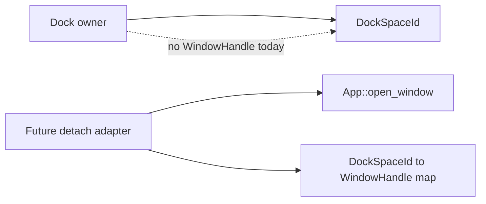

# refactor: Deepen docking GPUI integration seams

## Summary

Refactor the docking layer so `DockHost` becomes a narrow GPUI render adapter and a deeper docking owner module coordinates graph state, panel registration, actions, and future interaction state. The plan preserves GPUI's existing `App`, `Window`, `FocusHandle`, `Entity`, and native window tabbing concepts as the authoritative modules rather than introducing a parallel docking window manager.

---

## Problem Frame

Phase 1 and Phase 2 landed a pure `DockGraph`, static `DockHost`, panel registry, layout persistence, visual tests, and a native smoke example. That shape is useful, but the next feature step will add tab activation, drag/drop, splitter resize, floating overlays, and eventually platform-window detach. If that work grows directly inside `DockHost`, callers will keep crossing a wide interface that exposes graph mutation, registry mutation, notification ordering, debug selectors, and render state.

The architectural review found the top deepening opportunity in the docking owner seam: keep `DockGraph` pure, keep GPUI windows and focus owned by GPUI, and make one docking module absorb coordination. This gives locality before interaction code arrives.

---

## Requirements

- R1. Keep `DockGraph` pure: no `Entity`, `AnyView`, `WindowHandle`, `WindowId`, `FocusHandle`, or platform-window state may enter graph storage or layout serialization.
- R2. Introduce a deeper docking owner module that owns a graph, selected dock space, panel registry, host options, and future interaction state behind one interface.
- R3. Narrow `DockHost` into a GPUI render adapter for one dock space, with rendering delegated from the docking owner rather than exposing broad mutation access to callers.
- R4. Preserve `App::open_window`, `Window`, `WindowOptions`, `active_window`, and `window_stack` as the only modules responsible for platform window lifecycle.
- R5. Preserve GPUI `FocusHandle`, `Focusable`, hitboxes, and `InteractiveElement` as the input and focus seam; docking active tab state remains selection, not focus.
- R6. Keep docking tabs, native window tabbing, in-window floating containers, and platform floating windows as separate concepts.
- R7. Keep current Phase 2 behavior and the docking native example working through the new owner interface.
- R8. Move tests toward the new interface so future interaction tests validate docking behavior without depending on incidental `DockHost` internals.

---

## Scope Boundaries

In scope:

- Refactoring `open-gpui-docking` ownership so graph, registry, options, and event-ready state sit behind a deeper module.
- Updating static rendering and the native smoke example to use the new owner shape.
- Adding a small action seam for active-tab mutation as the first proof that GPUI events can flow into graph updates through the owner.
- Documenting the GPUI window integration decision so future OS-level detach work does not reinterpret `DockSpaceId` as `WindowId`.
- Preserving existing graph, layout, and host-rendering behavior.

Deferred to follow-up work:

- Full tab drag/drop, drop preview overlays, splitter resize, and floating overlay chrome.
- Platform-window detach, cross-window drag routing, hovered-window selection, and coordinate conversion.
- Advanced focus traversal and accessibility-specific dock-tree navigation.
- A full extraction of every `DockGraph` helper into separate modules unless the owner refactor exposes a concrete locality problem.

Out of scope:

- Moving docking into `crates/gpui`.
- Adding a docking-owned window manager.
- Reusing `WindowOptions::tabbing_identifier` for docking tabs.
- Changing GPUI platform backends for this refactor.

---

## Key Technical Decisions

- KTD1. **Dock owner before interaction:** Add a deeper docking owner module before adding broad interaction behavior, so tab activation and drag/drop cross one interface instead of mutating `DockHost` internals directly.
- KTD2. **`DockHost` as adapter:** Treat `DockHost` as an adapter from docking state to GPUI `Render`, not as the long-term owner of graph, registry, debug instrumentation, and interaction policy.
- KTD3. **No premature platform adapter:** Do not introduce a platform-window detach adapter in this refactor. One production adapter would be hypothetical; document the seam and add it only when OS-level detach work starts.
- KTD4. **Graph purity is non-negotiable:** Keep item identity and layout structure in `DockGraph`; keep view state in `DockPanelRegistry` and GPUI entities.
- KTD5. **GPUI focus remains authoritative:** A dock tab click may select an active panel and may ask GPUI to focus a rendered view, but docking must not maintain a second focus table.
- KTD6. **Test through the owner seam:** The owner interface becomes the main test surface. Rendering tests still inspect visible output, but state mutation tests should not need direct `graph_mut` access on `DockHost`.

---

## High-Level Technical Design

The refactor adds one deep module that owns docking state and policy. `DockHost` renders that module into a GPUI window. `DockGraph` remains the storage and mutation module for layout state. `DockPanelRegistry` remains the adapter from `DockItemId` to GPUI view content. GPUI `App` and `Window` remain the platform lifecycle modules.

Platform-window detach stays as a future adapter:

---

## Refactor Brief

**Intent:** Remove future coordination complexity from `DockHost` before interaction work makes the interface harder to shrink.

**Scope:** `crates/gpui_docking` host, render, panel, tests, public exports, and `examples/docking-native`.

**Deletion plan:** Remove or demote direct caller reliance on `DockHost::graph_mut`, broad panel mutation access, and runtime debug selector state where a test adapter can carry it.

**Seam plan:** Create a deep docking owner module; keep `DockHost` as the GPUI adapter; defer platform-window detach as a future adapter.

**Testing plan:** Move state mutation coverage to owner-level tests, preserve visual host tests, and keep pure graph/layout tests unchanged.

**Risk plan:** Maintain current behavior first, then shrink interfaces. If public churn becomes too wide, keep temporary compatibility methods only with tests proving they delegate to the owner.

**Workflow plan:** This should be one standard refactor plan, executed as focused implementation units rather than a long-lived architecture lane.

**Scale plan:** Direct plan-led refactor; no Codex goal is needed until a bounded implementation unit is selected for execution.

---

## Implementation Units

### U1. Record The GPUI Integration Decision

**Goal:** Capture the window/focus/tabbing decision before code reshaping starts.

**Requirements:** R1, R4, R5, R6

**Dependencies:** None

**Files:**

- `docs/adr/0002-docking-gpui-integration.md`
- `docs/adr/README.md`

**Approach:** Add an ADR stating that GPUI owns platform windows and focus; docking owns logical dock spaces, layout, and selection. The ADR should distinguish docking tabs from native window tabbing and in-window floating from platform floating windows.

**Patterns to follow:** `docs/adr/0001-open-gpui-fork-strategy.md`

**Test scenarios:** Test expectation: none -- documentation-only unit.

**Verification:** Future readers can identify where the GPUI integration decision lives and do not need to infer it from implementation details.

### U2. Add The Deep Dock Owner Module

**Goal:** Introduce the module that owns docking state coordination behind one interface.

**Requirements:** R2, R3, R7, R8

**Dependencies:** U1

**Files:**

- `crates/gpui_docking/src/workspace.rs`
- `crates/gpui_docking/src/host.rs`
- `crates/gpui_docking/src/panel.rs`
- `crates/gpui_docking/src/lib.rs`
- `crates/gpui_docking/src/host_tests.rs`

**Approach:** Add a docking owner module that holds the current `DockHost` state responsibilities: graph, dock space, registry, options, and action-ready state. Keep the interface small: construction, panel registration, graph read access, applying dock actions, and producing render state for a host. Avoid traits until there are two real adapters.

**Patterns to follow:** Existing `DockHost` state accessors in `crates/gpui_docking/src/host.rs`; registry behavior in `crates/gpui_docking/src/panel.rs`; visual setup helpers in `crates/gpui_docking/src/host_tests.rs`

**Test scenarios:**

- Creating the owner with a graph and dock space preserves the graph root and panel registry.
- Registering a panel through the owner replaces the previous registration and keeps graph state unchanged.
- Applying an active-tab action through the owner updates the graph and returns a changed/no-change result.
- A missing panel resolves through the owner without panicking.

**Verification:** State tests can exercise graph and registry coordination through the owner without opening a platform window.

### U3. Narrow DockHost Into A Render Adapter

**Goal:** Make `DockHost` render one dock space from the owner without remaining the main mutation surface.

**Requirements:** R2, R3, R7, R8

**Dependencies:** U2

**Files:**

- `crates/gpui_docking/src/host.rs`
- `crates/gpui_docking/src/render.rs`
- `crates/gpui_docking/src/host_tests.rs`
- `examples/docking-native/src/main.rs`

**Approach:** Rework `DockHost` construction so it adapts an owner or owner-backed state into GPUI `Render`. Keep static rendering output equivalent to Phase 2. Existing examples should create the owner, register panels through it, then mount the host adapter. Temporary compatibility constructors are acceptable only if they delegate to the owner and do not become the preferred interface.

**Patterns to follow:** `Render for DockHost` in `crates/gpui_docking/src/render.rs`; native example setup in `examples/docking-native/src/main.rs`

**Test scenarios:**

- A single-root tabs graph renders the same active panel through the adapter.
- A split graph keeps the same normalized bounds behavior through the adapter.
- Updating active tab through the owner and notifying the view redraws the new active panel.
- The native example builds against the preferred owner-first setup.

**Verification:** Host visual tests continue to validate tabs, splits, missing panels, and graph mutation redraw through the new adapter.

### U4. Add A Minimal Dock Action Seam

**Goal:** Prove GPUI element events can mutate docking state without direct graph access on the render adapter.

**Requirements:** R3, R5, R7, R8

**Dependencies:** U2, U3

**Files:**

- `crates/gpui_docking/src/action.rs`
- `crates/gpui_docking/src/render.rs`
- `crates/gpui_docking/src/host.rs`
- `crates/gpui_docking/src/host_tests.rs`

**Approach:** Add a small action or intent module for host-level interactions, starting with active-tab selection. Rendered tab labels should emit the action through GPUI click handling; the owner applies it to `DockGraph`. This unit should not implement drag/drop or splitter resize.

**Patterns to follow:** GPUI `on_click` and listener patterns in `crates/gpui/src/elements/div.rs`; current `DockOp::SetActiveTab` behavior in `crates/gpui_docking/src/op.rs`

**Test scenarios:**

- Clicking an inactive tab emits a selection action and changes the active graph index.
- Clicking the active tab is a no-op and does not disturb panel registration.
- Clicking a tab label does not create a docking focus table.
- Invalid tab indexes are rejected through the owner without mutating unrelated state.

**Verification:** A visual interaction test can select a tab through GPUI event simulation and observe the active panel change.

### U5. Contain Debug Instrumentation

**Goal:** Keep test observability without letting debug selector bookkeeping define the production interface.

**Requirements:** R3, R8

**Dependencies:** U3

**Files:**

- `crates/gpui_docking/src/debug.rs`
- `crates/gpui_docking/src/host.rs`
- `crates/gpui_docking/src/render.rs`
- `crates/gpui_docking/src/host_tests.rs`

**Approach:** Move debug region recording behind a narrow instrumentation module or test-support helper. Keep existing visual assertions possible, but make runtime rendering independent from a public selector map. If the repository's lint or feature structure makes a full move too noisy, first make the debug interface crate-private and document it as test instrumentation.

**Patterns to follow:** Current `DockDebugRegion` and selector helpers in `crates/gpui_docking/src/host.rs` and `crates/gpui_docking/src/host_tests.rs`

**Test scenarios:**

- Host, tab, split, and panel regions remain inspectable in visual tests.
- Production-facing owner and host interfaces do not require callers to understand selector mapping.
- Two redraws of the same graph expose stable test regions.

**Verification:** Existing selector-based visual tests continue to pass or are replaced by equivalent instrumentation assertions.

### U6. Tighten Graph Policy Locality Where It Blocks Interaction

**Goal:** Prevent interaction work from depending on broad `DockGraph` internals.

**Requirements:** R1, R2, R8

**Dependencies:** U2, U4

**Files:**

- `crates/gpui_docking/src/graph.rs`
- `crates/gpui_docking/src/op.rs`
- `crates/gpui_docking/src/layout.rs`
- `crates/gpui_docking/src/tests.rs`

**Approach:** Do not split `graph.rs` mechanically. Instead, extract only the policy that new owner/action code needs repeatedly: checked operation errors, target lookup, and canonicalization guarantees. Keep storage private and make interaction code consume `DockOp` or owner-level actions rather than traversal helpers.

**Patterns to follow:** `DockGraph::apply_op_checked`, `DockGraph::edge_dock_decision`, layout validation in `crates/gpui_docking/src/layout.rs`

**Test scenarios:**

- Invalid active-tab selection returns a typed error and leaves graph state unchanged.
- Invalid move or floating operations expose a distinguishable failure path when interaction code needs it.
- Layout export/import remains unchanged for existing fixtures.
- Canonical space assertions still hold after owner-applied actions.

**Verification:** Pure graph tests still cover mutation invariants; owner tests do not need private graph traversal.

### U7. Update Example And Verification Notes

**Goal:** Make the new seam visible to application authors.

**Requirements:** R7, R8

**Dependencies:** U2, U3, U4

**Files:**

- `examples/docking-native/src/main.rs`
- `examples/docking-native/Cargo.toml`
- `docs/verification.md`

**Approach:** Update the docking native smoke example so it uses the owner-first setup and demonstrates static rendering plus tab activation if U4 lands. Document the expected verification surface at a behavior level.

**Patterns to follow:** Existing `examples/docking-native/src/main.rs`; existing verification style in `docs/verification.md`

**Test scenarios:**

- The example constructs the owner, registers panels, mounts the host adapter, and opens a GPUI window.
- The example's default layout still renders explorer, editor, preview, terminal, and problems panels.
- If tab activation is included, clicking a visible inactive tab changes the active panel without panic.

**Verification:** The example remains a runnable public-interface smoke path for the refactored docking seam.

---

## Acceptance Examples

- AE1. Given a docking owner with a graph and registered panels, when a host adapter renders it in a GPUI window, then the same active panel content appears as before the refactor.
- AE2. Given an inactive docking tab, when the user clicks it, then the owner applies active-tab selection and the host redraws the selected panel.
- AE3. Given a serialized layout, when it is exported and imported after the refactor, then it contains only dock spaces, nodes, items, and floating bounds, not GPUI view or window handles.
- AE4. Given a future platform detach design, when it needs to open a new OS window, then it must use a separate adapter over `App::open_window` rather than storing `WindowHandle` in `DockGraph`.

---

## Alternative Approaches Considered

- Keep growing `DockHost`: rejected because the interface would stay shallow as interactions arrive, spreading coordination knowledge across examples, tests, and callers.
- Move docking into `crates/gpui`: rejected because Phase 2 already works as an optional crate and no missing GPUI primitive has been proven.
- Add a docking window manager now: rejected because GPUI already owns platform window lifecycle and one adapter would be hypothetical until OS-level detach starts.
- Split `graph.rs` by file immediately: rejected as mechanical cleanup unless it improves the owner/action seam. The deletion test does not justify moving code without reducing caller knowledge.

---

## Risks & Dependencies

- Public interface churn may affect the newly added native example. Mitigation: update the example in the same refactor and keep compatibility methods only when they delegate cleanly.
- The owner module could become another pass-through if it only forwards to `DockGraph`. Mitigation: require it to own registry coordination, action application, and render-state preparation.
- Debug instrumentation may be hard to isolate without disrupting visual tests. Mitigation: first make it crate-private and test-owned, then extract further if the interface shrinks.
- Typed failure semantics for all `DockOp` variants can expand scope. Mitigation: only tighten the failure paths needed by owner/action work; defer exhaustive error taxonomy.

---

## System-Wide Impact

The active code changes should remain inside `crates/gpui_docking` and `examples/docking-native`. `crates/gpui` should not change unless implementation proves a missing public primitive. GPUI platform backends should not change in this refactor.

This plan strengthens the optional docking crate's internal module depth without weakening the clean fork strategy in `docs/adr/0001-open-gpui-fork-strategy.md`.

---

## Sources & Research

- `docs/adr/0001-open-gpui-fork-strategy.md` establishes that Open GPUI should keep clean framework boundaries and use references without importing unrelated application architecture.
- `docs/plans/2026-06-08-001-feat-docking-plan.md` defines `DockSpaceId` as logical and defers OS-level multi-window docking.
- `docs/plans/2026-06-08-002-feat-docking-host-rendering-plan.md` defines Phase 2 as static host rendering and keeps interaction deferred.
- `crates/gpui/src/app.rs` shows `App::open_window`, `active_window`, and `window_stack` as GPUI's platform-window lifecycle seam.
- `crates/gpui/src/window.rs` shows `Window`, `FocusHandle`, hitboxes, pointer capture, frame scheduling, and bounds ownership.
- `crates/gpui/src/platform.rs` defines `WindowOptions`, `WindowBounds`, platform tabbing, and platform window creation.
- `crates/gpui/src/elements/div.rs` provides the event and drag/drop hooks that docking interaction should use.
- `crates/gpui_docking/src/ids.rs` already documents `DockSpaceId` as logical rather than necessarily an OS window.
- `crates/gpui_docking/src/host.rs`, `render.rs`, and `panel.rs` show the current Phase 2 host/registry/render shape.
- `crates/gpui_docking/src/graph.rs` contains the current graph storage, mutation, query, layout, and canonicalization implementation.
