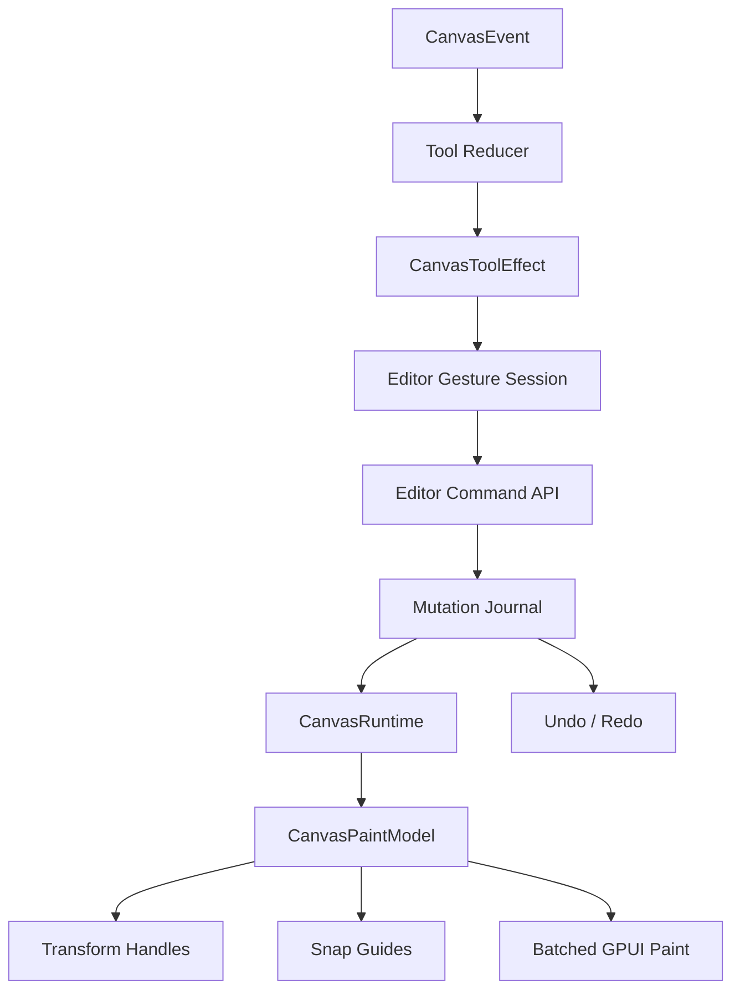

# feat: Add Product-Grade Canvas Editing Interactions

## Summary

This plan turns the canvas core from a correct model and tool skeleton into a usable editing
foundation. The work adds transform handles, duplicate and clipboard semantics, z-order commands,
snap guides, and tighter editor mutation boundaries while deleting shallow or redundant paths that
would make product integrations bypass consistency rules.

---

## Problem Frame

The current canvas crate has strong document, mutation, runtime, persistence, and paint boundaries,
but the default editor still lacks the everyday operations users expect in a flow editor, whiteboard,
or MarginNote-style note map. Applications can select, drag, connect, pan, delete, and extend tools,
yet they cannot resize records through handles, reorder layers, duplicate selections, or get
alignment feedback without inventing parallel state outside `CanvasEditor`.

The next layer should stay renderer-neutral. The core crate should expose editing intent and
transaction semantics; GPUI should paint handles and guides from snapshots; applications should not
need mutable access to document internals.

---

## Requirements

**Editing Commands**

- R1. The editor must expose transaction-backed commands for duplicate, delete, bring forward, send
  backward, bring to front, and send to back.
- R2. Duplicate must preserve selected nodes, shapes, handles, and internal edges while assigning
  new IDs and offsetting copied records.
- R3. Clipboard support must serialize a selection payload that can be pasted into another document
  without carrying runtime cache state.
- R4. Layering commands must preserve relative order inside the selected set and update runtime
  cache and undo history through the normal mutation path.

**Transform Interaction**

- R5. Selected nodes and shapes must expose resize handles in the paint snapshot.
- R6. Pointer gestures on resize handles must commit one undoable transaction and support cancel
  restore.
- R7. Resize must enforce minimum sizes and must use kind-specific geometry policy when registered.
- R8. Dragging selected records must remain one gesture-level undo operation and must keep connected
  edge geometry synchronized through `CanvasRuntime`.

**Snap And Feedback**

- R9. Move and resize gestures must compute snap candidates from nearby unlocked records without
  making snap state part of the persisted document.
- R10. GPUI paint snapshots must include alignment guide overlays and transform affordances without
  rendering every record as a GPUI element.
- R11. Escape, undo, redo, persistence, and custom tools must continue to observe the same committed
  mutations as built-in tools.

---

## Key Technical Decisions

- KTD1. **Commands live on `CanvasEditor`, not `CanvasDocument`:** user-facing editing operations
  must pass through selection pruning, journal commits, runtime updates, and history.
- KTD2. **Clipboard is document data plus remap metadata:** copied selections should use canonical
  records and deterministic ID remapping, not opaque renderer objects.
- KTD3. **Transform handles are hit targets:** resize grips should be represented in interaction
  snapshots and hit testing, but they should not become persisted handles or document records.
- KTD4. **Snap guides are transient gesture feedback:** snapping adjusts proposed transactions and
  paints guides, while the document stores only the final positions or sizes.
- KTD5. **Kind policy constrains transforms:** unknown kinds use default bounds and minimum size,
  while registered kinds can reject or normalize resize output.
- KTD6. **Remove bypass paths while adding commands:** any public setter or helper that lets callers
  mutate document, selection, runtime, or history out of sync should be deleted or tightened.

---

## High-Level Technical Design

Transform and layer operations should be expressed as editor commands that produce
`CanvasTransaction` values internally. Built-in tools can then reuse those commands during pointer
gestures, while application code can call the same command surface from menus or keyboard shortcuts.

---

## Implementation Units

### U1. Editor Command Surface And API Pruning

**Goal:** Add explicit editor methods for common editing commands and remove public mutation paths
that can desynchronize document, runtime, selection, and history.

**Requirements:** R1, R4, R11, KTD6.

**Files:**

- `crates/canvas/src/tool.rs`
- `crates/canvas/src/document.rs`
- `crates/canvas/src/journal.rs`
- `crates/canvas/src/lib.rs`

**Approach:** Introduce command methods on `CanvasEditor` for delete, duplicate, z-order changes,
and clipboard paste. Keep low-level transactions available where they are already part of the core
model, but make editor state mutation go through one consistency boundary. Delete obsolete helper
paths when the new command surface supersedes them.

**Test scenarios:**

- `crates/canvas/src/tool.rs`: each command updates document, selection, runtime, and history in one
  path.
- `crates/canvas/src/tool.rs`: undo and redo restore z-order and duplicated records.
- `crates/canvas/src/tool.rs`: locked records are skipped by destructive commands unless an explicit
  diagnostic path opts in.
- `crates/canvas/src/journal.rs`: command-generated diffs include actual implicit edge changes.

### U2. Duplicate And Clipboard Payloads

**Goal:** Add renderer-neutral copy, cut, duplicate, and paste semantics for selected records.

**Requirements:** R2, R3, R11.

**Files:**

- `crates/canvas/src/clipboard.rs`
- `crates/canvas/src/document.rs`
- `crates/canvas/src/tool.rs`
- `crates/canvas/src/lib.rs`

**Approach:** Add a small clipboard module that captures selected nodes, shapes, and internal edges.
Paste remaps IDs, offsets geometry, and returns a normal transaction. Edges that cross the selection
boundary are omitted unless both endpoints are included.

**Test scenarios:**

- `crates/canvas/src/clipboard.rs`: copying two connected nodes includes their internal edge.
- `crates/canvas/src/clipboard.rs`: copying one endpoint omits edges to records outside the payload.
- `crates/canvas/src/tool.rs`: paste remaps IDs and selects the pasted records.
- `crates/canvas/src/tool.rs`: cut appends one loggable mutation and supports undo.

### U3. Transform Handles And Resize Gestures

**Goal:** Add resize hit targets, paint snapshot affordances, and one-transaction resize gestures for
selected nodes and shapes.

**Requirements:** R5, R6, R7, R8, R10, R11.

**Files:**

- `crates/canvas/src/tool.rs`
- `crates/canvas/src/gpui.rs`
- `crates/canvas/src/resolve.rs`
- `crates/canvas/src/schema.rs`

**Approach:** Extend interaction snapshots with transform handles derived from selected record
bounds. Add a resize tool state that captures baseline geometry, applies unrecorded updates during
drag, and commits one transaction on pointer up. Use `CanvasKindRegistry` to normalize or reject
kind-specific resize output.

**Test scenarios:**

- `crates/canvas/src/gpui.rs`: selected nodes and shapes produce stable handle bounds at each
  viewport scale.
- `crates/canvas/src/tool.rs`: dragging a corner handle resizes one selected node and creates one
  undo entry.
- `crates/canvas/src/tool.rs`: cancel restores baseline bounds after transient resize updates.
- `crates/canvas/src/schema.rs`: registered kind policy can clamp resize output.

### U4. Snap Guides And Alignment Feedback

**Goal:** Add move and resize snapping with paintable alignment guides.

**Requirements:** R8, R9, R10.

**Files:**

- `crates/canvas/src/snap.rs`
- `crates/canvas/src/tool.rs`
- `crates/canvas/src/gpui.rs`
- `crates/canvas/src/runtime.rs`

**Approach:** Add a transient snap resolver that compares active bounds against nearby unlocked
records from `CanvasRuntime`. It should emit adjusted deltas plus guide segments for the paint
snapshot. Keep thresholds in document-space pixels and defer user-configurable snap settings.

**Test scenarios:**

- `crates/canvas/src/snap.rs`: moving a selected record snaps left, center, right, top, middle, and
  bottom alignments within threshold.
- `crates/canvas/src/tool.rs`: shift-constrained dragging and snapping compose predictably.
- `crates/canvas/src/gpui.rs`: paint frame exposes guide overlays only during active transform
  gestures.
- `crates/canvas/src/runtime.rs`: snap candidates exclude hidden and locked records by default.

### U5. Example And Documentation Coverage

**Goal:** Prove the new editing operations in the native smoke example and public docs.

**Requirements:** R1, R2, R5, R9, R10.

**Files:**

- `examples/smoke-native/src/main.rs`
- `crates/canvas/README.md`
- `docs/adr/0002-open-gpui-canvas-architecture.md`

**Approach:** Wire keyboard shortcuts and visible affordances into the smoke example without turning
the example into a product app. Update README examples to show command-based editing rather than
direct document mutation.

**Test scenarios:**

- `examples/smoke-native/src/main.rs`: shortcuts call editor commands instead of mutating the
  document directly.
- `crates/canvas/README.md`: documented snippets compile against the new command surface where
  practical.
- `docs/adr/0002-open-gpui-canvas-architecture.md`: architecture text describes transform handles,
  clipboard payloads, and snap feedback as editor/runtime concerns.

---

## Scope Boundaries

- The plan does not add rich text editing, embedded widgets, or file preview rendering.
- The plan does not add multi-user collaboration or CRDT adapters.
- The plan does not add rotation; resize handles should leave a clear future path for it.
- The plan does not require a public snap settings API in 0.1.
- The plan allows deleting pre-release APIs that conflict with the new editor command boundary.

---

## System-Wide Impact

This change deepens the editor consistency boundary. Keyboard shortcuts, built-in tools, custom
tools, persistence helpers, undo/redo, runtime caches, and GPUI paint snapshots should all observe
the same committed mutations. The public API surface should become smaller where shallow mutation
helpers are removed, and broader where product-level commands are introduced.

---

## Risks & Dependencies

- **Risk: Transform handles leak renderer details into the model.** Mitigation: keep handles in
  interaction snapshots and hit targets, not document records.
- **Risk: Clipboard remapping creates broken edges.** Mitigation: include only internal edges and
  test partial selection copies.
- **Risk: Snapping makes drag gestures feel unpredictable.** Mitigation: keep snapping deterministic,
  thresholded, and easy to disable internally if follow-up UX needs it.
- **Risk: API pruning breaks examples or docs.** Mitigation: update smoke-native and README in the
  same plan and treat compiler errors as the public-surface audit.

---

## Sources / Research

- `docs/adr/0002-open-gpui-canvas-architecture.md`
- `docs/adr/0003-open-gpui-canvas-spatial-index-strategy.md`
- `crates/canvas/src/tool.rs`
- `crates/canvas/src/gpui.rs`
- `crates/canvas/src/resolve.rs`
- `crates/canvas/src/schema.rs`
- `examples/smoke-native/src/main.rs`
