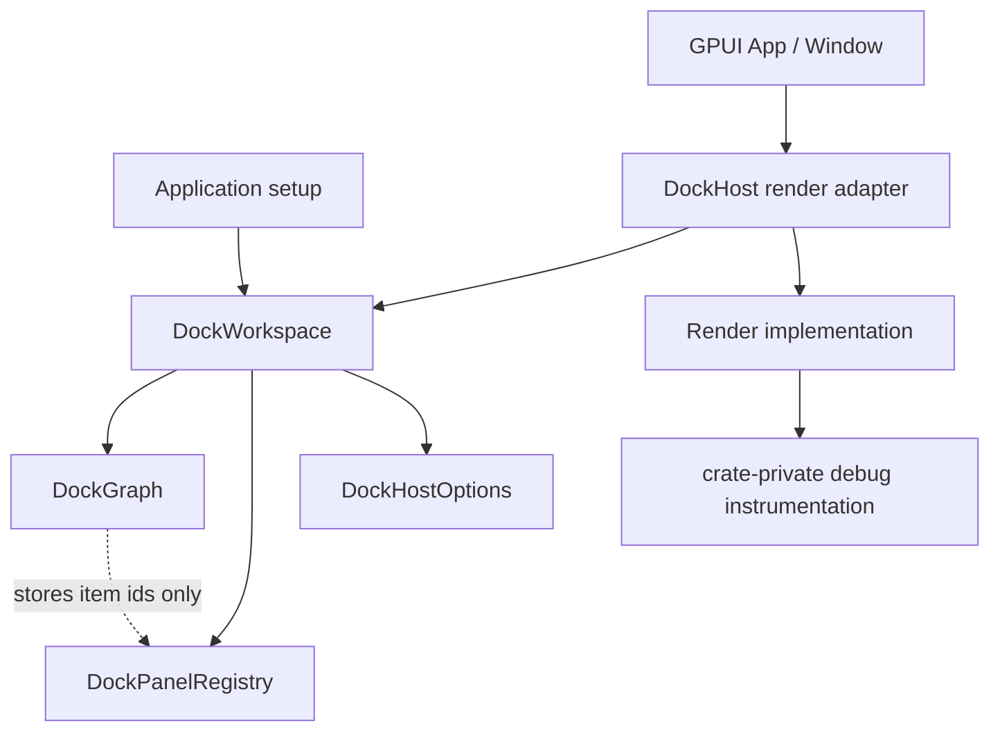
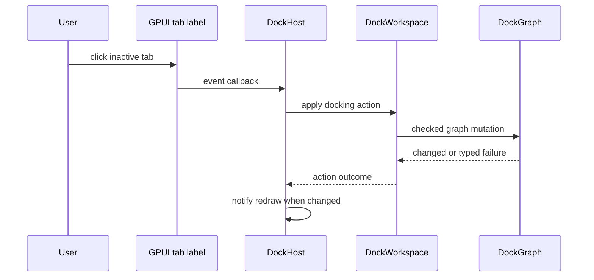

# refactor: Complete docking owner seam

## Summary

Complete the docking owner refactor that started in `docs/plans/2026-06-08-003-refactor-docking-gpui-integration-plan.md`. `DockWorkspace` should become the preferred coordination surface for graph state, panel registration, host options, and tab-selection actions, while `DockHost` becomes a narrow GPUI render adapter with temporary compatibility kept only where it delegates inward.

---

## Problem Frame

`DockWorkspace` now exists and `DockHost` stores it internally, but callers can still cross `DockHost` for direct graph mutation, panel mutation, options mutation, and debug selector lookup. That keeps the render adapter shallow: its interface exposes nearly the same concepts as the implementation it should hide. The next docking interaction work will add click selection, drag/drop, splitter resize, and floating overlays, so the owner seam should be completed before more behavior grows through host internals.

This plan finishes the refactor without changing GPUI platform-window ownership. GPUI `App` and `Window` still own real windows and focus; docking owns logical dock spaces, layout selection, panel registration, and future docking interaction policy.

---

## Requirements

- R1. Keep `DockGraph` pure: no GPUI `Entity`, `AnyView`, `WindowHandle`, `WindowId`, `FocusHandle`, or platform-window state may enter graph storage or layout serialization.
- R2. Make `DockWorkspace` the preferred public owner for graph, dock space, panel registry, host options, and docking actions.
- R3. Keep `DockHost` as a retained GPUI render adapter that renders one workspace in one GPUI window.
- R4. Replace direct host graph mutation in tests and examples with owner-level actions or workspace-level access.
- R5. Add tab activation through an explicit docking action so GPUI click handlers do not mutate `DockGraph` directly.
- R6. Contain debug selector recording so test observability does not define the production host interface.
- R7. Preserve current static rendering behavior for root tabs, splits, missing panels, empty roots, and deferred floating placeholders.
- R8. Keep the native smoke example compiling and showing the same default layout, with tab activation if the action seam lands.

---

## Scope Boundaries

In scope:

- Owner-backed host construction and preferred application setup.
- A minimal action seam for active-tab selection.
- Tests that exercise owner mutation rather than incidental host graph access.
- Debug instrumentation containment for visual tests.
- Native example and verification documentation updates.

### Deferred to Follow-Up Work

- Tab drag/drop, preview overlays, splitter resize, and floating overlay chrome.
- OS-level detach, cross-window drag routing, and platform-window mapping.
- Advanced focus transfer from tab selection into panel content.
- Exhaustive typed errors for every `DockOp` variant unless tab activation needs them.

Out of scope:

- Moving docking into `crates/gpui`.
- Adding a docking-owned platform window manager.
- Reusing `WindowOptions::tabbing_identifier` for docking tabs.
- Changing GPUI platform backends or core focus semantics.

---

## Key Technical Decisions

- KTD1. **Complete owner-first setup:** Applications should construct and configure `DockWorkspace`, then mount it through `DockHost`. Compatibility constructors can remain during the refactor, but the example and tests should use the owner-first path.
- KTD2. **Host owns the workspace by value for GPUI retention:** `DockHost` can still store the workspace because GPUI renders retained view entities, but host methods should expose docking behavior through the owner seam rather than graph and registry internals.
- KTD3. **Actions before direct event mutation:** Tab clicks should emit a docking action that the workspace applies. This keeps future drag/drop and splitter behavior on the same seam.
- KTD4. **Debug state is test instrumentation:** Selector bookkeeping should be crate-private or test-support-only. Production callers should not need `DockDebugRegion` knowledge to use docking.
- KTD5. **No platform-window adapter in this refactor:** ADR-0002 already records that future detach must go through `App::open_window`; this plan only finishes the single-window owner seam.

---

## High-Level Technical Design

Owner-backed rendering:

Tab-selection flow:

The owner seam is the stable behavior surface. The host remains necessary because GPUI renders retained views, but it should route interactions and reads through `DockWorkspace`. `DockGraph` remains the pure layout model, and `DockPanelRegistry` remains the adapter from `DockItemId` to GPUI view content.

---

## Implementation Units

### U1. Owner-Backed Host Construction

**Goal:** Make owner-first setup the preferred way to mount docking.

**Requirements:** R2, R3, R4, R7, R8

**Dependencies:** Existing `DockWorkspace`

**Files:**

- `crates/gpui_docking/src/workspace.rs`
- `crates/gpui_docking/src/host.rs`
- `crates/gpui_docking/src/render.rs`
- `crates/gpui_docking/src/host_tests.rs`
- `examples/docking-native/src/main.rs`

**Approach:** Add a preferred host construction path that accepts a configured `DockWorkspace`. Move tests and the native example to construct the workspace, register panels there, and mount the host adapter from that workspace. Keep existing graph-based host constructors only as temporary compatibility if removing them would cause unnecessary churn, and have them delegate to workspace construction.

**Patterns to follow:** Current `DockWorkspace::new`, `DockWorkspace::register_panel_view`, `DockHost::new`, and `open_host` test helper patterns.

**Test scenarios:**

- Creating a host from a workspace renders the same active panel body as the current graph-based constructor.
- Registering panels on the workspace before mounting preserves all titles and panel views after the host renders.
- The compatibility constructor, if kept, delegates to the same workspace state and produces equivalent render output.
- The native example constructs a workspace first and still opens the default docking window.

**Verification:** Application-facing examples no longer need direct graph or panel mutation methods on `DockHost` for setup.

### U2. Minimal Dock Action Seam

**Goal:** Add active-tab selection as the first owner-level docking action.

**Requirements:** R2, R4, R5, R7

**Dependencies:** U1

**Files:**

- `crates/gpui_docking/src/action.rs`
- `crates/gpui_docking/src/workspace.rs`
- `crates/gpui_docking/src/render.rs`
- `crates/gpui_docking/src/host.rs`
- `crates/gpui_docking/src/lib.rs`
- `crates/gpui_docking/src/host_tests.rs`

**Approach:** Introduce a small action module for docking interactions, starting with tab selection. The action should identify the tab stack and selected item or index, and `DockWorkspace` should translate it into checked graph mutation. Rendered tab labels should use GPUI click handling to apply the action through the host's workspace and notify only when state changes.

**Patterns to follow:** `DockOp::SetActiveTab` in `crates/gpui_docking/src/op.rs`, click handling in `crates/gpui/src/elements/div.rs`, and visual input simulation in `crates/gpui/src/app/test_context.rs`.

**Test scenarios:**

- Applying a select-tab action to an inactive tab changes the active index and returns a changed outcome.
- Applying a select-tab action to the already active tab returns a no-change outcome and preserves registered panels.
- Applying a select-tab action for a missing tabs node returns a typed failure and leaves graph state unchanged.
- Clicking an inactive rendered tab changes the active panel body after redraw.
- Clicking a tab label does not introduce any docking-owned focus table or platform-window state.

**Verification:** Tab activation is observable through rendered host output, and tests do not need to call `DockHost::graph_mut` for tab selection.

### U3. Debug Instrumentation Containment

**Goal:** Keep visual-test observability while removing debug selector bookkeeping from the production host interface.

**Requirements:** R3, R4, R6, R7

**Dependencies:** U1

**Files:**

- `crates/gpui_docking/src/debug.rs`
- `crates/gpui_docking/src/host.rs`
- `crates/gpui_docking/src/render.rs`
- `crates/gpui_docking/src/host_tests.rs`
- `crates/gpui_docking/src/lib.rs`

**Approach:** Move selector recording and region lookup behind a crate-private debug instrumentation module or test-support helper. Keep visual tests able to resolve host, split, tab, panel, missing-panel, and placeholder regions. Avoid exporting debug selector state as part of the normal application-facing host surface unless a later public inspection story is intentionally designed.

**Patterns to follow:** Current `DockDebugRegion`, `record_debug_selector`, and `selector_for` test helper behavior.

**Test scenarios:**

- Visual tests can still resolve host, tab, split child, active panel, missing-panel, and empty-space regions.
- Two redraws of the same graph produce stable debug regions for tests.
- Production-facing host setup and tab activation do not require callers to import debug selector types.
- Missing node and deferred floating placeholders remain inspectable in crate tests.

**Verification:** Existing selector-based assertions either continue through the new instrumentation helper or are replaced by equivalent crate-local test queries.

### U4. Owner-First Regression Coverage

**Goal:** Move behavioral coverage to the owner seam and keep render behavior stable.

**Requirements:** R1, R2, R4, R5, R7

**Dependencies:** U1, U2, U3

**Files:**

- `crates/gpui_docking/src/host_tests.rs`
- `crates/gpui_docking/src/tests.rs`
- `crates/gpui_docking/src/workspace.rs`
- `crates/gpui_docking/src/action.rs`

**Approach:** Convert direct-host mutation tests into workspace/action tests, leaving host visual tests focused on rendered output. Keep pure graph tests unchanged except for targeted checked-error coverage that the action seam needs. Add regression coverage for invalid tab selection and no-op selection so action behavior is stable before drag/drop expands the action vocabulary.

**Patterns to follow:** `workspace_applies_ops_and_preserves_registered_panels`, existing pure graph operation tests, and `VisualTestContext` debug bounds assertions.

**Test scenarios:**

- Workspace setup with registered panels renders through the host without losing registry entries.
- Owner-level active-tab action updates graph state and preserves panel registrations.
- Invalid active-tab action leaves graph and registry state unchanged.
- Host redraw after owner-applied action shows the selected panel and unmounts the previous inactive panel.
- Layout export/import after owner actions contains only dock spaces, nodes, item IDs, and floating bounds.

**Verification:** Mutation behavior is covered through `DockWorkspace` and docking actions, while host tests remain render and input integration tests.

### U5. Example And Verification Notes

**Goal:** Make the completed seam clear to application authors and future implementers.

**Requirements:** R2, R5, R8

**Dependencies:** U1, U2, U4

**Files:**

- `examples/docking-native/src/main.rs`
- `examples/docking-native/Cargo.toml`
- `docs/verification.md`

**Approach:** Update the native smoke example text and setup so it demonstrates owner-first construction and tab activation. Add docking-specific verification notes to the repository verification document if the current verification gate does not make the docking example visible enough. Do not mark the earlier plan completed from inside this implementation plan; status changes belong to execution tooling after the refactor ships.

**Patterns to follow:** Existing native example style and the verification document's concise command grouping.

**Test scenarios:**

- The example opens a GPUI window with explorer, outline, editor, preview, terminal, and problems panels.
- The example uses the owner-first setup path and no longer relies on direct host graph or panel mutation for initial configuration.
- If tab activation is visible in the example, selecting a different visible tab changes the active panel without panic.
- Verification notes identify the docking crate and native example as part of the local smoke surface.

**Verification:** The example remains a runnable public-interface smoke path for the completed owner seam.

---

## Acceptance Examples

- AE1. Given a configured `DockWorkspace`, when an application mounts it through `DockHost`, then the host renders the same active panel content as before the refactor.
- AE2. Given an inactive docking tab, when the user clicks it, then a docking action updates the workspace and the selected panel becomes visible.
- AE3. Given an invalid tab-selection action, when the workspace rejects it, then the graph and registered panels remain unchanged.
- AE4. Given a serialized layout after tab activation, when it is exported, then it contains only dock spaces, nodes, item IDs, split fractions, and floating bounds.

---

## Alternatives Considered

- Continue mutating through `DockHost`: rejected because it leaves the render adapter shallow and makes future drag/drop logic depend on incidental host internals.
- Make `DockWorkspace` a separate GPUI `Entity`: deferred because the current retained root is already `DockHost`, and this refactor can complete the owner seam without introducing another GPUI lifecycle shape.
- Remove all compatibility methods immediately: risky for a newly added public surface. Prefer updating examples and tests first, then demoting compatibility only when usage has moved.
- Build drag/drop with the action seam now: rejected because tab activation is enough to prove the seam and keeps this refactor bounded.

---

## Risks & Dependencies

- Public interface churn may surprise early callers of `DockHost::graph_mut` and `DockHost::panels_mut`. Keep delegating compatibility temporarily if removal adds noise without increasing locality.
- Click simulation may expose GPUI event-test details that were not needed by static rendering tests. Keep the first interaction test narrow: one click, one tab stack, one redraw assertion.
- Debug instrumentation can leak back into production if test helpers stay public. Prefer crate-private helpers and only export them later if a real inspection interface is designed.
- Action failures can expand into a broad error taxonomy. Limit typed failures to active-tab selection unless implementation shows another failure path is needed.

---

## System-Wide Impact

The code changes should stay inside `crates/gpui_docking`, `examples/docking-native`, and documentation. `crates/gpui`, GPUI platform backends, and platform-window lifecycle modules should remain unchanged. This keeps docking optional and preserves ADR-0002's decision that GPUI owns real windows and focus.

---

## Sources & Research

- `docs/adr/0002-docking-gpui-integration.md` defines `DockGraph` purity, `DockHost` as render adapter, and GPUI ownership of platform windows and focus.
- `docs/plans/2026-06-08-003-refactor-docking-gpui-integration-plan.md` defines the broader owner seam refactor and identifies `DockHost::graph_mut`, debug selectors, and host-owned coordination as the deletion targets.
- `crates/gpui_docking/src/workspace.rs` already contains the initial `DockWorkspace` owner module.
- `crates/gpui_docking/src/host.rs` still exposes direct graph, panel, options, and debug selector access from the render adapter.
- `crates/gpui_docking/src/render.rs` renders tab labels and is the natural entry point for a minimal click-to-action flow.
- `crates/gpui_docking/src/host_tests.rs` currently mixes registry tests, host mutation tests, visual rendering tests, and the new workspace coverage.
- `examples/docking-native/src/main.rs` still constructs `DockHost` directly and registers panels through the host.
- `crates/gpui/src/elements/div.rs` provides click handling and future drag/drop hooks for docking interactions.
- `crates/gpui/src/app/test_context.rs` provides visual input simulation needed for a focused tab-click regression test.
