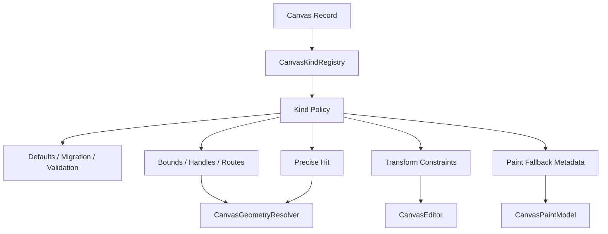

# feat: Deepen Canvas Kind Policy And Shape Utilities

## Summary

This plan evolves `CanvasKindRegistry` from validation and geometry hooks into a tldraw-style policy
boundary for per-kind geometry, hit testing, transform constraints, paint fallback, migration, and
interaction behavior. The goal is to let applications build Figma, draw.io, mind map, and note-card
experiences without forking the canvas core.

---

## Problem Frame

The canvas model intentionally stores `kind: String` plus flexible JSON payloads. That keeps import,
extension, and experimentation open, but the system needs one place where a kind's behavior lives.
Today validation, defaults, bounds, handle positions, routing, hit testing, paint fallback, and
future resize policy are still split across modules.

The next layer should borrow the idea of tldraw `ShapeUtil` without copying its renderer. A kind
handler should describe the contract for one record kind, while the core editor, runtime, and GPUI
adapter consume those policies through stable resolver APIs.

---

## Requirements

**Policy Coverage**

- R1. Node, edge, and shape kinds must be able to define defaults, migration, validation, bounds,
  precise hit testing, transform constraints, and paint fallback metadata.
- R2. Unknown kinds must continue to load and render with default behavior.
- R3. Registered kind policy must be used by document loading, transactions, runtime cache rebuilds,
  hit testing, transform gestures, and GPUI paint snapshots.
- R4. Policy APIs must avoid storing renderer-specific objects in document records.

**Extensibility**

- R5. Applications must be able to register policy for custom node, shape, and edge kinds without
  making `CanvasEditor` generic.
- R6. Policy errors must surface as typed schema errors at load or transaction time.
- R7. The registry must support future versioned payload migrations without forcing one global
  document migration per app-defined kind.

**Refactoring**

- R8. Duplicated endpoint, route, bounds, hit, preview, and paint fallback logic must move behind a
  unified resolver or policy path.
- R9. Obsolete ad hoc kind checks should be deleted once the registry path owns the behavior.

---

## Key Technical Decisions

- KTD1. **Keep data open and behavior registered:** document records keep `kind` and payload fields,
  while behavior comes from `CanvasKindRegistry`.
- KTD2. **Use policy structs instead of trait-object sprawl:** small policy structs with optional
  hooks keep common kinds cheap and avoid requiring every app to implement a large trait.
- KTD3. **Resolver remains the consumer boundary:** editor, runtime, hit testing, and paint should
  ask `CanvasGeometryResolver` or a sibling policy resolver instead of calling handlers directly.
- KTD4. **Policy can constrain transforms but not own gestures:** kind handlers can normalize or
  reject geometry; tool state remains in the editor.
- KTD5. **Migration stays record-local when possible:** app-defined payload upgrades should run on
  records of the matching kind without changing the global snapshot format.

---

## High-Level Technical Design

The registry should not become a renderer plugin system. It supplies declarative and callback-based
policy that core code can use while keeping batched rendering and runtime caches in canvas-owned
modules.

---

## Implementation Units

### U1. Kind Policy Surface

**Goal:** Extend kind handler types with explicit policy sections for geometry, transform, hit, and
paint fallback.

**Requirements:** R1, R2, R4, R5, R6.

**Files:**

- `crates/canvas/src/schema.rs`
- `crates/canvas/src/resolve.rs`
- `crates/canvas/src/lib.rs`

**Approach:** Split existing handler responsibilities into named policy fields. Preserve open
registry behavior for unknown kinds. Add typed errors for policy validation failures and avoid
public callbacks that require GPUI paint types.

**Test scenarios:**

- `crates/canvas/src/schema.rs`: unknown kinds load and validate with default policy.
- `crates/canvas/src/schema.rs`: registered kind defaults and migrations run before validation.
- `crates/canvas/src/schema.rs`: invalid transform policy output returns a typed schema error.
- `crates/canvas/src/resolve.rs`: resolver uses registered bounds and handle policies.

### U2. Unified Hit And Geometry Resolution

**Goal:** Route culling, hit testing, endpoint picking, previews, and paint-frame bounds through one
geometry policy path.

**Requirements:** R3, R8, R9.

**Files:**

- `crates/canvas/src/resolve.rs`
- `crates/canvas/src/index.rs`
- `crates/canvas/src/spatial_cache.rs`
- `crates/canvas/src/runtime.rs`
- `crates/canvas/src/gpui.rs`

**Approach:** Audit direct default-router or bounds calls and replace them with resolver methods.
Delete duplicate endpoint and edge-route calculations once tests prove parity.

**Test scenarios:**

- `crates/canvas/src/runtime.rs`: custom edge routes affect culling and hit testing.
- `crates/canvas/src/gpui.rs`: custom route and endpoint policy affects paint and preview.
- `crates/canvas/src/index.rs`: precise hit policy can reject a target inside coarse bounds.
- `crates/canvas/src/spatial_cache.rs`: cache materialization stays consistent with resolver output.

### U3. Transform Constraint Integration

**Goal:** Let kind policy clamp or reject resize, move, and future rotation results.

**Requirements:** R1, R3, R6.

**Files:**

- `crates/canvas/src/schema.rs`
- `crates/canvas/src/tool.rs`
- `crates/canvas/src/document.rs`

**Approach:** Add transform proposal types for nodes and shapes. The editor applies policy during
transaction preparation, so tools and command APIs share the same constraints.

**Test scenarios:**

- `crates/canvas/src/tool.rs`: resizing a constrained kind clamps to minimum dimensions.
- `crates/canvas/src/tool.rs`: moving a locked or policy-rejected record does not commit a partial
  mutation.
- `crates/canvas/src/document.rs`: transaction preparation reports policy errors before mutating the
  document.

### U4. Paint Fallback Metadata

**Goal:** Allow kinds to supply renderer-neutral fallback style hints used by GPUI batched paint.

**Requirements:** R1, R3, R4, R5.

**Files:**

- `crates/canvas/src/schema.rs`
- `crates/canvas/src/gpui.rs`
- `crates/canvas/README.md`

**Approach:** Add style or marker metadata that the GPUI adapter can convert into batched quads and
paths. Keep rich custom widgets outside this fallback path.

**Test scenarios:**

- `crates/canvas/src/gpui.rs`: registered shape paint fallback changes fill, stroke, or corner
  policy without changing document data.
- `crates/canvas/src/gpui.rs`: unknown kinds keep default rendering.
- `crates/canvas/README.md`: docs show registering a kind policy without a renderer plugin.

---

## Scope Boundaries

- The plan does not add a full custom widget host.
- The plan does not require a scripting or plugin runtime.
- The plan does not make `CanvasDocument` generic over payload types.
- The plan does not implement obstacle routing; it only ensures custom route policy is respected.

---

## System-Wide Impact

This change makes kind behavior a first-class extension boundary. It affects document loading,
transaction validation, geometry resolution, runtime cache materialization, GPUI paint snapshots,
and transform commands. It should shrink ad hoc logic and make future examples exercise one policy
system instead of many local conditionals.

---

## Risks & Dependencies

- **Risk: The policy surface becomes too large too early.** Mitigation: use optional policy fields
  and default behavior for unknown kinds.
- **Risk: Handler callbacks make deterministic persistence harder.** Mitigation: restrict callbacks
  to validation and derived behavior, not hidden document mutations.
- **Risk: GPUI details leak into the registry.** Mitigation: expose renderer-neutral style and
  geometry hints only.

---

## Sources / Research

- `repo-ref/tldraw/packages/editor/src/lib/editor/shapes/ShapeUtil.ts`
- `repo-ref/tldraw/packages/tlschema/src/shapes/TLBaseShape.ts`
- `repo-ref/xyflow/packages/system/src/types/nodes.ts`
- `docs/adr/0002-open-gpui-canvas-architecture.md`
- `crates/canvas/src/schema.rs`
- `crates/canvas/src/resolve.rs`
- `crates/canvas/src/gpui.rs`
