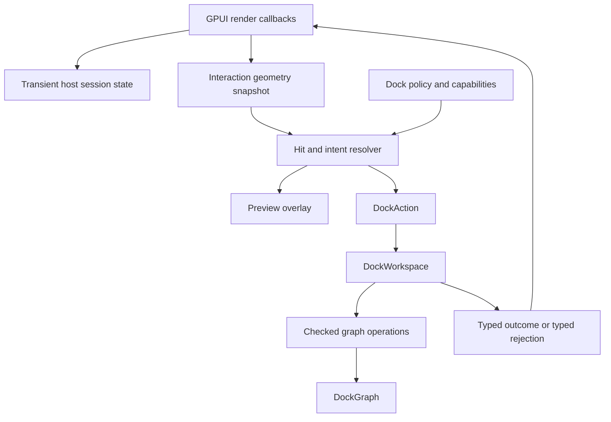
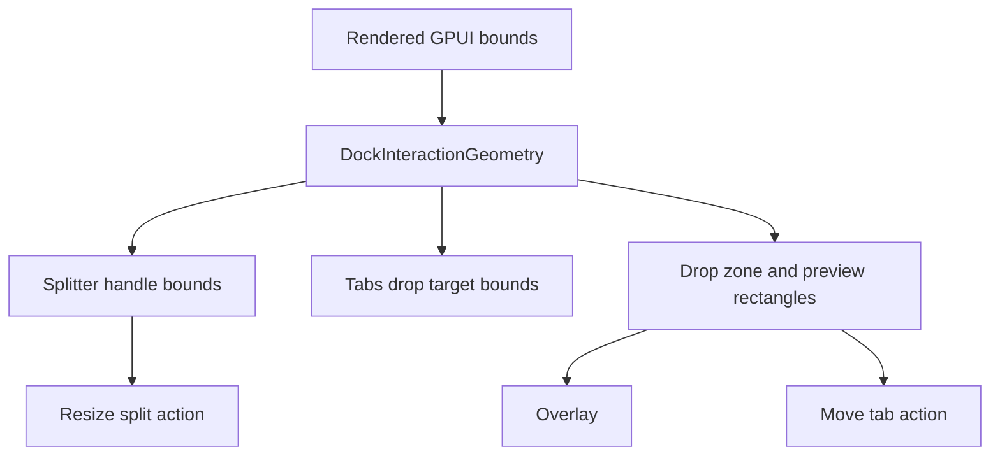

# refactor: Align docking interaction seams

## Summary

Tighten the interaction architecture around `DockWorkspace`, `DockAction`, shared geometry, policy checks, typed failures, and test instrumentation before adding the next docking capability. The immediate goal is not more surface area; it is making splitter resize, tab drag/drop, preview, and future floating behavior share one owner-first path.

---

## Problem Frame

The completed owner seam, splitter resize, and tab drag/drop phases prove the core model can render, resize, and move panels. They also left several seams intentionally thin. `DockHost` still exposes broad compatibility mutation methods, splitter resize still commits by applying `DockOp` from host state, drop resolution exists but preview geometry is not yet a shared artifact, and `DockGraph` still has raw mutation routes that are easy to bypass.

One external review point is partially stale: the tab drag payload and resolver modules already exist, and `DockAction::MoveTab` already commits tab drops through `DockWorkspace`. The still-valid part is that hover preview, hit resolution, and final commit should not grow separate geometry rules.

---

## Requirements

- R1. Keep `DockHost` as a retained GPUI render adapter with a narrower application-facing mutation surface.
- R2. Route user-triggered docking commits through `DockAction -> DockWorkspace`, including splitter resize.
- R3. Use one pure interaction geometry source for rendered split handles, tabs drop targets, hit-testing, and drop previews.
- R4. Make drag/drop hover preview and final commit consume the same resolved intent.
- R5. Add a policy and capability seam that can reject unsupported docking modes before preview or commit.
- R6. Reduce raw `DockGraph` mutation exposure and improve checked operation errors so failures are actionable.
- R7. Keep test/debug observability available without making debug selector storage part of production host state.
- R8. Preserve existing behavior for tab selection, splitter resize, center and edge tab drops, layout import/export, and native example rendering.
- R9. Keep `DockGraph` pure: no GPUI view, window, focus, drag session, or instrumentation state may enter graph storage.

---

## Scope Boundaries

In scope:

- Refactoring interaction seams and public surfaces in `open-gpui-docking`.
- Shared geometry and intent types for current splitters and tab drop targets.
- Minimal preview overlay plumbing for the already implemented tab drag/drop path.
- Capability and policy checks for current and near-term docking modes.
- Typed errors for action and operation paths touched by interactions.
- Test instrumentation cleanup needed to verify these contracts.

### Deferred to Follow-Up Work

- Tab reorder within the same tabs node.
- Dragging a whole tabs stack as a group.
- In-window floating chrome and floating drag.
- Platform-window detach, cross-window drag routing, and OS window mapping.
- Replacing every low-level graph builder API if doing so would block existing layout construction patterns.

Out of scope:

- Moving docking into `crates/gpui`.
- Changing GPUI platform-window ownership, focus semantics, or core event dispatch.
- Introducing a separate runtime scene graph outside the current GPUI render path.

---

## Key Technical Decisions

- KTD1. **Stabilize seams before expanding features:** The next phase should pay down interaction contract drift before adding floating, reorder, or cross-window behavior.
- KTD2. **Actions carry commit intent, not pointer mechanics:** Host state may track transient drag sessions, but committed docking changes should be represented as `DockAction` values applied by `DockWorkspace`.
- KTD3. **Geometry is a render-time snapshot with pure helpers:** Current GPUI flex layout is the source of rendered bounds. The shared geometry module should derive split handles, drop zones, and preview rectangles from those bounds rather than assuming serialized graph layout perfectly matches rendered pixels.
- KTD4. **Preview and commit share resolved intent:** The hover overlay should render from the same `DockDropIntent` that the drop handler commits, with policy rejection handled before both.
- KTD5. **Policy decorates interaction resolution:** Capability rules should live above graph mutation so unsupported modes never produce misleading previews or late generic graph failures.
- KTD6. **Compatibility shrink should be staged:** Public compatibility methods can remain briefly when they delegate inward, but tests and examples should stop depending on them as mutation surfaces.
- KTD7. **Graph checked errors should explain the failed invariant:** `OperationFailed` is acceptable only for legacy fallback; interaction-facing operations need typed rejection reasons.

---

## High-Level Technical Design

Interaction path after this refactor:

Geometry ownership:

The graph remains the pure data model. The host observes GPUI events and owns only transient sessions. The workspace owns policy, action application, panel registry, options, and graph coordination.

---

## Implementation Units

### U1. Narrow Host and Workspace Surfaces

**Goal:** Make owner-first APIs the normal application path and classify compatibility methods that still expose graph or registry internals.

**Requirements:** R1, R6, R8, R9

**Dependencies:** None

**Files:**

- `crates/gpui_docking/src/host.rs`
- `crates/gpui_docking/src/workspace.rs`
- `crates/gpui_docking/src/lib.rs`
- `crates/gpui_docking/src/host_tests.rs`
- `crates/gpui_docking/src/tests.rs`
- `examples/docking-native/src/main.rs`

**Approach:** Audit `DockHost` public methods and move application setup toward `DockWorkspace`. Keep read access that is needed for rendering and application inspection, but demote direct mutation helpers to crate-private, test-only, builder-only, or documented compatibility paths where possible. Convert tests and the native example away from `DockHost` mutation methods so future API narrowing does not fight the test suite.

**Patterns to follow:** `DockHost::from_workspace`, `DockWorkspace::register_panel_view`, existing owner-first tests in `crates/gpui_docking/src/host_tests.rs`.

**Test scenarios:**

- Constructing a host from a configured workspace still renders the active panel.
- Existing native example setup can register panels without mutating `DockHost` after mount.
- Public host mutation methods that remain are covered as compatibility delegates, not the preferred path.
- Crate tests can still inspect rendered state without requiring application-facing graph mutation.

**Verification:** Application-facing usage reads as workspace setup followed by host rendering; host no longer appears to be the main mutation owner.

### U2. Route Splitter Resize Through DockAction

**Goal:** Move splitter resize commits behind the same action seam used by tab selection and tab move.

**Requirements:** R2, R6, R8, R9

**Dependencies:** U1

**Files:**

- `crates/gpui_docking/src/action.rs`
- `crates/gpui_docking/src/host.rs`
- `crates/gpui_docking/src/render.rs`
- `crates/gpui_docking/src/splitter.rs`
- `crates/gpui_docking/src/op.rs`
- `crates/gpui_docking/src/host_tests.rs`

**Approach:** Add an action variant for resize commits, likely carrying the target split and normalized fractions computed by `splitter.rs`. Keep pointer start, current position, and initial fractions as transient host session data. `DockWorkspace` should validate the resize action and apply checked graph mutation, returning changed, unchanged, or typed failure.

**Patterns to follow:** `DockAction::SelectTab`, `DockAction::MoveTab`, `splitter::resize_adjacent_fractions`, `DockOp::SetSplitFractions`.

**Test scenarios:**

- Applying a resize action with valid normalized fractions updates the split and reports changed.
- Reapplying the same effective fractions reports unchanged or preserves the graph without spurious failure.
- Invalid split id returns a typed action or operation error.
- Mismatched fraction length returns a typed error and leaves the graph unchanged.
- Rendered horizontal and vertical splitter drags still update child bounds.
- Mouse-up still clears the transient splitter drag session.

**Verification:** No rendered splitter code directly commits `DockOp`; it computes resize data and asks the workspace to apply an action.

### U3. Introduce Shared Interaction Geometry

**Goal:** Create a single pure geometry source for splitter handles, tabs targets, drop zones, and preview rectangles.

**Requirements:** R3, R4, R8, R9

**Dependencies:** U2

**Files:**

- `crates/gpui_docking/src/geometry.rs`
- `crates/gpui_docking/src/drop_target.rs`
- `crates/gpui_docking/src/splitter.rs`
- `crates/gpui_docking/src/render.rs`
- `crates/gpui_docking/src/graph.rs`
- `crates/gpui_docking/src/lib.rs`
- `crates/gpui_docking/src/host_tests.rs`
- `crates/gpui_docking/src/tests.rs`

**Approach:** Extract reusable geometry types that accept rendered bounds and pure options, then derive handle bounds, target hit zones, and preview rectangles from the same values. Keep `DockGraph::compute_layout` as pure model layout unless implementation proves it can be safely unified with rendered bounds. The key contract is that render hit-testing and preview use the same geometry helpers.

**Patterns to follow:** `DockGraph::compute_layout`, `splitter::handle_bounds`, `drop_target::resolve_tabs_drop`, current debug bounds assertions in visual tests.

**Test scenarios:**

- Splitter handle bounds from the shared geometry helper match current rendered handle hit areas.
- Center and edge drop zones resolve exactly as current `drop_target` tests expect.
- Preview rectangles for left, right, top, bottom, and center zones are derived from the same resolved target bounds.
- Small targets still preserve a center zone and produce non-negative preview rectangles.
- Non-finite or zero-size bounds produce no interaction target rather than panicking.

**Verification:** `render.rs` no longer owns independent geometry formulas for handles, drop zones, or preview rectangles.

### U4. Complete Drop Intent and Preview Pipeline

**Goal:** Close the remaining tab drag/drop gap by using one resolved intent for hover state, preview overlay, and final commit.

**Requirements:** R3, R4, R5, R8

**Dependencies:** U3

**Files:**

- `crates/gpui_docking/src/drop_target.rs`
- `crates/gpui_docking/src/drag.rs`
- `crates/gpui_docking/src/render.rs`
- `crates/gpui_docking/src/action.rs`
- `crates/gpui_docking/src/host.rs`
- `crates/gpui_docking/src/host_tests.rs`

**Approach:** Extend the drop resolver so it returns enough information for both visual preview and commit, including target tabs, zone, preview rectangle, and rejection state when policy blocks a target. Render the overlay from the stored intent. On drop, commit only the last valid intent that belongs to the target, then clear hover state in all drop exit paths.

**Patterns to follow:** Existing `DockDropIntent`, `DockTabDragPayload`, `DockAction::MoveTab`, and tab drag visual tests.

**Test scenarios:**

- Drag hover over a target center records an intent whose preview and commit zone are both center.
- Drag hover over each edge records the matching zone and preview rectangle.
- Dropping with no current valid intent does not mutate graph state and clears hover state.
- Same-stack center hover can preview as a no-op or be hidden according to the chosen policy, but commit remains unchanged.
- Center and edge visual drag tests still pass after overlay wiring.

**Verification:** There is no separate hover-zone calculation in render code that can disagree with commit intent.

### U5. Add Policy and Capability Seam

**Goal:** Make supported docking operations explicit and reject unsupported targets before preview or commit.

**Requirements:** R5, R6, R8, R9

**Dependencies:** U3, U4

**Files:**

- `crates/gpui_docking/src/policy.rs`
- `crates/gpui_docking/src/workspace.rs`
- `crates/gpui_docking/src/host.rs`
- `crates/gpui_docking/src/drop_target.rs`
- `crates/gpui_docking/src/action.rs`
- `crates/gpui_docking/src/lib.rs`
- `crates/gpui_docking/src/host_tests.rs`

**Approach:** Introduce a small policy or capability type owned by `DockWorkspace`, with defaults that preserve current behavior. Start with rules that matter to existing interactions: allow center merge, allow edge split, allow same-stack no-op, allow splitter resize, and keep floating disabled in this phase. The resolver should include policy results so previews do not advertise blocked operations.

**Patterns to follow:** `DockHostOptions` for workspace-owned configuration, `DockActionApplyError` for typed rejections.

**Test scenarios:**

- Default policy preserves current center drop, edge drop, and splitter resize behavior.
- Disabling edge split prevents edge preview and returns a typed rejection if commit is attempted.
- Disabling center merge prevents center preview and returns a typed rejection if commit is attempted.
- Disabling splitter resize prevents resize action commits without corrupting fractions.
- Floating remains disabled or deferred without producing a fake drop preview.

**Verification:** Capability decisions are made before graph mutation and are visible to both preview and commit paths.

### U6. Tighten Graph Mutation and Checked Errors

**Goal:** Reduce bypassable graph mutation paths and replace generic failures with interaction-relevant typed errors.

**Requirements:** R6, R8, R9

**Dependencies:** U2, U5

**Files:**

- `crates/gpui_docking/src/graph.rs`
- `crates/gpui_docking/src/op.rs`
- `crates/gpui_docking/src/workspace.rs`
- `crates/gpui_docking/src/action.rs`
- `crates/gpui_docking/src/builder.rs`
- `crates/gpui_docking/src/tests.rs`
- `crates/gpui_docking/src/host_tests.rs`

**Approach:** Keep builder and import paths able to construct graphs, but narrow raw mutation APIs that are not meant for application code. Improve `apply_op_checked` for operations used by interactions, especially move item, resize split, target-not-in-space, target-not-tabs, source item missing, invalid fractions, and policy rejection. Leave untouched operation variants as legacy only when refactoring them would exceed this plan's scope.

**Patterns to follow:** Existing `DockOpApplyError` variants for tab selection and the canonicalization checks in pure graph tests.

**Test scenarios:**

- Moving an item from a missing source space returns source-item-not-found with no mutation.
- Moving to a target not contained by the target space returns target-not-in-space with no mutation.
- Center drop onto a non-tabs node returns target-not-tabs with no mutation.
- Resizing a missing split returns split-not-found with no mutation.
- Resizing with fraction length mismatch returns invalid-fractions with no mutation.
- Existing pure graph movement and floating tests still preserve canonical graph invariants.

**Verification:** Interaction-facing errors no longer collapse into a generic operation failure for common invalid inputs.

### U7. Separate Debug Instrumentation From Production State

**Goal:** Preserve visual test observability while preventing debug selector storage from shaping production host state.

**Requirements:** R7, R8, R9

**Dependencies:** U1, U3, U4

**Files:**

- `crates/gpui_docking/src/debug.rs`
- `crates/gpui_docking/src/host.rs`
- `crates/gpui_docking/src/render.rs`
- `crates/gpui_docking/src/host_tests.rs`
- `crates/gpui_docking/src/lib.rs`

**Approach:** Move selector recording behind a crate-private test observer or render instrumentation helper. Keep region IDs stable for visual tests, but make production callers unaware of selector maps. If render code still needs to emit debug selectors, treat recording as optional instrumentation rather than host business state.

**Patterns to follow:** Current `DockDebugRegion`, `DockDebugInstrumentation`, and `selector_for` helper usage.

**Test scenarios:**

- Visual tests can still resolve host, tab, split child, splitter handle, panel, missing panel, and deferred floating regions.
- Redraw clears stale selector state or replaces it through the observer.
- Production-facing constructors and owner APIs do not expose debug selector mutation.
- Drop preview instrumentation can be observed in tests without becoming public API.

**Verification:** Debug state can be disabled or compiled away from production-facing behavior without changing docking semantics.

---

## System-Wide Impact

This refactor affects the main extension points of `open-gpui-docking`: public host construction, workspace-owned actions, graph mutation, render hit-testing, and visual-test observability. It should reduce the risk of future feature work adding parallel interaction rules. The main downstream concern is public API churn for callers that currently mutate `DockHost` or `DockGraph` directly.

---

## Risks & Dependencies

- **API compatibility risk:** Narrowing public methods may affect local examples or external callers. Mitigate with staged compatibility delegates and clear tests that exercise the preferred workspace path.
- **Geometry mismatch risk:** GPUI-rendered flex bounds may differ from pure graph layout. Mitigate by making render-time bounds the interaction source and keeping `compute_layout` as a model helper until parity is proven.
- **Over-broad policy risk:** A policy seam can become a vague options bag. Mitigate by starting only with rules required by current interactions.
- **Error churn risk:** Replacing `OperationFailed` everywhere could expand the change too far. Mitigate by typing errors for interaction paths first and deferring untouched legacy variants.
- **Test fragility risk:** Moving debug instrumentation can break visual tests without behavioral regressions. Mitigate by preserving stable `DockDebugRegion` concepts during the transition.

---

## Acceptance Examples

- AE1. When a user drags a splitter handle, the rendered panes resize and the commit path is represented as a workspace action rather than a direct host graph operation.
- AE2. When a user drags a tab over the right edge of another tab stack, the preview rectangle and the eventual `MoveTab` action both use the same right-edge intent.
- AE3. When edge splitting is disabled by policy, hovering over an edge does not show an edge split preview, and a forced commit returns a typed rejection without mutating the graph.
- AE4. When an invalid tab move targets a node outside the target space, the error identifies the target-space mismatch and the graph remains unchanged.
- AE5. When visual tests query docking regions, they can still locate rendered regions without production callers depending on debug selector storage.

---

## Sources & Research

- `docs/plans/2026-06-08-004-refactor-complete-docking-owner-seam-plan.md`
- `docs/plans/2026-06-08-005-feat-docking-splitter-resize-plan.md`
- `docs/plans/2026-06-08-006-feat-docking-tab-drag-drop-plan.md`
- `crates/gpui_docking/src/host.rs`
- `crates/gpui_docking/src/action.rs`
- `crates/gpui_docking/src/render.rs`
- `crates/gpui_docking/src/splitter.rs`
- `crates/gpui_docking/src/drop_target.rs`
- `crates/gpui_docking/src/graph.rs`
- `crates/gpui_docking/src/op.rs`
- `crates/gpui_docking/src/workspace.rs`
- `crates/gpui_docking/src/host_tests.rs`
- External reviewer feedback summarized in the planning prompt.
