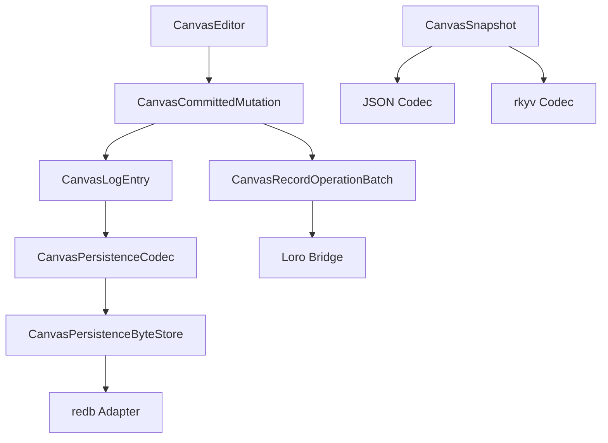

# feat: Add Canvas Local-First Persistence Adapters

## Summary

This plan adds the first concrete local-first adapter layer for `open-gpui-canvas`: redb-backed
durability, rkyv snapshot codecs, and a Loro operation bridge. The work should start only after the
editor command and kind-policy surfaces are stable enough that persisted operations represent real
product behavior.

---

## Problem Frame

The canvas crate already has checkpoints, monotonic logs, codecs, byte stores, and adapter feature
names. Those boundaries are useful, but the optional adapters are not implemented. Before exposing
local-first workflows, the crate needs concrete storage and collaboration bridges that consume the
same committed mutation semantics as the editor, undo/redo, and persistence helpers.

This is not just a dependency task. redb, rkyv, and Loro each impose different data lifecycle
constraints, so adapters must remain optional and must not force every canvas user into one storage
or collaboration model.

---

## Requirements

**redb Store**

- R1. A `redb-store` feature must provide a local byte store implementation for checkpoints and
  sequence-keyed log entries.
- R2. The redb adapter must preserve monotonic replay semantics and checkpoint compaction behavior.
- R3. Store errors must map into existing persistence error types without leaking database internals
  into editor APIs.

**rkyv Snapshot Codec**

- R4. A `rkyv-snapshot` feature must provide a zero-copy-oriented codec boundary for checkpoints
  and log entries where the record format is stable enough.
- R5. rkyv support must not replace the JSON codec as the default in 0.1.
- R6. Codec envelopes must still carry document format and codec version information.

**Loro CRDT Bridge**

- R7. A `loro-crdt` feature must translate committed record operation batches into a Loro document
  representation without bypassing `CanvasEditor`.
- R8. The bridge must distinguish command intent from actual document semantics, including implicit
  incident edge deletion.
- R9. Conflict and merge behavior must be covered by deterministic tests before public examples
  claim collaboration support.

---

## Key Technical Decisions

- KTD1. **Adapters consume committed mutations:** persistence and CRDT bridges should use the
  mutation journal output, not raw tool events or runtime cache changes.
- KTD2. **Feature gates stay honest:** enabling a feature means the adapter exists and is tested;
  placeholder status should be removed when implementation lands.
- KTD3. **JSON remains the baseline codec:** rkyv is an optional performance path, not a mandatory
  format migration.
- KTD4. **CRDT is an adapter, not the document model:** `CanvasDocument` remains the canonical local
  model; Loro maps to and from operation batches.
- KTD5. **Durability and collaboration are separate:** redb can store local checkpoints and logs
  without requiring Loro, and Loro can be tested in memory without redb.

---

## High-Level Technical Design

The adapters should attach to the existing byte-store and operation-batch seams. None of them should
own editor state or runtime cache state.

---

## Implementation Units

### U1. redb Byte Store

**Goal:** Implement a feature-gated redb-backed byte store for checkpoints and logs.

**Requirements:** R1, R2, R3.

**Files:**

- `crates/canvas/src/persistence/redb_store.rs`
- `crates/canvas/src/persistence/mod.rs`
- `crates/canvas/src/persistence/store.rs`
- `crates/canvas/Cargo.toml`

**Approach:** Store one latest checkpoint and sequence-keyed log bytes in separate redb tables.
Reuse `CanvasPersistenceByteStoreAdapter` for typed persistence.

**Test scenarios:**

- `crates/canvas/src/persistence/redb_store.rs`: appending log entries and saving checkpoints
  survive reopening the database.
- `crates/canvas/src/persistence/redb_store.rs`: compaction removes entries through the checkpoint
  sequence.
- `crates/canvas/src/persistence/tests.rs`: redb adapter passes the same replay tests as memory
  store when the feature is enabled.

### U2. rkyv Codec

**Goal:** Add an optional snapshot and log-entry codec that can be benchmarked against JSON.

**Requirements:** R4, R5, R6.

**Files:**

- `crates/canvas/src/persistence/rkyv_codec.rs`
- `crates/canvas/src/persistence/mod.rs`
- `crates/canvas/src/persistence/store.rs`
- `crates/canvas/Cargo.toml`

**Approach:** Keep the envelope contract and add compatibility tests before treating the codec as a
recommended path. If record types require serialization adjustments, keep them localized and avoid
changing public document semantics.

**Test scenarios:**

- `crates/canvas/src/persistence/rkyv_codec.rs`: checkpoints encode and decode with versioned
  envelopes.
- `crates/canvas/src/persistence/rkyv_codec.rs`: log entries preserve sequence, metadata, and actual
  record operation batches.
- `crates/canvas/benches/large_canvas.rs`: codec benchmark compares JSON and rkyv paths.

### U3. Loro Operation Bridge

**Goal:** Translate committed canvas mutations into a Loro document and reconstruct canvas snapshots
  from that state.

**Requirements:** R7, R8, R9.

**Files:**

- `crates/canvas/src/persistence/loro_crdt.rs`
- `crates/canvas/src/persistence/mod.rs`
- `crates/canvas/src/journal.rs`
- `crates/canvas/Cargo.toml`

**Approach:** Start with deterministic single-writer translation, then add conflict tests. Store
record maps by stable IDs and apply committed operation batches so implicit deletes are visible.

**Test scenarios:**

- `crates/canvas/src/persistence/loro_crdt.rs`: adding, updating, and deleting records round-trip
  through Loro state.
- `crates/canvas/src/persistence/loro_crdt.rs`: deleting a node also removes incident edges in the
  CRDT view.
- `crates/canvas/src/persistence/loro_crdt.rs`: two peer updates merge deterministically for
  disjoint records.

### U4. Adapter Documentation And Feature Status

**Goal:** Replace placeholder adapter status with implemented feature reports and usage docs.

**Requirements:** R1, R4, R7.

**Files:**

- `crates/canvas/README.md`
- `docs/adr/0002-open-gpui-canvas-architecture.md`
- `CHANGELOG.md`

**Approach:** Document adapter guarantees and limitations. Do not market real-time collaboration
until Loro conflict tests cover it.

**Test scenarios:**

- `crates/canvas/README.md`: redb, rkyv, and Loro snippets compile or are clearly marked as
  conceptual where compile coverage is not practical.
- `CHANGELOG.md`: feature additions and limitations are recorded for the release.

---

## Scope Boundaries

- The plan does not make redb, rkyv, or Loro default dependencies.
- The plan does not add networking, presence, auth, or cloud sync.
- The plan does not replace JSON checkpoints as the default codec.
- The plan does not expose CRDT internals through `CanvasEditor`.

---

## System-Wide Impact

This change affects package features, persistence guarantees, replay behavior, and future local-first
examples. It should keep the core editor and document model storage-agnostic while proving the
adapter seams are deep enough for real local persistence and collaboration bridges.

---

## Risks & Dependencies

- **Risk: Adapter dependencies increase compile cost.** Mitigation: keep features optional and CI
  matrixed.
- **Risk: rkyv requires intrusive type changes.** Mitigation: keep JSON default and defer rkyv parts
  that would destabilize the public record model.
- **Risk: Loro conflict semantics are under-specified.** Mitigation: start with deterministic
  operation translation and add collaboration claims only after merge tests pass.

---

## Sources / Research

- `crates/canvas/src/persistence/store.rs`
- `crates/canvas/src/persistence/tests.rs`
- `docs/adr/0002-open-gpui-canvas-architecture.md`
- `docs/plans/2026-06-08-004-feat-canvas-product-editing-interactions-plan.md`
- `docs/plans/2026-06-08-005-feat-canvas-kind-policy-and-shape-utils-plan.md`
