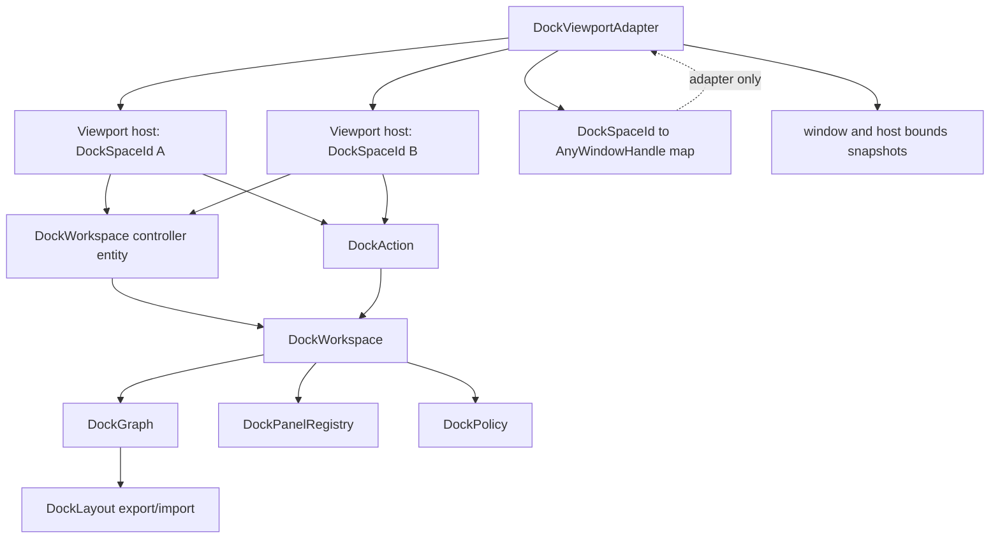
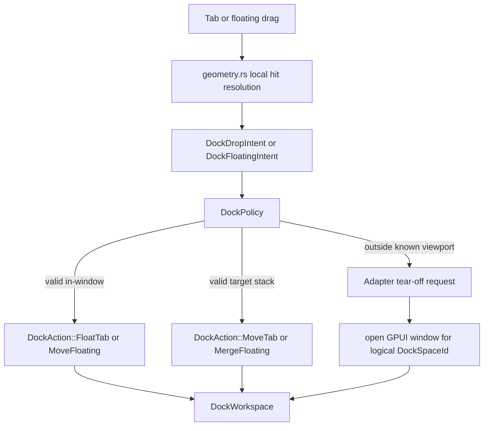

# feat: Add docking floating multi-viewport adapter

## Summary

Add the next docking architecture layer after the interaction seam work: usable floating behavior and a platform-window adapter that can map logical dock spaces to GPUI windows without moving platform state into `DockGraph`. The plan should preserve the owner-first `DockWorkspace` path, reuse current geometry and intent seams, and characterize GPUI cross-window drag behavior before relying on it.

---

## Problem Frame

The latest external review is directionally right: the project should not put OS-window, focus, or multi-viewport lifecycle into the pure graph. That warning remains load-bearing. Two parts of the review are now partly stale after the completed interaction seam work: `DockHost` no longer exposes the broad `graph_mut` and panel mutation surface described in the review, and drop/preview geometry now goes through `geometry.rs` plus a resolved `DockDropIntent`.

The remaining architecture risk is sharper now. `DockHost` is a narrower adapter, but it still owns a `DockWorkspace` by value. That is sufficient for one window and one rendered dock space. It is not sufficient for multiple windows unless the next phase introduces a shared owner shape or another explicit state-sharing contract. The graph also already has in-window floating data and operations, but those operations are not yet exposed as `DockAction` variants and the rendered host still treats floating as deferred UI.

Zed's workspace implementation is useful as an application-layer reference, not as a graph model to copy. Zed's `Workspace` is effectively a window-root owner: it owns the center pane group, side docks, pane list, active pane, and persistence hooks, while each `Pane` keeps a weak workspace reference and delegates split/drop mutations back to the owner. Zed also stores window stack and window bounds outside the pane tree. That supports this plan's controller and adapter boundary, but the generic docking crate should stay more data-oriented than Zed's stateful item-handle model.

This phase should therefore move from "interaction seams" to "viewport ownership seams": keep `DockGraph` pure, make floating actions owner-first, render in-window floating from existing graph data, then add a platform adapter that owns `DockSpaceId -> WindowHandle` mapping and screen/local coordinate conversion.

---

## Requirements

- R1. Keep `DockGraph`, `DockOp`, and `DockLayout` free of GPUI `WindowHandle`, `WindowId`, focus state, display state, drag session state, and panel view state.
- R2. Support multiple rendered viewport hosts acting on one logical workspace owner without cloning divergent graph state.
- R3. Keep `DockSpaceId` as a logical dock space identifier, not an OS-window identifier.
- R4. Route floating, floating-bounds, raise, and merge commits through `DockAction -> DockWorkspace`.
- R5. Preserve policy gates so disabled floating interactions reject before preview or commit.
- R6. Render in-window floating containers from the existing graph floating data, including panel content, bounds, z-order, drag, and merge-back hooks.
- R7. Put `DockSpaceId -> AnyWindowHandle` and display/window bounds in an adapter-owned map outside graph persistence.
- R8. Define screen-to-host and host-to-screen coordinate conversion for drop and floating intents, with DPI/display assumptions documented in tests.
- R9. Characterize GPUI cross-window drag/drop behavior before making cross-window docking depend on it.
- R10. Preserve existing single-window `DockHost::from_workspace` compatibility and native example behavior.

---

## Scope Boundaries

In scope:

- Shared workspace owner and viewport-host adapter shape for multiple GPUI windows.
- Floating-related `DockAction` variants and policy validation.
- Rendering and interaction for in-window floating containers already represented by `DockGraph`.
- A platform adapter skeleton that owns dock space to window mapping and opens or closes GPUI windows.
- Coordinate conversion helpers for host-local, window, and screen bounds.
- Characterization tests for cross-window drag/drop and release-outside-window behavior.
- Updates to `examples/docking-native` that demonstrate the adapter without making it a polished product shell.

Deferred to later:

- Full production tear-off UX with polished window chrome and platform-specific window decorations.
- Persisting OS-window placement, monitor affinity, or restore policies in user settings.
- Tab reorder and whole-tab-stack drag if they would distract from viewport ownership.
- Cross-monitor DPI edge cases beyond one explicit conversion contract and a documented follow-up risk.
- Deep changes to GPUI platform drag dispatch unless characterization proves the adapter cannot work without them.

Out of scope:

- Storing `AnyWindowHandle`, `WindowId`, `DisplayId`, or focus handles in `DockGraph` or `DockLayout`.
- Treating one `DockSpaceId` as exactly one platform window in the core model.
- Replacing the existing panel registry with platform-window-owned view storage.
- Moving docking into `crates/gpui`.

---

## Key Technical Decisions

- KTD1. **Add a shared owner before adding real multi-window behavior:** A platform adapter needs more than a map. Multiple viewport hosts must dispatch to one workspace owner or they will render divergent graph copies.
- KTD2. **Keep `DockSpaceId` logical:** The adapter may associate a space with a GPUI window handle, but the graph and layout must continue to work for embedded hosts, in-window floating, and future non-window viewports.
- KTD3. **Promote existing floating ops through actions:** `DockOp::FloatItemInWindow`, `SetFloatingBounds`, `RaiseFloating`, and `MergeFloatingInto` already describe pure graph changes. UI commits should expose those through `DockAction` with policy checks.
- KTD4. **Render in-window floating before depending on OS tear-off:** Existing graph data can prove floating chrome, z-order, bounds updates, and merge-back without adding platform-window lifecycle first.
- KTD5. **Adapter owns window state and coordinate snapshots:** The adapter should store `AnyWindowHandle`, window bounds, display id when available, and host bounds snapshots. The graph should store only logical roots and in-window floating bounds.
- KTD6. **Characterization precedes cross-window reliance:** GPUI keeps active drag state at the app level, but drop dispatch depends on target-window hitboxes and mouse-up events. Tests should prove the exact behavior before feature logic depends on it.
- KTD7. **Compatibility remains staged:** `DockHost::from_workspace` should keep single-window users working while new multi-viewport APIs introduce the shared-owner path.
- KTD8. **Use Zed as an owner and lifecycle reference, not as the graph API:** Zed validates owner-delegated pane mutation, weak references from panes to workspace, and separate window persistence. It should not pull `ItemHandle`, focus, or window-root assumptions into `DockGraph`.

---

## High-Level Technical Design

Floating and tear-off boundary:

The graph remains the source of truth for docking structure. The adapter owns platform windows, target-window lookup, and coordinate conversion. The workspace owns policy, panel registry, graph mutation, and action outcomes.

---

## Implementation Units

### U1. Shared Workspace Controller And Viewport Host

**Goal:** Introduce a multi-viewport owner shape so more than one rendered host can observe and mutate the same `DockWorkspace`.

**Requirements:** R1, R2, R3, R10

**Dependencies:** None

**Files:**

- `crates/gpui_docking/src/controller.rs`
- `crates/gpui_docking/src/host.rs`
- `crates/gpui_docking/src/workspace.rs`
- `crates/gpui_docking/src/render.rs`
- `crates/gpui_docking/src/lib.rs`
- `crates/gpui_docking/src/host_tests.rs`
- `examples/docking-native/src/main.rs`

**Approach:** Add a shared owner type around `DockWorkspace`, likely as a GPUI entity or a small controller that viewport hosts can reference. Keep the existing value-owned `DockHost::from_workspace` path as compatibility, but add a new host construction path where a host renders one `DockSpaceId` from the shared controller. Host event callbacks should apply actions through the controller, then notify affected hosts. Borrow Zed's pattern of child panes delegating mutations to a workspace owner through weak references, while avoiding Zed's one-window-one-workspace assumption for the generic graph.

**Execution note:** Start with characterization or small proof tests around rendering two hosts from one owner before changing the public constructor shape.

**Patterns to follow:** `Context::observe`, `Context::read_entity`, `Context::update_entity`, Zed's workspace-owner and pane-delegation pattern from the local reference snapshot, `crates/gpui/examples/move_entity_between_windows.rs`, and existing `DockHost::from_workspace` tests.

**Test scenarios:**

- Two viewport hosts backed by one owner both observe a tab selection action applied from either host.
- A tab move action in one host mutates the shared graph once, not a cloned host-local graph.
- The existing `DockHost::from_workspace` compatibility constructor still renders and applies actions in a single-window test.
- Panel registry entries remain owner-owned and are not duplicated per viewport host.
- Layout export from the shared owner contains graph state only and no viewport/window handles.

**Verification:** Multi-viewport rendering has one workspace owner and no copied graph state hidden inside each platform window.

### U2. Floating Actions And Policy Validation

**Goal:** Promote existing floating graph operations to owner-first actions with typed policy and graph failures.

**Requirements:** R1, R4, R5, R10

**Dependencies:** U1

**Files:**

- `crates/gpui_docking/src/action.rs`
- `crates/gpui_docking/src/policy.rs`
- `crates/gpui_docking/src/workspace.rs`
- `crates/gpui_docking/src/op.rs`
- `crates/gpui_docking/src/graph.rs`
- `crates/gpui_docking/src/tests.rs`
- `crates/gpui_docking/src/host_tests.rs`

**Approach:** Add action variants for floating one tab, updating floating bounds, raising a floating container, and merging a floating container into tabs. Reuse the existing graph operations where they already express the pure mutation. Apply `DockPolicy::validate_floating` before producing previews or commits. Tighten checked errors only for the floating operations touched here.

**Patterns to follow:** `DockAction::MoveTab`, `DockAction::ResizeSplit`, `DockOp::FloatItemInWindow`, `DockOp::SetFloatingBounds`, `DockOp::RaiseFloating`, `DockOp::MergeFloatingInto`.

**Test scenarios:**

- With floating enabled, floating item `a` creates one floating container in the target dock space and removes the item from its source tabs.
- With floating disabled, the same action returns `DockPolicyError::FloatingDisabled` and leaves the graph unchanged.
- Updating floating bounds changes only the matching floating container and reports changed.
- Raising an already topmost floating container preserves state and reports unchanged or a valid no-op.
- Merging a floating container into target tabs moves its items and removes the floating container.
- Invalid floating node ids return typed graph errors rather than generic operation failure where practical.

**Verification:** Render and adapter code can express floating commits without calling `DockOp` directly.

### U3. Render In-Window Floating Containers

**Goal:** Replace the deferred floating placeholder with actual in-window floating rendering backed by graph floating containers.

**Requirements:** R1, R4, R5, R6, R10

**Dependencies:** U1, U2

**Files:**

- `crates/gpui_docking/src/floating.rs`
- `crates/gpui_docking/src/render.rs`
- `crates/gpui_docking/src/host.rs`
- `crates/gpui_docking/src/geometry.rs`
- `crates/gpui_docking/src/debug.rs`
- `crates/gpui_docking/src/lib.rs`
- `crates/gpui_docking/src/host_tests.rs`
- `examples/docking-native/src/main.rs`

**Approach:** Render the normal dock root, then render `graph.floating_containers(space)` as absolute overlays in stored z-order. A floating frame should render its child subtree through the same recursive render path, expose a drag handle for moving bounds, raise on interaction, and reuse existing drop resolution when merging back into a tabs target. Keep any floating chrome state in the host/controller, not in graph nodes.

**Patterns to follow:** Existing recursive `DockHost::render_node`, debug regions in `DockDebugRegion`, splitter transient drag state, and `DockGraph::floating_containers`.

**Test scenarios:**

- A graph with one floating container renders the registered panel view inside the floating bounds.
- Floating containers render above the root dock tree and respect z-order after a raise action.
- Dragging a floating frame updates `DockFloatingContainer.bounds` through a `DockAction`.
- Dropping or committing merge-back moves floating items into the target tabs and removes the overlay.
- Missing floating child nodes render a test-visible placeholder without panicking.
- Existing root tabs, split rendering, splitter resize, and tab drag/drop visual tests still pass.

**Verification:** In-window floating is usable in the native example without introducing platform windows.

### U4. Viewport Adapter And Window Mapping

**Goal:** Add an adapter-owned mapping between logical dock spaces and GPUI windows.

**Requirements:** R1, R3, R7, R8, R10

**Dependencies:** U1, U3

**Files:**

- `crates/gpui_docking/src/viewport.rs`
- `crates/gpui_docking/src/controller.rs`
- `crates/gpui_docking/src/host.rs`
- `crates/gpui_docking/src/lib.rs`
- `crates/gpui_docking/src/host_tests.rs`
- `examples/docking-native/src/main.rs`

**Approach:** Introduce a `DockViewportAdapter` or equivalent owner-side helper that tracks which `DockSpaceId` is currently rendered by which `AnyWindowHandle`, plus the last known window bounds and host bounds. Provide APIs to register the primary viewport, open a new viewport window for a logical dock space, unregister a closed window, and look up the host-local bounds snapshot for hit resolution. The adapter may use `AnyWindowHandle`, `WindowOptions`, `WindowBounds`, and `DisplayId`; these must not appear in graph or layout DTOs. Mirror Zed's separation between pane/workspace structure and app-session window stack or window-bounds persistence.

**Patterns to follow:** `App::open_window`, `WindowOptions`, `WindowBounds`, `Window::bounds`, `Window::window_handle`, `crates/gpui/examples/window_positioning.rs`, and `examples/docking-native/src/main.rs`.

**Test scenarios:**

- Registering a viewport records its logical space and window handle in the adapter map.
- Opening a secondary viewport creates a GPUI window whose host renders from the shared workspace owner.
- Closing or removing a viewport unregisters the window mapping without deleting graph roots.
- Adapter state can report known spaces and bounds, but `DockGraph::export_layout` still serializes no window handles.
- Reopening a viewport for an existing dock space reuses or replaces the mapping according to one documented rule.
- Window stack or bounds persistence, if added in this phase, lives in adapter/example state rather than `DockLayout`.

**Verification:** Platform-window lifecycle is observable and testable outside the pure graph.

### U5. Coordinate Conversion And Cross-Viewport Drop Characterization

**Goal:** Define how drag positions move between host-local, window, and screen coordinate spaces, then prove or document GPUI cross-window drop behavior.

**Requirements:** R1, R3, R7, R8, R9

**Dependencies:** U4

**Files:**

- `crates/gpui_docking/src/geometry.rs`
- `crates/gpui_docking/src/drop_target.rs`
- `crates/gpui_docking/src/drag.rs`
- `crates/gpui_docking/src/viewport.rs`
- `crates/gpui_docking/src/render.rs`
- `crates/gpui_docking/src/host_tests.rs`

**Approach:** Add pure helpers that convert a screen or window point into a viewport host-local point using the adapter's bounds snapshots. Then add characterization tests for the current GPUI behavior: active drag lifetime across windows, target-window `on_drag_move`, target-window `on_drop`, and mouse-up outside known targets. If cross-window `on_drop` is not reliable, route the first tear-off behavior through an adapter-managed release outside known dock targets rather than pretending target-window drops already work.

**Execution note:** Characterization-first. Write tests that capture current GPUI behavior before adding adapter fallback logic.

**Patterns to follow:** `DragMoveEvent`, `AnyDrag`, `on_drag_move`, `on_drop`, `VisualTestContext::simulate_mouse_*`, `crates/gpui/examples/drag_drop.rs`, and `crates/gpui/examples/move_entity_between_windows.rs`.

**Test scenarios:**

- A point inside a registered viewport converts from screen/window coordinates to the expected host-local point.
- A point outside every registered viewport resolves to no dock target and can become a tear-off candidate when floating is enabled.
- Active drag state survives or fails across two test windows in a documented characterization test.
- If target-window drop is supported, dragging a tab from one viewport to another commits through the shared owner.
- If target-window drop is not supported, releasing outside the source viewport produces an adapter tear-off request without mutating the graph until a window is opened.
- Conversion helpers handle zero-size or stale host bounds by returning no target instead of panicking.

**Verification:** The implementation no longer relies on untested cross-window event assumptions.

### U6. Native Example And Public Surface Documentation

**Goal:** Demonstrate the new floating and viewport adapter path while keeping public API expectations clear.

**Requirements:** R3, R6, R7, R10

**Dependencies:** U3, U4, U5

**Files:**

- `examples/docking-native/src/main.rs`
- `crates/gpui_docking/src/lib.rs`
- `crates/gpui_docking/src/host.rs`
- `crates/gpui_docking/src/controller.rs`
- `crates/gpui_docking/src/viewport.rs`
- `docs/plans/2026-06-08-008-feat-docking-floating-multiviewport-adapter-plan.md`

**Approach:** Update the native example to create a shared docking owner, register panels once, mount the primary viewport, and expose a small visible path for in-window floating or adapter-managed secondary viewport creation. Public docs and rustdoc should state the separation between graph state, workspace owner, host adapter, and viewport adapter.

**Patterns to follow:** Current example setup in `examples/docking-native/src/main.rs`, existing rustdoc style in `crates/gpui_docking/src/ids.rs`, and prior plan verification sections.

**Test scenarios:**

- The native example compiles with the new owner and adapter construction path.
- The example still works through the existing single-window behavior when no secondary viewport is opened.
- Public exports include the intended owner/adapter types and do not expose test-only instrumentation.
- Rustdoc examples or prose do not imply that `DockSpaceId` is an OS window.

**Verification:** A downstream caller can see the preferred setup path without reading internal tests.

---

## System-Wide Impact

This plan changes the highest-level ownership shape of `open-gpui-docking`. It affects public host construction, action application, floating rendering, native example setup, and future platform-window lifecycle. The pure graph and layout APIs should remain stable in spirit: they may gain checked errors for floating operations, but they should not gain platform-window state.

The most important compatibility risk is that `DockHost` currently serves both as render adapter and owner container. The new shared-owner path should be additive first, with compatibility constructors preserved until downstream usage can migrate.

---

## Risks & Dependencies

- **Shared-owner complexity:** GPUI entity ownership may make a controller-backed host less direct than the current value-owned `DockHost`. Mitigate with U1 characterization before broad refactors.
- **Cross-window drag uncertainty:** `active_drag` is app-level, but drop delivery depends on target-window hitboxes and mouse-up dispatch. Mitigate with U5 characterization and fallback adapter intents.
- **Coordinate drift:** Window bounds, host bounds, and rendered hitboxes can become stale between frames. Mitigate with bounds snapshots updated during render and no-target behavior for stale values.
- **API churn:** Introducing controller and viewport adapter types can confuse the existing simple path. Mitigate by keeping `DockHost::from_workspace` and documenting the preferred multi-viewport path separately.
- **Floating scope creep:** In-window floating can expand into full window management. Mitigate by keeping OS-window lifecycle in U4/U5 adapter units and graph floating in U2/U3 only.
- **Platform variance:** macOS, Windows, Linux, and web may differ in window bounds, decorations, and drag routing. Mitigate by treating the first adapter as native smoke behavior and documenting unsupported targets.
- **Zed reference mismatch:** Zed's workspace is an application model with project state, item handles, focus, and one root workspace per window. Mitigate by borrowing owner and persistence patterns only, not its state shape.

---

## Acceptance Examples

- AE1. When two viewport hosts render from the same docking owner, selecting or moving a tab in one host is reflected by the other host after notification.
- AE2. When floating is disabled by policy, a forced float action returns a typed policy error and the graph remains unchanged.
- AE3. When floating is enabled, a tab can become an in-window floating container whose bounds and z-order are represented in `DockGraph` without storing any GPUI window handle.
- AE4. When a floating container is dragged, its bounds update through a workspace action and layout export still contains only serializable docking data.
- AE5. When a secondary viewport window is opened, the adapter records the `DockSpaceId -> AnyWindowHandle` association outside the graph.
- AE6. When a tab is dragged across two test windows, the test suite either proves target-window drop commit works or proves the adapter fallback path handles release outside known dock targets.
- AE7. When layout is exported after viewport operations, the serialized JSON contains dock spaces, nodes, items, floating bounds, and no `WindowHandle`, `WindowId`, `DisplayId`, `AnyView`, or `Entity`.

---

## Sources & Research

- `docs/plans/2026-06-08-001-feat-docking-plan.md`
- `docs/plans/2026-06-08-004-refactor-complete-docking-owner-seam-plan.md`
- `docs/plans/2026-06-08-006-feat-docking-tab-drag-drop-plan.md`
- `docs/plans/2026-06-08-007-refactor-docking-interaction-seams-plan.md`
- `crates/gpui_docking/src/action.rs`
- `crates/gpui_docking/src/drop_target.rs`
- `crates/gpui_docking/src/geometry.rs`
- `crates/gpui_docking/src/graph.rs`
- `crates/gpui_docking/src/host.rs`
- `crates/gpui_docking/src/ids.rs`
- `crates/gpui_docking/src/op.rs`
- `crates/gpui_docking/src/policy.rs`
- `crates/gpui_docking/src/render.rs`
- `crates/gpui_docking/src/workspace.rs`
- `crates/gpui_docking/src/host_tests.rs`
- `examples/docking-native/src/main.rs`
- `crates/gpui/examples/drag_drop.rs`
- `crates/gpui/examples/move_entity_between_windows.rs`
- `crates/gpui/examples/window_positioning.rs`
- `crates/gpui/src/app.rs`
- `crates/gpui/src/elements/div.rs`
- `crates/gpui/src/platform.rs`
- `crates/gpui/src/window.rs`
- Local Zed reference snapshot: workspace owner shape, pane drag/drop split delegation, pane group split tree, session window-stack persistence, and workspace window-bounds persistence.
- External reviewer feedback summarized in the planning prompt.
