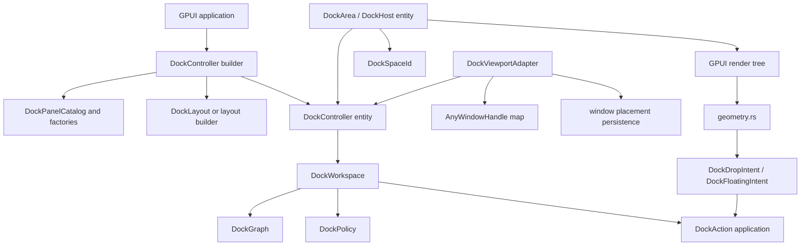

# feat: Design docking user API and multi-viewport roadmap

## Summary

Define the future docking architecture that makes the feature pleasant for application authors, native to GPUI, and capable of ImGui-style multi-viewport docking. The current infrastructure is a good core foundation, but it needs a user-facing controller API, lazy panel lifecycle, viewport adapter, and persistence split before it becomes an ergonomic GPUI docking system.

---

## Problem Frame

The current docking crate has the right low-level direction: `DockGraph` is pure data, `DockOp` describes graph mutation, `DockLayout` serializes without GPUI views, `DockPanelRegistry` keeps renderable content outside the graph, `DockWorkspace` is the owner seam, `DockAction` routes user commits, `DockPolicy` gates capabilities, and `geometry.rs` gives a pure hit/preview foundation.

That is enough to keep implementation disciplined. It is not enough to make the final product feel good. A GPUI user should not need to manually assemble graph nodes, register views in several places, reason about `DockNodeId`, or know when a host owns a workspace by value. They should be able to declare dockable items, choose a default layout, mount a dock area, and opt into capabilities like split, floating, persistence, and platform tear-off.

The ImGui docking experience provides the target behavior, not the target API. ImGui exposes global flags such as docking and viewports, a dockspace concept, platform viewport callbacks, hovered viewport reporting, auto-merge options, transparent payloads, and `.ini` settings. GPUI should express the same experience through retained entities, actions, event emitters, typed layout data, and explicit platform adapters instead of an immediate-mode global context.

Zed provides a second useful reference at the application layer. Its `Workspace` is a window-root owner that owns pane groups, docks, panes, active pane, and persistence. Its panes delegate split/drop back to the workspace owner through weak references. The generic docking crate should borrow that owner pattern, but avoid importing Zed's project-specific item handles, focus state, and one-workspace-per-window assumption into the pure graph.

---

## Current Infrastructure Assessment

What is correct now:

- The graph is pure and does not store `AnyView`, `Entity`, `WindowHandle`, or focus state.
- The operation vocabulary and layout import/export are testable without opening a GPUI window.
- `DockWorkspace` and `DockAction` have started to pull commits out of `DockHost`.
- `DockPolicy` gives a capability gate for future product choices.
- `geometry.rs` gives a shared place for hit testing, split handles, drop zones, and preview bounds.
- The native example proves the crate can be consumed from a GPUI app.

What must change before the final API:

- `DockHost` still owns a `DockWorkspace` by value, which blocks a clean multi-viewport owner model.
- `DockPanelRegistry` stores `AnyView` directly, which is convenient for tests but weak for lazy restore, close/reopen, and multi-window lifecycle.
- The public setup path still feels graph-first rather than app-author-first.
- In-window floating exists in graph operations but is not yet an action/rendered feature.
- Platform windows, screen coordinate conversion, hovered-window targeting, and release-outside-window behavior are not modeled.
- Persistence currently covers docking layout, not a split between dock layout and platform-window placement.

The short version: the foundation is correct for a docking kernel, but not yet complete for a framework API. More `DockOp` coverage alone will not make the system pleasant. The next design layer must decide which concepts users see, which concepts GPUI owns, and which concepts stay as internal graph machinery.

---

## Requirements

- R1. Keep the core graph and layout portable, serializable, and independent of GPUI platform-window state.
- R2. Provide a simple app-author API for registering dockable panels and mounting a dock area without touching raw graph nodes for common cases.
- R3. Support advanced callers with explicit graph/layout APIs when they need deterministic imports, migrations, or custom layouts.
- R4. Make the GPUI integration retained and entity-native: controller state lives in GPUI entities, hosts observe owners, and actions/events use existing GPUI patterns.
- R5. Support lazy panel creation, close/reopen behavior, panel metadata, and policy hooks without storing views in `DockGraph`.
- R6. Preserve ImGui-like interaction semantics: tab merge, edge split, splitter resize, floating preview, tear-off to platform window, docking back into another viewport, and optional auto-merge controls.
- R7. Keep platform viewport lifecycle in an adapter that owns window handles, display/bounds snapshots, focus activation, and close behavior.
- R8. Separate persisted dock layout from persisted platform-window placement.
- R9. Make unsupported capabilities explicit through policy rather than hidden no-ops.
- R10. Provide examples and tests that prove both the simple path and the advanced path.
- R11. Keep the common setup path short enough that a GPUI app author can copy it from an example and adapt panel ids, factories, and default layout only.
- R12. Make the public model teach the architecture: item ids identify content, layouts describe structure, controllers own state, hosts render spaces, adapters own platform windows.
- R13. Keep split layout canonical as n-ary same-axis containers while exposing ImGui-style four-direction drop zones to users.

---

## User API Design Principles

The API should be shaped around three audiences instead of one graph-centric surface.

**Simple app authors** should see a builder, panel registration, default layout, policy toggles, restore/export, and one `render`/`mount` entry point. They should not need to construct `DockNodeId`, call raw `DockOp`, or understand tab-node internals for normal editor-style layouts.

**Advanced layout authors** should keep access to `DockGraph`, `DockLayout`, `DockLayoutBuilder`, `EditorDockLayoutSpec`, and checked operations. This path is for migrations, generated layouts, deterministic tests, and applications that already have their own layout model.

**Framework integrators** should see the owner/runtime layer: controller entity, viewport host, viewport adapter, action outcomes, policy rejections, and persistence hooks. This is where multi-window behavior, close policies, focus restore, and app-specific session management plug in.

The main usability rule is that public API names should match user intent before data structure mechanics. Users want to "register a panel", "open a panel", "dock left", "float", "restore layout", and "tear off"; only lower layers should talk in terms of graph roots, node ids, and operation application.

---

## GPUI Integration Contract

The docking crate should feel like GPUI, not like an embedded immediate-mode subsystem.

- Controller/workspace state should live in GPUI entities when UI is involved, so windows and hosts can observe one owner.
- Hosts should render one logical dock space and forward user actions to the owner instead of owning long-lived graph state by value in the multi-viewport path.
- Panel creation should use GPUI-native factories and retained views, with direct `AnyView` registration retained as a convenience path.
- Actions should be typed GPUI-facing commits: select, move, resize, float, merge, close, open, and restore. They should return typed outcomes and typed policy errors.
- Transient hover, preview, splitter drag, and tab drag state can stay in host/controller runtime state. Durable layout state belongs in `DockWorkspace`/`DockGraph`; platform window state belongs in the adapter.
- Persistence should be split into dock layout data and viewport placement data so GPUI apps can decide whether to restore just panels, just windows, or both.

This contract is the main guardrail for the ImGui-like experience: the behavior can be familiar, but the mechanics should be retained, typed, and entity-native.

---

## Split Model Decision

The split model should stay n-ary in the core graph and four-directional in the interaction layer.

ImGui is the right behavior reference for drop affordances: users expect center merge plus left, right, top, and bottom split targets. That does not require the core graph to be binary. ImGui's internal dock nodes are binary split nodes, but that is an implementation choice tied to its immediate-mode docking context and `.ini` settings format.

The current `DockGraph` already uses the more useful retained model for GPUI: `DockNode::Split` stores one axis plus `Vec<DockNodeId>` children and matching `Vec<f32>` fractions. That is closer to `egui_tiles` horizontal and vertical containers, where repeated same-axis splits produce more siblings rather than deeper binary nesting.

Canonical rules:

- Same-axis edge drops insert a sibling into the existing split container.
- Cross-axis edge drops wrap the target in a new split container.
- Same-axis split nesting should be flattened during graph mutations and import.
- Single-child split containers should collapse during simplification.
- Fractions should remain normalized and match child count.
- Grid layout should stay out of the core docking model for now; it can be added later as a separate container kind if dashboard-style use cases justify the complexity.

This gives users the ImGui docking feel without inheriting binary-tree persistence noise or deep same-axis nesting.

---

## Scope Boundaries

In scope:

- Future API shape for users of `open-gpui-docking`.
- GPUI-native owner/host/viewport layering.
- Panel registration and lazy panel lifecycle.
- Multi-viewport and tear-off roadmap.
- Persistence boundaries for graph layout versus platform-window state.
- Validation matrix for ImGui-like user experience.

Deferred to implementation plans:

- Exact names of every public type and method.
- Full platform-specific behavior for macOS, Windows, Linux, and web.
- Accessibility navigation details beyond not blocking future focus integration.
- Rich tab overflow, dirty markers, icons, and panel-specific menus.

Out of scope:

- Porting ImGui's immediate-mode `DockContext` directly.
- Copying Zed's project-specific workspace and item model.
- Making GPUI core depend on `open-gpui-docking`.

---

## Key Technical Decisions

- KTD1. **Three-layer architecture:** Keep `DockGraph` as the model, add a GPUI-native docking controller as the owner, and put OS-window behavior in a viewport adapter.
- KTD2. **Simple API first, graph escape hatch second:** Most users should register panels and use layout builders; advanced users can still import/export and mutate graph data.
- KTD3. **Panel factories over stored views:** The long-term registry should support lazy view creation and restoration. Direct `AnyView` registration can stay as a convenience path.
- KTD4. **Host renders a space; controller owns the workspace:** A rendered host should not be the long-term owner of graph state when multi-viewport is enabled.
- KTD5. **ImGui experience, GPUI mechanics:** Use ImGui as the behavior benchmark for dockspaces and viewports, but express it through GPUI entities, windows, actions, and retained state.
- KTD6. **Viewport adapter owns platform reality:** `AnyWindowHandle`, window bounds, display id, activation, and window close hooks belong to adapter state, not `DockGraph`.
- KTD7. **Persistence is split:** `DockLayout` stores dock spaces, nodes, items, fractions, and in-window floating bounds. A separate adapter-level record stores platform window placement and last viewport stack.
- KTD8. **Capabilities are typed:** Docking modes such as edge split, center merge, floating, tear-off, auto-merge, and cross-viewport drop should be policy fields with typed rejections.
- KTD9. **The first public abstraction should be intent-oriented:** expose panels, layouts, spaces, actions, and policies before exposing node mechanics. Raw graph APIs stay public for advanced use, but they should not be the teaching path.
- KTD10. **One logical owner can render through many hosts:** multi-viewport support should start from a shared controller model, not from cloning `DockWorkspace` into every GPUI window.
- KTD11. **Canonical n-ary splits, ImGui-style drop zones:** the core layout should flatten same-axis split siblings, while the interaction layer keeps the familiar center/left/right/top/bottom drop vocabulary.

---

## High-Level Technical Design



User-facing setup should eventually feel closer to this shape:

```rust
let docking = cx.new(|cx| {
    DockController::builder("main")
        .panel("explorer", "Explorer", |cx| ExplorerPanel::new(cx))
        .panel("editor", "Editor", |cx| EditorPanel::new(cx))
        .panel("terminal", "Terminal", |cx| TerminalPanel::new(cx))
        .default_layout(EditorDockLayoutSpec::new(
            ["explorer"],
            ["editor"],
            ["terminal"],
        ))
        .policy(DockPolicy::desktop())
        .build(cx)
});

cx.open_window(options, |_, cx| docking.viewport("main", cx));
```

The exact API may change during implementation, but the important property is that common users register panels and mount a viewport. They do not hand-author `DockNodeId` graphs unless they choose the advanced API.

---

## Implementation Units

### U1. Public API Shape And Controller Builder

**Goal:** Design and implement a user-facing setup API that hides raw graph assembly for common applications.

**Requirements:** R2, R3, R4, R10

**Dependencies:** None

**Files:**

- `crates/gpui_docking/src/controller.rs`
- `crates/gpui_docking/src/builder.rs`
- `crates/gpui_docking/src/workspace.rs`
- `crates/gpui_docking/src/host.rs`
- `crates/gpui_docking/src/lib.rs`
- `crates/gpui_docking/src/host_tests.rs`
- `examples/docking-native/src/main.rs`

**Approach:** Introduce a controller or builder facade that owns a `DockWorkspace`, panel catalog, policy, and default layout. Preserve raw `DockLayoutBuilder` for advanced callers. The simple path should let users register panels by stable ids and mount a viewport by `DockSpaceId`.

**Patterns to follow:** Existing `EditorDockLayoutSpec`, current native example setup, Zed's workspace-owner pattern, and GPUI `cx.new` entity construction.

**Test scenarios:**

- A minimal builder with three panels and an editor layout renders without direct `DockNodeId` usage.
- The same controller can export a `DockLayout` that contains only item ids and graph data.
- Advanced callers can still provide a prebuilt `DockGraph`.
- The old `DockWorkspace::new` plus `DockHost::from_workspace` path still compiles.

**Verification:** A new user can create a useful dock area through a short, discoverable API.

### U2. Panel Catalog And Lazy View Lifecycle

**Goal:** Move from view-only registration toward panel specs and factories that work with restore, close, and multi-window lifecycle.

**Requirements:** R1, R2, R5, R8

**Dependencies:** U1

**Files:**

- `crates/gpui_docking/src/panel.rs`
- `crates/gpui_docking/src/controller.rs`
- `crates/gpui_docking/src/workspace.rs`
- `crates/gpui_docking/src/render.rs`
- `crates/gpui_docking/src/host_tests.rs`

**Approach:** Add a panel catalog concept that can store title, close policy, optional icon metadata, factory callback, and optional restore data. Keep `register_panel_view` for simple already-created views. Render should resolve item ids through the catalog and instantiate or reuse views according to documented lifecycle rules.

**Patterns to follow:** Existing `DockPanelRegistry`, Zed's `ItemHandle` separation between item identity and rendered view behavior, and current missing-panel fallback UI.

**Test scenarios:**

- A panel factory is called lazily when its item first renders.
- Re-rendering the same item reuses the existing view according to the chosen cache rule.
- Closing a closable panel removes the item from the graph but leaves the catalog able to reopen it.
- Non-closable panels return a typed rejection and remain in the graph.
- Layout serialization never includes factory or view state.

**Verification:** Panel lifecycle works for restored layouts and future platform windows without graph pollution.

### U3. GPUI-Native Host And Action Integration

**Goal:** Make docking feel like a normal GPUI component rather than a parallel UI runtime.

**Requirements:** R4, R6, R9, R10

**Dependencies:** U1, U2

**Files:**

- `crates/gpui_docking/src/host.rs`
- `crates/gpui_docking/src/render.rs`
- `crates/gpui_docking/src/action.rs`
- `crates/gpui_docking/src/policy.rs`
- `crates/gpui_docking/src/debug.rs`
- `crates/gpui_docking/src/host_tests.rs`

**Approach:** Render hosts as retained GPUI entities that observe a controller and emit typed actions. Integrate focus, action dispatch, notifications, and test selectors through GPUI conventions. Keep transient interactions in host/controller state and committed state in `DockWorkspace`.

**Patterns to follow:** `Context::observe`, `Context::emit`, `Window::dispatch_action`, existing splitter and tab drag code, and Zed's owner-delegated pane action pattern.

**Test scenarios:**

- Host notification updates after a controller action.
- A tab click dispatches through `DockAction` and does not mutate host-local graph state.
- A policy rejection can be surfaced without stale preview state.
- Debug selectors remain test-only and do not become public API.

**Verification:** Docking hosts compose as GPUI views and can be embedded in normal GPUI windows.

### U4. ImGui-Like Docking Interaction Semantics

**Goal:** Match the experience users expect from ImGui docking while keeping the implementation retained and typed.

**Requirements:** R6, R9, R10, R13

**Dependencies:** U3

**Files:**

- `crates/gpui_docking/src/drag.rs`
- `crates/gpui_docking/src/drop_target.rs`
- `crates/gpui_docking/src/geometry.rs`
- `crates/gpui_docking/src/policy.rs`
- `crates/gpui_docking/src/render.rs`
- `crates/gpui_docking/src/host_tests.rs`

**Approach:** Treat ImGui's dockspace and viewport flags as behavior requirements: center merge, edge split, no-split policy, no-docking-over policy, floating preview, transparent payload option, no-auto-merge option, and platform viewport support. Express each as typed `DockPolicy` or adapter capability rather than global IO flags.

**Patterns to follow:** `repo-ref/imgui/imgui_demo.cpp` docking and viewport options, existing `DockPolicy`, `DockDropIntent`, and `geometry.rs`.

**Test scenarios:**

- Center merge, edge split, and disabled split policies all produce expected previews and commits.
- Repeated same-axis drops produce one n-ary split with multiple children, not a chain of binary same-axis splits.
- Cross-axis drops wrap the target in a new split and preserve the canonical no-same-axis-nesting invariant.
- Dragging a tab outside known dock targets produces a floating or tear-off candidate only when policy allows it.
- Transparent payload or preview-only behavior can be configured without changing commit semantics.
- Same hover intent is used for preview and commit.
- Drop targets do not appear for disabled capabilities.

**Verification:** The behavior feels like dockspaces and viewports, but all state transitions remain typed and testable.

### U5. Multi-Viewport Adapter And Platform Window Lifecycle

**Goal:** Add ImGui-style viewport behavior through a GPUI adapter that owns platform windows.

**Requirements:** R1, R6, R7, R8, R9

**Dependencies:** U3, U4

**Files:**

- `crates/gpui_docking/src/viewport.rs`
- `crates/gpui_docking/src/controller.rs`
- `crates/gpui_docking/src/host.rs`
- `crates/gpui_docking/src/geometry.rs`
- `crates/gpui_docking/src/host_tests.rs`
- `examples/docking-native/src/main.rs`

**Approach:** Implement the adapter planned in 008: map logical dock spaces to `AnyWindowHandle`, open secondary windows, track host bounds snapshots, convert screen/window/host coordinates, and handle window close/activation. Cross-window drag/drop must be characterized before the adapter depends on target-window drop delivery.

**Patterns to follow:** `App::open_window`, `WindowOptions`, `WindowBounds`, `Window::window_handle`, `crates/gpui/examples/window_positioning.rs`, `crates/gpui/examples/move_entity_between_windows.rs`, and ImGui's platform viewport separation.

**Test scenarios:**

- Dragging a tab out of the primary dock area opens or requests a secondary viewport when tear-off is enabled.
- Dragging a tab or floating window back over a dock host resolves local drop zones and commits through the controller.
- Closing a secondary viewport follows a documented policy: merge back, keep layout space, or reject close while dirty.
- Window handles and display data never appear in `DockLayout`.
- Release outside all viewports does not corrupt graph state.

**Verification:** The adapter provides the platform part of the ImGui multi-viewport experience without contaminating the graph.

### U6. Persistence And Restore Boundaries

**Goal:** Persist docking state and window placement in separate layers.

**Requirements:** R1, R8, R10

**Dependencies:** U1, U2, U5

**Files:**

- `crates/gpui_docking/src/layout.rs`
- `crates/gpui_docking/src/viewport.rs`
- `crates/gpui_docking/src/controller.rs`
- `crates/gpui_docking/src/tests.rs`
- `crates/gpui_docking/src/host_tests.rs`

**Approach:** Keep `DockLayout` focused on graph structure and serializable item ids. Add a separate adapter-level placement record if platform windows need persistence. This mirrors Zed's separation between workspace structure and window/session persistence and avoids making core layouts platform-specific.

**Patterns to follow:** Existing `DockLayout`, local Zed reference snapshot for window stack and bounds persistence, and ImGui docking settings as a behavior reference.

**Test scenarios:**

- A layout round-trip preserves roots, splits, tabs, active tabs, and in-window floating bounds.
- Adapter placement persistence can restore viewport windows without changing graph JSON.
- Missing panel factories during restore render missing-panel UI rather than failing import.
- Window placement data can be discarded while the dock graph remains valid.

**Verification:** Application authors can choose whether they persist only layout, only window placement, or both.

### U7. Examples, Documentation, And Experience Matrix

**Goal:** Make the intended user experience concrete and regression-testable.

**Requirements:** R2, R6, R9, R10

**Dependencies:** U1, U4, U5, U6

**Files:**

- `examples/docking-native/src/main.rs`
- `crates/gpui_docking/src/lib.rs`
- `crates/gpui_docking/src/host_tests.rs`
- `docs/plans/2026-06-08-009-feat-docking-user-api-multiviewport-roadmap-plan.md`

**Approach:** Evolve the native example into a small but realistic docking app. It should demonstrate the simple setup API, splitting, tab drag/drop, in-window floating, optional tear-off, and restore. Keep the example quiet and utilitarian rather than a marketing page.

**Patterns to follow:** Current `examples/docking-native`, GPUI examples, and ImGui's demo value of exposing capability toggles.

**Test scenarios:**

- Example compiles with default capabilities.
- Example can opt out of split, floating, or tear-off through policy.
- Visual tests cover the core experience matrix: select, split, resize, drag tab, float, dock back, restore.
- Documentation states the difference between `DockGraph`, `DockController`, `DockHost`, and `DockViewportAdapter`.

**Verification:** A user can copy the example setup and understand which layer to customize.

---

## Phased Roadmap

| Phase | Goal | User-visible result |
| --- | --- | --- |
| P0 | Current foundation | Pure graph, layout, registry, host rendering, splitter resize, tab drag/drop |
| P1 | Controller and simple API | Users register panels and mount a dock area without raw graph work |
| P2 | In-window floating | Users can float panels inside the same GPUI window and dock them back |
| P3 | Viewport adapter | Users can tear off a panel into a GPUI platform window |
| P4 | Cross-viewport docking | Users can drag back and forth between platform windows |
| P5 | Persistence and polish | Layout and window placement restore with policy, focus, and close behavior |

---

## Development Readiness And Execution Order

This roadmap is clear enough to begin implementation, but it should not be treated as one oversized implementation batch. The safe execution shape is a sequence of reviewable slices that preserve the existing single-window host behavior while introducing the new owner/runtime layers.

Recommended first implementation slice:

1. Add the controller/shared-owner path from U1 while keeping `DockHost::from_workspace` working.
2. Add tests proving two hosts can observe and mutate one owner without cloned graph state.
3. Preserve current graph, layout, splitter resize, and tab drag/drop behavior.
4. Update the native example only enough to show the preferred owner-backed setup path.

Recommended follow-up slices:

| Slice | Plan coverage | Reason |
| --- | --- | --- |
| S1. Shared owner and host compatibility | 009 U1, 009 U3, 008 U1 | Unblocks every later multi-viewport and panel lifecycle change. |
| S2. Split canonical hardening | 009 U4 | Locks the n-ary split invariant before more drag/drop features depend on it. |
| S3. Panel catalog and lazy lifecycle | 009 U2 | Enables restore, close/reopen, and multi-window content reuse. |
| S4. In-window floating | 008 U2, 008 U3, 009 U4 | Proves floating behavior before OS-window tear-off. |
| S5. Viewport adapter characterization | 008 U4, 008 U5, 009 U5 | Adds platform-window mapping only after shared ownership is in place. |
| S6. Persistence and example polish | 009 U6, 009 U7, 008 U6 | Finishes the user-facing story after behavior is proven. |

Implementation should stop and revisit the plan only if one of these assumptions fails: GPUI cannot support a controller-backed host cleanly, cross-window drag behavior contradicts the adapter model, or panel factories cannot safely cache/reuse retained views across the intended host lifecycle.

---

## Experience Matrix

| User goal | Public concept | Internal owner | Persistence layer |
| --- | --- | --- | --- |
| Define content | panel id and panel factory | panel catalog/controller | app-owned panel metadata, not graph |
| Define default layout | layout builder/spec | `DockWorkspace` imports graph data | `DockLayout` |
| Split repeatedly in one direction | four-direction drop zones | n-ary same-axis `DockNode::Split` | normalized split fractions |
| Select or move a tab | typed action | controller/workspace | graph active tab and node structure |
| Resize a split | typed action | controller/workspace | graph split fractions |
| Float inside a window | typed action plus policy | controller/workspace and host runtime | graph floating bounds |
| Tear off to OS window | viewport adapter request | viewport adapter and controller | adapter placement record |
| Dock back across windows | cross-viewport resolved intent | viewport adapter plus controller | graph/layout only after commit |
| Restore a session | layout plus placement restore | controller plus adapter | split dock layout and window placement |

This matrix should be used as a quick design test. If a future feature cannot be placed cleanly into one row, it is probably growing in the wrong layer.

---

## Architecture Decisions To Lock Before Implementation

These decisions should be treated as locked unless implementation exposes a concrete contradiction:

| Decision | Status | Reason |
| --- | --- | --- |
| Core split model | Locked: n-ary same-axis split containers | Matches current `DockGraph`, keeps editor layouts flat, and avoids binary same-axis nesting. |
| User drop vocabulary | Locked: center plus four edges | Matches ImGui-style user expectations and current `DropZone`. |
| Grid layout | Deferred | Useful for dashboards, but it complicates docking, resize, import/export, and preview too early. |
| State owner | Locked direction: controller/workspace owns graph; hosts render spaces | Required before multi-viewport to avoid cloned workspace state. |
| Panel lifecycle | Locked direction: factory catalog long term, direct view registration as convenience | Required for restore, close/reopen, and multi-window lifecycle. |
| Platform windows | Locked: adapter-owned, not graph-owned | Prevents `DockLayout` from depending on GPUI window handles or display state. |
| Persistence | Locked: dock layout and viewport placement split | Lets apps restore graph state without forcing OS-window restore. |

The remaining implementation-time choices are naming and exact ergonomics, not architecture blockers: whether the facade is called `DockController`, `DockArea`, or `DockRuntime`; how panel factory caching is exposed; and how much compatibility surface `DockHost::from_workspace` keeps.

---

## Risks & Dependencies

- **API over-design:** A broad builder can become rigid. Mitigate by keeping raw graph/layout APIs as escape hatches.
- **View lifecycle mistakes:** Storing `AnyView` directly is simple but can fight restore and multi-window. Mitigate with factories while keeping direct views as convenience.
- **Cross-window event assumptions:** ImGui backends expose hovered viewport and platform viewport hooks. GPUI behavior must be characterized before relying on cross-window drops.
- **Zed mismatch:** Zed is an app, not a generic docking crate. Borrow owner and persistence ideas only.
- **Split model drift:** Implementers may accidentally reintroduce binary same-axis nesting while chasing ImGui behavior. Mitigate with canonical graph tests and import simplification.
- **Persistence coupling:** Window placement is useful but should not make `DockLayout` platform-specific.
- **Platform differences:** Native and web targets may not support the same tear-off behavior. Policy and adapter capabilities should surface those differences.

---

## Acceptance Examples

- AE1. A user can create a three-panel editor layout through a builder without manually creating `DockNodeId` values.
- AE2. A user can still import a custom `DockLayout` and register panel factories for every item id.
- AE3. A tab drag inside one dock area previews and commits through the same typed intent.
- AE4. A tab dragged outside all dock targets becomes an in-window floating panel or tear-off request only when policy allows it.
- AE5. A platform tear-off window is tracked by the viewport adapter, not by `DockGraph`.
- AE6. A panel can be docked back from a platform viewport into the main dock area without duplicating panel state.
- AE7. Exported dock layout JSON contains no `AnyView`, `Entity`, `WindowHandle`, `WindowId`, or display state.
- AE8. Repeated same-axis edge drops export as one split node with multiple children and normalized fractions, while users still interact through left/right/top/bottom targets.

---

## Sources & Research

- `docs/plans/2026-06-08-001-feat-docking-plan.md`
- `docs/plans/2026-06-08-008-feat-docking-floating-multiviewport-adapter-plan.md`
- `crates/gpui_docking/src/action.rs`
- `crates/gpui_docking/src/builder.rs`
- `crates/gpui_docking/src/geometry.rs`
- `crates/gpui_docking/src/graph.rs`
- `crates/gpui_docking/src/host.rs`
- `crates/gpui_docking/src/layout.rs`
- `crates/gpui_docking/src/panel.rs`
- `crates/gpui_docking/src/policy.rs`
- `crates/gpui_docking/src/workspace.rs`
- `examples/docking-native/src/main.rs`
- `crates/gpui/examples/drag_drop.rs`
- `crates/gpui/examples/move_entity_between_windows.rs`
- `crates/gpui/examples/window_positioning.rs`
- `repo-ref/egui_tiles/src/container/mod.rs`
- `repo-ref/egui_tiles/src/container/linear.rs`
- `repo-ref/egui_tiles/README.md`
- `repo-ref/imgui/imgui_demo.cpp`
- `repo-ref/imgui/imgui_internal.h`
- `repo-ref/imgui/imgui.cpp`
- Local Zed reference snapshot: workspace owner, pane drag/drop delegation, pane group split tree, session window-stack persistence, and window-bounds persistence.
