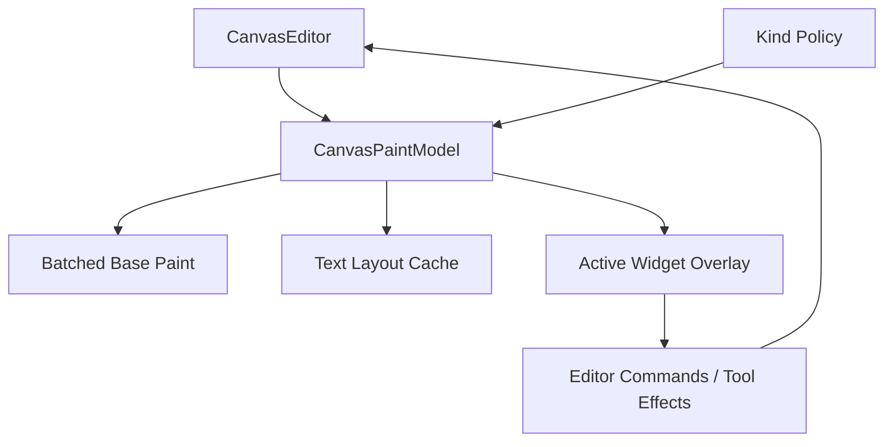

# feat: Add Canvas Paint Text And Widget Overlay Boundary

## Summary

This plan defines the product-grade rendering boundary for text, rich node widgets, overlays, and
batched paint so `open-gpui-canvas` can support note maps, flow editors, and whiteboard workflows
without regressing into one GPUI element per record.

---

## Problem Frame

The current GPUI adapter proves batched node, shape, edge, selection, transform handle, and snap
guide rendering. Real products still need text cards, editable labels, richer node content, and
tool overlays. Those features must not collapse the architecture into a DOM-like renderer where
every canvas record becomes an element and large documents lose culling benefits.

---

## Requirements

**Batched Paint**

- R1. Default rendering must continue to cull and paint visible records in batches.
- R2. Kind policy should provide renderer-neutral fallback style and label metadata.
- R3. Paint snapshots must be cheap enough to rebuild during interaction on large documents.

**Text And Editing**

- R4. Text labels must support stable measurement, clipping, selection-state styling, and fallback
  rendering.
- R5. Rich text editing can use GPUI elements only for active or selected records, not for every
  offscreen record.
- R6. Text layout cache invalidation must follow document diffs, viewport zoom, and kind policy.

**Widget Overlay**

- R7. Applications must be able to mount interactive node widgets for selected or active records
  without bypassing document transactions.
- R8. Overlay hit priority must be explicit so tool gestures and widget interactions do not fight.
- R9. Widget state must remain application-owned; canvas core only supplies placement, lifecycle,
  and mutation entrypoints.

---

## Key Technical Decisions

- KTD1. **Batched base, sparse overlays:** the base canvas paints many records; GPUI widgets appear
  only for active editing surfaces.
- KTD2. **Renderer-neutral label policy first:** text fallback metadata belongs in kind policy, while
  GPUI-specific layout remains in the adapter.
- KTD3. **Overlay mutations go through editor commands:** widget interactions should call editor
  APIs or emit tool effects rather than mutating document state directly.
- KTD4. **Cache by semantic dependencies:** text and paint caches should invalidate from record IDs,
  payload versions, style, kind policy, and zoom rather than from full document clones.

---

## High-Level Technical Design

The overlay layer is a consumer of editor state, not an alternate state owner.

---

## Implementation Units

### U1. Label And Paint Fallback Policy

**Goal:** Add renderer-neutral label and paint metadata to kind policy.

**Requirements:** R2, R4.

**Files:**

- `crates/canvas/src/schema.rs`
- `crates/canvas/src/resolve.rs`
- `crates/canvas/src/gpui.rs`

**Test scenarios:**

- `crates/canvas/src/gpui.rs`: registered kind label metadata changes fallback text without
  changing document records.
- `crates/canvas/src/schema.rs`: unknown kinds keep default fallback style.

### U2. Text Layout Cache

**Goal:** Add a GPUI adapter cache for measured labels that invalidates from document and viewport
changes.

**Requirements:** R3, R4, R6.

**Files:**

- `crates/canvas/src/gpui.rs`
- `crates/canvas/src/runtime.rs`
- `crates/canvas/benches/large_canvas.rs`

**Test scenarios:**

- `crates/canvas/src/gpui.rs`: layout cache refreshes when a node label payload changes.
- `crates/canvas/benches/large_canvas.rs`: paint snapshot benchmarks report text cache costs.

### U3. Sparse Widget Overlay Contract

**Goal:** Define how applications attach active node widgets or text editors to selected records.

**Requirements:** R5, R7, R8, R9.

**Files:**

- `crates/canvas/src/gpui.rs`
- `examples/canvas-notes/src/main.rs`
- `crates/canvas/README.md`

**Test scenarios:**

- `examples/canvas-notes/src/main.rs`: only selected note cards request overlay widgets.
- `crates/canvas/src/gpui.rs`: overlay bounds come from the same resolver as paint and hit testing.
- `crates/canvas/README.md`: widget examples route mutations through `CanvasEditor`.

### U4. Paint Snapshot Performance Guardrails

**Goal:** Avoid full document/index clones on hot paint paths where runtime-owned snapshots can be
shared safely.

**Requirements:** R1, R3, R6.

**Files:**

- `crates/canvas/src/gpui.rs`
- `crates/canvas/src/runtime.rs`
- `crates/canvas/benches/large_canvas.rs`
- `docs/research/canvas-spatial-index-benchmark-results.md`

**Test scenarios:**

- `crates/canvas/benches/large_canvas.rs`: compare current paint model creation against shared
  runtime snapshot creation.
- `crates/canvas/src/gpui.rs`: paint snapshot cannot pair a document with a runtime built from a
  different geometry policy.

---

## Scope Boundaries

- The plan does not require a full rich text editor in core.
- The plan does not move application widget state into `CanvasDocument`.
- The plan does not abandon batched rendering for the default path.
- The plan does not add GPU rendering or tile rasterization.

---

## System-Wide Impact

This work will determine whether the canvas can support MarginNote-like notes and Figma-like node
editing without sacrificing large-document performance. It should give examples a realistic UI path
while keeping the core renderer scalable.

---

## Sources / Research

- `crates/canvas/src/gpui.rs`
- `crates/canvas/src/runtime.rs`
- `crates/canvas/src/schema.rs`
- `examples/smoke-native/src/main.rs`
- `repo-ref/tldraw/packages/editor/src/lib/editor/shapes/ShapeUtil.ts`
- `repo-ref/xyflow/packages/system/src/types/nodes.ts`
