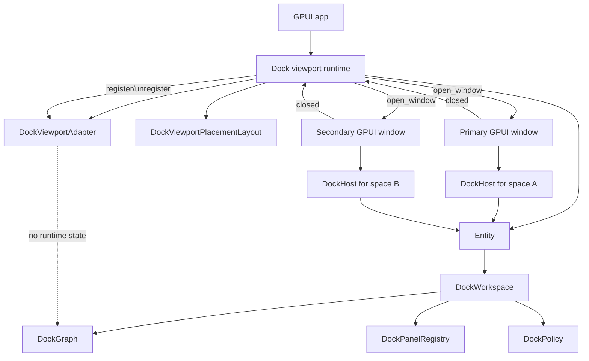
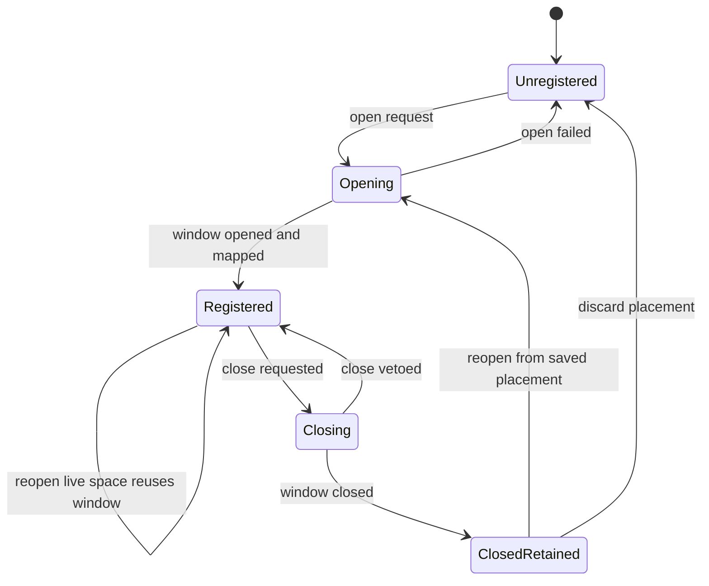

# feat: Productize docking viewport lifecycle

## Summary

Add the next docking slice after the public API stabilization pass: a product-ready viewport
lifecycle layer that can open, register, close, reopen, and restore GPUI windows for logical dock
spaces. This plan keeps `DockGraph` and `DockLayout` pure while turning `DockViewportAdapter` from a
placement map into a runtime boundary that applications can rely on.

---

## Problem Frame

The docking crate now has the correct layer split. `DockController::builder` is the recommended
setup path, controller-backed `DockHost` instances can share one workspace, lazy panel factories are
available, in-window floating renders from graph data, cross-window tab drop has a characterization
test, and `DockViewportAdapter` stores window mappings plus placement snapshots outside
`DockLayout`.

The remaining gap is lifecycle ownership. The adapter can record that a logical `DockSpaceId` is
rendered by an `AnyWindowHandle`, but it does not yet provide an application-facing flow for opening
secondary viewport windows, wiring close callbacks, preserving detached spaces after close,
reopening an existing space, or restoring saved placement into runtime windows. The native example
still opens only the primary window, so downstream users cannot copy a complete multi-window pattern.

This plan should productize that boundary without expanding into interaction polish. Floating
resize, snapping, richer chrome, keyboard navigation, and accessibility remain later work. The
priority here is correctness of ownership, cleanup, restore, and public contracts.

---

## Requirements

- R1. Keep `DockGraph`, `DockOp`, and `DockLayout` free of `AnyWindowHandle`, `WindowHandle`,
  `WindowId`, `DisplayId`, focus state, and platform-window lifecycle state.
- R2. Provide a GPUI-native runtime path that opens a `DockHost` window for a logical
  `DockSpaceId` from a shared `DockController`.
- R3. Make viewport registration, replacement, close, unregister, reopen, and restore behavior
  explicit through typed outcomes instead of ad hoc application code.
- R4. Preserve dock layout and panel state when a secondary viewport window closes unless a future
  policy explicitly requests graph mutation.
- R5. Reuse existing `DockViewportPlacementLayout` data when restoring window bounds, display hints,
  and host-bounds snapshots.
- R6. Install or document close hooks so runtime window cleanup cannot leave stale
  `DockSpaceId -> AnyWindowHandle` mappings, including callbacks that only provide `WindowId`.
- R7. Keep primary and secondary viewport behavior compatible with controller-backed hosts and the
  existing `DockHost::from_workspace` compatibility path.
- R8. Add a separate policy gate for platform viewport tear-off so in-window floating and OS-window
  lifecycle can be enabled independently.
- R9. Define release-outside-known-viewport behavior as a typed lifecycle request, and do not mutate
  graph state until a destination viewport exists.
- R10. Update `examples/docking-native` and rustdoc so a GPUI app author can see the complete
  controller, host, adapter, placement, close, and restore boundary.
- R11. Promote lifecycle-supporting graph operations for moving items or tab stacks into an empty
  dock space, and keep panel close/reopen semantics separate from viewport close.

---

## Scope Boundaries

In scope:

- Runtime APIs or a small runtime entity around `DockViewportAdapter` that opens and tracks
  `DockHost` windows.
- Close and unregister behavior for primary and secondary viewport mappings.
- Reopen semantics for a logical dock space that already has a live window or a saved placement.
- Restore workflow that combines `DockLayout` import with adapter placement restore.
- Action-level support for move-to-empty-space and close-item operations needed by tear-off and
  panel lifecycle boundaries.
- Policy separation between in-window floating and platform viewport tear-off.
- Native example controls or visible affordances for opening and closing a secondary viewport.

Deferred for later:

- Floating resize handles, snapping, edge attraction, and polished detached-window chrome.
- Merge-on-close behavior that moves a detached space back into the primary root.
- Keyboard navigation, focus restoration, accessibility traversal, and tab overflow polish.
- Cross-monitor DPI refinements beyond the existing placement snapshot contract.

Out of scope:

- Storing platform window handles or display state in `DockGraph` or `DockLayout`.
- Moving docking window lifecycle into `crates/gpui`.
- Replacing controller-backed hosts with one workspace per platform window.
- Reworking the graph split model, tab drag/drop semantics, or panel factory lifecycle.

---

## Key Technical Decisions

- KTD1. **Add a viewport runtime boundary above the adapter:** `DockViewportAdapter` already owns
  mappings and snapshots. Product lifecycle needs a small orchestration layer or expanded adapter
  API that can call GPUI window APIs, register handles, and clean up on close.
- KTD2. **Default close behavior retains layout:** Closing a secondary viewport should unregister
  its runtime window and keep the logical dock space in the graph. This makes reopen and restore
  predictable and avoids destructive graph mutation without application policy.
- KTD3. **Reopen is deterministic:** Opening a live space should either activate/reuse the existing
  window or replace the mapping by documented rule. The first implementation should prefer reuse
  when the mapped window is still live, and replacement only after close/unregister.
- KTD4. **Restore opens windows before applying placement:** Saved placement contains no runtime
  handles, so restore should import `DockLayout`, open/register windows for saved spaces, then apply
  `DockViewportPlacementLayout` to the new handles.
- KTD5. **Tear-off policy is distinct from in-window floating:** `DockPolicy::allow_floating` should
  continue to govern graph-backed in-window floating. Platform-window tear-off needs its own
  capability gate because it has lifecycle and platform constraints.
- KTD6. **Tear-off request precedes graph mutation:** A tab released outside known dock targets can
  request a new viewport, but the graph should not move the item into another space until the
  runtime window exists or the implementation chooses an in-window floating fallback.
- KTD7. **GPUI close hooks are load-bearing:** `Window::on_window_should_close`,
  `Window::remove_window`, and `App::on_window_closed` are the local mechanisms for preventing
  close, closing programmatically, and clearing stale mappings. The plan should use these before
  inventing docking-specific platform hooks.
- KTD8. **Native example is part of the contract:** The example should demonstrate lifecycle
  wiring, not just compile. It is the teaching path for how a downstream app owns controller,
  runtime adapter, policy, layout, and placement together.
- KTD9. **Viewport close is not panel close:** Closing a platform window should unregister runtime
  state and retain logical layout by default. Closing a dock item should go through graph actions and
  panel close policy.
- KTD10. **Adapter cleanup needs `WindowId` indexing:** `App::on_window_closed` reports only
  `WindowId`, so the adapter or runtime must be able to unregister by id without requiring a live
  `AnyWindowHandle`.

---

## High-Level Technical Design

Lifecycle state:

The graph remains the durable model. The viewport runtime owns platform-window liveness, close
callbacks, reuse rules, and restore orchestration. `DockViewportAdapter` remains the serializable
placement and coordinate-conversion boundary.

---

## Implementation Units

### U1. Viewport Lifecycle Model And Policy

**Goal:** Define the typed lifecycle vocabulary before wiring GPUI windows into the adapter.

**Requirements:** R1, R3, R4, R8, R9

**Dependencies:** None

**Files:**

- `crates/gpui_docking/src/viewport.rs`
- `crates/gpui_docking/src/policy.rs`
- `crates/gpui_docking/src/lib.rs`
- `crates/gpui_docking/src/tests.rs`

**Approach:** Add lifecycle-facing types for open, reopen, close, unregister, and restore outcomes.
Introduce a platform-viewport capability in `DockPolicy` that is independent from
`allow_floating`. Keep this layer serializable only where it represents placement or policy data;
runtime handles stay in existing snapshots. Choose a default close policy that retains graph layout
and placement after secondary windows close.

**Patterns to follow:** `DockActionOutcome`, `DockActionApplyError`, `DockPolicyError`,
`DockViewportPlacementValidationError`, and the current `DockViewportAdapter` replacement rules.

**Test scenarios:**

- Default policy keeps platform viewport tear-off disabled while preserving current split, merge,
  resize, and in-window floating defaults.
- Enabling platform viewports does not enable in-window floating unless the caller also opts into
  floating.
- Close policy defaults to retaining logical dock spaces without graph mutation.
- Lifecycle outcome types distinguish opened, reused, replaced, closed, vetoed, and unknown-window
  cases.
- `DockLayout` serialization still contains no lifecycle policy, window handles, or display ids.

**Verification:** Public lifecycle vocabulary is typed, documented, and separated from pure graph
layout.

### U2. Runtime Window Open And Reopen Flow

**Goal:** Provide a GPUI-native way to open or reuse a platform window that renders a logical dock
space from one shared controller.

**Requirements:** R1, R2, R3, R5, R7

**Dependencies:** U1

**Files:**

- `crates/gpui_docking/src/viewport.rs`
- `crates/gpui_docking/src/controller.rs`
- `crates/gpui_docking/src/host.rs`
- `crates/gpui_docking/src/lib.rs`
- `crates/gpui_docking/src/host_tests.rs`

**Approach:** Add a runtime entry point around `DockViewportAdapter` that accepts an
`Entity<DockController>`, a `DockSpaceId`, and `WindowOptions`, opens a `DockHost` root through
`App::open_window`, then registers the returned handle. Reopening an already live space should use
the documented reuse rule rather than creating duplicate windows. Opening from saved placement
should translate `DockViewportWindowBounds` back into `WindowOptions` without leaking that data into
`DockLayout`.

**Execution note:** Start with controller-backed host tests that prove a secondary window renders
from the same owner before adding example UI.

**Patterns to follow:** `DockHost::from_controller`, `open_controller_space` in
`crates/gpui_docking/src/host_tests.rs`, `App::open_window`, `WindowOptions`, `WindowBounds`,
`crates/gpui/examples/window_positioning.rs`, and `crates/gpui/examples/move_entity_between_windows.rs`.

**Test scenarios:**

- Opening a secondary viewport registers its `DockSpaceId -> AnyWindowHandle` mapping and renders a
  controller-backed `DockHost`.
- A tab selection or move committed in the secondary window mutates the shared controller graph once.
- Reopening a space with a live mapping returns a reuse outcome and does not create a duplicate
  mapping.
- Opening a space with saved placement uses saved bounds in `WindowOptions`.
- Opening failure leaves the adapter mapping unchanged.
- The compatibility `DockHost::from_workspace` path continues to work without a viewport runtime.

**Verification:** Applications can open and reuse logical viewport windows without writing their own
mapping ceremony.

### U3. Close Hooks And Runtime Cleanup

**Goal:** Ensure platform window close events unregister runtime mappings without deleting durable
dock state.

**Requirements:** R1, R3, R4, R6, R7

**Dependencies:** U1, U2

**Files:**

- `crates/gpui_docking/src/viewport.rs`
- `crates/gpui_docking/src/host.rs`
- `crates/gpui_docking/src/host_tests.rs`
- `examples/docking-native/src/main.rs`

**Approach:** Wire close handling through GPUI's existing hooks. Use `Window::on_window_should_close`
when a close policy can veto the operation, and use `App::on_window_closed` or an equivalent runtime
subscription to unregister by `WindowId` after the window is gone. Programmatic close should route
through `Window::remove_window` and the same unregister path. Preserve placement snapshots when the
policy says closed spaces can be reopened.

**Patterns to follow:** `Window::on_window_should_close`, `Window::remove_window`,
`App::on_window_closed`, `crates/gpui/examples/on_window_close_quit.rs`, and
`DockViewportAdapter::unregister_window`.

**Test scenarios:**

- Closing a secondary viewport unregisters its window mapping and leaves the graph root for that
  dock space intact.
- Closing an unknown or already unregistered window is a no-op with a typed outcome.
- A close policy that vetoes close keeps the adapter mapping and leaves the window live.
- Programmatic close and platform close share the same cleanup behavior.
- A `WindowId`-only close notification unregisters the matching space without needing a live
  `AnyWindowHandle`.
- Replacing a mapping removes the old window index so later close events for the old handle do not
  unregister the new mapping.
- Closing the primary viewport follows the documented application-owned behavior and does not
  corrupt secondary mappings.

**Verification:** Runtime cleanup is deterministic and cannot leave stale window ids in the
adapter.

### U4. Placement Restore Workflow

**Goal:** Make layout restore and viewport placement restore a single documented workflow without
coupling their serialized formats.

**Requirements:** R1, R3, R5, R7, R10

**Dependencies:** U2, U3

**Files:**

- `crates/gpui_docking/src/viewport.rs`
- `crates/gpui_docking/src/controller.rs`
- `crates/gpui_docking/src/layout.rs`
- `crates/gpui_docking/src/tests.rs`
- `crates/gpui_docking/src/host_tests.rs`
- `examples/docking-native/src/main.rs`

**Approach:** Add a restore helper or documented runtime flow that imports `DockLayout` into a
controller, opens windows for placement entries, registers the new handles, and applies
`DockViewportPlacementLayout` to rehydrate adapter snapshots. Missing placement entries should fall
back to caller-provided `WindowOptions`. Placement entries for spaces not present in the graph
should be ignored or reported by a typed outcome without failing layout import.

**Patterns to follow:** `DockControllerBuilder::try_layout`, `DockViewportAdapter::apply_placement`,
`viewport_restore_workflow_uses_new_runtime_windows_with_saved_placement`, and
`dock_layout_import_does_not_require_viewport_placement`.

**Test scenarios:**

- Restoring layout plus placement opens primary and secondary viewport windows with new runtime
  handles.
- Applying placement after registration restores display id, window bounds, and host bounds for
  matching spaces.
- A missing placement entry still opens a valid viewport with fallback options.
- A placement entry for a missing graph space reports skipped placement without failing valid graph
  import.
- Invalid placement version or duplicate spaces are rejected before windows are opened.
- Exported dock layout JSON remains independent from placement JSON after restore.

**Verification:** Session restore can recreate runtime windows from saved placement while keeping
layout persistence graph-only.

### U5. Lifecycle Graph Actions For Detached Spaces

**Goal:** Expose graph mutations that lifecycle runtime needs without letting viewport code call raw
`DockOp` variants directly.

**Requirements:** R1, R3, R8, R9, R11

**Dependencies:** U1

**Files:**

- `crates/gpui_docking/src/action.rs`
- `crates/gpui_docking/src/op.rs`
- `crates/gpui_docking/src/graph.rs`
- `crates/gpui_docking/src/workspace.rs`
- `crates/gpui_docking/src/panel.rs`
- `crates/gpui_docking/src/policy.rs`
- `crates/gpui_docking/src/tests.rs`
- `crates/gpui_docking/src/host_tests.rs`

**Approach:** Promote existing graph operations for moving one item or an entire tabs node into an
empty dock space through `DockAction`. Add close-item action support only for panel lifecycle
semantics, with `DockPanel::closable` enforced before graph mutation. Keep viewport close outside
this action path: closing a window unregisters runtime state, while closing a panel changes the
graph.

**Patterns to follow:** `DockAction::MoveTab`, `DockAction::FloatItemInWindow`,
`DockOp::MoveItemToEmptyDockSpace`, `DockOp::MoveTabsToEmptyDockSpace`, `DockOp::CloseItem`, and
`DockPanel::closable`.

**Test scenarios:**

- Moving one item to an empty dock space creates the target root and removes the item from the
  source space.
- Moving an entire tabs node to an empty dock space preserves its item order and active tab.
- Move-to-empty-space actions reject a target space that already has a root with a typed error.
- Failed move-to-empty-space actions leave source and target graph state unchanged.
- Closing a closable item removes it from the graph and preserves panel catalog registration for
  future reopen.
- Closing a non-closable item returns a typed policy or action error and leaves the graph unchanged.
- Viewport close tests prove that window close does not invoke close-item behavior.

**Verification:** Tear-off and panel close/reopen can use typed actions while viewport lifecycle
stays runtime-only.

### U6. Tear-Off Request And Cross-Viewport Fallback

**Goal:** Define how tab release outside known dock targets becomes a viewport lifecycle request
instead of an untracked drag failure.

**Requirements:** R2, R3, R8, R9

**Dependencies:** U1, U2, U3, U5

**Files:**

- `crates/gpui_docking/src/drag.rs`
- `crates/gpui_docking/src/drop_target.rs`
- `crates/gpui_docking/src/render.rs`
- `crates/gpui_docking/src/viewport.rs`
- `crates/gpui_docking/src/policy.rs`
- `crates/gpui_docking/src/host_tests.rs`

**Approach:** Keep the existing cross-window tab drop path for known target hosts. Add a typed
release-outside-known-viewport path that can request a new platform viewport when platform
viewports are enabled, or fall back to no mutation when disabled. The request should carry source
space, source tabs, item id, release position, and suggested placement. Do not move the tab into a
new graph space until the runtime open succeeds and the destination rule is known.

**Execution note:** Characterization-first. Preserve the existing
`cross_window_tab_drag_can_drop_into_target_controller_host` behavior before adding outside-release
fallbacks.

**Patterns to follow:** `DockTabDragPayload`, `DockDropIntent`, `DockViewportAdapter::hit_test_screen`,
`DockAction::MoveTab`, `DockAction::FloatItemInWindow`, and the cross-window visual test in
`crates/gpui_docking/src/host_tests.rs`.

**Test scenarios:**

- Cross-window drop into a registered target host still previews and commits through the shared
  controller.
- Releasing a tab outside all registered viewports with platform viewports disabled clears preview
  state and leaves the graph unchanged.
- Releasing outside all registered viewports with platform viewports enabled emits or records one
  open-viewport request with source item data and suggested placement.
- If runtime window open fails, source graph state remains unchanged and the request failure is
  visible to the caller.
- If runtime window open succeeds, the chosen destination rule moves or floats the item exactly once.
- Stale host bounds cause no target resolution rather than a panic or partial mutation.

**Verification:** Tear-off behavior has an explicit lifecycle boundary and does not depend on
unobserved platform drag behavior.

### U7. Native Example And Public Documentation

**Goal:** Make the productized lifecycle path discoverable for downstream GPUI applications.

**Requirements:** R2, R3, R5, R6, R7, R10

**Dependencies:** U1, U2, U3, U4, U5, U6

**Files:**

- `examples/docking-native/src/main.rs`
- `crates/gpui_docking/src/lib.rs`
- `crates/gpui_docking/src/controller.rs`
- `crates/gpui_docking/src/host.rs`
- `crates/gpui_docking/src/viewport.rs`
- `crates/gpui_docking/src/host_tests.rs`

**Approach:** Update the native example so it owns one controller and one viewport runtime, opens
the primary dock viewport, can open a secondary dock space, and demonstrates close/reopen or restore
with placement. Keep the UI utilitarian. Rustdoc should describe the four durable layers: graph
layout, controller, host, and viewport runtime/adapter.

**Patterns to follow:** Current `examples/docking-native/src/main.rs`, crate-level docs in
`crates/gpui_docking/src/lib.rs`, and the builder smoke tests in
`crates/gpui_docking/src/tests.rs`.

**Test scenarios:**

- The native example compiles with controller-backed primary and secondary viewport setup.
- Opening the secondary viewport from the example path registers adapter state.
- Closing and reopening the secondary viewport preserves graph layout and panel factories.
- Example restore uses dock layout and viewport placement as separate records.
- Rustdoc does not imply that `DockSpaceId` is an OS-window id or that `DockLayout` stores placement.

**Verification:** A downstream app author can copy the example to add multi-window docking without
reading internal tests.

---

## System-Wide Impact

This work introduces a new runtime layer at the boundary between `open-gpui-docking` and GPUI
platform windows. It affects public API surface, native example structure, policy semantics,
adapter cleanup, and restore behavior. It should not change the pure graph mutation contract except
where U6 needs a typed lifecycle request before graph mutation.

The compatibility risk is concentrated in naming and ownership. `DockController` should remain the
workspace owner, `DockHost` should remain the render adapter, and the viewport runtime should own
platform-window liveness. Mixing those roles would make multi-window restore harder to reason about.

---

## Risks & Dependencies

- **Borrowing shape around `App::open_window`:** Opening a window while registering adapter state may
  require an entity-backed runtime rather than direct `&mut DockViewportAdapter` calls. Mitigate by
  starting U2 with the smallest GPUI-native owner shape that tests can exercise.
- **Close callback ordering:** `App::on_window_closed` fires after the window is inaccessible, while
  `Window::on_window_should_close` can veto before close. Mitigate by keeping veto logic pre-close
  and cleanup post-close.
- **Duplicate reopen behavior:** Without a fixed reuse rule, repeated open requests can create
  duplicate windows for one logical space. Mitigate with typed reuse outcomes and tests.
- **WindowId-only cleanup:** GPUI closed callbacks no longer expose the closed window object.
  Mitigate with adapter indexing by `WindowId` and close tests that do not require
  `AnyWindowHandle`.
- **Restore partial failure:** Invalid placement should not half-open windows. Mitigate by validating
  placement before runtime window creation.
- **Tear-off event uncertainty:** Release outside known targets may not arrive through the same path
  as registered target drops. Mitigate with characterization-first tests and a no-mutation fallback.
- **Policy confusion:** In-window floating and platform tear-off are related but not equivalent.
  Mitigate with separate policy fields and docs.
- **Example overreach:** A full product shell could obscure the lifecycle contract. Mitigate by
  keeping the example focused on controller, host, adapter, open, close, and restore.

---

## Acceptance Examples

- AE1. When the app opens a secondary viewport for `DockSpaceId("preview")`, the runtime creates a
  GPUI window, mounts a controller-backed `DockHost`, and registers the mapping outside the graph.
- AE2. When the same live viewport is opened again, the runtime reports reuse and does not create a
  duplicate mapping.
- AE3. When a secondary viewport closes, the adapter unregisters the window while the graph root,
  panels, and placement data remain available for reopen.
- AE4. When restore receives valid `DockLayout` plus valid `DockViewportPlacementLayout`, new
  runtime windows are opened and the saved placement is applied to those new handles.
- AE5. When placement data is invalid, restore rejects it before opening windows or mutating adapter
  mappings.
- AE6. When platform viewport tear-off is disabled, releasing a tab outside all known viewports
  clears transient drag state and leaves the graph unchanged.
- AE7. When platform viewport tear-off is enabled, releasing a tab outside all known viewports
  creates a typed open-viewport request and mutates graph state only after the destination exists.
- AE8. After any viewport lifecycle operation, exported `DockLayout` JSON contains dock spaces,
  nodes, items, split fractions, active tabs, and in-window floating bounds, but no window handles,
  display ids, entities, or view state.
- AE9. When a panel is closed, graph state changes through a close-item action and does not reuse the
  viewport close path.

---

## Sources & Research

- `docs/plans/2026-06-08-008-feat-docking-floating-multiviewport-adapter-plan.md`
- `docs/plans/2026-06-08-009-feat-docking-user-api-multiviewport-roadmap-plan.md`
- `docs/plans/2026-06-08-010-refactor-docking-public-api-stabilization-plan.md`
- `crates/gpui_docking/src/action.rs`
- `crates/gpui_docking/src/controller.rs`
- `crates/gpui_docking/src/drag.rs`
- `crates/gpui_docking/src/drop_target.rs`
- `crates/gpui_docking/src/graph.rs`
- `crates/gpui_docking/src/host.rs`
- `crates/gpui_docking/src/host_tests.rs`
- `crates/gpui_docking/src/lib.rs`
- `crates/gpui_docking/src/op.rs`
- `crates/gpui_docking/src/panel.rs`
- `crates/gpui_docking/src/policy.rs`
- `crates/gpui_docking/src/render.rs`
- `crates/gpui_docking/src/tests.rs`
- `crates/gpui_docking/src/viewport.rs`
- `crates/gpui_docking/src/workspace.rs`
- `examples/docking-native/src/main.rs`
- `crates/gpui/src/app.rs`
- `crates/gpui/src/window.rs`
- `crates/gpui/src/platform.rs`
- `crates/gpui/examples/on_window_close_quit.rs`
- `crates/gpui/examples/move_entity_between_windows.rs`
- `crates/gpui/examples/window_positioning.rs`
