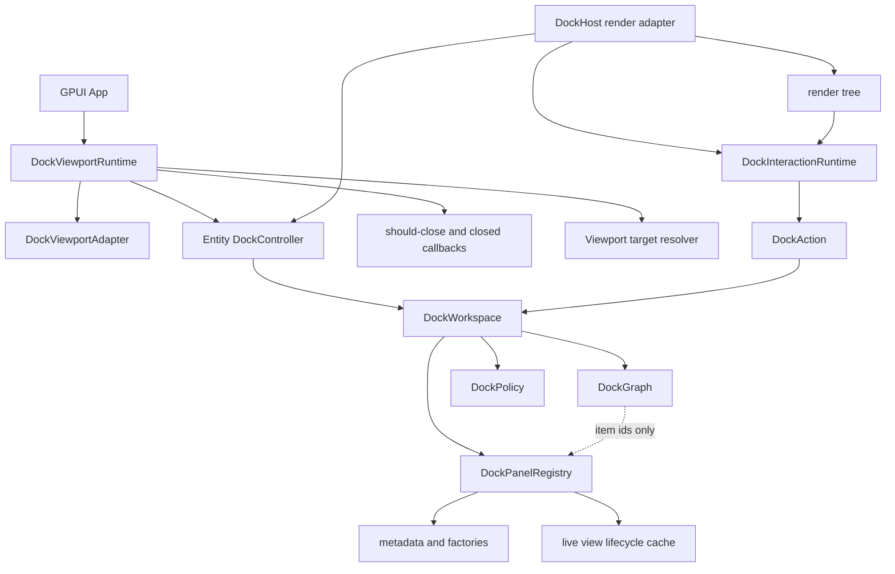
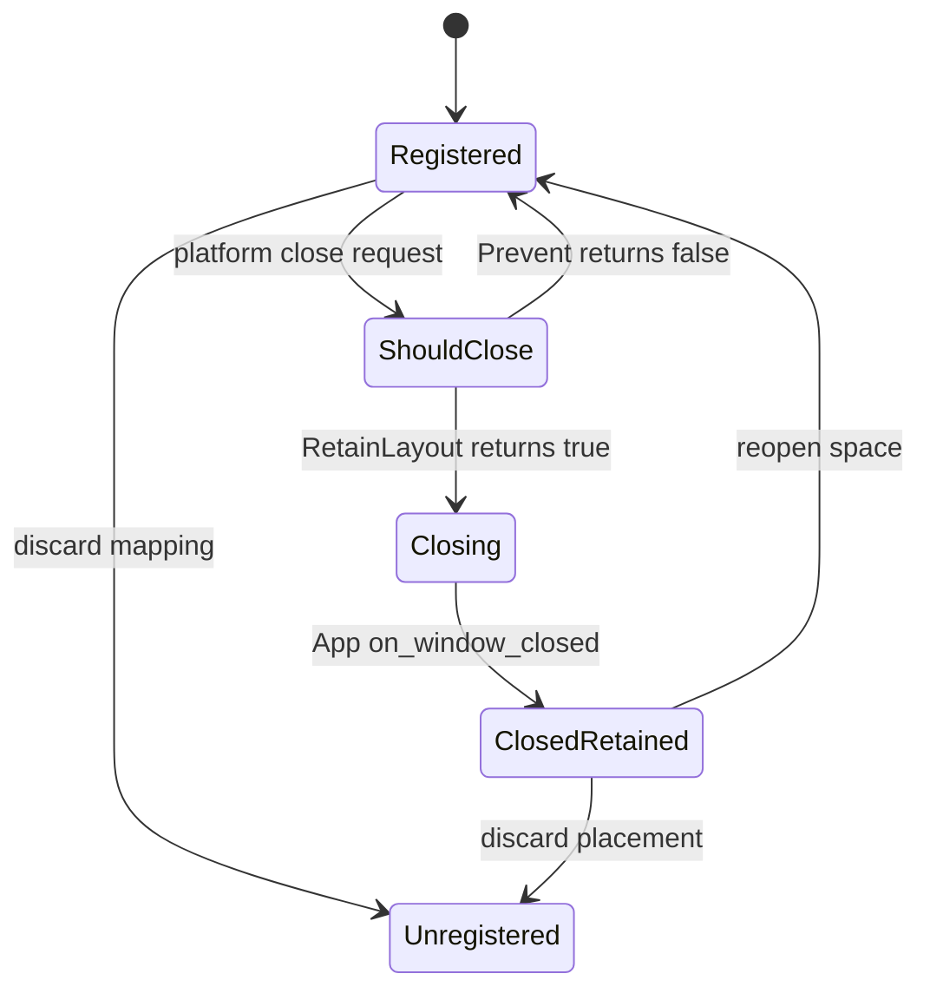
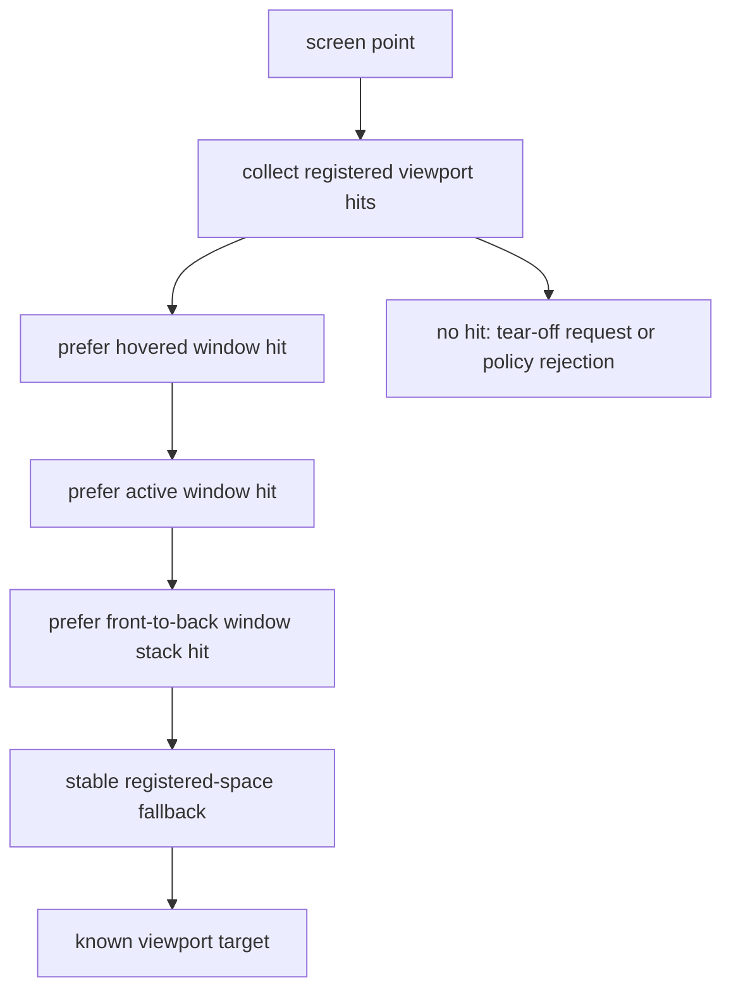
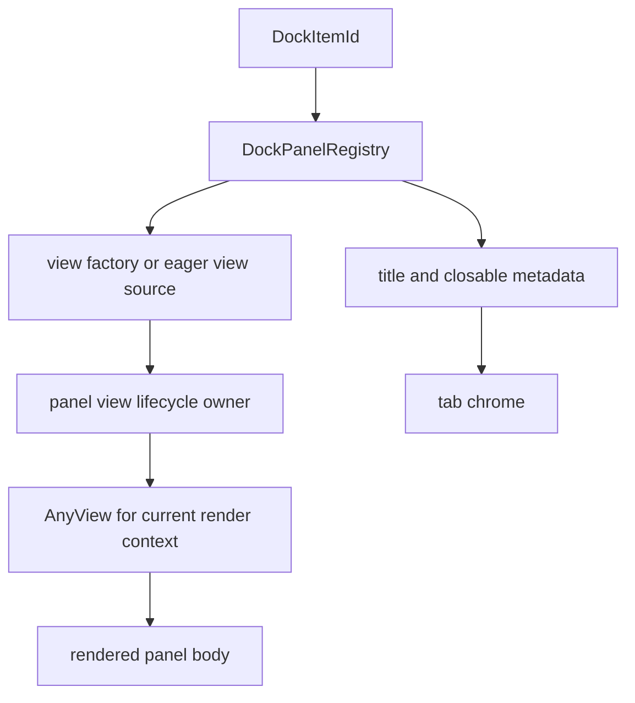

# refactor: Deepen docking lifecycle seams

## Summary

Deepen the remaining docking lifecycle seams after the viewport runtime owner work. This plan narrows `DockHost` into a render adapter, gives viewport close and target resolution a product-grade runtime contract, and separates panel metadata from live GPUI view cache ownership without moving runtime state into `DockGraph` or `DockLayout`.

---

## Problem Frame

The current docking direction is sound: `DockGraph` and `DockLayout` are pure data, `DockAction -> DockWorkspace` owns commits, controller-backed hosts can share one workspace, and `DockViewportRuntime` keeps window mapping outside the graph. The remaining architecture risk is depth. `DockHost` still stores interaction sessions directly, viewport close prevention is a post-close mapping outcome rather than a GPUI should-close veto, viewport hit testing chooses the first lexical `DockSpaceId`, and `DockPanelRegistry` mixes panel metadata with retained `AnyView` cache semantics.

This refactor should strengthen those seams before adding more docking behavior. It should preserve the current single-window and controller-backed behavior while making the multi-window lifecycle easier to reason about.

---

## Requirements

- R1. Keep `DockGraph`, `DockOp`, and `DockLayout` free of `AnyView`, `Entity`, `WindowHandle`, `WindowId`, `DisplayId`, focus state, drag sessions, and viewport runtime state.
- R2. Narrow `DockHost` so render recursion and GPUI element construction remain there, while splitter, floating, and tab-drop session state move behind an interaction runtime boundary.
- R3. Preserve current splitter resize, floating drag, tab selection, tab drag/drop preview, cross-window drop, and controller-backed host behavior.
- R4. Route user commits through `DockAction -> DockWorkspace` or `DockController`, with render callbacks emitting runtime intents rather than owning commit policy.
- R5. Split viewport close handling into a GPUI should-close veto phase and a post-close cleanup phase.
- R6. Make `DockViewportClosePolicy::Prevent` prevent platform window close when installed through the runtime hook, not merely preserve a stale mapping after close.
- R7. Resolve viewport targets with explicit arbitration inputs: hit snapshots, hovered window, active window, window stack order, stale snapshots, and deterministic fallback.
- R8. Keep viewport mapping, placement, and target arbitration outside graph and layout persistence.
- R9. Separate panel metadata and factory registration from live view cache ownership so restore, reopen, and multi-window host lifetimes do not require callers to infer `AnyView` reuse rules.
- R10. Preserve eager `AnyView` registration and lazy factory convenience paths for existing tests and simple applications.
- R11. Update native example and rustdoc to demonstrate the recommended interaction runtime, viewport close hook, target resolver, and panel lifecycle boundaries.
- R12. Add characterization coverage before moving render/session behavior that is currently verified mostly through visual interaction tests.

---

## Scope Boundaries

In scope:

- Extracting a docking interaction runtime owned below or beside `DockHost`.
- Moving splitter drag, floating drag, and tab drop intent storage out of `DockHost` fields.
- Installing runtime-owned GPUI `Window::on_window_should_close` callbacks for veto-capable viewport close policy.
- Adding viewport target resolution that can rank overlapping viewport hits by hovered, active, and front-to-back window order.
- Introducing a panel lifecycle boundary that distinguishes metadata lookup, factory registration, and live view resolution/cache.
- Updating tests, native example, and public docs for the new seams.

### Deferred to Follow-Up Work

- Tab reorder within the same tabs node.
- Whole-tab-stack drag as a distinct payload.
- Rich floating chrome, snapping, resize handles, and merge previews beyond existing behavior.
- Cross-monitor DPI refinements beyond the current placement snapshot contract.
- Focus restoration, keyboard navigation, accessibility traversal, and tab overflow polish.
- Merge-on-viewport-close behavior that moves detached layout back into another space.

Out of scope:

- Moving docking into `crates/gpui`.
- Storing GPUI runtime handles or retained views in `DockGraph` or `DockLayout`.
- Replacing GPUI platform window ownership, focus semantics, or event dispatch.
- Replacing the public graph/layout escape hatches used by advanced callers.

---

## Key Technical Decisions

- KTD1. **Runtime boundary before behavior expansion:** The refactor should first preserve and relocate existing transient interaction behavior, then deepen viewport and panel lifecycle seams.
- KTD2. **Host stays render-facing:** `DockHost` remains the GPUI retained root for one logical dock space, but interaction sessions should be owned by a `DockInteractionRuntime`-style component that exposes narrow methods to render callbacks.
- KTD3. **Render callbacks emit intents:** GPUI event closures should compute pointer facts and call the runtime. They should not directly own drag session state or duplicate commit policy.
- KTD4. **Close veto and cleanup are separate lifecycle phases:** `DockViewportClosePolicy::Prevent` belongs in `Window::on_window_should_close`; `App::on_window_closed` remains the cleanup path after a close has already happened.
- KTD5. **Viewport arbitration is explicit data flow:** `hit_test_screen` should not rely on `BTreeMap` iteration when viewports overlap. A resolver should accept platform order signals when available and fall back to deterministic registered-space ordering only after those signals fail.
- KTD6. **Panel metadata is not live view state:** Title, closable policy, and factory registration should be queryable without instantiating or retaining a GPUI view. Live view cache semantics should sit behind a lifecycle owner that can later vary by host, viewport, or restore policy.
- KTD7. **Compatibility shrinks in stages:** Existing eager/lazy registration and `DockHost::from_workspace` paths remain while tests and examples move to the deeper seams.
- KTD8. **No new GPUI ownership model:** The docking crate should use existing `App`, `Window`, `Entity`, `AnyView`, and callback APIs before adding new primitives in `crates/gpui`.

---

## High-Level Technical Design

Component ownership after this refactor:

Viewport close lifecycle:

Viewport target arbitration:

Panel lifecycle split:

---

## System-Wide Impact

This change affects the core GPUI docking layering rather than a single feature. Application authors should still register panels, build controllers, mount hosts, and open runtime viewports through the same broad concepts. Internally, tests and examples should stop treating `DockHost` as the interaction state owner. Future work should be able to add richer cross-window drop, close/reopen policy, and panel restore behavior without widening graph or render adapter responsibilities.

---

## Implementation Units

### U1. Characterize Current Interaction Runtime Behavior

**Goal:** Lock the observable splitter, floating, and tab-drop behavior before relocating session state out of `DockHost`.

**Requirements:** R2, R3, R4, R12

**Dependencies:** None

**Files:**

- `crates/gpui_docking/src/host_tests.rs`
- `crates/gpui_docking/src/tests.rs`
- `crates/gpui_docking/src/render.rs`
- `crates/gpui_docking/src/host.rs`

**Approach:** Add focused characterization around current render-driven sessions. Cover owned and controller-backed hosts, session cleanup on mouse-up/drop exit, and unchanged graph behavior for invalid interactions. Prefer tests that assert public outcomes and debug selectors over tests that depend on private field layout.

**Execution note:** Add characterization coverage before moving session fields or changing render callbacks.

**Patterns to follow:** Existing visual tests in `crates/gpui_docking/src/host_tests.rs`, `simulate_left_drag`, `cross_window_tab_drag_can_drop_into_target_controller_host`, and `workspace_applies_actions_and_preserves_registered_panels`.

**Test scenarios:**

- Starting and finishing a splitter drag updates split fractions and leaves no active drag session after mouse-up.
- A splitter mouse move with no active drag leaves the graph unchanged.
- Floating handle drag raises the container, updates bounds while the left button is held, and clears transient drag state on mouse-up.
- Floating drag is ignored when floating policy is disabled.
- Tab drag hover stores a drop preview for the hovered target and clears it after drop or invalid exit.
- Controller-backed hosts apply tab and splitter actions through the shared controller and notify peer hosts.

**Verification:** Existing behavior is covered without relying on `DockHost` field ownership as the contract.

### U2. Extract Dock Interaction Runtime

**Goal:** Move splitter drag, floating drag, and tab-drop intent state behind a dedicated interaction runtime boundary.

**Requirements:** R2, R3, R4, R12

**Dependencies:** U1

**Files:**

- `crates/gpui_docking/src/host.rs`
- `crates/gpui_docking/src/render.rs`
- `crates/gpui_docking/src/drag.rs`
- `crates/gpui_docking/src/drop_target.rs`
- `crates/gpui_docking/src/splitter.rs`
- `crates/gpui_docking/src/lib.rs`
- `crates/gpui_docking/src/host_tests.rs`

**Approach:** Introduce an interaction runtime module or type that owns current `SplitterDrag`, `FloatingDrag`, and `DockDropIntent`-equivalent state. `DockHost` should hold this runtime as one field and expose narrow render-facing methods only when needed. The runtime should ask host/controller/workspace for immutable options and action application through closures or small adapter methods so it does not become a second workspace owner.

**Technical design:** Directionally, render callbacks pass pointer facts into runtime methods such as start/update/finish drag and set/clear drop intent. The runtime returns changed/unchanged plus optional action requests; the host remains responsible for calling GPUI notify.

**Patterns to follow:** Current `DockHost::apply_action_from_host`, `DockWorkspace::apply_action`, `DockAction::ResizeSplit`, `DockAction::SetFloatingBounds`, and `DockAction::RaiseFloating`.

**Test scenarios:**

- Splitter drag state can be started, updated, and finished through the runtime without exposing the old `DockHost` session fields.
- Floating drag state can be started, updated, and finished through the runtime while preserving policy checks.
- Drop intent can be set, queried for preview rendering, and cleared through the runtime.
- Owned and controller-backed hosts both route runtime-produced actions through the same host action adapter.
- Tests can inspect runtime state only through crate-private test helpers, not public `DockHost` API.

**Verification:** `DockHost` no longer has separate `splitter_drag`, `floating_drag`, or `tab_drop_intent` fields; render behavior remains unchanged.

### U3. Narrow Render Callback Responsibilities

**Goal:** Make render code consume runtime methods and shared geometry rather than directly managing interaction sessions.

**Requirements:** R2, R3, R4

**Dependencies:** U2

**Files:**

- `crates/gpui_docking/src/render.rs`
- `crates/gpui_docking/src/geometry.rs`
- `crates/gpui_docking/src/drop_target.rs`
- `crates/gpui_docking/src/host.rs`
- `crates/gpui_docking/src/host_tests.rs`

**Approach:** Keep element construction and recursive rendering in `render.rs`, but make event closures call runtime entry points. Render code may compute GPUI-local bounds and pointer positions, then delegate session mutation, policy-sensitive intent resolution, and action emission. Keep preview rendering based on one stored resolved intent.

**Patterns to follow:** `geometry::splitter_handle_bounds`, `drop_target::resolve_tabs_drop`, `DockDropIntent`, and current preview rendering in `render_drop_preview`.

**Test scenarios:**

- Splitter handle hit testing still matches rendered handle bounds after callback cleanup.
- Center and edge tab previews still use the same resolved intent that drop commit consumes.
- Dropping without a valid current intent does not mutate graph state and clears preview state.
- Rendered missing-panel and missing-node paths are unaffected by runtime extraction.
- Current cross-window tab drop characterization still passes with runtime-owned intent state.

**Verification:** `render.rs` contains GPUI event wiring and element construction, not direct ownership of drag or drop session structs.

### U4. Productize Viewport Close Veto

**Goal:** Make viewport close policy support both true GPUI close prevention and post-close runtime cleanup.

**Requirements:** R1, R5, R6, R8, R11

**Dependencies:** None

**Files:**

- `crates/gpui_docking/src/viewport.rs`
- `crates/gpui_docking/src/host.rs`
- `crates/gpui_docking/src/host_tests.rs`
- `examples/docking-native/src/main.rs`
- `crates/gpui_docking/src/lib.rs`

**Approach:** Add a runtime installation path for `Window::on_window_should_close` when opening controller-backed viewport windows. The should-close hook should consult the runtime close policy and return `false` for `Prevent`. `App::on_window_closed` remains responsible for unregistering mappings after accepted closes. Adapter-level `close_viewport_mapping` can remain as the cleanup primitive, but its docs and tests should no longer claim it can veto a platform close by itself.

**Technical design:** The close path has two callbacks: the per-window should-close hook makes the pre-close decision, while the application-level closed observer cleans stale mappings by `WindowId` after GPUI confirms the window is gone.

**Patterns to follow:** `DockViewportRuntimeHandle::observe_window_closed`, `DockViewportAdapter::close_viewport_mapping`, `DockViewportClosePolicy`, `Window::on_window_should_close`, and `App::on_window_closed`.

**Test scenarios:**

- Opening a viewport through the runtime installs a should-close callback that returns false when close policy is `Prevent`.
- A prevented close leaves the window live and keeps the adapter mapping.
- With `RetainLayout`, the should-close callback allows close and the closed observer removes only runtime mapping.
- Cleanup by unknown `WindowId` returns `UnknownWindow` and does not affect other mappings.
- Programmatic `remove_window` under retain policy still unregisters the mapping through the closed observer.
- Native example wires both should-close and closed cleanup through the runtime handle.

**Verification:** `DockViewportClosePolicy::Prevent` has a test that exercises GPUI should-close behavior, not only adapter mapping retention.

### U5. Add Viewport Target Resolver Arbitration

**Goal:** Replace lexical first-hit viewport targeting with an explicit resolver that handles overlapping windows and platform order signals.

**Requirements:** R1, R7, R8, R11

**Dependencies:** U4 may run independently, but final docs should describe both together.

**Files:**

- `crates/gpui_docking/src/viewport.rs`
- `crates/gpui_docking/src/host_tests.rs`
- `crates/gpui_docking/src/tests.rs`
- `crates/gpui_docking/src/lib.rs`

**Approach:** Add a resolver type or pure helper that collects all viewport hits for a screen point, ranks them by hovered window, active window, `App::window_stack` front-to-back order, then stable fallback ordering. Keep `DockViewportAdapter::hit_test_screen` as a deterministic compatibility wrapper or delegate. Runtime methods that can access `App` should pass active and stack inputs into the resolver.

**Technical design:** The resolver should accept optional platform facts because not every GPUI platform implements `window_stack`. Missing platform facts should degrade to stable fallback rather than failing target resolution.

**Patterns to follow:** `DockViewportAdapter::screen_to_host`, `DockViewportHit`, `DockViewportTearOffOutcome`, `App::window_stack`, `App::active_window`, and `Window::is_window_hovered`.

**Test scenarios:**

- Non-overlapping viewport hits return the containing space as before.
- Two overlapping viewport snapshots prefer the hovered window when a hovered hit is supplied.
- Without hovered data, overlapping hits prefer the active window when active is among the hits.
- Without hovered or active data, overlapping hits prefer the first hit in front-to-back window stack order.
- When platform order is unavailable, overlapping hits fall back to stable `DockSpaceId` ordering.
- Stale mappings or snapshots with missing bounds are ignored and do not block tear-off requests.
- Release outside all known viewports still returns a policy-gated tear-off request or rejection.

**Verification:** No product-facing target resolution path relies on raw `BTreeMap` hit order when platform signals are available.

### U6. Split Panel Metadata From Live View Lifecycle

**Goal:** Keep panel metadata and registration stable while moving live `AnyView` cache semantics behind a clearer lifecycle boundary.

**Requirements:** R1, R9, R10, R11

**Dependencies:** U1, U2 are useful for characterization; this unit can begin after current panel tests are understood.

**Files:**

- `crates/gpui_docking/src/panel.rs`
- `crates/gpui_docking/src/controller.rs`
- `crates/gpui_docking/src/workspace.rs`
- `crates/gpui_docking/src/render.rs`
- `crates/gpui_docking/src/host_tests.rs`
- `crates/gpui_docking/src/tests.rs`
- `crates/gpui_docking/src/lib.rs`

**Approach:** Introduce a descriptor/catalog concept for title, closable flag, and factory/eager source, then put live view resolution behind a lifecycle owner or cache abstraction. Preserve existing public registration methods by adapting them to the new internal split. Avoid forcing exact per-window cache policy in this pass; the main goal is to make metadata access independent from view instantiation and to make live cache ownership explicit.

**Technical design:** Directionally, tab chrome should read a descriptor, while panel body rendering should request a live view from the lifecycle layer for the current render context. Eager `AnyView` registrations can be modeled as already-live sources for compatibility.

**Patterns to follow:** Current `DockPanel::title`, `DockPanel::is_closable`, `DockPanel::resolve_view`, lazy panel tests, and `DockControllerBuilder::panel_factory`.

**Test scenarios:**

- Reading title and closable metadata for inactive lazy panels does not instantiate their views.
- Rendering the active lazy panel instantiates one live view for the chosen lifecycle scope.
- Re-rendering the same active panel reuses the live view according to the chosen compatibility policy.
- Replacing a panel registration replaces metadata and resets or replaces the live cache consistently.
- Layout export still excludes titles, factories, `AnyView`, `Entity`, and window handles.
- Controller builder lazy factories continue to mount and render through controller-backed hosts.
- Eager `register_panel_view` remains supported for simple applications and tests.

**Verification:** The registry API can answer metadata queries without exposing or requiring live `AnyView` cache state.

### U7. Update Documentation, Example, and Verification Gates

**Goal:** Make the new boundaries visible to downstream users and future implementers.

**Requirements:** R1, R2, R5, R7, R9, R11

**Dependencies:** U2, U4, U5, U6

**Files:**

- `crates/gpui_docking/src/lib.rs`
- `crates/gpui_docking/src/host.rs`
- `crates/gpui_docking/src/viewport.rs`
- `crates/gpui_docking/src/panel.rs`
- `examples/docking-native/src/main.rs`
- `docs/plans/2026-06-08-012-refactor-docking-lifecycle-seams-plan.md`

**Approach:** Update crate docs and type docs so they teach the split: graph/layout store durable structure, controller/workspace owns commits, host renders a space, interaction runtime owns transient sessions, viewport runtime owns platform windows, and panel lifecycle owns live views. Update the native example to use runtime-provided close wiring and any new recommended panel registration names. Mark this plan completed only after code and verification land.

**Patterns to follow:** Existing crate-level docs in `crates/gpui_docking/src/lib.rs`, native example runtime handle setup, and prior plan status conventions.

**Test scenarios:**

- Documentation examples compile where they are included as rustdoc snippets.
- Native example still opens primary and secondary viewport windows from one controller.
- Native example uses runtime-owned close hooks rather than manual adapter cleanup.
- Public docs do not describe `DockHost` as the long-term interaction state owner.

**Verification:** Rustdoc and native example reflect the same architecture that tests exercise.

---

## Risks & Mitigations

- **Render regression risk:** Interaction behavior is currently event-callback heavy. Mitigate by landing U1 characterization before moving state.
- **Borrowing and callback lifetime risk:** Runtime-owned close hooks and interaction state may create borrow cycles or stale handles. Mitigate by keeping runtime handles cloneable and narrow, and by testing `WindowId` cleanup paths.
- **Panel cache semantics risk:** A too-large panel lifecycle rewrite could break simple eager-view users. Mitigate by preserving public registration methods and making the first split internal.
- **Platform signal availability risk:** `window_stack` is optional across GPUI platforms. Mitigate by accepting optional resolver inputs and preserving deterministic fallback.
- **API churn risk:** New seam names may change during implementation. Mitigate by keeping exact naming as implementation-owned while preserving the architecture contracts in this plan.

---

## Alternative Approaches Considered

- **Leave interaction sessions in `DockHost`:** This is lowest effort, but it keeps the render adapter as the hidden runtime owner and makes future cross-window interaction harder to reason about.
- **Move all interaction state into `DockController`:** This deepens owner semantics, but it risks turning the controller into a global UI runtime and complicates multiple hosts that need independent hover or pointer sessions.
- **Store one panel live view per registry entry forever:** This preserves current behavior, but it hides lifecycle policy in the registry and weakens restore/reopen semantics.
- **Make `hit_test_screen` require platform z-order:** This avoids ambiguous overlap behavior, but it would fail on platforms that do not implement `window_stack`. Optional inputs with fallback are more portable.

---

## Sources & Research

- `docs/adr/0002-docking-gpui-integration.md` establishes the graph/layout, host, owner, viewport adapter, and GPUI ownership split.
- `docs/plans/2026-06-08-007-refactor-docking-interaction-seams-plan.md` documents the current action, policy, geometry, and preview direction.
- `docs/plans/2026-06-08-011-feat-docking-viewport-lifecycle-plan.md` documents the runtime owner and close lifecycle foundation that this plan deepens.
- `crates/gpui_docking/src/host.rs` shows `DockHost` still holding interaction session state.
- `crates/gpui_docking/src/render.rs` shows render callbacks directly managing splitter, floating, and tab-drop sessions.
- `crates/gpui_docking/src/viewport.rs` shows the current adapter/runtime, close mapping, and first-hit target resolution.
- `crates/gpui_docking/src/panel.rs` shows metadata and live `AnyView` cache currently tied together.
- `crates/gpui/src/window.rs` provides `Window::on_window_should_close` and hovered-window state.
- `crates/gpui/src/app.rs` provides active-window, window-stack, and closed-window observer APIs.

---

## Verification

The implementation should pass focused docking tests, formatting, linting for the crate, docs, and the native example build. The minimum behavioral evidence is: interaction characterization stays green after runtime extraction, `Prevent` veto is proven through GPUI should-close behavior, overlapping viewport resolution follows explicit arbitration, panel metadata queries do not instantiate inactive lazy views, and layout/placement serialization still excludes runtime state.
