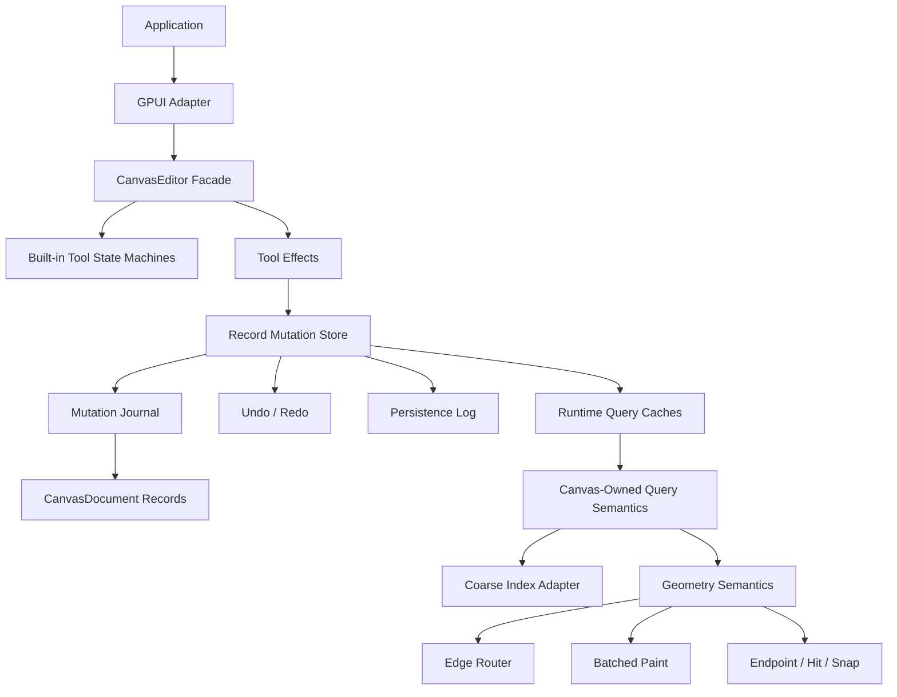

# refactor: Deepen Canvas Architecture Seams

## Summary

This plan continues the pre-1.0 `open-gpui-canvas` architecture work by turning the remaining
MVP seams into deeper modules. The priority is to make document mutation, record-store semantics,
and GPUI integration harder to misuse before adding more tools, geometry features, or runtime index
backends.

---

## Problem Frame

The current canvas architecture is on the right path: `CanvasEditor` owns consistency,
`CanvasCommittedMutation` reports semantic changes, `CanvasRuntime` owns runtime caches,
`CanvasGeometryResolver` centralizes geometry, and the GPUI adapter keeps batched paint separate
from sparse overlays. Several interfaces are still too shallow for a reusable ecosystem.

The highest-risk issue is that callers can still mutate `CanvasDocument` collections directly,
bypassing transactions, the record mutation store, validation, runtime-cache sync, undo, persistence,
and future CRDT translation. The second issue is that record mutation concepts exist, but store,
history, persistence, and adapters still need to understand neighboring concepts instead of
observing one store-level fact source. The third issue is developer experience: applications still
hand-wire GPUI canvas callbacks and input mapping even for the default renderer.

This plan treats the prior completed plans as foundation, not as finished architecture. It does not
copy xyflow's DOM rendering layer, and it borrows tldraw's state-machine and store lessons only
where they deepen Open GPUI's Rust-first modules.

---

## Requirements

**Mutation Discipline**

- R1. `CanvasDocument` must preserve efficient read access while removing public write access to
  canonical record collections and metadata.
- R2. Document-changing behavior must pass through transactions, committed mutations, or explicit
  internal construction paths.
- R3. Existing JSON Canvas, examples, tests, runtime, and GPUI code must move to the new read API
  rather than relying on public fields.

**Store-Level Mutation Semantics**

- R4. Local transactions, undo, redo, persistence logging, replay, and future CRDT translation must
  observe the same committed semantic diff.
- R5. Command-derived record changes must remain available only as intent inspection; committed
  mutation batches must be the fact source for durable side effects.
- R6. Store semantics must preserve actual implicit changes, including incident edge deletion after
  node removal.

**Default Integration Depth**

- R7. The default GPUI adapter must provide a higher-leverage path from `CanvasEditor` to paint,
  input mapping, focus, keyboard events, interaction feedback, and sparse overlays.
- R8. Applications must still be able to build custom renderers or custom tools without depending
  on private runtime internals.

**Tool, Geometry, And Runtime Extensibility**

- R9. Built-in tools must be extractable into composable state-machine modules while keeping
  `CanvasEditor` as the command and effect application facade.
- R10. Geometry must expose shape and edge semantics such as precise hit, nearest point, route
  geometry, and endpoint geometry instead of leaving paint and tools to infer from bounds.
- R11. Runtime query semantics must keep final hit filtering, z ordering, stale suppression, and
  dirty incident-edge behavior inside canvas-owned modules even when third-party indexes become
  adapters.

---

## Key Technical Decisions

- KTD1. **Lock writes before adding features:** making `CanvasDocument` collections private is a
  pre-1.0 breaking change that prevents later CRDT, persistence, and cache bugs.
- KTD2. **Prefer one semantic mutation source:** durable observers should consume committed
  mutation batches, not infer from command intent, snapshots, or renderer-local caches.
- KTD3. **Keep `CanvasEditor` as facade, not god object:** the editor should schedule events and
  apply effects, while tool state machines, record mutation store, runtime query, and GPUI adapter own
  their own deeper implementations.
- KTD4. **Make the default GPUI path ergonomic without becoming xyflow:** the default adapter can
  own GPUI wiring and overlays while the base renderer remains batched and culling-driven.
- KTD5. **Third-party indexes stay coarse:** R-tree, packed AABB, or GPU culling adapters may
  narrow candidates, but canvas-owned query semantics remain final.
- KTD6. **Geometry is a semantic module:** route segments, nearest-point math, hit testing, snap
  anchors, and paint paths should be products of one geometry interface.
- KTD7. **Delete misleading pre-release APIs:** if an API lets callers construct inconsistent
  document/runtime/paint/tool state, remove it instead of deprecating it.

---

## High-Level Technical Design

The steady-state flow is:

- Applications read records through `CanvasDocument` accessors or snapshots.
- Every document write enters the record mutation store as a transaction, prepared mutation, replay
  entry, or controlled internal import path.
- The record mutation store produces the committed mutation fact, then editor and persistence paths
  update history, persistence cursors, runtime caches, and observers from that committed diff.
- `CanvasEditor` dispatches tool events and applies effects, but built-in tool state machines own
  select, pan, connect, resize, and future text-edit branches.
- The GPUI adapter consumes editor snapshots and supplies default input and paint wiring without
  taking ownership of application widget state.

---

## Implementation Units

### U1. Document Read API And Mutation Guardrails

**Goal:** Replace public record collection writes with explicit read accessors and internal
mutation-only paths.

**Requirements:** R1, R2, R3, R7.

**Dependencies:** None.

**Files:**

- `crates/canvas/src/document.rs`
- `crates/canvas/src/json_canvas.rs`
- `crates/canvas/src/clipboard.rs`
- `crates/canvas/src/graph.rs`
- `crates/canvas/src/index.rs`
- `crates/canvas/src/runtime.rs`
- `crates/canvas/src/gpui.rs`
- `crates/canvas/src/tool.rs`
- `crates/canvas/tests/json_canvas_examples.rs`
- `examples/smoke-native/src/main.rs`
- `examples/canvas-notes/src/main.rs`

**Approach:** Add read APIs such as record lookup, iterators, counts, and snapshot helpers before
making `nodes`, `edges`, `shapes`, and `metadata` private. Keep construction/import internals
inside `document.rs` and adapters, but route external changes through transactions. Remove or
rewrite tests and examples that index directly into public maps unless they are inside crate
internals.

**Execution note:** Characterize current read behavior first because this is a wide pre-1.0 API
change.

**Patterns to follow:** `CanvasEditor` field encapsulation in `crates/canvas/src/tool.rs` and
snapshot access used by `CanvasPaintModel::from(&CanvasEditor)`.

**Test scenarios:**

- `crates/canvas/src/document.rs`: public lookups return the same nodes, edges, shapes, and
  metadata values previously read from fields.
- `crates/canvas/src/document.rs`: external code cannot mutate record collections except through
  transaction APIs.
- `crates/canvas/tests/json_canvas_examples.rs`: JSON Canvas fixture import/export keeps the same
  node, edge, handle, and extra-payload assertions through accessors.
- `examples/canvas-notes/src/main.rs`: selected-node summaries use document read APIs and still
  compile.

**Verification:** The unit is complete when `open-gpui-canvas`, `open-gpui-smoke-native`, and
`open-gpui-canvas-notes` compile without direct public collection writes.

### U2. Record Mutation Store Module

**Goal:** Make committed semantic diffs the store-level fact source for local mutation, history,
persistence, replay, and future collaboration adapters.

**Requirements:** R4, R5, R6.

**Dependencies:** U1.

**Files:**

- `crates/canvas/src/mutation.rs`
- `crates/canvas/src/changes.rs`
- `crates/canvas/src/persistence.rs`
- `crates/canvas/src/persistence/store.rs`
- `crates/canvas/src/persistence/tests.rs`
- `crates/canvas/src/tool.rs`
- `crates/canvas/src/lib.rs`
- new `crates/canvas/src/store.rs` or equivalent mutation-store module

**Approach:** Introduce a deeper record mutation/store module that wraps prepared mutation,
committed mutation, committed operation batches, and observer handoff. Persistence helpers should
log the same committed mutation the editor applies. Command-derived batches stay as explicit
legacy/intent helpers; no new durable observer should need them for truth.

**Execution note:** Preserve existing persistence atomicity tests before moving code, then expand
coverage around the new store interface.

**Patterns to follow:** `CanvasPreparedMutation` reuse in `crates/canvas/src/tool.rs` and
`CanvasLogEntry::from_committed_mutation` in `crates/canvas/src/persistence/store.rs`.

**Test scenarios:**

- `crates/canvas/src/mutation.rs`: removing a node produces node and incident edge delete operations
  in sequence order.
- `crates/canvas/src/mutation.rs`: committed operation batches preserve origin and transaction
  metadata.
- `crates/canvas/src/persistence/store.rs`: transaction, undo, redo, and gesture commit append the
  committed mutation before applying it in memory.
- `crates/canvas/src/persistence/tests.rs`: replay reconstructs the same document using store-level
  log entries after checkpoint compaction.

**Verification:** The unit is complete when history and persistence tests depend on the store-level
committed mutation interface rather than parallel command/diff concepts.

### U3. Deeper GPUI Adapter

**Goal:** Provide a default GPUI integration that owns editor snapshotting, input mapping, focus,
keyboard dispatch, paint-frame construction, sparse overlay placement, and default callback wiring.

**Requirements:** R7, R8.

**Dependencies:** U1.

**Files:**

- `crates/canvas/src/gpui.rs`
- `examples/smoke-native/src/main.rs`
- `examples/canvas-notes/src/main.rs`
- `crates/canvas/README.md`
- `crates/canvas/benches/large_canvas.rs`

**Approach:** Deepen the GPUI adapter around `CanvasEditor` rather than requiring every example to
hand-roll `canvas` callbacks and `CanvasInputMapper` event registration. Keep low-level frame and
paint functions available for custom renderers, but make the default path a high-leverage module.
Overlay placement remains layout data; application widget state remains outside the canvas
document.

**Patterns to follow:** Existing `canvas_view`, `CanvasPaintModel::from(&CanvasEditor)`, and the
overlay contract used in `examples/canvas-notes/src/main.rs`.

**Test scenarios:**

- `crates/canvas/src/gpui.rs`: default adapter dispatches pointer, wheel, Delete, Backspace, and
  Escape events to the editor through the same reducer path as manual mapping.
- `crates/canvas/src/gpui.rs`: selected-node overlay placements come from the same paint frame as
  batched records.
- `examples/smoke-native/src/main.rs`: the smoke example removes duplicated input wiring while
  preserving stamp-tool behavior.
- `examples/canvas-notes/src/main.rs`: the note example keeps sparse overlay behavior and no longer
  needs to mutate overlay state during paint.

**Verification:** The unit is complete when examples use the default adapter for ordinary canvas
interaction while custom low-level paint hooks remain available.

### U4. Built-In Tool State Machine Module

**Goal:** Move select, pan, connect, resize, and future text-edit branches out of `CanvasEditor`
into composable state-machine modules.

**Requirements:** R9.

**Dependencies:** U2.

**Files:**

- `crates/canvas/src/tool.rs`
- `crates/canvas/src/gesture.rs`
- new `crates/canvas/src/tool_state.rs` or `crates/canvas/src/tools/mod.rs`
- `crates/canvas/src/lib.rs`
- `crates/canvas/README.md`

**Approach:** Keep `CanvasEditor` as the event/effect facade, but make built-in tools implement a
state-machine interface similar in spirit to tldraw `StateNode`: enter, event, transition, cancel,
and effect emission. Start with current select/pan/connect behavior and avoid adding product-new
tools in the same unit.

**Execution note:** Move one built-in tool at a time and keep reducer tests green after each move.

**Patterns to follow:** `CanvasToolReducer` effect emission, `CanvasGestureSession`, and tldraw's
branch/leaf state-node separation in `repo-ref/tldraw/packages/editor/src/lib/editor/tools/StateNode.ts`.

**Test scenarios:**

- `crates/canvas/src/tool_state.rs`: select idle to translating, selecting, resizing, and idle
  cancel transitions match existing behavior.
- `crates/canvas/src/tool_state.rs`: pan and connect emit the same viewport and transaction effects
  as the current editor branches.
- `crates/canvas/src/tool.rs`: `CanvasEditor::handle_event` delegates to built-in tool modules and
  still applies effects through one mutation path.
- `crates/canvas/src/gesture.rs`: move and resize gestures remain cancelable after tool extraction.

**Verification:** The unit is complete when the old large `select_effects`, `pan_effects`, and
`connect_effects` branches are removed or reduced to thin dispatch.

### U5. Semantic Geometry Module

**Goal:** Lift geometry from bounds-oriented helpers to shape and edge geometry semantics shared by
runtime, tools, snapping, hit testing, and paint.

**Requirements:** R10.

**Dependencies:** U1.

**Files:**

- `crates/canvas/src/resolve.rs`
- `crates/canvas/src/routing.rs`
- `crates/canvas/src/runtime.rs`
- `crates/canvas/src/gpui.rs`
- `crates/canvas/src/snap.rs`
- `crates/canvas/src/transform.rs`
- `crates/canvas/src/schema.rs`

**Approach:** Extend `CanvasGeometryResolver` so edge paths and record geometry can answer precise
hit tests, nearest points, route bounds, snap anchors, endpoint positions, and paint-ready
geometry. Keep route segment interpretation out of GPUI paint where possible by passing resolved
geometry into paint frames.

**Patterns to follow:** Existing `CanvasResolvedEdgeGeometry` and tldraw `Geometry2d` concepts such
as nearest point, distance to point, and hit test by geometry rather than only by bounds.

**Test scenarios:**

- `crates/canvas/src/resolve.rs`: straight, polyline, orthogonal, and cubic-bezier edges expose
  bounds, nearest point, and hit results through the same interface.
- `crates/canvas/src/gpui.rs`: paint uses resolved edge geometry without recalculating route
  semantics.
- `crates/canvas/src/snap.rs`: snap calculations can consume geometry anchors instead of only
  raw record bounds where applicable.
- `crates/canvas/src/schema.rs`: kind geometry hooks continue to flow through runtime, hit testing,
  and paint.

**Verification:** The unit is complete when edge hit testing and edge painting consume the same
resolved geometry data.

### U6. Runtime Query Module

**Goal:** Concentrate query filtering, ordering, stale suppression, dirty incident refresh, and
adapter interaction behind a runtime query module.

**Requirements:** R11.

**Dependencies:** U5.

**Files:**

- `crates/canvas/src/runtime.rs`
- `crates/canvas/src/spatial_cache.rs`
- `crates/canvas/src/index.rs`
- `crates/canvas/tests/spatial_index_strategies.rs`
- `crates/canvas/benches/spatial_index_strategies.rs`
- `docs/research/canvas-spatial-index-benchmark-results.md`

**Approach:** Treat any concrete index as a coarse candidate provider. Runtime query owns final
`HitOptions`, half-open bounds behavior, z-order ordering, stale suppression, overlay merge, and
incident-edge refresh. Keep `SpatialIndex` as oracle/fallback but make the production query seam
live under `CanvasRuntime`.

**Patterns to follow:** ADR 0003's static-base plus dynamic-overlay shape and current
`CanvasSpatialCache` parity tests.

**Test scenarios:**

- `crates/canvas/tests/spatial_index_strategies.rs`: runtime query and hit results match the
  oracle across hidden, locked, handle, margin, z-order, and custom-router cases.
- `crates/canvas/src/spatial_cache.rs`: stale base records are suppressed when overlay records
  replace moved nodes and incident edges.
- `crates/canvas/benches/spatial_index_strategies.rs`: runtime query benchmarks remain available
  for vector, static-base, and overlay experiments.
- `crates/canvas/src/runtime.rs`: public runtime query methods do not expose concrete index adapter
  details.

**Verification:** The unit is complete when replacing the coarse index storage would be local to
runtime query internals and parity tests still target the runtime interface.

### U7. Documentation, Examples, And API Cleanup

**Goal:** Update public documentation and examples around the deeper modules, and delete pre-1.0
APIs that now duplicate or bypass the preferred paths.

**Requirements:** R2, R5, R7, R8, R9, R10, R11.

**Dependencies:** U1, U2, U3, U4, U5, U6.

**Files:**

- `README.md`
- `CHANGELOG.md`
- `crates/canvas/README.md`
- `docs/adr/0002-open-gpui-canvas-architecture.md`
- `docs/adr/0003-open-gpui-canvas-spatial-index-strategy.md`
- `examples/smoke-native/src/main.rs`
- `examples/canvas-notes/src/main.rs`

**Approach:** Rewrite the docs to describe the new steady-state architecture: document reads are
safe, writes are semantic mutations, store-level committed diffs are the fact source, default GPUI
adapter is the ergonomic path, built-in tools are state machines, geometry is semantic, and runtime
query owns index semantics. Delete obsolete wrappers instead of deprecating them.

**Test scenarios:**

- `crates/canvas/README.md`: examples use accessors, editor commands, default adapter, and
  committed mutation vocabulary.
- `examples/smoke-native/src/main.rs`: smoke remains a compact interaction example after adapter
  deepening.
- `examples/canvas-notes/src/main.rs`: note-map example remains a public API pressure test after
  document field privacy.

**Verification:** The unit is complete when README examples and workspace examples reflect the new
preferred path and no public API docs recommend direct record mutation.

---

## Scope Boundaries

### In Scope

- Breaking pre-1.0 canvas API changes that remove unsafe or shallow mutation paths.
- Internal module extraction where it improves locality and leverage.
- Tests that prove old behavior through new interfaces.
- Updating examples to pressure-test the new public API.

### Deferred to Follow-Up Work

- Concrete Loro adapter.
- Concrete redb store.
- Concrete rkyv snapshot format.
- Obstacle-aware routing.
- Rich text editor widgets.
- GPU culling or GPU path rendering.
- Public index strategy selection.

### Out of Scope

- Replacing the nodes/edges/shapes data model.
- Copying xyflow's DOM/SVG node wrapper architecture.
- Making each canvas record a GPUI element.
- Designing final stable 1.0 public traits before internal modules prove their shape.

---

## System-Wide Impact

This refactor changes how application authors read canvas data, how all code writes canvas data,
and how examples wire the default renderer. It is intentionally pre-1.0 and should land before more
ecosystem crates depend on direct document fields or hand-written GPUI callback wiring.

The highest blast radius is U1 because direct field reads are common in tests and internals. The
second highest blast radius is U3 because examples and applications currently own input mapping.
The safest execution shape is to land each unit independently with focused tests and a conventional
commit.

---

## Risks & Dependencies

- **Risk: Accessor migration becomes mechanical churn.** Mitigation: characterize document read
  behavior first and keep accessors small and obvious.
- **Risk: Store module becomes a naming wrapper.** Mitigation: apply the deletion test; if deleting
  it would not scatter history, persistence, runtime sync, and CRDT translation logic, it is too
  shallow.
- **Risk: GPUI adapter hides useful customization.** Mitigation: keep low-level `CanvasPaintModel`,
  frame, and paint functions available while making the editor-backed default path deeper.
- **Risk: Tool extraction changes behavior.** Mitigation: move one tool state at a time and keep
  existing transition tests green.
- **Risk: Geometry work grows into a routing product.** Mitigation: stop at shared geometry
  semantics; obstacle routing and arrowhead styling stay deferred.
- **Risk: Runtime query refactor overfits the current vector cache.** Mitigation: keep third-party
  candidates as coarse adapters and run parity through `CanvasRuntime`.

---

## Sources / Research

- `docs/adr/0002-open-gpui-canvas-architecture.md`
- `docs/adr/0003-open-gpui-canvas-spatial-index-strategy.md`
- `docs/plans/2026-06-08-001-refactor-canvas-core-architecture-plan.md`
- `docs/plans/2026-06-08-003-feat-runtime-hybrid-spatial-cache-plan.md`
- `docs/plans/2026-06-08-009-refactor-canvas-editor-gesture-api-plan.md`
- `docs/plans/2026-06-08-010-feat-canvas-paint-text-widget-overlay-plan.md`
- `crates/canvas/src/document.rs`
- `crates/canvas/src/mutation.rs`
- `crates/canvas/src/persistence/store.rs`
- `crates/canvas/src/tool.rs`
- `crates/canvas/src/gpui.rs`
- `crates/canvas/src/resolve.rs`
- `crates/canvas/src/runtime.rs`
- `crates/canvas/src/spatial_cache.rs`
- `repo-ref/tldraw/packages/editor/src/lib/editor/tools/StateNode.ts`
- `repo-ref/tldraw/packages/store/src/lib/Store.ts`
- `repo-ref/tldraw/packages/editor/src/lib/primitives/geometry/Geometry2d.ts`
- `repo-ref/xyflow/packages/react/src/components/NodeWrapper/index.tsx`
