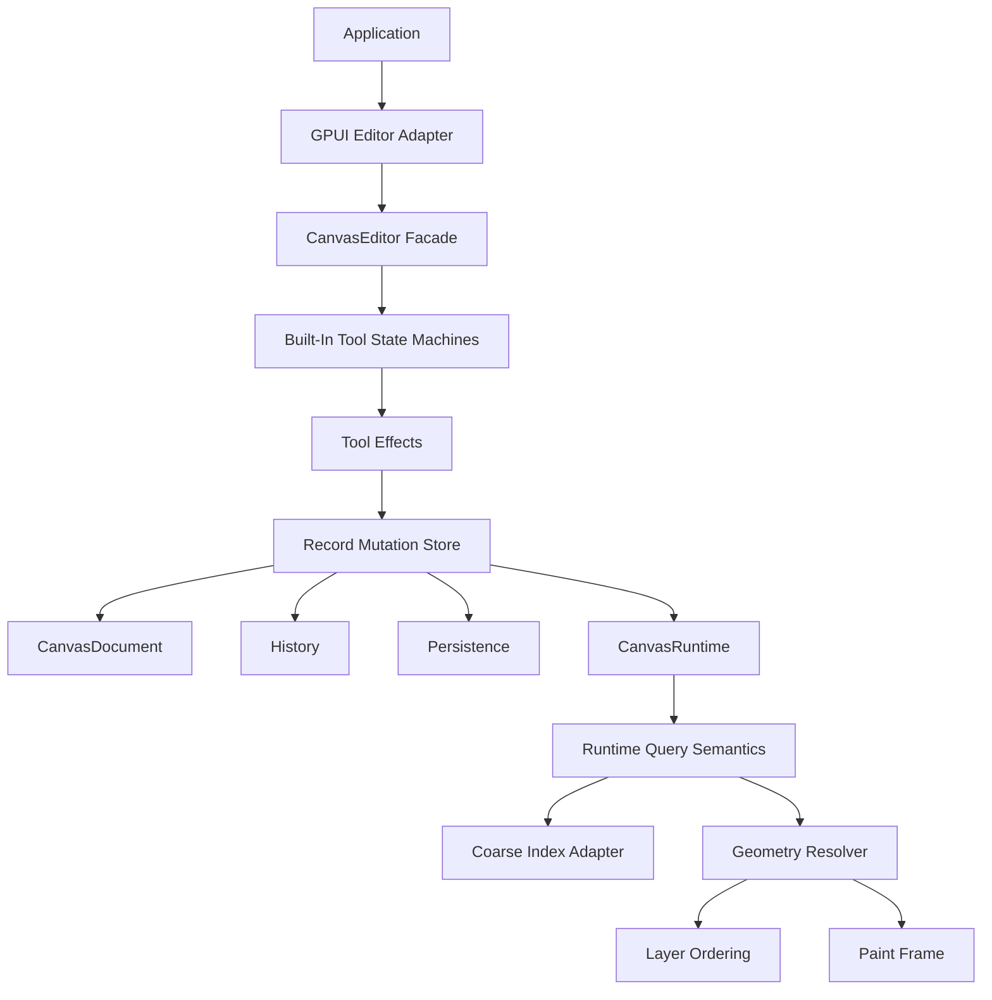

# refactor: Deepen Canvas Follow-Up Seams

## Summary

This plan records the next pre-1.0 `open-gpui-canvas` refactor opportunities found after the
latest tool, z-order, runtime, geometry, and GPUI adapter work. The goal is to remove remaining
shallow APIs before more product features make them harder to change.

---

## Problem Frame

The current canvas baseline is healthier than the initial MVP: document writes mostly go through
the editor mutation path, runtime query owns final hit semantics, geometry is more centralized, and
built-in tools are no longer fully embedded in `CanvasEditor`. The follow-up issues are now more
specific. Some fixed behavior still lives in the wrong module, some public structs still expose
mutable internals, and some adapter ergonomics remain too manual for application authors.

These issues are worth handling before a wider canvas ecosystem appears. They are not urgent
runtime crashes, but they are the kind of pre-1.0 seams that become expensive once downstream
crates depend on them.

---

## Requirements

**Mutation And Store Discipline**

- R1. Public document and selection APIs must not let callers bypass transaction, journal,
  validation, runtime sync, history, or persistence semantics.
- R2. Store-level committed mutations must remain the durable fact source for history,
  persistence, replay, and future CRDT adapters.

**Layering And Tool Locality**

- R3. Layer ordering must be domain logic outside the select tool reducer.
- R4. Built-in select behavior must be split into smaller state-machine components before lasso,
  text edit, pinch, snap, and richer resize modes are added.

**Runtime, Geometry, And Adapter Depth**

- R5. Runtime query must keep final filtering and ordering semantics inside canvas-owned modules
  even when coarse index adapters change.
- R6. Geometry must stay the shared source for hit, route, endpoint, nearest-point, snap, and paint
  interpretation.
- R7. The GPUI adapter must keep improving the default editor-backed path without claiming keyboard
  focus ownership it cannot enforce.

**Pre-1.0 API Hygiene**

- R8. APIs that expose inconsistent state construction or duplicate preferred paths should be
  removed instead of deprecated.

---

## Key Technical Decisions

- KTD1. **Move fixed behavior to its owning module:** shape translation and adjacent z-order are
  now functionally fixed, but z-order semantics should not remain buried in tool code.
- KTD2. **Prefer semantic APIs over public fields:** read access can stay cheap, but mutable access
  must be guarded because future Loro, redb, and rkyv adapters cannot defend against out-of-band
  record edits.
- KTD3. **Keep indexes as candidate providers:** a third-party R-tree, static AABB index, or GPU
  culling helper should not own z-order, stale suppression, precise hit, or visibility rules.
- KTD4. **Do not hide GPUI focus reality:** default adapters can reduce boilerplate, but keyboard
  forwarding remains an explicit focus-owner responsibility unless GPUI provides a stronger widget
  focus abstraction.
- KTD5. **Delete pre-release escape hatches:** because the canvas crate has not stabilized, removing
  misleading constructors is safer than carrying deprecated APIs.

---

## High-Level Technical Design

The target shape keeps `CanvasEditor` as the public command facade. Tool modules express user
intent and emit effects. The mutation store applies record changes and publishes committed semantic
diffs. Runtime query and geometry remain the only places that interpret hit, culling, ordering, and
paint geometry.

---

## Implementation Units

### U1. CanvasDocument And CanvasSelection Guardrails

**Goal:** Tighten public mutable state so document and selection invariants cannot be bypassed by
application code.

**Requirements:** R1, R2, R8.

**Files:**

- `crates/canvas/src/document.rs`
- `crates/canvas/src/tool.rs`
- `crates/canvas/src/mutation.rs`
- `crates/canvas/src/changes.rs`
- `crates/canvas/src/persistence/store.rs`
- `crates/canvas/tests/json_canvas_examples.rs`

**Approach:** Add focused read helpers and selection mutation helpers first, then make public fields
private where the crate surface allows it. Keep import, replay, and test construction paths explicit
instead of relying on direct map writes.

**Test scenarios:**

- `crates/canvas/src/document.rs`: callers can read nodes, edges, shapes, metadata, and counts
  through accessors without direct field access.
- `crates/canvas/src/tool.rs`: selection add, replace, retain, clear, and mixed node/shape/edge
  cases preserve pruning semantics.
- `crates/canvas/src/mutation.rs`: deleting a node still emits committed node and incident-edge
  semantic changes through the store path.
- `crates/canvas/tests/json_canvas_examples.rs`: JSON Canvas import/export tests compile without
  direct mutation of document internals.

### U2. Layer Ordering Module

**Goal:** Extract z-order semantics from tool code into a reusable module for nodes, edges, shapes,
and mixed selections.

**Requirements:** R3, R6, R8.

**Files:**

- `crates/canvas/src/tool.rs`
- new `crates/canvas/src/layer.rs`
- `crates/canvas/src/runtime.rs`
- `crates/canvas/src/resolve.rs`
- `crates/canvas/src/lib.rs`

**Approach:** Move adjacent layer swapping, z-index normalization, stable ordinal handling, and
multi-select relative ordering into a layer module. Tools should request a layer command and receive
a transaction or effect; runtime and paint should share the same ordering interpretation.

**Test scenarios:**

- `crates/canvas/src/layer.rs`: sparse z-index values move across the next adjacent layer, not just
  by arithmetic `+1` or `-1`.
- `crates/canvas/src/layer.rs`: duplicate z-index values preserve deterministic ordinal order.
- `crates/canvas/src/layer.rs`: mixed node, edge, and shape selections keep relative order while
  moving forward or backward.
- `crates/canvas/src/tool.rs`: undo and redo restore layer order through the normal transaction
  path.

### U3. Select Tool State Machine Deepening

**Goal:** Split the select tool into explicit state nodes and effect helpers before adding more
editing behavior.

**Requirements:** R4, R8.

**Files:**

- `crates/canvas/src/tool.rs`
- `crates/canvas/src/tool/builtin.rs`
- new `crates/canvas/src/tool/select.rs`
- `crates/canvas/src/gesture.rs`
- `crates/canvas/README.md`

**Approach:** Keep the editor as dispatcher and mutation owner, but move select idle, pointing,
translating, resizing, marquee, and cancel transitions into a select module. The select module
should understand records generically enough that node and shape movement do not diverge again.

**Test scenarios:**

- `crates/canvas/src/tool/select.rs`: node-only, shape-only, and mixed selections enter the same
  translation path.
- `crates/canvas/src/tool/select.rs`: cancel restores the original prepared gesture for nodes and
  shapes.
- `crates/canvas/src/tool/select.rs`: resize and future marquee states do not share ad hoc pointer
  branches with translation.
- `crates/canvas/src/tool.rs`: `CanvasEditor::handle_event` remains a thin dispatcher plus effect
  application path.

### U4. Runtime Query And Geometry Contract Audit

**Goal:** Make the runtime query and geometry contracts strong enough that future index and router
adapters cannot fork visible behavior.

**Requirements:** R5, R6.

**Files:**

- `crates/canvas/src/runtime.rs`
- `crates/canvas/src/spatial_cache.rs`
- `crates/canvas/src/index.rs`
- `crates/canvas/src/resolve.rs`
- `crates/canvas/src/routing.rs`
- `crates/canvas/tests/spatial_index_strategies.rs`

**Approach:** Audit public constructors and test helpers that can inject inconsistent runtime
state. Keep coarse candidate replacement possible, but ensure final visibility, locked/hidden
rules, z-order, precise edge hit, and route geometry are owned by runtime query and geometry.

**Test scenarios:**

- `crates/canvas/src/runtime.rs`: no public constructor accepts a concrete index without also
  rebuilding or validating runtime-owned graph and geometry caches.
- `crates/canvas/tests/spatial_index_strategies.rs`: candidate order changes do not change final
  hit order for overlapping records.
- `crates/canvas/src/resolve.rs`: edge paint and edge hit consume the same resolved geometry for
  straight, polyline, orthogonal, and curved routes.
- `crates/canvas/src/routing.rs`: custom routers flow through runtime query, precise hit, preview,
  and paint without separate endpoint calculations.

### U5. GPUI Adapter Ergonomics And Documentation

**Goal:** Reduce default integration boilerplate while documenting keyboard ownership accurately.

**Requirements:** R7, R8.

**Files:**

- `crates/canvas/src/gpui.rs`
- `examples/smoke-native/src/main.rs`
- `examples/canvas-notes/src/main.rs`
- `crates/canvas/README.md`
- `docs/adr/0002-open-gpui-canvas-architecture.md`

**Approach:** Keep explicit keyboard forwarding in the public contract, then make pointer, wheel,
paint-frame, overlay, and mapper wiring easier to use from examples. Remove stale helpers that
expose `CanvasPaintModel` parts without a full runtime snapshot.

**Test scenarios:**

- `crates/canvas/src/gpui.rs`: default editor view registers pointer and wheel handling through one
  input mapper path.
- `crates/canvas/src/gpui.rs`: keyboard helpers dispatch Delete, Backspace, and Escape only when
  the focus owner forwards the event.
- `examples/smoke-native/src/main.rs`: the smoke example demonstrates the default adapter without
  duplicating low-level pointer setup.
- `examples/canvas-notes/src/main.rs`: sparse overlays still derive placement from the same frame
  used for batched paint.

### U6. Public API Cleanup Pass

**Goal:** Remove obsolete pre-release API surface after the deeper modules exist.

**Requirements:** R8.

**Files:**

- `crates/canvas/src/document.rs`
- `crates/canvas/src/runtime.rs`
- `crates/canvas/src/gpui.rs`
- `crates/canvas/src/tool.rs`
- `crates/canvas/README.md`

**Approach:** Search for constructors, public fields, and helper functions that let callers bypass
the preferred document, runtime, geometry, or GPUI paths. Remove them directly unless a current
example or test proves a real extension use case.

**Test scenarios:**

- `crates/canvas/src/runtime.rs`: inconsistent runtime construction paths are gone or crate-private.
- `crates/canvas/src/gpui.rs`: paint model construction requires a coherent editor or runtime
  snapshot.
- `crates/canvas/README.md`: public examples use the surviving preferred APIs only.
- Workspace checks compile without deprecation shims.

---

## Scope Boundaries

### In Scope

- Breaking pre-1.0 API cleanup inside `open-gpui-canvas`.
- Moving already-fixed behavior into deeper owning modules.
- Focused tests for invariants exposed by the latest reviews.
- Documentation updates for the default adapter and mutation discipline.

### Deferred

- New product features such as lasso, text editing, pinch zoom, snap guides, obstacle routing, and
  rich node widgets.
- Concrete Loro, redb, or rkyv adapters.
- Public stable trait design for third-party index backends.
- GPU culling or GPU path rendering.

### Out Of Scope

- Replacing the core node, edge, and shape record model.
- Copying xyflow's DOM/SVG rendering architecture.
- Making every canvas record a GPUI element.

---

## System-Wide Impact

This work intentionally changes public pre-1.0 APIs. The highest blast radius is document and
selection encapsulation because tests, examples, and downstream prototypes may read fields directly.
The second highest blast radius is GPUI adapter cleanup because examples currently serve as public
API guidance.

Layer extraction and select state-machine deepening are lower-risk if they preserve transactions
and tests through the existing editor facade. Runtime and geometry audits are medium-risk because a
small inconsistency there can create visible divergence between hit testing and paint.

---

## Risks & Dependencies

- **Risk: Guardrails become ceremony.** Mitigation: add compact read and builder APIs before making
  fields private.
- **Risk: Layer extraction duplicates runtime ordering.** Mitigation: make layer commands and
  runtime ordering share the same ordering primitive.
- **Risk: Tool state-machine split creates too many tiny modules.** Mitigation: split by state
  ownership and effect boundaries, not by every helper function.
- **Risk: GPUI adapter overclaims keyboard ownership.** Mitigation: document keyboard forwarding as
  explicit and only own pointer, wheel, paint, and overlay wiring by default.
- **Risk: API cleanup removes useful extension points.** Mitigation: keep low-level coherent
  snapshot APIs, but remove paths that can construct inconsistent state.

---

## Sources / Research

- `docs/plans/2026-06-09-001-refactor-canvas-architecture-seams-plan.md`
- `docs/adr/0002-open-gpui-canvas-architecture.md`
- `docs/adr/0003-open-gpui-canvas-spatial-index-strategy.md`
- `crates/canvas/src/document.rs`
- `crates/canvas/src/tool.rs`
- `crates/canvas/src/tool/builtin.rs`
- `crates/canvas/src/mutation.rs`
- `crates/canvas/src/changes.rs`
- `crates/canvas/src/persistence/store.rs`
- `crates/canvas/src/runtime.rs`
- `crates/canvas/src/spatial_cache.rs`
- `crates/canvas/src/resolve.rs`
- `crates/canvas/src/routing.rs`
- `crates/canvas/src/gpui.rs`
