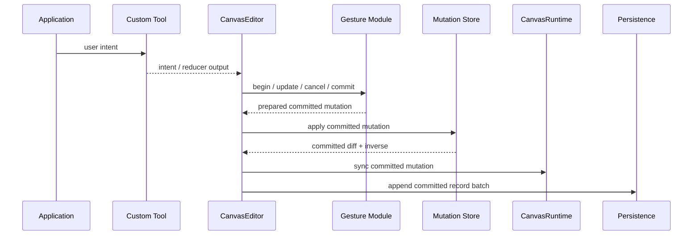
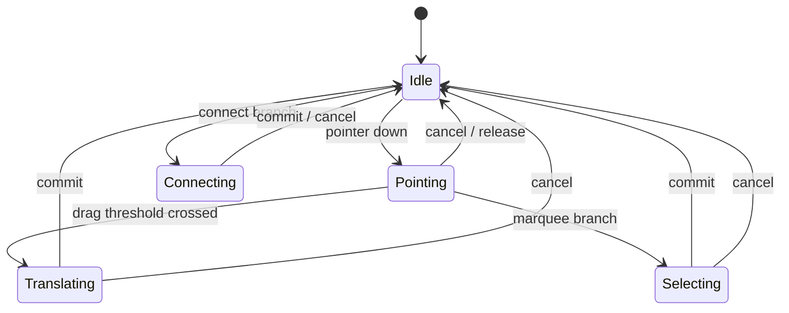

# refactor: Deepen Canvas Custom Tool and Fact Seams

## Summary

This plan covers the next canvas deepening pass after the release-surface tightening commit.
The remaining work focuses on a shallow public custom-tool effect surface, on making committed
mutation the only shared fact source, and on deleting helper APIs that still let callers construct
inconsistent runtime or adapter state.

---

## Problem Frame

The canvas baseline is healthier now than it was before the latest release-surface cleanup.
The public `SpatialIndex` export is gone, runtime sync now prefers committed mutations, and the
package metadata and docs point at the surviving release paths.

The remaining friction is narrower but still load-bearing. Public custom tools still need to
understand internal gesture and effect ordering. Store and persistence concepts are still
adjacent enough that new code can drift toward intent-only reasoning. A few helper paths still
invite callers to think in raw diffs or inconsistent adapter construction, which is exactly the
kind of seam that becomes expensive once downstream crates start depending on it.

This plan keeps the fearless pre-1.0 posture: delete misleading escape hatches, deepen the owning
modules, and do not add deprecation shims for APIs that should not survive.

---

## Requirements

**Custom Tool Semantics**

- R1. Public custom tool APIs must express user intent without requiring authors to know internal
  gesture ordering or editor state transitions.
- R2. Gesture commit and cancel must be owned by editor-side modules and produce one committed
  mutation fact.

**Store, Runtime, And Persistence Facts**

- R3. `CanvasCommittedMutation` must remain the shared fact source for runtime sync, undo/redo,
  persistence, and replay.
- R4. Durable store records must not require callers to forge record operation batches or infer
  semantics from intent-only transactions.

**API And Documentation Hygiene**

- R5. Remaining inconsistent constructors, helpers, or docs that can build incoherent runtime or
  paint state must be deleted rather than deprecated.
- R6. Examples, benches, and ADR text must continue to point at the surviving preferred paths.

---

## Key Technical Decisions

- KTD1. **Separate public intent from internal effect ordering:** custom tool authors should
  describe user intent, while the editor owns gesture state and commit sequencing.
- KTD2. **Keep committed mutation as the shared fact source:** runtime, history, and persistence
  should all consume the same committed object or its owned views.
- KTD3. **Delete inconsistent escape hatches:** if a helper can construct a mismatched document,
  runtime, or paint snapshot, remove it instead of preserving it behind a deprecated name.
- KTD4. **Keep the hidden `SpatialIndex` as an oracle only:** tests and benches may use it for
  parity, but it should not reappear as a top-level public path.

---

## High-Level Technical Design

The shape keeps public tools on the intent side of the seam. The editor and gesture modules own
state transitions. The store owns committed facts. Runtime, history, and persistence consume those
facts instead of reconstructing them from raw diffs.

---

## Implementation Units

### U1. Custom Tool Intent And Gesture Ownership

**Goal:** Split the public custom-tool contract from internal gesture ordering and commit logic.

**Requirements:** R1, R2.

**Dependencies:** None.

**Files:**

- `crates/canvas/src/tool.rs`
- `crates/canvas/src/tool/builtin.rs`
- `crates/canvas/src/gesture.rs`
- `crates/canvas/src/gpui.rs`
- `crates/canvas/src/persistence/store.rs`
- `crates/canvas/README.md`
- `crates/canvas/tests/persistence.rs`

**Approach:** Introduce a deeper public intent layer for custom tools so authors do not need to
reason about `BeginGesture`, `UpdateGesture`, `CommitGesture`, or `SetState(ToolState)` ordering.
Keep the editor as the only owner of gesture lifecycle and effect application. Built-in tools can
keep their state-machine internals, but the public surface should read like intent, not internal
editor choreography.

**Patterns to follow:** `CanvasGestureSession`, the existing built-in tool modules, and the
current `CanvasToolReducer` effect application path.

**Test scenarios:**

- `crates/canvas/src/tool.rs`: a custom drag tool can commit and cancel without synthesizing
  internal editor state transitions.
- `crates/canvas/src/tool.rs`: invalid or out-of-order custom tool effects are rejected or
  normalized at the editor seam.
- `crates/canvas/src/persistence/tests.rs`: a persistent custom gesture produces one committed log
  entry, not a sequence of transient gesture writes.
- `crates/canvas/src/tool/builtin.rs`: built-in select behavior still reaches translate, resize,
  connect, and cancel behavior through the new intent surface.

**Verification:** The unit is complete when custom tool authors can express actions without
knowing the editor's internal gesture order.

---

### U2. Store-First Mutation Facts

**Goal:** Keep committed mutation as the authoritative fact source across history, runtime sync,
and persistence.

**Requirements:** R3, R4.

**Dependencies:** U1.

**Files:**

- `crates/canvas/src/mutation.rs`
- `crates/canvas/src/changes.rs`
- `crates/canvas/src/persistence/store.rs`
- `crates/canvas/src/persistence/tests.rs`
- `crates/canvas/src/tool.rs`
- `crates/canvas/src/runtime.rs`

**Approach:** Preserve command intent as a derivable view, but make committed mutation the object
that history, persistence, and runtime sync consume. Reduce any remaining public batch fields or
constructors that let callers forge inconsistent record operations. Keep replay-only legacy paths
explicitly labeled as such.

**Patterns to follow:** `CanvasCommittedMutation`, `CanvasRecordMutationStore`,
`CanvasLogEntry::from_committed_mutation`, and the existing undo/redo persistence flow.

**Test scenarios:**

- `crates/canvas/src/mutation.rs`: deleting a node still reports the node delete plus incident
  edge deletes in the committed batch.
- `crates/canvas/src/persistence/tests.rs`: undo and redo reuse the prepared mutation that was
  already logged.
- `crates/canvas/src/persistence/tests.rs`: legacy replay entries stay replay-only and are not
  treated as committed semantic truth.
- `crates/canvas/src/runtime.rs`: runtime parity tests continue to pass when sync is driven by the
  committed mutation object.

**Verification:** The unit is complete when no durable observer needs to infer truth from
transaction intent or raw diffs.

---

### U3. API And Documentation Cleanup

**Goal:** Delete any remaining helper, constructor, or doc path that still points callers at an
inconsistent runtime or adapter shape.

**Requirements:** R5, R6.

**Dependencies:** U1, U2.

**Files:**

- `crates/canvas/src/runtime.rs`
- `crates/canvas/src/gpui.rs`
- `crates/canvas/README.md`
- `docs/adr/0003-open-gpui-canvas-spatial-index-strategy.md`
- `crates/canvas/tests/spatial_index_strategies.rs`
- `crates/canvas/benches/spatial_index_strategies.rs`

**Approach:** Keep the hidden `SpatialIndex` only as a test and benchmark oracle. Keep the
committed-mutation runtime path and delete any remaining inconsistent constructor or helper that
can pair mismatched document, runtime, or paint state. Update the README and ADR text so they
match the surviving preferred path instead of describing a deprecated one.

**Patterns to follow:** The current hidden `index` module for parity tests, the editor-backed GPUI
adapter, and the committed-mutation sync path in `CanvasEditor`.

**Test scenarios:**

- `crates/canvas/README.md`: the examples compile against the surviving preferred APIs only.
- `crates/canvas/tests/spatial_index_strategies.rs`: parity tests continue to compile through the
  hidden oracle path.
- `crates/canvas/benches/spatial_index_strategies.rs`: benchmarks still compare candidates against
  the oracle without exposing it as a top-level public path.
- `crates/canvas/src/gpui.rs`: default adapter docs and helpers do not overclaim keyboard focus
  ownership.

**Verification:** The unit is complete when public docs and helper APIs no longer advertise
inconsistent state construction paths.

---

## Scope Boundaries

### Deferred for later

- New product features such as lasso, text editing, pinch zoom, richer snap policies, obstacle
  routing, and richer widget overlays.
- Concrete Loro, redb, or rkyv adapters.
- GPU culling or GPU path rendering.
- Public stable trait design for user-selectable index backends.

### Outside this product's identity

- Copying xyflow's DOM/SVG rendering architecture.
- Making every canvas record a GPUI element.
- Reintroducing public APIs that let callers bypass the editor, store, runtime, or geometry seams.

---

## System-Wide Impact

This plan changes public pre-1.0 APIs and the docs that teach them. The highest blast radius is the
custom-tool surface, because downstream reducers will feel that change directly.

The second highest blast radius is persistence semantics, because the plan keeps tightening the
path between committed mutation, undo/redo, and log entries. The lowest blast radius is the hidden
oracle path, because it stays available to tests and benches while remaining out of the public
surface.

---

## Risks & Dependencies

- **Risk: the custom-tool split becomes too shallow.** Mitigation: keep intent and internal effect
  ordering on opposite sides of the seam.
- **Risk: store semantics drift during the cleanup.** Mitigation: keep committed mutation as the
  single cross-module fact source and expand the persistence parity tests.
- **Risk: API cleanup removes a useful extension point.** Mitigation: keep low-level parity and
  benchmark helpers only when they are genuine test or adapter seams.
- **Risk: documentation drifts away from the surviving API.** Mitigation: update README and ADR
  text in the same change that deletes the escape hatch.

---

## Sources / Research

- `docs/plans/2026-06-09-002-refactor-canvas-follow-up-seams-plan.md`
- `docs/adr/0002-open-gpui-canvas-architecture.md`
- `docs/adr/0003-open-gpui-canvas-spatial-index-strategy.md`
- `crates/canvas/src/tool.rs`
- `crates/canvas/src/tool/builtin.rs`
- `crates/canvas/src/gesture.rs`
- `crates/canvas/src/mutation.rs`
- `crates/canvas/src/changes.rs`
- `crates/canvas/src/persistence/store.rs`
- `crates/canvas/src/runtime.rs`
- `crates/canvas/src/gpui.rs`
- `crates/canvas/README.md`
- `crates/canvas/tests/spatial_index_strategies.rs`
- `crates/canvas/benches/spatial_index_strategies.rs`
