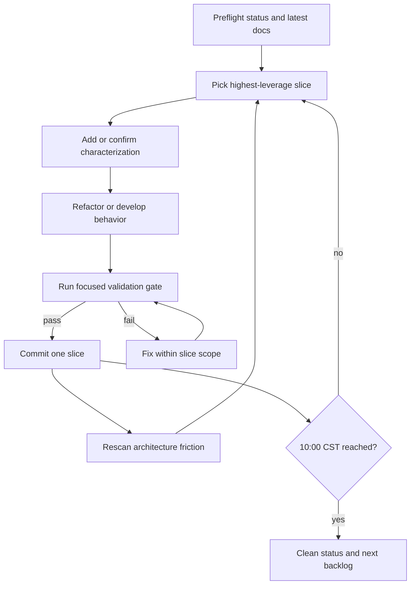
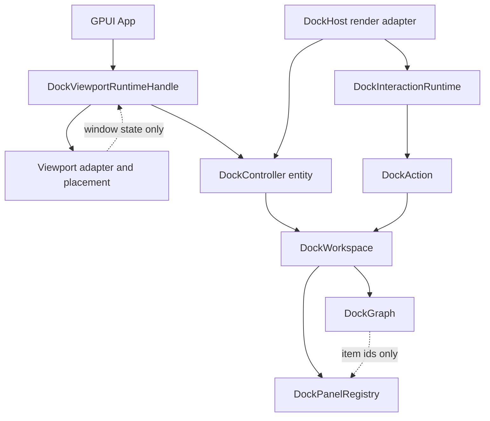

# refactor: Run docking morning refactor program

## Summary

Run docking work continuously until 2026-06-09 10:00 CST as a sequence of verified, independently
committable refactor and development slices. The loop is: pick the highest-leverage slice, add or
confirm characterization, deepen the module or ship the product behavior, verify, commit, then
rescan for the next issue before starting the next slice.

---

## Problem Frame

The previous docking lifecycle work completed the three urgent seams: `DockHost` no longer owns
separate transient interaction fields, viewport close prevention has a GPUI should-close phase, and
panel descriptors are distinct from live GPUI view lifecycle state. The remaining risk has shifted
from one known seam to continuous productization: the public API still needs a stronger teaching
path, large files such as `crates/gpui_docking/src/viewport.rs` and
`crates/gpui_docking/src/graph.rs` are accumulating multiple responsibilities, and tests are
starting to mix behavior characterization with broad integration setup.

This plan turns the morning into a disciplined refactoring program rather than one oversized
change. The program should make forward progress even when one candidate turns out to be too risky:
each slice has its own verification and commit boundary, and each completed slice triggers a fresh
architecture scan to select the next target.

---

## Requirements

- R1. Preserve ADR 0002: `DockGraph` and `DockLayout` stay pure data, `DockHost` stays a GPUI render
  adapter, `DockController` or `DockWorkspace` owns durable state commits, and viewport runtime
  state stays outside graph persistence.
- R2. Keep every slice independently reviewable, verified, and committable; do not carry a large
  uncommitted refactor across multiple hours when a smaller commit boundary exists.
- R3. Start from the highest-leverage productization work: public API stabilization, examples, and
  tests that teach the recommended controller-backed setup path.
- R4. Use fearless refactoring where the current interface is shallow or the implementation has
  poor locality, but do not create speculative traits or adapters for hypothetical future use.
- R5. Add or preserve characterization before moving behavior across modules, especially in
  `viewport.rs`, `graph.rs`, `render.rs`, and `host_tests.rs`.
- R6. After each verified commit, rescan for new architecture friction and choose the next slice
  from evidence rather than blindly following a stale queue.
- R7. Protect concurrent user edits: inspect `git status` before each slice, stage only files
  touched for that slice, and never reset, restore, checkout, stash, or delete unrelated changes.
- R8. Keep validation focused but strong: `cargo fmt --check`,
  `cargo nextest run -p open-gpui-docking --no-fail-fast`, `cargo clippy -p open-gpui-docking
  --all-targets`, and `cargo doc -p open-gpui-docking --no-deps` are the default gate after
  behavior or public API changes.
- R9. Keep `examples/docking-native/src/main.rs` copyable as the reference app-author flow when
  public API or viewport lifecycle behavior changes.
- R10. At or before 2026-06-09 10:00 CST, stop on a clean checkpoint: committed work, fresh status,
  validation evidence, and a short next-backlog note if more issues remain.

---

## Scope Boundaries

In scope:

- `crates/gpui_docking/src/*.rs`
- `examples/docking-native/src/main.rs`
- `docs/plans/*.md`
- `docs/adr/0002-docking-gpui-integration.md` only if a decision must be clarified

Deferred for later:

- Focus restoration, keyboard traversal, and accessibility behavior.
- Rich floating chrome, snapping, resize handles, and merge previews beyond existing behavior.
- Cross-monitor DPI refinements beyond the current placement snapshot contract.
- Full platform-specific behavior on Windows, Linux, or web beyond code paths covered by existing
  GPUI abstractions.

Out of scope:

- Moving docking into `crates/gpui`.
- Storing `AnyView`, `Entity`, `WindowHandle`, `WindowId`, focus state, or runtime drag state in
  `DockGraph` or `DockLayout`.
- Broad clippy cleanup in unrelated crates such as `open-gpui`, `open-gpui-macos`, or utility
  crates.
- Binding `main` to a worktree or rewriting unrelated repository workflow.

---

## Key Technical Decisions

- KTD1. **Timebox as a queue, not a monolith:** Work should proceed through bounded slices that can
  each be verified and committed. This prevents a late-morning half-refactor from leaving the branch
  hard to review.
- KTD2. **Public API first:** The active public API stabilization plan is the best first slice
  because it improves user leverage and exposes whether the latest lifecycle seams are easy to use.
- KTD3. **Module depth follows evidence:** Large file size alone does not justify extraction. Split
  `viewport.rs` or `graph.rs` only around real concepts that reduce caller knowledge and concentrate
  tests.
- KTD4. **Tests move toward interfaces:** Characterization should assert through public or
  crate-private interfaces such as `DockController`, `DockViewportRuntimeHandle`,
  `DockViewportAdapter`, and `DockWorkspace`, not through incidental field layout.
- KTD5. **Feature work must ride on a stable seam:** Product behavior such as tab reorder,
  close/reopen, or richer viewport release handling should be attempted only after the relevant
  action/runtime seam has characterization.
- KTD6. **Commits are the cadence:** After a slice passes validation, commit with a Conventional
  Commit message before starting another slice unless the next slice is a tiny documentation follow-up
  to the same behavior.
- KTD7. **Warnings are reported, not broadened:** Existing dependency warnings may remain; new
  warnings in `open-gpui-docking` are blockers for the slice that introduced them.

---

## High-Level Technical Design

The morning uses a repeatable execution loop:

The expected architecture after several slices should remain:

---

## Timebox Plan

The exact order can change after each rescan, but this is the starting queue for a run beginning
around 2026-06-09 00:30 CST.

| Window | Target | Expected commit |
| --- | --- | --- |
| 00:30-00:45 | Preflight, set first bounded goal, inspect user changes, confirm validation baseline | none |
| 00:45-02:00 | Public API stabilization slice: builder/docs/example/user-facing tests | `refactor(docking): stabilize controller setup api` |
| 02:00-02:15 | Verify, commit, rescan `lib.rs`, `controller.rs`, `builder.rs`, native example | same slice |
| 02:15-03:45 | Viewport depth slice: extract placement, target arbitration, or close lifecycle modules if evidence supports it | `refactor(docking): deepen viewport runtime modules` |
| 03:45-04:00 | Verify, commit, rescan `viewport.rs` and viewport tests | same slice |
| 04:00-05:30 | Graph/action locality slice: reduce `graph.rs` or `action.rs` responsibility only where tests can follow the interface | `refactor(docking): isolate graph mutation locality` |
| 05:30-05:45 | Verify, commit, rescan graph/action/test friction | same slice |
| 05:45-07:15 | Product behavior slice from fresh evidence: likely tab reorder, close/reopen panel flow, or viewport release polish | `feat(docking): ...` |
| 07:15-07:30 | Verify, commit, rescan product behavior gaps | same slice |
| 07:30-09:00 | Test and docs structure slice: split oversized test setup, update native example and crate docs | `test(docking): organize public behavior coverage` or `docs(docking): ...` |
| 09:00-09:45 | Final architecture scan: find remaining shallow modules and write next actionable backlog | `docs(docking): capture next refactor backlog` if material |
| 09:45-10:00 | Final verification or explicit handoff checkpoint | none unless docs changed |

---

## Implementation Units

### U1. Morning Preflight And First Goal

**Goal:** Start the run without inheriting stale assumptions or staging unrelated work.

**Requirements:** R2, R6, R7, R10

**Files:**

- `docs/plans/2026-06-09-013-refactor-docking-morning-program-plan.md`
- `docs/plans/2026-06-08-010-refactor-docking-public-api-stabilization-plan.md`
- `docs/plans/2026-06-08-012-refactor-docking-lifecycle-seams-plan.md`

**Approach:** Check `git status --short --branch`, inspect the latest docking commits, and create a
bounded goal for only the first implementation unit. Do not create one goal for the whole morning
because later slices should be selected from rescan evidence.

**Verification:**

- Worktree state is known.
- First execution goal names one bounded slice.

### U2. Public API Stabilization Slice

**Goal:** Make the preferred app-author path obvious and tested after the lifecycle refactors.

**Requirements:** R1, R2, R3, R5, R8, R9

**Files:**

- `crates/gpui_docking/src/controller.rs`
- `crates/gpui_docking/src/builder.rs`
- `crates/gpui_docking/src/workspace.rs`
- `crates/gpui_docking/src/lib.rs`
- `crates/gpui_docking/src/tests.rs`
- `crates/gpui_docking/src/host_tests.rs`
- `examples/docking-native/src/main.rs`
- `docs/plans/2026-06-08-010-refactor-docking-public-api-stabilization-plan.md`

**Approach:** Reconcile the active public API stabilization plan with the current code. If the
builder already exists, tighten its docs and tests rather than inventing another setup API. Add
smoke coverage for common controller-backed setup, lazy panel registration, layout export/import,
policy configuration, and mounting a host or runtime viewport without raw `DockNodeId` work in the
common path.

**Test scenarios:**

- A minimal `DockController::builder` setup registers lazy panels and builds a controller without
  direct graph-node construction.
- Exported `DockLayout` contains graph data and item ids but no view or window runtime state.
- Restoring a valid layout plus registering the same panel descriptors does not instantiate lazy
  views just to render tab metadata.
- `examples/docking-native/src/main.rs` uses the same public setup concepts shown in crate docs.

**Verification:**

- `cargo fmt --check`
- `cargo nextest run -p open-gpui-docking --no-fail-fast`
- `cargo doc -p open-gpui-docking --no-deps`
- `cargo clippy -p open-gpui-docking --all-targets`
- `cargo check -p open-gpui-docking-native`

### U3. Viewport Runtime Module Depth Slice

**Goal:** Reduce `viewport.rs` locality pressure without changing the graph/window ownership model.

**Requirements:** R1, R2, R4, R5, R6, R8

**Files:**

- `crates/gpui_docking/src/viewport.rs`
- Possible new files under `crates/gpui_docking/src/viewport/` or adjacent flat modules if that
  better matches repository style
- `crates/gpui_docking/src/host_tests.rs`

**Approach:** Apply the deletion test before splitting. Good extraction candidates are placement
DTO validation, target arbitration, and close lifecycle outcomes because each has a coherent
interface and test surface. Avoid a trait-based adapter unless there are two concrete adapters.

**Test scenarios:**

- Placement validation still rejects duplicate spaces and unsupported versions.
- Close policy still distinguishes pre-close veto from post-close cleanup.
- Overlapping viewport hits still prefer hovered, active, then front-to-back stack order.
- Runtime-opened windows still install should-close hooks that observe later policy changes.

**Verification:**

- Same gate as U2.
- `open-gpui-docking` introduces no new clippy warnings.

### U4. Graph And Action Locality Slice

**Goal:** Concentrate graph mutation knowledge where it belongs and make action behavior easier to
audit.

**Requirements:** R1, R2, R4, R5, R6, R8

**Files:**

- `crates/gpui_docking/src/graph.rs`
- `crates/gpui_docking/src/action.rs`
- `crates/gpui_docking/src/op.rs`
- `crates/gpui_docking/src/layout.rs`
- `crates/gpui_docking/src/tests.rs`
- `crates/gpui_docking/src/host_tests.rs`

**Approach:** Inspect whether `graph.rs` is large because `DockGraph` is a deep module or because
unrelated concerns are living in one file. Extract only when a concept has a stable seam, such as
layout import/export, graph validation, or mutation helpers. Keep public graph APIs stable unless a
clearer internal module can reduce caller knowledge.

**Test scenarios:**

- Layout import/export round-trips roots, splits, floatings, and item ids unchanged.
- Invalid layout validation errors remain stable.
- Same-axis edge docks still flatten into n-ary splits.
- Action application remains transactional when graph operations reject.
- Policy rejections still leave graph state unchanged.

**Verification:**

- Same gate as U2.

### U5. Product Behavior Slice

**Goal:** Use the newly stable seams to ship one user-visible docking behavior if the preceding
refactors leave enough time.

**Requirements:** R1, R2, R5, R8, R9

**Candidate behaviors:**

- Tab reorder within the same tab stack.
- Close/reopen panel flow that keeps panel descriptors separate from graph state.
- Viewport release polish using `DockViewportTargetContext::from_window` for pointer-event paths
  and `DockViewportTargetContext::from_app` when only app-level signals are available.
- Better native example controls for platform viewport close policy and placement restore.

**Files:**

- `crates/gpui_docking/src/action.rs`
- `crates/gpui_docking/src/graph.rs`
- `crates/gpui_docking/src/render.rs`
- `crates/gpui_docking/src/interaction.rs`
- `crates/gpui_docking/src/viewport.rs`
- `crates/gpui_docking/src/host_tests.rs`
- `examples/docking-native/src/main.rs`

**Approach:** Pick one behavior from fresh evidence. Add characterization first, then implement the
smallest complete public behavior. Do not start multiple product behaviors in parallel.

**Test scenarios:**

- The selected behavior has at least one pure graph/action test and one host or viewport integration
  test when UI routing matters.
- Policy-disabled paths return typed rejections or unchanged outcomes.
- Exported layout remains graph-only after the behavior runs.

**Verification:**

- Same gate as U2.

### U6. Test Structure And Public Behavior Coverage

**Goal:** Keep the test suite navigable as docking coverage grows.

**Requirements:** R2, R4, R5, R6, R8

**Files:**

- `crates/gpui_docking/src/host_tests.rs`
- `crates/gpui_docking/src/tests.rs`
- Possible new test modules under `crates/gpui_docking/src/`

**Approach:** Split only along reader intent: public API smoke tests, viewport lifecycle tests,
graph/action mutation tests, and render interaction tests. Avoid reshuffling tests merely to reduce
line count if the resulting modules do not improve locality.

**Test scenarios:**

- Existing 120-test docking suite remains green.
- Public API setup tests can be found without scanning render interaction tests.
- Viewport lifecycle tests are close to viewport runtime code or named clearly.

**Verification:**

- `cargo nextest run -p open-gpui-docking --no-fail-fast`

### U7. Final Rescan And Next Backlog

**Goal:** End the timebox with evidence for the next refactor cycle instead of an ambiguous "more to
do" state.

**Requirements:** R6, R10

**Files:**

- `docs/plans/*.md`
- Optional temp architecture review report outside the repo if a full visual review is warranted

**Approach:** Re-run a lightweight architecture scan over `crates/gpui_docking/src`, compare the
remaining friction against ADR 0002, and either update an active plan or create a short next-backlog
plan. If the scan finds a major new candidate, record files, problem, solution, benefits, test
surface, and recommendation strength before ending.

**Verification:**

- `git status --short --branch`
- Latest commits listed with validation evidence.
- Remaining backlog is explicit.

---

## Risks And Dependencies

- **Time risk:** Large module refactors can exceed the morning. Mitigation: stop at slice boundaries
  and commit only verified work.
- **False extraction risk:** Splitting a large file can make interfaces shallower if concepts are not
  real. Mitigation: use the deletion test and require tests to move to the new interface.
- **Platform lifecycle risk:** GPUI window hooks are hard to fully prove outside platform smoke
  paths. Mitigation: keep close-veto logic pure enough for tests and run `open-gpui-docking-native`
  check after public API changes.
- **Warning noise risk:** Workspace dependencies already emit warnings. Mitigation: report existing
  warnings separately and block only new `open-gpui-docking` warnings.
- **Concurrent edit risk:** User edits may arrive during a long run. Mitigation: inspect status
  before each slice and avoid destructive git commands.

---

## Acceptance Examples

- AE1. After the first slice, a new app-author setup path is tested and documented, and the branch
  has a commit that can be reviewed without later slices.
- AE2. After a viewport or graph refactor, public behavior and layout serialization remain unchanged
  under nextest.
- AE3. If a product behavior is started, it ships as one complete behavior with typed policy/error
  handling and tests, not as partial UI wiring.
- AE4. If a slice proves too risky, the run can skip it, record why, and continue to another
  candidate without leaving uncommitted churn.
- AE5. At 2026-06-09 10:00 CST, the branch is either clean or has a precise, intentionally
  uncommitted handoff with validation state and remaining files listed.

---

## Sources

- `docs/adr/0002-docking-gpui-integration.md`
- `docs/plans/2026-06-08-009-feat-docking-user-api-multiviewport-roadmap-plan.md`
- `docs/plans/2026-06-08-010-refactor-docking-public-api-stabilization-plan.md`
- `docs/plans/2026-06-08-012-refactor-docking-lifecycle-seams-plan.md`
- `crates/gpui_docking/src/controller.rs`
- `crates/gpui_docking/src/viewport.rs`
- `crates/gpui_docking/src/graph.rs`
- `crates/gpui_docking/src/host_tests.rs`
