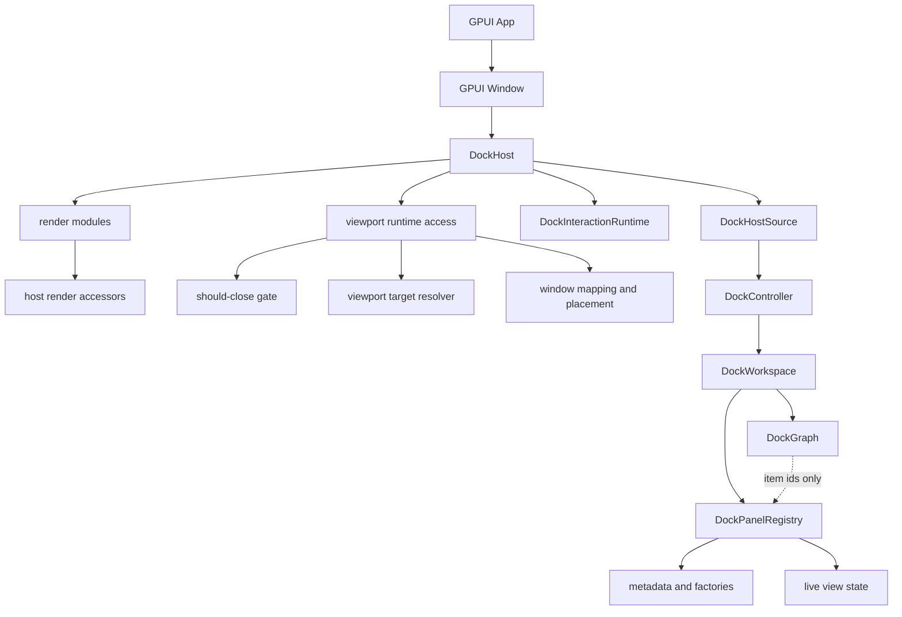
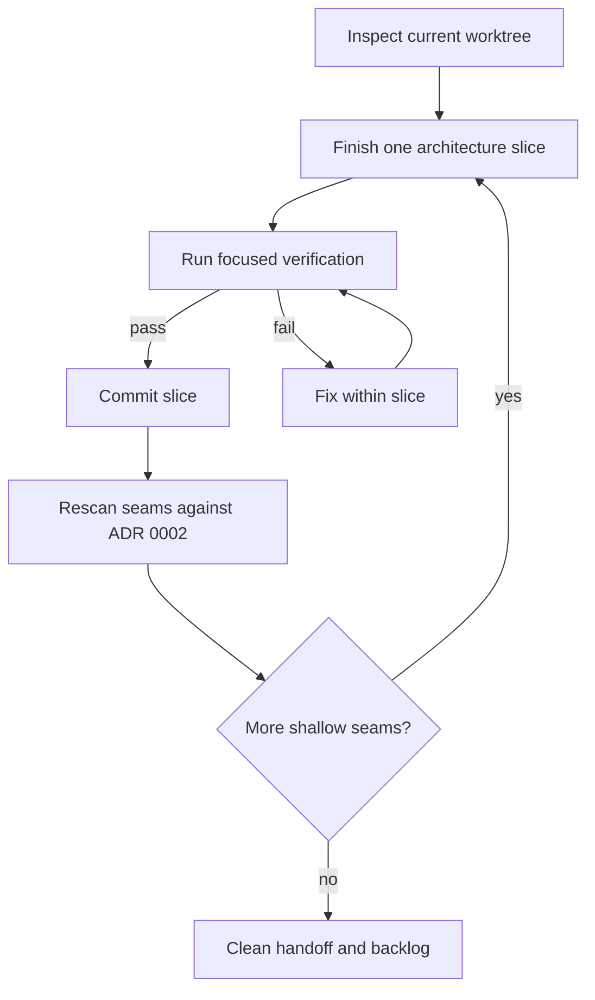

# refactor: Harden docking architecture seams

## Summary

Finish the docking architecture hardening pass around the three remaining seams: narrow
`DockHost` into a render and interaction adapter, prove viewport runtime close and target behavior
through product paths, and keep `DockPanelRegistry` metadata separate from live GPUI view lifecycle
state. Work proceeds as independently verified slices that can be committed as soon as each seam is
stable.

---

## Problem Frame

ADR 0002 sets the right direction: graph and layout are pure data, workspace/controller commit
durable changes, viewport runtime maps logical spaces to GPUI windows, and host renders one dock
space. Recent commits already deepened large parts of viewport and panel lifecycle code, but the
reviewed risk is whether the seams are deep enough in the code paths that application authors will
actually use.

The current checkpoint has uncommitted `DockHost` field-privacy and accessor work. That should be
finished first, then followed by another architecture scan so the next slice is chosen from current
evidence rather than from stale assumptions.

---

## Requirements

- R1. Preserve ADR 0002 ownership boundaries: no `AnyView`, `Entity`, `WindowHandle`, `WindowId`,
  focus state, drag session, placement runtime, or viewport runtime state may enter `DockGraph`,
  `DockOp`, or `DockLayout`.
- R2. Make `DockHost` a narrow GPUI-facing adapter: source ownership, transient interactions,
  pending render overrides, and viewport runtime mapping live behind focused helper types.
- R3. Keep render modules responsible for element construction and pointer fact collection, not for
  owning splitter, floating, tab-drop, viewport, or workspace commit policy.
- R4. Ensure `DockViewportClosePolicy::Prevent` is represented as a true should-close veto for
  runtime-opened GPUI windows, with post-close cleanup remaining a separate phase.
- R5. Ensure viewport target resolution uses explicit arbitration inputs for hovered window, active
  window, front-to-back order, stale mappings, and deterministic fallback.
- R6. Keep panel descriptors, factory metadata, pending restored metadata, and live `AnyView` cache
  state separately queryable so restore and multi-window lifecycles do not force view
  instantiation.
- R7. Preserve existing eager and lazy panel registration compatibility while moving tests and docs
  toward the lifecycle-aware registration model.
- R8. After each meaningful slice, verify the docking crate and commit only the files changed for
  that slice.
- R9. Continue scanning for shallow seams after the named issues are closed; delete dead wrappers or
  compatibility code when tests prove they are no longer needed.

---

## Scope Boundaries

In scope:

- `crates/gpui_docking/src/host.rs`
- `crates/gpui_docking/src/host_source.rs`
- `crates/gpui_docking/src/host_interactions.rs`
- `crates/gpui_docking/src/render*.rs`
- `crates/gpui_docking/src/viewport*.rs`
- `crates/gpui_docking/src/panel*.rs`
- `crates/gpui_docking/src/workspace*.rs`
- `crates/gpui_docking/src/controller*.rs`
- `crates/gpui_docking/src/*tests.rs`
- `examples/docking-native/src/main.rs`
- `docs/architecture/*.md`
- `docs/plans/*.md`

### Deferred to Follow-Up Work

- Tab reorder, whole-stack drag, snapping chrome, rich platform floating windows, keyboard focus
  traversal, and accessibility polish.
- Cross-monitor DPI refinements beyond the current placement snapshot contract.
- Merge-on-viewport-close behavior that moves a detached layout back into another dock space.

Out of scope:

- Moving docking into `crates/gpui`.
- Replacing GPUI platform window ownership, focus semantics, or event dispatch.
- Binding `main` to a worktree or rewriting repository workflow.
- Broad cleanup in unrelated crates.

---

## Key Technical Decisions

- KTD1. **Finish the active host slice first:** The worktree already contains `DockHost` field
  privacy and accessor edits. Finish and verify that slice before starting new viewport or panel
  churn.
- KTD2. **Host access is a boundary, not the final abstraction:** Private host fields and
  crate-private accessors are the first narrowing step. Larger state containers should be added only
  if they hide real ownership detail rather than becoming pass-through structure.
- KTD3. **Viewport productization is evidence-driven:** Existing `viewport_runtime`,
  `viewport_close_gate`, and target resolver modules should be verified through runtime-opened
  window paths before adding more abstractions.
- KTD4. **Panel lifecycle keeps compatibility while teaching the deeper model:** Eager `AnyView`
  registration remains valid, but restored metadata and lazy registration should not imply live
  view instantiation.
- KTD5. **Deletion is part of hardening:** Once call sites move to deeper helpers, remove obsolete
  wrappers, duplicated test fixtures, and legacy entry points that no longer document a supported
  path.
- KTD6. **Commit cadence follows verification:** Each slice lands after focused validation rather
  than accumulating a multi-hour uncommitted rewrite.

---

## High-Level Technical Design

Target ownership after this pass:

Execution loop:

---

## Implementation Units

### U1. Complete Host Accessor Checkpoint

**Goal:** Finish the current uncommitted `DockHost` accessor refactor so render and interaction
modules no longer depend on direct field access.

**Requirements:** R1, R2, R3, R8

**Dependencies:** None

**Files:**

- `crates/gpui_docking/src/host.rs`
- `crates/gpui_docking/src/host_source.rs`
- `crates/gpui_docking/src/host_interactions.rs`
- `crates/gpui_docking/src/host_debug.rs`
- `crates/gpui_docking/src/render.rs`
- `crates/gpui_docking/src/host_render_session.rs`
- `crates/gpui_docking/src/host_*tests.rs`

**Approach:** Finish migrating field reads and writes to crate-private `DockHost` accessors. Keep
public host constructors stable, and keep `DockHostSource` as the workspace/controller ownership
boundary. Any test-only access should go through crate-private helpers rather than old public
fields.

**Patterns to follow:** Current `DockHostSource`, `DockHost::apply_action_from_host`,
`DockWorkspace::apply_action`, `DockViewportRuntime`, and existing host interaction tests.

**Test scenarios:**

- Owned hosts still apply splitter, floating, tab selection, and tab-drop actions through their
  workspace.
- Controller-backed hosts still apply the same actions through the shared controller.
- Host source and interaction runtime fields are private, with test-only debug access routed through
  crate-private helpers.
- Viewport runtime operations still work for owned and controller-backed host paths.
- Debug snapshots can inspect host state without depending on direct host fields.

**Verification:** The crate builds and tests pass with no references to removed `DockHost` fields in
render or interaction code.

### U2. Narrow Render Access To Host State

**Goal:** Reduce render-layer knowledge of mutable host internals after host fields are private
behind crate-private accessors.

**Requirements:** R2, R3, R8, R9

**Dependencies:** U1

**Files:**

- `crates/gpui_docking/src/render.rs`
- `crates/gpui_docking/src/render_tabs.rs`
- `crates/gpui_docking/src/render_split.rs`
- `crates/gpui_docking/src/render_floating.rs`
- `crates/gpui_docking/src/host.rs`
- `crates/gpui_docking/src/host_render_session.rs`
- `crates/gpui_docking/src/host_render_actions.rs`
- `crates/gpui_docking/src/host_*tests.rs`

**Approach:** Add render-facing accessors or a render session object where direct mutation is still
needed. Render code may request current state and submit intents, but it should not know which host
field owns the data. Delete old bridge methods once all call sites use the narrower interface.

**Execution note:** Add characterization only where an accessor change might alter event behavior.

**Test scenarios:**

- Splitter handle rendering and drag callbacks still mutate only through host action paths.
- Floating drag callbacks still respect policy and clear transient state.
- Tab-drop previews render from the same resolved intent used by the drop commit.
- Missing-panel and missing-node rendering remain unchanged.
- No render module directly reaches into host-owned transient fields.

**Verification:** Render modules depend on host accessors or render-session APIs, and obsolete
bridge methods are removed when unused.

### U3. Verify Viewport Close And Target Product Paths

**Goal:** Prove that the viewport runtime modules are not merely pure helpers but are wired through
the runtime-opened GPUI window paths.

**Requirements:** R1, R4, R5, R8

**Dependencies:** U1 may run independently; final documentation should reflect both host and
viewport boundaries.

**Files:**

- `crates/gpui_docking/src/viewport_runtime.rs`
- `crates/gpui_docking/src/viewport_runtime_handle.rs`
- `crates/gpui_docking/src/viewport_close.rs`
- `crates/gpui_docking/src/viewport_close_gate.rs`
- `crates/gpui_docking/src/viewport_target*.rs`
- `crates/gpui_docking/src/viewport_registry.rs`
- `crates/gpui_docking/src/host_viewport*_tests.rs`
- `examples/docking-native/src/main.rs`

**Approach:** Audit runtime-opened windows, close hook installation, policy updates after open, and
target-context construction from GPUI window/app facts. Add or tighten tests where the product path
still exercises only adapter-level helpers. Remove stale close or hit-test wrappers that bypass the
resolver.

**Test scenarios:**

- A runtime-opened viewport installs a should-close hook that observes later policy changes.
- `Prevent` vetoes the close before mapping cleanup, and `RetainLayout` allows close followed by
  mapping cleanup.
- Reused registered windows still install or preserve the should-close path.
- Overlapping viewport hits prefer hovered, active, then front-to-back stack order.
- Stale mappings are ignored without corrupting placement snapshots.
- The native example compiles through the recommended runtime handle path.

**Verification:** No product-facing viewport open, close, or target path relies on lexical map order
or post-close mapping retention as a substitute for close veto.

### U4. Finish Panel Registry Lifecycle Separation

**Goal:** Ensure panel metadata, restored descriptors, factories, and live views have explicit
lifecycle boundaries.

**Requirements:** R1, R6, R7, R8, R9

**Dependencies:** U1 is useful for host/render integration; registry work can otherwise proceed
independently.

**Files:**

- `crates/gpui_docking/src/panel.rs`
- `crates/gpui_docking/src/panel_registry.rs`
- `crates/gpui_docking/src/panel_view.rs`
- `crates/gpui_docking/src/panel_catalog.rs`
- `crates/gpui_docking/src/workspace.rs`
- `crates/gpui_docking/src/workspace_panel_lifecycle*.rs`
- `crates/gpui_docking/src/controller.rs`
- `crates/gpui_docking/src/render.rs`
- `crates/gpui_docking/src/host_panel_tests.rs`

**Approach:** Audit every registry query and workspace restore path. Metadata queries should not
instantiate views. Attaching a live view to restored metadata should be explicit and observable.
Remove old registry names if they hide whether the caller is asking for descriptor data or a live
view.

**Test scenarios:**

- Restored metadata renders tab labels without constructing an `AnyView`.
- Registering a live panel for an existing restored descriptor attaches the view while preserving
  stable item identity.
- Missing-panel detection reports only panels that lack live view state, not panels whose metadata
  is valid.
- Eager registration remains compatible for simple applications.
- Lazy factories instantiate only when rendering or explicit resolution needs a live view.

**Verification:** Registry APIs make metadata and live view semantics clear at call sites, and
layout serialization remains free of live view state.

### U5. Documentation, Example, And Dead-Code Cleanup

**Goal:** Make the hardened seams visible to users and remove obsolete bridge code.

**Requirements:** R1, R7, R8, R9

**Dependencies:** U1, U3, U4

**Files:**

- `crates/gpui_docking/src/lib.rs`
- `examples/docking-native/src/main.rs`
- `docs/architecture/docking-architecture-audit-20260609.md`
- `docs/plans/2026-06-09-014-refactor-docking-architecture-hardening-plan.md`
- Related source files where compatibility wrappers become unused.

**Approach:** Update docs so the recommended model is: graph/layout for durable data,
workspace/controller for commits, host for GPUI rendering, host state or interaction runtime for
transient interaction sessions, viewport runtime for platform windows, and panel lifecycle for live
views. Delete unused wrappers only after search and tests prove they no longer define a supported
entry point.

**Test scenarios:**

- Public rustdoc describes the ownership model without calling `DockHost` the long-term state owner.
- The native example compiles with the recommended controller, viewport runtime, and panel
  lifecycle path.
- Removed wrappers have no remaining call sites in source or tests.

**Verification:** The documentation and example teach the same architecture that the code enforces.

### U6. Continuous Architecture Rescan

**Goal:** Continue finding and fixing shallow seams after the named review items are closed.

**Requirements:** R1, R8, R9

**Dependencies:** Runs after each committed slice.

**Files:**

- `crates/gpui_docking/src/*.rs`
- `docs/architecture/*.md`
- `docs/plans/*.md`

**Approach:** After each verified commit, scan for new ownership leaks, dead compatibility layers,
oversized modules with mixed responsibilities, and tests coupled to implementation fields. Promote
only evidence-backed findings into the next slice.

**Test scenarios:**

- New refactor candidates identify the violated ownership boundary and affected tests.
- Deletions remove unused code without reducing public behavior coverage.
- Remaining known issues are recorded with concrete file paths and verification expectations.

**Verification:** The branch ends each cycle with a clean or intentionally documented worktree and a
clear next slice.

---

## Risks And Dependencies

- **Current dirty worktree risk:** The active `DockHost` accessor edits may contain partial
  migration mistakes. Mitigation: finish U1 before starting unrelated changes.
- **Over-abstraction risk:** Moving state behind helper types can add shallow pass-through APIs.
  Mitigation: delete old bridge methods and keep only accessors that hide real ownership detail.
- **Runtime hook risk:** GPUI should-close behavior is platform-mediated. Mitigation: keep close
  policy logic pure enough for tests and cover runtime-opened window paths.
- **Panel compatibility risk:** Existing eager and lazy registration paths may encode assumptions
  about `AnyView` reuse. Mitigation: preserve compatibility first, then rename or remove only
  proven-dead APIs.
- **Concurrent edit risk:** User edits may arrive during the long run. Mitigation: inspect the
  worktree before each slice and stage only the files touched for that slice.

---

## Acceptance Examples

- AE1. After U1, `DockHost` fields are private behind crate-private accessors, and current host
  behavior remains green.
- AE2. After U2, render code uses host accessors or render-session APIs rather than directly
  mutating host-owned transient state.
- AE3. After U3, a runtime-opened viewport can be prevented from closing before cleanup, and
  overlapping target selection follows explicit arbitration.
- AE4. After U4, restored panel metadata can be displayed and later attached to a live view without
  forcing view creation during restore.
- AE5. After each slice, the branch has a focused commit or a documented reason for keeping the
  slice open.

---

## Sources

- `docs/adr/0002-docking-gpui-integration.md`
- `docs/plans/2026-06-08-012-refactor-docking-lifecycle-seams-plan.md`
- `docs/plans/2026-06-09-013-refactor-docking-morning-program-plan.md`
- `crates/gpui_docking/src/host.rs`
- `crates/gpui_docking/src/host_source.rs`
- `crates/gpui_docking/src/viewport_runtime.rs`
- `crates/gpui_docking/src/viewport_target_resolver.rs`
- `crates/gpui_docking/src/panel_registry.rs`
