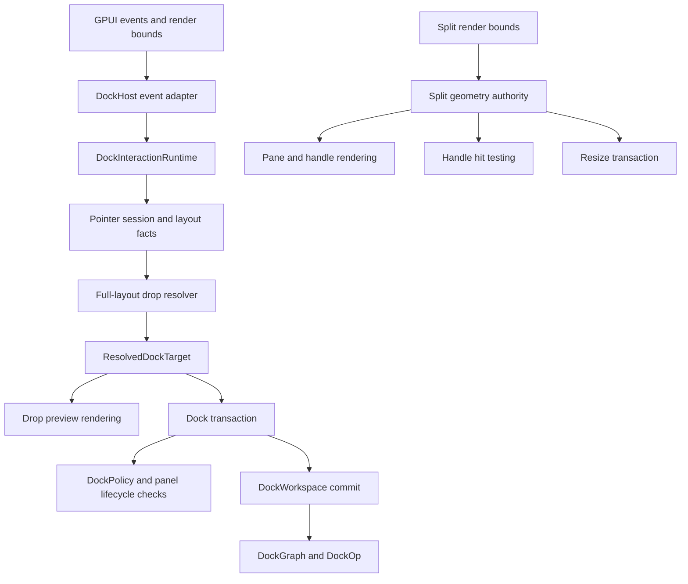
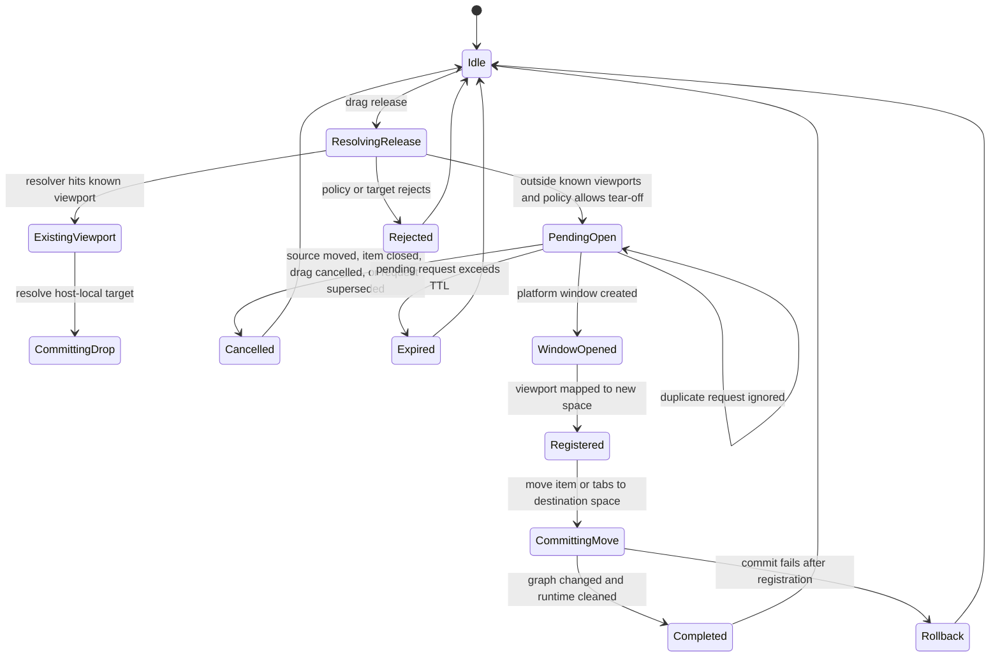
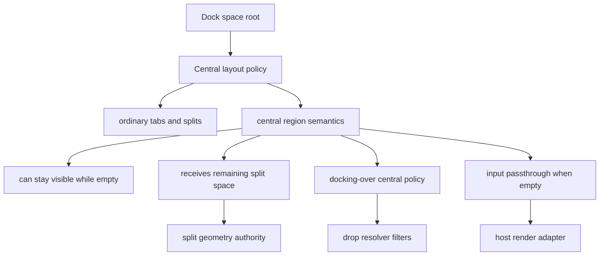

# refactor: Deepen docking interaction foundation

## Summary

Deepen the docking interaction layer so ImGui-like docking can sit on top of the existing ADR 0002
architecture without widening render callbacks or leaking graph mutation details into application
code. The main shift is to make full-layout drop resolution, user-intent transactions, tear-off
runtime state, and split geometry explicit internal authorities.

---

## Problem Frame

The previous architecture hardening pass closed the first layer of issues: `DockGraph` is pure,
`DockLayout` stays serializable, `DockPanelRegistry` separates metadata from live views, and
`DockViewportRuntime` owns platform-window mapping outside graph data. That is enough for the
current product surface, but it is not deep enough for comfortable ImGui-like docking.

The remaining shallow boundary is interaction semantics. `DockAction::MoveTab` still resembles
`DockOp::MoveItem`, tab drop resolution is local to one tab stack, render callbacks still assemble
actions and decide notification behavior, tear-off is a resolver rather than a transaction, and
split rendering does not share one geometry authority with hit testing and resize commits. Central
dockspace behavior is also undefined: ImGui's central node can stay alive while empty, consume
remaining space, and optionally pass input through, which is not the same as an ordinary tab stack.

This plan keeps the successful ownership model from ADR 0002 and deepens the seams underneath it.
The goal is not to port ImGui's immediate-mode `DockContext`; it is to give GPUI a retained,
typed, testable interaction foundation with the same docking affordances.

---

## Requirements

- R1. Preserve ADR 0002 boundaries: `DockGraph`, `DockOp`, and `DockLayout` must not store GPUI
  entities, views, window handles, focus state, transient drag sessions, or viewport runtime state.
- R2. Replace render-facing graph-shaped move actions with a transaction layer that accepts user
  intent, performs policy and source validation, maps errors, and commits through `DockWorkspace`.
- R3. Make one full-layout drop resolver the authority for preview and commit across root, leaf,
  tab-bar reorder, floating title bar, empty dock space, inner target, outer target, and viewport
  target cases.
- R4. Keep `DockHost` and render modules as GPUI event/render adapters: they may collect pointer
  facts and draw resolved previews, but they must not own interaction policy, transaction commits,
  or error swallowing.
- R5. Add a tear-off transaction state machine that covers release, pending request, window open,
  viewport registration, graph move, completion cleanup, cancel, and stale pending recovery.
- R6. Make split geometry the single calculation source for pane rectangles, handle hit
  rectangles, handle centers, minimum-size clamp behavior, and next fractions.
- R7. Define central dockspace semantics before broad graph changes: empty keep-alive, remaining
  space allocation, docking-over policy, and passthrough behavior must have a clear owner.
- R8. Delete obsolete compatibility wrappers and local resolvers after deeper modules replace them,
  with tests proving the supported path.

---

## Scope Boundaries

In scope:

- `crates/gpui_docking/src/action.rs`
- `crates/gpui_docking/src/workspace_action.rs`
- `crates/gpui_docking/src/workspace_move_action.rs`
- `crates/gpui_docking/src/drop_target.rs`
- `crates/gpui_docking/src/tab_drop_runtime.rs`
- `crates/gpui_docking/src/interaction.rs`
- `crates/gpui_docking/src/host.rs`
- `crates/gpui_docking/src/host_interactions.rs`
- `crates/gpui_docking/src/host_render_actions.rs`
- `crates/gpui_docking/src/render*.rs`
- `crates/gpui_docking/src/geometry.rs`
- `crates/gpui_docking/src/splitter.rs`
- `crates/gpui_docking/src/viewport*.rs`
- `crates/gpui_docking/src/policy.rs`
- `crates/gpui_docking/src/builder.rs`
- `crates/gpui_docking/src/lib.rs`
- `crates/gpui_docking/src/*tests.rs`
- `docs/architecture/*.md`
- `docs/adr/0002-docking-gpui-integration.md`

### Deferred to Follow-Up Work

- Polished drag chrome, snapping, tab overflow, dirty markers, close glyphs, icons, and keyboard
  navigation.
- Accessibility traversal and focus restoration beyond preserving GPUI as the focus authority.
- Platform-specific DPI and window-decoration refinements beyond current placement snapshots.
- Merge-on-viewport-close behavior that moves detached content back into another dock space.
- Rich application-level API sugar beyond the interaction foundation needed by existing controller
  and host paths.

Out of scope:

- Porting ImGui's immediate-mode docking internals or `.ini` persistence format.
- Importing `repo-ref/fret` docking crates as dependencies.
- Moving docking into `crates/gpui`.
- Storing `AnyWindowHandle`, `WindowId`, `Entity`, `AnyView`, or focus state in graph/layout data.

---

## Key Technical Decisions

- KTD1. **Full-layout drop resolution leads the refactor:** The resolver determines the canonical
  target vocabulary that transactions, preview rendering, tear-off, and cross-window behavior all
  consume.
- KTD2. **Transactions accept user intent, not graph mechanics:** Render and app code should express
  "drop this dragged tab on the current resolved target" or "resize this handle", while the
  transaction layer expands that into validation and graph ops.
- KTD3. **Preview and commit share one resolved target:** A drop preview must be drawn from the same
  resolver output that a release commits. Recomputing target semantics in the commit path is a
  regression.
- KTD4. **Interaction sessions sit behind host render callbacks:** Render callbacks pass event facts
  into the interaction runtime. The runtime owns pointer session state and returns typed render
  outcomes such as changed preview, committed action, rejected intent, or no-op.
- KTD5. **Split geometry becomes authoritative:** Flex shares, handle hit boxes, and resize clamps
  must come from one pure geometry calculation so the rendered handle and committed fraction cannot
  drift.
- KTD6. **Tear-off is a runtime transaction:** Release outside known targets should not mutate the
  graph until a destination viewport exists and is registered. Pending requests need idempotency,
  cancellation, and stale recovery.
- KTD7. **Central node starts as a semantics seam:** This pass should define central dockspace
  behavior through policy/layout/resolver tests before making `DockGraph` store a new node kind or
  central flag.
- KTD8. **Deletion follows replacement:** Once full-layout resolver, transaction, split geometry,
  and tear-off state paths are in use, remove the old local helpers instead of preserving duplicate
  behavior.

---

## High-Level Technical Design

Interaction flow after this refactor:

Tear-off transaction lifecycle:

Central dockspace semantics:

---

## Implementation Units

### U1. Full-Layout Drop Target Model And Resolver

**Goal:** Replace local tab-stack drop resolution with a resolver that sees the whole dock space,
floating containers, empty roots, and viewport target context.

**Requirements:** R1, R3, R7

**Dependencies:** None

**Files:**

- `crates/gpui_docking/src/drop_target.rs`
- `crates/gpui_docking/src/geometry.rs`
- `crates/gpui_docking/src/tab_drop_runtime.rs`
- `crates/gpui_docking/src/interaction.rs`
- `crates/gpui_docking/src/render_tabs.rs`
- `crates/gpui_docking/src/render_floating.rs`
- `crates/gpui_docking/src/viewport_target.rs`
- `crates/gpui_docking/src/viewport_target_context.rs`
- `crates/gpui_docking/src/host_interaction_tests.rs`
- `crates/gpui_docking/src/host_render_tests.rs`

**Approach:** Introduce a resolved target vocabulary that can represent tab-bar reorder, center
merge, inner edge split, outer root split, floating-title target, empty dock space, known viewport,
and tear-off candidate. The resolver input should be pure facts: graph/layout snapshot, rendered
bounds, pointer position, dragged payload identity, policy, and viewport arbitration context.
Existing `DockDropIntent` can be replaced or narrowed into a projection of this richer target.

**Execution note:** Add characterization tests around the current tab drop and reorder behavior
before replacing the local resolver.

**Patterns to follow:** Current `drop_target::resolve_tabs_drop`, Fret
`repo-ref/fret/ecosystem/fret-docking/src/dock/drop_resolve/target.rs`, and ImGui
`DockNodePreviewDockSetup` / `DockNodeCalcDropRectsAndTestMousePos` as behavior references.

**Test scenarios:**

- A pointer over a tab label resolves to a center reorder target with the expected insertion index.
- A pointer over a leaf body center resolves to center merge and produces preview bounds for that
  leaf.
- A pointer over a leaf edge resolves to an inner edge split target.
- A pointer over the root outer edge resolves to an outer split target when root and leaf differ.
- A pointer over an empty dock space resolves to an empty-space target without requiring a tabs node.
- A pointer over a floating title bar resolves against the floating container's child layout.
- Policy-disabled center merge or edge split returns a typed rejection that can still drive preview
  diagnostics without committing.
- A viewport hit produces a known-viewport target with host-local coordinates, while a miss can
  produce a tear-off candidate only when policy allows platform viewports.

**Verification:** Drop preview and drop commit consume the same resolved target type, and no render
callback needs to choose a zone directly from only one tabs bound.

### U2. Split Geometry Authority

**Goal:** Make one pure geometry module calculate split pane rectangles, handle hit rectangles,
handle centers, min-size clamps, and next fractions.

**Requirements:** R1, R6

**Dependencies:** None

**Files:**

- `crates/gpui_docking/src/geometry.rs`
- `crates/gpui_docking/src/splitter.rs`
- `crates/gpui_docking/src/render_split.rs`
- `crates/gpui_docking/src/interaction.rs`
- `crates/gpui_docking/src/host_interactions.rs`
- `crates/gpui_docking/src/host_render_tests.rs`
- `crates/gpui_docking/src/workspace_resize_policy_tests.rs`
- `crates/gpui_docking/src/graph_split_tests.rs`

**Approach:** Move split-specific calculations into a coherent split geometry authority. Rendering
uses computed pane rects and handle positions. Hit testing uses computed handle hit rects. Resize
uses the same handle center and min-size clamp inputs to produce fractions. Keep graph fraction
normalization and graph validation separate from rendered pixel geometry.

**Execution note:** Characterize the existing flex-share render selectors and resize outcomes
before replacing geometry internals.

**Patterns to follow:** Current `geometry::splitter_handle_bounds`,
`splitter::resize_adjacent_fractions`, and Fret
`repo-ref/fret/ecosystem/fret-docking/src/dock/split_geometry.rs`.

**Test scenarios:**

- Horizontal and vertical split geometry returns one pane rect per child and one handle rect per
  gap.
- Handle centers match the rendered handle positions used by the event layer.
- Non-finite or mismatched fractions are sanitized the same way render currently sanitizes them.
- Dragging a handle grows the adjacent pane and shrinks its neighbor while preserving total share.
- Minimum pane size clamps both directions and handles impossible minimums deterministically.
- Resize returns no action for invalid child counts, invalid handle index, or invalid split extent.

**Verification:** `render_split`, splitter hit testing, and resize actions use the same split
geometry output instead of separate flex-share and fraction calculations.

### U3. Dock Transaction Module For User Intents

**Goal:** Add a transaction layer that receives user-level intents and owns validation, policy,
panel lifecycle checks, graph op projection, commit, and error mapping.

**Requirements:** R1, R2, R3, R8

**Dependencies:** U1

**Files:**

- `crates/gpui_docking/src/action.rs`
- `crates/gpui_docking/src/workspace_action.rs`
- `crates/gpui_docking/src/workspace_move_action.rs`
- `crates/gpui_docking/src/workspace_move_validation.rs`
- `crates/gpui_docking/src/workspace_panel_action.rs`
- `crates/gpui_docking/src/workspace_resize_action.rs`
- `crates/gpui_docking/src/host_render_actions.rs`
- `crates/gpui_docking/src/workspace_move_tests.rs`
- `crates/gpui_docking/src/workspace_resize_policy_tests.rs`

**Approach:** Introduce transaction input types that describe user intent: select item, commit
resolved drop, commit empty-space move, commit splitter resize, commit floating drag, close item,
and open registered item. `DockAction` can remain as a public compatibility layer during the
migration, but render and common app paths should stop constructing graph-shaped move actions.
Transactions convert resolved targets into `DockOp` only after validation succeeds.

**Patterns to follow:** Current `DockWorkspace::apply_action`, `DockWorkspaceMoveTabRequest`,
`DockActionApplyError`, panel close/open action helpers, and policy validation methods.

**Test scenarios:**

- Committing a resolved center target moves or reorders a tab without the caller naming graph op
  details.
- Same-stack center drop without an insertion index remains unchanged when policy allows it.
- Same-stack center reorder with an insertion index changes item order.
- Edge split targets validate target containment before graph mutation.
- Empty-space targets create a root only when the destination space is empty.
- Policy rejections are returned before graph mutation and keep the original graph unchanged.
- Missing source item, missing tabs, wrong node kind, and unregistered panel lifecycle errors map to
  stable transaction errors.

**Verification:** Render/app code no longer needs to understand the full `DockOp::MoveItem` field
set for ordinary tab drops.

### U4. Interaction Session Boundary Behind DockHost

**Goal:** Move pointer-session decisions behind the interaction runtime so render modules only adapt
GPUI events into facts and draw resolved state.

**Requirements:** R2, R3, R4, R8

**Dependencies:** U1, U2, U3

**Files:**

- `crates/gpui_docking/src/interaction.rs`
- `crates/gpui_docking/src/host.rs`
- `crates/gpui_docking/src/host_interactions.rs`
- `crates/gpui_docking/src/host_render_actions.rs`
- `crates/gpui_docking/src/render_tabs.rs`
- `crates/gpui_docking/src/render_split.rs`
- `crates/gpui_docking/src/render_floating.rs`
- `crates/gpui_docking/src/host_interaction_tests.rs`
- `crates/gpui_docking/src/host_floating_tests.rs`
- `crates/gpui_docking/src/host_render_tests.rs`

**Approach:** Make render callbacks call narrow interaction entry points such as drag moved, drag
released, splitter pressed, splitter moved, floating handle pressed, or floating moved. The
interaction runtime reads policy through a host/workspace port and commits through the transaction
port. It returns outcomes that tell `DockHost` whether to notify, render a preview, or clear a
session. Error swallowing should become explicit and testable rather than hidden inside render
callbacks.

**Patterns to follow:** Current `DockInteractionRuntime`, `DockHost::apply_action_from_host`, and
`DockHostRenderSession`.

**Test scenarios:**

- Splitter pointer down starts a session without directly constructing a resize action in render
  code.
- Splitter pointer move commits through the transaction port and notifies only when fractions
  change.
- Floating handle pointer down validates policy, raises the floating container, and starts a drag
  session through one interaction entry point.
- Drop preview updates notify only when the resolved target changes.
- Drop release clears the active drop session after changed, unchanged, and rejected outcomes.
- Render modules contain no policy reads beyond passing event facts through the host adapter.

**Verification:** `DockHost` stores the interaction runtime and controller reference, while render
modules do not own commit policy, action construction, or session cleanup decisions.

### U5. Viewport Tear-Off Transaction State Machine

**Goal:** Productize tab tear-off as a runtime transaction from release to platform window creation,
viewport registration, graph move, cleanup, cancellation, and stale pending recovery.

**Requirements:** R1, R3, R5, R8

**Dependencies:** U1, U3

**Files:**

- `crates/gpui_docking/src/viewport_tear_off.rs`
- `crates/gpui_docking/src/viewport_runtime.rs`
- `crates/gpui_docking/src/viewport_runtime_handle.rs`
- `crates/gpui_docking/src/viewport_open.rs`
- `crates/gpui_docking/src/viewport_registration.rs`
- `crates/gpui_docking/src/viewport_target.rs`
- `crates/gpui_docking/src/viewport_target_resolver.rs`
- `crates/gpui_docking/src/host_viewport_runtime_tests.rs`
- `crates/gpui_docking/src/host_viewport_runtime_handle_tests.rs`
- `crates/gpui_docking/src/host_viewport_tests.rs`

**Approach:** Keep `DockViewportAdapter` as the low-level mapping and placement primitive, but add
runtime-owned tear-off pending state. A request records source space, dragged item or tab stack,
pointer/release context, requested destination, and expiration metadata. Window creation completes
the pending request by registering the viewport and committing the move transaction. Source movement,
item close, duplicate request, window-open failure, or stale TTL cancels or expires the pending
request without graph mutation.

**Patterns to follow:** Current `DockViewportRuntime`, `DockViewportTearOffOutcome`, viewport close
gate tests, Fret `DockTearOffMachine`, and Fret `handle_dock_window_created`.

**Test scenarios:**

- Release inside a known viewport resolves a normal drop target and does not create a pending
  tear-off request.
- Release outside known viewports creates one pending request when platform viewport policy allows
  it.
- Duplicate release for the same dragged item while pending is idempotent.
- Closing or moving the source item before window creation cancels the pending request.
- Window-open failure or stale pending expiration clears pending state and leaves graph layout
  unchanged.
- Window-created completion registers the new viewport before committing the move.
- Commit failure after registration cleans up or marks the pending request complete without leaving
  a duplicate pending entry.

**Verification:** Application code has a typed tear-off transaction path and no longer needs to
manually chain resolver, open window, register viewport, move item, and cleanup.

### U6. Central Dockspace Semantics Seam

**Goal:** Define central region behavior and ownership without prematurely rewriting graph storage.

**Requirements:** R1, R3, R6, R7

**Dependencies:** U1, U2

**Files:**

- `crates/gpui_docking/src/policy.rs`
- `crates/gpui_docking/src/builder.rs`
- `crates/gpui_docking/src/layout.rs`
- `crates/gpui_docking/src/graph.rs`
- `crates/gpui_docking/src/render.rs`
- `crates/gpui_docking/src/drop_target.rs`
- `crates/gpui_docking/src/layout_tests.rs`
- `crates/gpui_docking/src/graph_validation_tests.rs`
- `crates/gpui_docking/src/host_render_tests.rs`

**Approach:** Decide where central semantics live for the current graph model. The first target
should be a policy/layout seam that can mark one region as central for resolver and render behavior
without making every `DockNode::Tabs` carry ad hoc render flags. Define behavior for empty
keep-alive, remaining space allocation during splits, docking-over central policy, and empty
passthrough. Only extend graph/layout data if policy and layout tests prove that owner-level
metadata is insufficient.

**Execution note:** Treat this unit as specification-first. Tests should capture semantics before a
storage change is chosen.

**Patterns to follow:** ImGui `DockSpace`, `ImGuiDockNodeFlags_CentralNode`,
`ImGuiDockNodeFlags_PassthruCentralNode`, and current `EditorDockLayoutSpec` default layout builder.

**Test scenarios:**

- A central region can remain represented when it has no docked items.
- Ordinary empty tabs are still rejected or cleaned up according to existing graph validation rules.
- A central region receives remaining space after neighboring split children take their fractions.
- Policy can reject docking over the central region while still allowing outer split targets.
- Empty passthrough central behavior is visible to render/interaction without storing GPUI input
  state in the graph.
- Layout export/import preserves any central semantic only if the chosen owner is part of durable
  layout data.

**Verification:** The crate has a documented central-node decision point and tests that prevent
future render-only flags from becoming the hidden semantics owner.

### U7. Cleanup, Public Surface Shrink, And Documentation

**Goal:** Remove obsolete wrappers and document the deeper interaction architecture after the new
resolver, transaction, geometry, and tear-off paths are wired.

**Requirements:** R1, R2, R4, R8

**Dependencies:** U1, U2, U3, U4, U5, U6

**Files:**

- `crates/gpui_docking/src/lib.rs`
- `crates/gpui_docking/src/action.rs`
- `crates/gpui_docking/src/drop_target.rs`
- `crates/gpui_docking/src/tab_drop_runtime.rs`
- `crates/gpui_docking/src/geometry.rs`
- `crates/gpui_docking/src/splitter.rs`
- `docs/architecture/docking-architecture-audit-20260609.md`
- `docs/adr/0002-docking-gpui-integration.md`
- `docs/plans/2026-06-09-015-refactor-docking-interaction-foundation-plan.md`

**Approach:** Delete old local helpers once all call sites use the deeper modules. Update rustdoc
to teach the new layering: graph/layout are pure, workspace transactions own commits, interaction
runtime owns pointer sessions, full-layout resolver owns targets, split geometry owns rendered
split math, and viewport runtime owns tear-off transactions. Keep advanced raw graph APIs public
where they remain useful, but stop presenting graph-shaped `DockAction` variants as the common
interaction path.

**Patterns to follow:** Current `lib.rs` architecture overview and
`docs/architecture/docking-architecture-audit-20260609.md`.

**Test scenarios:**

- Public rustdoc no longer points common users at graph-shaped move actions for ordinary drag/drop.
- Removed helpers have no remaining references.
- Existing graph, workspace, host, viewport, and panel lifecycle tests still pass after deletion.
- Native example still compiles with the controller-backed host and viewport runtime path.

**Verification:** The docking crate exposes one interaction story, not duplicate local resolver and
commit paths.

---

## Acceptance Examples

- AE1. When a tab is dragged across another tab bar, preview and release use the same resolved
  reorder target and produce the expected insertion index.
- AE2. When a tab is dragged over a leaf edge, the preview rectangle and committed split target both
  identify the same inner edge.
- AE3. When a tab is dragged to a root outer edge, the resolver emits an outer target rather than
  pretending the nearest leaf owns the whole decision.
- AE4. When a tab is released outside all known viewports with platform viewports enabled, the graph
  is unchanged until a runtime-opened destination viewport is registered.
- AE5. When a split handle is rendered and dragged, the hit rect, visual handle center, and next
  fractions come from the same geometry calculation.
- AE6. When the central region is empty, policy determines whether it stays alive, accepts docking,
  or passes input through; render code does not invent that behavior locally.

---

## Phased Delivery

1. Build the pure authorities first: full-layout drop resolver and split geometry.
2. Add transaction and interaction session boundaries that consume those authorities.
3. Productize viewport tear-off through runtime state once resolved targets and transactions exist.
4. Define central semantics and then clean public docs and obsolete helpers.

This sequence keeps risky render and runtime rewiring behind pure tests before touching the host
event path.

---

## System-Wide Impact

This refactor affects the docking crate's public teaching path and internal interaction boundaries.
Application authors should see fewer graph mechanics in common drag/drop flows. Advanced callers can
still use pure graph and layout APIs, but workspace/controller transactions become the expected
commit boundary for user interactions.

The largest downstream impact is test shape. Existing tests that assert direct `DockAction::MoveTab`
construction from render callbacks should move toward resolved-target and transaction assertions.
Graph operation tests should remain focused on pure mutation invariants.

---

## Risks & Mitigations

- **Risk: Resolver scope grows too broad and becomes another host.** Mitigation: keep resolver input
  as immutable layout facts and keep commits in the transaction module.
- **Risk: Transaction layer becomes a pass-through rename of `DockAction`.** Mitigation: require
  transaction tests where callers provide user intent or resolved targets without source/target op
  internals.
- **Risk: Split geometry changes visual behavior unexpectedly.** Mitigation: characterize current
  handle positions, normalized shares, and resize clamps before replacing render internals.
- **Risk: Tear-off pending state leaks after failed window creation.** Mitigation: include
  duplicate, cancel, stale TTL, open failure, and commit failure tests in the first tear-off unit.
- **Risk: Central node semantics become hidden render flags.** Mitigation: define policy/layout
  tests before adding render behavior, and only persist central metadata if owner-level state cannot
  satisfy restore semantics.

---

## Alternative Approaches Considered

- **Patch `DockAction` fields in place:** Rejected because it would keep render/app callers aware of
  graph mutation mechanics and would not solve preview/commit locality.
- **Extend the current tab-only resolver:** Rejected because ImGui-like docking needs root, inner,
  outer, floating, empty-space, and viewport targets to compete in one resolution pass.
- **Port ImGui docking internals:** Rejected because GPUI is retained and entity-native, while ImGui
  docking is immediate-mode and tightly coupled to `ImGuiWindow` lifecycle.
- **Copy Fret's runtime effect model:** Rejected because Fret's `Effect::Dock` substrate is not the
  GPUI application model. Its resolver and tear-off state-machine depth are useful references.
- **Add a central graph enum immediately:** Deferred because central behavior may belong in layout
  policy or owner metadata. A graph change should follow tested semantics, not precede them.

---

## Documentation / Operational Notes

Update rustdoc and architecture docs after the code path changes. The final documentation should
teach five authorities:

- Graph/layout own durable structure.
- Workspace/controller transactions own commits.
- Interaction runtime owns transient pointer sessions.
- Full-layout resolver owns drop target selection and preview geometry.
- Viewport runtime owns platform-window tear-off lifecycle.

The native example should stay compile-verified, but this plan does not require new UI chrome unless
needed to prove the interaction foundation.

---

## Verification Strategy

Each implementation unit should close with focused unit or integration coverage before broader crate
verification. Pure modules should be proven with deterministic geometry, resolver, transaction, and
state-machine tests. Host and viewport rewiring should be proven through existing controller-backed
host tests and runtime-opened viewport tests.

Before a slice is considered complete, the docking crate should have clean formatting, successful
test builds, passing docking tests under the repo's nextest preference, generated docs for the
docking crate, and a compile check for the native docking example path when viewport or public API
behavior changes.

---

## Sources / Research

- `docs/adr/0002-docking-gpui-integration.md`
- `docs/architecture/docking-architecture-audit-20260609.md`
- `docs/plans/2026-06-09-014-refactor-docking-architecture-hardening-plan.md`
- `crates/gpui_docking/src/action.rs`
- `crates/gpui_docking/src/op.rs`
- `crates/gpui_docking/src/drop_target.rs`
- `crates/gpui_docking/src/interaction.rs`
- `crates/gpui_docking/src/host_render_actions.rs`
- `crates/gpui_docking/src/render_split.rs`
- `crates/gpui_docking/src/viewport_tear_off.rs`
- `crates/gpui_docking/src/viewport_runtime.rs`
- `repo-ref/imgui/imgui.cpp`
- `repo-ref/imgui/imgui.h`
- `repo-ref/imgui/imgui_internal.h`
- `repo-ref/fret/ecosystem/fret-docking/src/dock/drop_resolve/target.rs`
- `repo-ref/fret/ecosystem/fret-docking/src/dock/split_geometry.rs`
- `repo-ref/fret/ecosystem/fret-docking/src/runtime/tear_off.rs`
- `repo-ref/fret/ecosystem/fret-docking/src/runtime/window_created.rs`
- `repo-ref/fret/docs/docking-imgui-parity-matrix.md`
