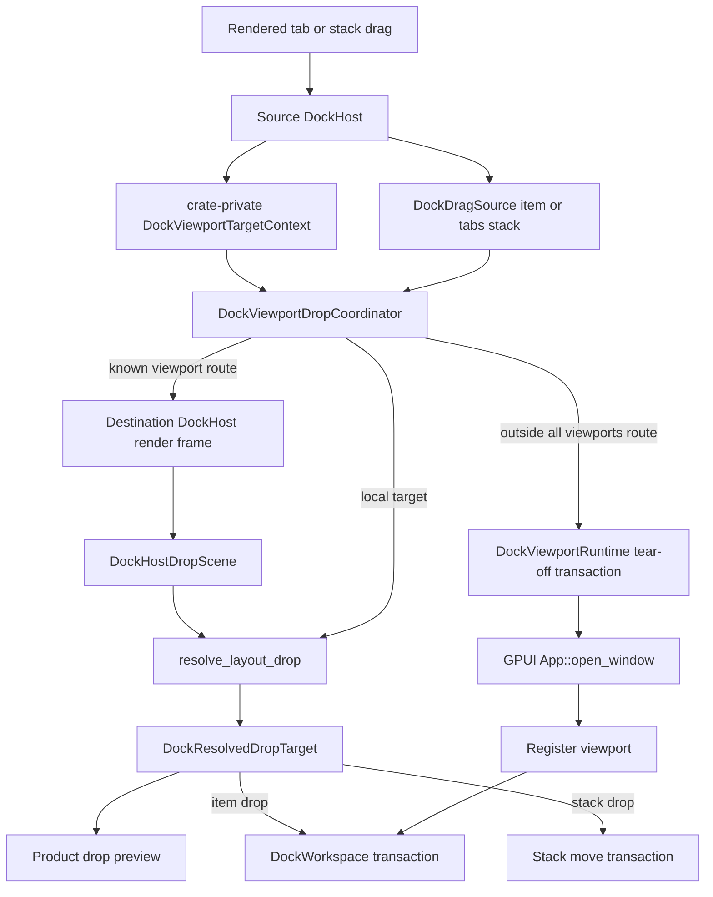
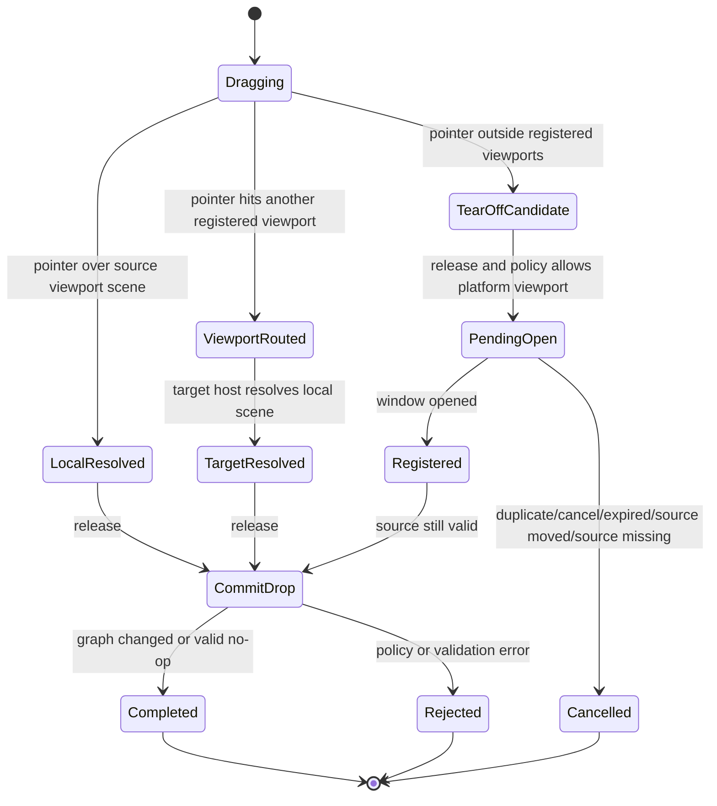

# feat: Productize ImGui-like docking multi-viewport

## Summary

Close the remaining product gap between the retained docking foundation and an ImGui-like
multi-viewport docking experience. The core release path now uses the resolver, transaction,
geometry, and viewport runtime seams for cross-window drag, dock-back, tear-off, whole-stack drag,
preview, close, and activation behavior; this plan remains active for dogfood, visual polish,
documentation alignment, and deletion-audit proof.

---

## Problem Frame

The current docking foundation is in the right shape. `DockGraph` and `DockLayout` remain pure
data, `DockAction` no longer exposes graph-shaped move commands for rendered drag/drop,
`DockDropRuntime` stores resolved targets, split geometry is centralized, `DockViewportRuntime`
owns platform-window mappings, and `DockPanelRegistry` separates descriptor metadata from live
views.

The remaining gap is no longer primarily architectural depth. It is the product hardening path
that turns those seams into a shippable ImGui-like experience: dogfooding tab and stack drags across
GPUI windows, validating previews in source and destination viewports, releasing to dock back,
releasing outside all viewports to tear off, restoring focus, and handling close decisions without
graph/window corruption. On the current branch the rendered host release path already routes
through host drop scenes and viewport runtime transactions; this plan remains active for visual
polish, manual dogfood, documentation alignment, and deletion of any stale compatibility paths.

The plan keeps ADR 0002 intact. Platform windows, focus, retained views, and event routing stay
owned by GPUI. Docking adds a runtime coordinator and host-local drop scene, not a second window or
focus manager.

---

## Requirements

**P0 product loop**

- R1. A rendered drag session must use one full host-local drop scene that includes tab labels,
  leaves, root edges, floating title bars, empty dock spaces, and central-region facts.
- R2. Preview and commit must consume the same host-local resolved target for local, floating, and
  empty-space drops; viewport hits and tear-off candidates must first resolve into either a target
  host-local target or a viewport-runtime transaction outcome.
- R3. Releasing a dragged item or tabs stack over another registered viewport must route through
  that viewport's host-local drop scene before mutating the graph.
- R4. Releasing a dragged item or tabs stack outside all registered viewports must open a platform
  viewport through `DockViewportRuntime`, register it, move the source payload only after
  registration succeeds, and clean up duplicate, cancelled, expired, source-moved, and
  commit-failed requests.
- R5. The drag payload model must support both one item and an entire tabs stack, with order and
  active tab preserved when a stack is moved, floated, torn off, or docked back.
- R6. Viewport target arbitration must use hovered-window, active-window, and front-to-back window
  stack signals where available, with deterministic fallback when platform signals are missing.

**Product behavior**

- R7. Drop preview must represent inner targets, outer/root targets, floating title-bar targets,
  empty dock-space targets, known viewport routing, tear-off candidates, and rejected policy states
  without falling back to a tab-only preview projection; routed targets must distinguish the global
  route preview from the final host-local commit preview.
- R8. Central region behavior must remain ImGui-compatible at the user level: empty keep-alive,
  remaining-space allocation, dock-over policy, and passthrough hit behavior must agree between
  layout, hit testing, preview, and commit.
- R9. Platform viewport close and focus behavior must be explicit: current prevent/retain behavior
  must stay correct, any merge-back behavior must be introduced as an explicit policy extension,
  and successful drop/tear-off/dock-back should restore a predictable active tab and GPUI focus
  target.
- R10. The native docking example must demonstrate the real multi-viewport loop instead of only
  opening two controller-backed windows.

**Boundaries**

- R11. `DockGraph`, `DockLayout`, and serialized layout data must not store GPUI window handles,
  host entities, `AnyView`, `Entity`, `FocusHandle`, hovered-window state, or transient drag state.
- R12. Obsolete tab-local helpers and tab-only preview projections should be deleted after the
  unified scene and preview paths replace them.

---

## Scope Boundaries

In scope:

- `crates/gpui_docking/src/drag.rs`
- `crates/gpui_docking/src/drop_runtime.rs`
- `crates/gpui_docking/src/drop_target.rs`
- `crates/gpui_docking/src/interaction.rs`
- `crates/gpui_docking/src/host.rs`
- `crates/gpui_docking/src/host_interactions.rs`
- `crates/gpui_docking/src/host_render_actions.rs`
- `crates/gpui_docking/src/host_render_session.rs`
- `crates/gpui_docking/src/render.rs`
- `crates/gpui_docking/src/render_tabs.rs`
- `crates/gpui_docking/src/render_floating.rs`
- `crates/gpui_docking/src/render_split.rs`
- `crates/gpui_docking/src/viewport.rs`
- `crates/gpui_docking/src/viewport_runtime.rs`
- `crates/gpui_docking/src/viewport_runtime_handle.rs`
- `crates/gpui_docking/src/viewport_target_context.rs`
- `crates/gpui_docking/src/viewport_target_resolver.rs`
- `crates/gpui_docking/src/viewport_tear_off.rs`
- `crates/gpui_docking/src/workspace_transaction.rs`
- `crates/gpui_docking/src/workspace_move_transaction.rs`
- `crates/gpui_docking/src/workspace_floating_transaction.rs`
- `crates/gpui_docking/src/workspace_panel_lifecycle.rs`
- `crates/gpui_docking/src/*tests.rs`
- `examples/docking-native/src/main.rs`
- `docs/adr/0002-docking-gpui-integration.md`
- `docs/architecture/docking-architecture-audit-20260609.md`
- `docs/plans/2026-06-09-015-refactor-docking-interaction-foundation-plan.md`

Deferred for later:

- Per-panel class compatibility and full `ImGuiWindowClass`-style docking filters.
- DPI, taskbar, decoration, no-input, and no-focus-on-appearing parity for every platform backend.
- Rich tab chrome such as icons, dirty markers, overflow menus, close-all menus, and keyboard tab
  switching beyond what is needed to prove close/focus semantics.
- Accessibility traversal beyond preserving GPUI as the focus authority.

Out of scope:

- Porting Dear ImGui's immediate-mode `DockContext`, `.ini` format, or backend callback model.
- Importing Fret docking crates as dependencies.
- Moving docking into `crates/gpui`.
- Storing platform-window or retained-view state in `DockGraph` or `DockLayout`.

---

## ImGui Capability Gap Matrix

| Capability | ImGui reference | Current open-gpui implication | Priority |
|---|---|---|---|
| Tab drag and reorder | `repo-ref/imgui/imgui.cpp:19629`, `repo-ref/imgui/imgui.cpp:21358` | Rendered release uses the host drop scene; continue dogfood for reorder polish and stale preview cleanup. | P0 |
| Dock-back across viewports | `repo-ref/imgui/imgui.cpp:21390`, `repo-ref/imgui/imgui.cpp:21466` | `KnownViewport` routes through the destination host scene before commit; keep validating stale-scene rejection and activation. | P0 |
| Tear-off to platform window | `repo-ref/imgui/imgui.cpp:18527`, `repo-ref/imgui/imgui.cpp:17483` | Rendered outside release and release polling call the runtime tear-off transaction; manual platform dogfood remains. | P0 |
| Whole window or stack drag | `repo-ref/imgui/imgui.cpp:5412`, `repo-ref/imgui/imgui.cpp:18527` | Drag payloads support item and tabs-stack moves across local, viewport, and tear-off paths. | P0 |
| Hover, active, and z-order arbitration | `repo-ref/imgui/imgui.cpp:16852`, `repo-ref/imgui/imgui.cpp:16866` | Crate-private `DockViewportTargetContext` is supplied by product paths; continue platform-signal dogfood. | P0 |
| Dock preview boxes | `repo-ref/imgui/imgui.cpp:19957`, `repo-ref/imgui/imgui.cpp:20045` | Preview now flows from resolved targets and routes; remaining work is visual polish and deletion-audit proof. | P1 |
| Central node | `repo-ref/imgui/imgui_internal.h:1995`, `repo-ref/imgui/imgui_internal.h:2060` | Central layout, hit testing, and passthrough have test coverage; continue preview/commit agreement dogfood. | P1 |
| Window close semantics | `repo-ref/imgui/imgui.cpp:19666`, `repo-ref/imgui/backends/imgui_impl_win32.cpp:1458` | Panel close, viewport retain/prevent/merge-back, activation, and focus paths are test-covered; native dogfood remains. | P1 |
| Platform viewport backend | `repo-ref/imgui/imgui.h:4215`, `repo-ref/imgui/backends/imgui_impl_win32.cpp:1486` | GPUI owns windows; docking runtime now owns mappings, placement, bounds, focus requests, and activation policy. | P1 |
| Persistence | `repo-ref/imgui/imgui.cpp:21474` | `DockLayout` and `DockViewportPlacementLayout` are already separated; restore edge cases are follow-up. | P2 |

---

## Key Technical Decisions

- KTD1. **Model `KnownViewport` as a routing target, not a workspace commit target:** A viewport
  hit identifies the destination window/space. The destination host must then resolve the pointer
  against its local drop scene before `DockWorkspace` mutates the graph. Tear-off candidates follow
  the same rule at the product layer: they are route candidates until the viewport runtime returns
  a pending/completed/cancelled outcome.
- KTD2. **Introduce a host-local drop scene authority:** Render modules should publish facts into
  one scene per host frame. The interaction runtime resolves against that scene and stores a
  `DockResolvedDropTarget`, replacing tab-only update and receiver APIs.
- KTD3. **Keep the viewport coordinator in runtime, outside graph:** `DockViewportRuntime` may own
  runtime host/drop-scene mappings or a crate-private coordinator, but `DockGraph` and
  `DockLayout` remain pure logical data.
- KTD4. **Unify preview and commit around the resolved target:** Product preview should draw from
  `DockResolvedDropTarget` directly. `DockDropPreviewIntent` and tab-only preview accessors should
  remain absent from production code after replacement.
- KTD5. **Make tear-off a user release transaction:** A release outside all registered viewports
  should create or reuse a target dock space, open the platform viewport, register it, validate the
  source, commit the move, and clean up as one runtime outcome.
- KTD6. **Promote drag payload from tab item to drag source:** A drag source can be one item or one
  tabs stack. The move transaction layer decides whether it projects to item move, stack move,
  floating merge, empty-space move, or tear-off.
- KTD7. **Treat Fret as a pattern reference, not an architecture template:** Borrow pending
  transaction, TTL, cancel, resolver, split, and arbitration patterns. Do not borrow Fret's effect
  queue, global manager, drag host, or runtime ownership model.
- KTD8. **Delete compatibility code after the product path lands:** Old tab-local helpers should
  not survive as parallel behavior once the scene/coordinator path is covered by tests.

---

## High-Level Technical Design

Release lifecycle:

---

## Implementation Units

### U1. Host Drop Scene And Unified Local Resolution

**Goal:** Replace tab-local drag update/release with one host-local drop scene that feeds the
existing full-layout resolver.

**Requirements:** R1, R2, R7, R8, R12

**Dependencies:** None

**Files:**

- `crates/gpui_docking/src/drop_target.rs`
- `crates/gpui_docking/src/drop_runtime.rs`
- `crates/gpui_docking/src/interaction.rs`
- `crates/gpui_docking/src/host_interactions.rs`
- `crates/gpui_docking/src/host_render_session.rs`
- `crates/gpui_docking/src/render_tabs.rs`
- `crates/gpui_docking/src/render_split.rs`
- `crates/gpui_docking/src/render_floating.rs`
- `crates/gpui_docking/src/host_interaction_tests.rs`
- `crates/gpui_docking/src/host_render_tests.rs`

**Approach:** Add a crate-private `DockHostDropScene` or equivalent frame snapshot that contains
tab labels, leaves, root bounds, floating title bars, empty spaces, and central-region facts in the
host coordinate system. Viewport hits and outside-all-viewport tear-off candidates are produced by
the viewport coordinator in U2/U3 and then routed back into a host-local scene or viewport-runtime
transaction. `DockHost` updates `DockInteractionRuntime` with the scene and pointer position, and
`DockDropRuntime` stores one host-local resolved target. Receiver-specific methods such as old
tab-drop target accessors should remain deleted after the unified scene path replaces them.

**Execution note:** Start with characterization tests for current tab reorder, leaf center drop,
and central dock-over behavior, then replace the API.

**Patterns to follow:** `crates/gpui_docking/src/drop_target.rs`,
`crates/gpui_docking/src/drop_runtime.rs`, and
`repo-ref/fret/ecosystem/fret-docking/src/dock/drop_resolve/target.rs`.

**Test scenarios:**

- Pointer over a tab label resolves to a `TabBar` target and preserves insertion stability while
  the pointer moves within the same tab.
- Pointer over a tab body center resolves to `LeafCenter`; pointer over inner edges resolves to
  `InnerEdge`.
- Pointer near a root outer edge resolves to `RootEdge` from the same scene.
- Pointer over an empty dock space resolves to `EmptyDockSpace` without a tab receiver.
- Pointer over a floating title bar resolves to `FloatingTitleBar` and prefers topmost floating
  containers when they overlap.
- Central leaf center and central tab-bar reorder respect central dock-over policy; central edge
  split continues to use edge-split policy.
- Empty central region keep-alive, remaining-space allocation, and passthrough hit behavior remain
  test-visible through host-local scene facts.
- A miss clears or preserves the resolved target only according to explicit scene policy.

**Verification:** Local rendered drag/drop behavior remains unchanged for existing tab moves, and
new tests prove non-tab targets can be resolved without receiver-specific release APIs.

### U2. Cross-Viewport Drop Coordinator

**Goal:** Route a drag release from one viewport to another viewport, resolve the target host's
local scene, and commit through the existing workspace transaction layer.

**Requirements:** R2, R3, R6, R11

**Dependencies:** U1

**Files:**

- `crates/gpui_docking/src/viewport_runtime.rs`
- `crates/gpui_docking/src/viewport_runtime_handle.rs`
- `crates/gpui_docking/src/viewport_open.rs`
- `crates/gpui_docking/src/viewport_registration.rs`
- `crates/gpui_docking/src/viewport_registry.rs`
- `crates/gpui_docking/src/viewport_target.rs`
- `crates/gpui_docking/src/viewport_target_context.rs`
- `crates/gpui_docking/src/viewport_target_resolver.rs`
- `crates/gpui_docking/src/viewport_coordinates.rs`
- `crates/gpui_docking/src/viewport.rs`
- `crates/gpui_docking/src/host.rs`
- `crates/gpui_docking/src/host_interactions.rs`
- `crates/gpui_docking/src/workspace_transaction.rs`
- `crates/gpui_docking/src/host_viewport_runtime_tests.rs`
- `crates/gpui_docking/src/host_viewport_runtime_handle_tests.rs`
- `crates/gpui_docking/src/host_viewport_tests.rs`

**Approach:** Introduce a crate-private coordinator that can map screen-space pointer position to a
registered viewport, obtain or receive the destination host's current drop scene, convert the
pointer into that host's local coordinate space, resolve locally, and commit to the target space.
`DockResolvedDropTargetKind::KnownViewport` should remain a routing result; `DockWorkspace` should
not directly commit it. The implementation must define the runtime registration path for host
scene snapshots when `DockViewportAdapter::open_viewport` creates a `DockHost`, including stale
scene rejection when a host has not rendered a scene for the target window/space.

**Technical design:** Store host scene snapshots or host-scene handles in runtime-owned state keyed
by `DockSpaceId` and `WindowId`. Keep that registry separate from `DockViewportAdapter`'s placement
snapshots so serialization remains pure. If the target window has a mapping but no current scene,
the coordinator should reject the drop without graph mutation rather than guessing a target.

**Patterns to follow:** `crates/gpui_docking/src/viewport_target_resolver.rs`,
`crates/gpui_docking/src/viewport_coordinates.rs`, and Dear ImGui
`repo-ref/imgui/imgui.cpp:16852`.

**Test scenarios:**

- A release over a secondary viewport prefers the hovered window over active-window and stack
  ordering.
- A release over overlapping registered viewports uses active-window when hovered-window is absent.
- A release over overlapping registered viewports uses front-to-back stack when hovered and active
  signals are absent.
- A release over a known viewport with no host-local target is rejected without graph mutation.
- A successful release into a target viewport moves the item to the target space and selects it.
- A same-space viewport route is treated as local and does not create duplicate move semantics.
- A source viewport route to a destination root-edge, empty-space, or floating-title target resolves
  in the destination host scene and commits the same resolved target that preview rendered.

**Verification:** Cross-viewport tests prove that `KnownViewport` no longer stops at a route-level
target-unavailable rejection when a valid target host scene is available.

### U3. User-Facing Tear-Off Release Flow

**Goal:** Connect rendered drag release outside all registered viewports to
`DockViewportRuntimeHandle::open_tear_off_viewport`.

**Requirements:** R4, R6, R10, R11

**Dependencies:** U1, U2

**Files:**

- `crates/gpui_docking/src/viewport_tear_off.rs`
- `crates/gpui_docking/src/viewport_runtime.rs`
- `crates/gpui_docking/src/viewport_runtime_handle.rs`
- `crates/gpui_docking/src/viewport_open.rs`
- `crates/gpui_docking/src/viewport_placement.rs`
- `crates/gpui_docking/src/viewport_placement_options.rs`
- `crates/gpui_docking/src/viewport_target_context.rs`
- `crates/gpui_docking/src/host_interactions.rs`
- `crates/gpui_docking/src/render_tabs.rs`
- `crates/gpui_docking/src/host_viewport_runtime_tests.rs`
- `crates/gpui_docking/src/host_viewport_runtime_handle_tests.rs`
- `examples/docking-native/src/main.rs`

**Approach:** When the viewport coordinator reports a tear-off route, create a deterministic target
`DockSpaceId`, derive `WindowOptions` from suggested bounds and placement policy, call
`open_tear_off_viewport`, and surface the resulting outcome to the interaction layer. Preserve the
existing invariant that graph mutation occurs only after the new viewport opens and registers. The
tear-off route is a viewport-runtime outcome, not a workspace-local resolved target.

**Technical design:** The product path now uses the runtime tear-off transaction plus a host-local
outside-release polling fallback. GPUI remains the input authority: supported platforms can report
global left-button state through the optional platform seam, while unsupported platforms fall back
to normal GPUI window-event delivery. Remaining proof is native dogfood across platform backends,
not an unimplemented architecture primitive.

**Patterns to follow:** `crates/gpui_docking/src/viewport_tear_off.rs`,
`repo-ref/fret/ecosystem/fret-docking/src/runtime/tear_off.rs`, and
`repo-ref/fret/ecosystem/fret-docking/src/runtime/window_created.rs`.

**Test scenarios:**

- Release outside all viewports opens a new viewport, registers the target space, moves the item,
  and selects it.
- A duplicate pending tear-off for the same item does not open another window.
- A pending tear-off that exceeds the runtime TTL cancels with `Expired` and allows a later retry.
- A source item closed before completion cancels with `SourceMissing` and does not mutate graph.
- A source item moved before completion cancels with `SourceMoved` and unregisters the new target
  mapping if needed.
- A commit failure after registration unregisters the target space and reports
  `CommitFailed`.
- Platform viewports disabled rejects the tear-off before opening a window.

**Verification:** The native example can demonstrate dragging a tab outside both demo windows and
seeing it become a new controller-backed platform viewport.

### U4. Drag Source Payloads For Item And Tabs Stack

**Goal:** Support ImGui-like whole-stack drag, float, tear-off, dock-back, and merge behavior
without collapsing a stack into one tab.

**Requirements:** R5, R7, R11

**Dependencies:** U1, U2, U3

**Files:**

- `crates/gpui_docking/src/drag.rs`
- `crates/gpui_docking/src/action.rs`
- `crates/gpui_docking/src/drop_target.rs`
- `crates/gpui_docking/src/drop_runtime.rs`
- `crates/gpui_docking/src/op.rs`
- `crates/gpui_docking/src/graph_ops.rs`
- `crates/gpui_docking/src/graph_tab_stack.rs`
- `crates/gpui_docking/src/workspace_move_transaction.rs`
- `crates/gpui_docking/src/workspace_floating_transaction.rs`
- `crates/gpui_docking/src/workspace_transaction.rs`
- `crates/gpui_docking/src/viewport_tear_off.rs`
- `crates/gpui_docking/src/viewport_runtime.rs`
- `crates/gpui_docking/src/render_tabs.rs`
- `crates/gpui_docking/src/render_floating.rs`
- `crates/gpui_docking/src/workspace_move_tests.rs`
- `crates/gpui_docking/src/host_interaction_tests.rs`
- `crates/gpui_docking/src/host_floating_tests.rs`

**Approach:** Keep item and tabs-stack drags on the shared `DockDragSource` payload shape. Stack
move requests preserve item order and active index across local drops, viewport-routed drops,
floating merge, and tear-off. Continue dogfooding the product paths while keeping any additional
transaction projection behind workspace/runtime seams.

**Patterns to follow:** `DockAction::FloatTabsInWindow`,
`crates/gpui_docking/src/workspace_floating_transaction.rs`, and Dear ImGui
`repo-ref/imgui/imgui.cpp:5412`.

**Test scenarios:**

- Dragging a tab item preserves current single-item move behavior.
- Dragging a tabs stack into another leaf merges all items in order and selects the previously
  active stack item.
- Dragging a tabs stack to an empty dock space creates a root tabs node with the same order and
  active index.
- Dragging a tabs stack across registered viewports uses the same coordinator route as item drag.
- Dragging a tabs stack outside all viewports tears off the whole stack after viewport
  registration.
- Dragging a floating container title bar onto a tabs target merges the floating stack and removes
  the in-window floating container.

**Verification:** Stack moves and item moves share the same resolved target vocabulary while using
separate transaction request types where validation differs.

### U5. Product Drop Preview And Obsolete Preview Deletion

**Goal:** Keep drop previews driven by resolved targets/routes, polish the ImGui-like visuals, and
prove the tab-only preview projection stays deleted.

**Requirements:** R2, R7, R8, R12

**Dependencies:** U1, U2, U3

**Files:**

- `crates/gpui_docking/src/drop_target.rs`
- `crates/gpui_docking/src/drop_runtime.rs`
- `crates/gpui_docking/src/host_interactions.rs`
- `crates/gpui_docking/src/render.rs`
- `crates/gpui_docking/src/render_tabs.rs`
- `crates/gpui_docking/src/render_floating.rs`
- `crates/gpui_docking/src/host_debug.rs`
- `crates/gpui_docking/src/host_render_tests.rs`
- `crates/gpui_docking/src/host_interaction_tests.rs`

**Approach:** Maintain the preview renderer that accepts resolved local targets and viewport routes,
then polish the product preview for tab reorder, center merge, inner edge, outer root edge,
floating merge, empty space, known viewport route, tear-off route, and rejected policy. Keep
`DockDropPreviewIntent`, `DockResolvedDropTarget::preview_intent()`, `tab_drop_preview_bounds`, and
receiver-specific preview selectors out of production code.

**Patterns to follow:** Dear ImGui `repo-ref/imgui/imgui.cpp:19957` and
`repo-ref/imgui/imgui.cpp:20045`, while preserving the existing GPUI element style in
`crates/gpui_docking/src/render_tabs.rs`.

**Test scenarios:**

- Tab reorder preview renders at the insertion slot.
- Inner and outer edge previews render on the same bounds that commit will split.
- Floating title-bar merge preview renders over the floating container target.
- Empty space and tear-off previews are visible without a tab receiver.
- Cross-viewport preview distinguishes the global known-viewport route from the destination
  host-local preview that will be committed.
- Rejected central dock-over and disabled edge split render a rejected preview state and leave graph
  unchanged on release.
- Removing tab-only preview helpers does not remove test-visible debug selectors for the new
  preview types.

**Verification:** There is one preview data path from `DockDropRuntime` to render; production code
does not reintroduce `DockResolvedDropTarget::preview_intent()` or tab-only preview helpers.

### U6. Viewport Close, Focus, And Activation Semantics

**Goal:** Make close and focus behavior explicit enough that multi-viewport docking feels stable
instead of merely preserving runtime mappings.

**Requirements:** R6, R9, R10, R11

**Dependencies:** U2, U3, U4

**Files:**

- `crates/gpui_docking/src/panel.rs`
- `crates/gpui_docking/src/panel_catalog.rs`
- `crates/gpui_docking/src/panel_registry.rs`
- `crates/gpui_docking/src/workspace_panel_lifecycle.rs`
- `crates/gpui_docking/src/viewport_close.rs`
- `crates/gpui_docking/src/viewport_close_gate.rs`
- `crates/gpui_docking/src/viewport_runtime.rs`
- `crates/gpui_docking/src/viewport_runtime_handle.rs`
- `crates/gpui_docking/src/render_tabs.rs`
- `crates/gpui_docking/src/workspace_panel_lifecycle_tests.rs`
- `crates/gpui_docking/src/host_viewport_runtime_tests.rs`
- `examples/docking-native/src/main.rs`

**Approach:** Separate item close, stack close, and platform viewport close policy. Keep GPUI focus
authoritative, but let successful drop outcomes request activation of the target window and
selection of the moved item or active stack item. Define whether closing a detached viewport
prevents close, retains layout without a window, or merges content into a fallback space.

**Patterns to follow:** Existing `DockViewportClosePolicy`,
`DockPanelDescriptor` close policy, and Dear ImGui tab close flow around
`repo-ref/imgui/imgui.cpp:19666`.

**Test scenarios:**

- Closing a closable tab removes it from the graph while descriptor metadata remains available for
  reopen.
- Closing a non-closable tab reports a panel-policy rejection and leaves graph state unchanged.
- Closing a viewport under prevent policy vetoes before cleanup.
- Closing a viewport under retain policy removes the runtime mapping but preserves logical layout.
- Closing a viewport under a newly introduced merge-back policy moves content into a fallback dock
  space and unregisters the platform mapping.
- Successful cross-viewport drop activates the destination viewport and selects the moved item.

**Verification:** Close and focus behavior is documented and covered at panel lifecycle, viewport
runtime, and native example levels.

### U7. Native Example And Multi-Viewport Dogfood Surface

**Goal:** Turn the native docking example into a real manual verification surface for the P0 and P1
multi-viewport loop.

**Requirements:** R3, R4, R5, R7, R8, R9, R10

**Dependencies:** U2, U3, U4, U5, U6

**Files:**

- `examples/docking-native/src/main.rs`
- `crates/gpui_docking/src/host_render_tests.rs`
- `crates/gpui_docking/src/host_viewport_tests.rs`
- `docs/architecture/docking-architecture-audit-20260609.md`

**Approach:** Update the demo content and controls to exercise primary-to-secondary drop,
secondary-to-primary dock-back, tear-off outside all windows, whole-stack drag, floating merge,
tab close/reopen, viewport close, placement export/import, and central empty passthrough. Keep the
example focused on the usable docking surface rather than explanatory text.

**Test scenarios:**

- The example opens primary and secondary viewports through `DockViewportRuntimeHandle`.
- A panel starts in the secondary space and can be docked back into the primary space.
- A primary tab can be torn off into a new runtime-opened viewport.
- A whole stack can be moved between viewports without changing item order.
- An empty central region remains visible, consumes remaining split space, and allows passthrough
  only according to central-region policy.
- Closing and reopening a panel uses descriptor metadata without requiring a live view during
  layout restore.

**Verification:** The native example builds, and manual dogfood can cover every P0 acceptance path
from this plan.

### U8. Documentation And Deletion Pass

**Goal:** Align documentation with the shipped product path and remove outdated compatibility code
after replacement.

**Requirements:** R10, R11, R12

**Dependencies:** U1, U2, U3, U4, U5, U6, U7

**Files:**

- `docs/adr/0002-docking-gpui-integration.md`
- `docs/architecture/docking-architecture-audit-20260609.md`
- `docs/plans/2026-06-09-015-refactor-docking-interaction-foundation-plan.md`
- `crates/gpui_docking/src/drop_target.rs`
- `crates/gpui_docking/src/drop_runtime.rs`
- `crates/gpui_docking/src/interaction.rs`
- `crates/gpui_docking/src/host_interactions.rs`
- `crates/gpui_docking/src/render_tabs.rs`
- `crates/gpui_docking/src/viewport_tear_off.rs`

**Approach:** Update ADR 0002's follow-up note with the productized multi-viewport flow. Adjust the
architecture audit so it distinguishes foundation readiness from end-to-end product behavior. Mark
the previous interaction-foundation plan as completed or superseded if its units have shipped.
Remove old tab-local interaction and preview helpers once tests prove the unified path.

**Test scenarios:**

- Test expectation: none for documentation edits.
- Deletion expectation: build and tests prove no production code depends on the removed tab-only
  preview or receiver APIs.

**Verification:** Documentation no longer claims runtime product behavior that is not connected to
rendered user workflows, and obsolete code is gone instead of preserved behind compatibility
wrappers.

---

## Acceptance Examples

- AE1. Given two runtime-opened dock viewports, when the user drags a tab from the primary viewport
  over a leaf in the secondary viewport, then the secondary viewport shows the drop preview and
  release moves the tab into that secondary leaf.
- AE2. Given a tab drag is released outside all registered viewports and platform viewports are
  allowed, when the platform window opens successfully, then the graph moves the tab only after the
  new viewport is registered.
- AE3. Given a pending tear-off exists for an item, when another tear-off request for the same item
  is made before completion, then no duplicate platform window is opened; when the pending request
  exceeds its TTL, then it cancels with `Expired` and a later retry can proceed.
- AE4. Given a source item is closed or moved while a tear-off is pending, when the new window
  creation completes, then the pending request cancels and graph state remains coherent.
- AE5. Given a tabs stack with three items and the second item active, when the stack is dragged to
  another viewport, then the target stack preserves item order and active item.
- AE6. Given central dock-over is disabled, when a tab is dragged over the central body, then the UI
  shows a rejected preview and release does not mutate the graph.
- AE6.1. Given a central region is empty, when the host renders and hit-tests it, then the region
  stays alive, receives remaining split space, and applies passthrough according to policy.
- AE7. Given a detached viewport uses retain-on-close policy, when the platform window closes, then
  runtime mapping is removed but logical layout remains serializable.
- AE8. Given a successful dock-back from a detached viewport, when the drop commits, then the
  destination window activates and the moved item becomes the selected tab.

---

## System-Wide Impact

End users gain the first real ImGui-like multi-viewport loop: tear off, dock back, move stacks, and
trust the preview. Application developers keep one shared `DockController` and one
`DockViewportRuntimeHandle`; they should not need to construct graph-shaped moves for drag/drop.
Framework code remains aligned with ADR 0002 because platform windows, focus, and retained views
stay in GPUI-owned runtime layers.

The main API pressure is likely around how applications opt into runtime-backed hosts. If
cross-viewport drag requires a runtime handle or host scene registry, the public constructor surface
should make the runtime path easy while keeping single-window hosts lightweight.

---

## Risks And Dependencies

- GPUI may not deliver drag-move events to non-source windows on every platform. If so, the
  coordinator needs platform hovered-window or window-stack signals to resolve the target under the
  drag, and this may require a small GPUI primitive outside the docking crate.
- Release outside every GPUI window now depends on the optional platform mouse-button state seam
  plus host-local polling. The remaining risk is backend coverage and correctness: unsupported
  platforms return `None`, so native dogfood must verify that fallback behavior remains explicit
  instead of silently claiming tear-off completion.
- Storing host entities in runtime would be acceptable runtime state, but it must stay separate
  from `DockViewportAdapter`'s serializable placement snapshots and from `DockGraph`.
- Whole-stack drag can invalidate source tabs while a drag is active. Stack transactions need
  stronger source validation than single-item moves.
- Close/focus behavior can become product-policy heavy. Keep it policy-driven and avoid embedding
  application-specific unsaved-document behavior in the docking crate.
- Preview polish can expand quickly. Land correctness first: target identity, preview bounds,
  rejection state, and commit agreement.

---

## Sources And Research

- Current architecture: `docs/adr/0002-docking-gpui-integration.md` and
  `docs/architecture/docking-architecture-audit-20260609.md`.
- Previous foundation plan: `docs/plans/2026-06-09-015-refactor-docking-interaction-foundation-plan.md`.
- Current open-gpui modules: `crates/gpui_docking/src/drop_target.rs`,
  `crates/gpui_docking/src/drop_runtime.rs`, `crates/gpui_docking/src/workspace_transaction.rs`,
  `crates/gpui_docking/src/interaction.rs`, `crates/gpui_docking/src/host_interactions.rs`,
  `crates/gpui_docking/src/viewport_runtime.rs`, and
  `crates/gpui_docking/src/viewport_tear_off.rs`.
- Dear ImGui docking reference: `repo-ref/imgui/imgui.cpp`,
  `repo-ref/imgui/imgui_internal.h`, `repo-ref/imgui/imgui.h`, and
  `repo-ref/imgui/backends/imgui_impl_win32.cpp`.
- Fret reference: `repo-ref/fret/ecosystem/fret-docking/src/runtime/tear_off.rs`,
  `repo-ref/fret/ecosystem/fret-docking/src/runtime/window_created.rs`,
  `repo-ref/fret/ecosystem/fret-docking/src/dock/drop_resolve/target.rs`,
  `repo-ref/fret/ecosystem/fret-docking/src/dock/split_geometry.rs`, and
  `repo-ref/fret/docs/adr/0072-docking-interaction-arbitration-matrix.md`.
