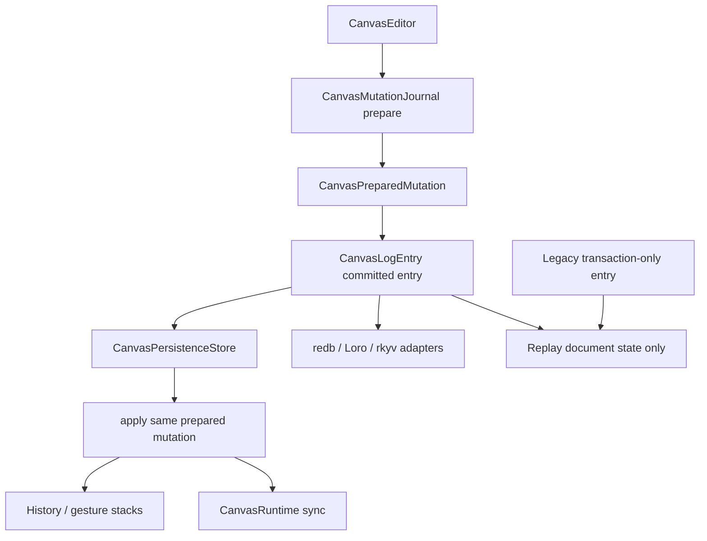
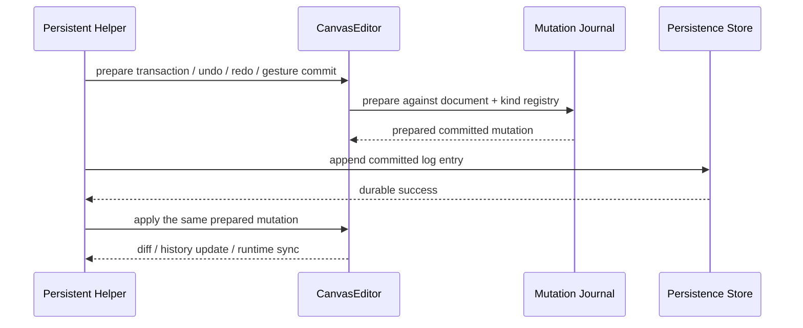

# refactor: Deepen Canvas Mutation Journal

## Summary

This plan deepens the canvas mutation journal so persistence, replay, undo/redo, runtime sync, and future CRDT adapters consume one committed mutation fact. The work keeps legacy transaction-only log replay compatible, but removes public ambiguity that lets new code treat intent transactions and actual semantic record changes as equal sources of truth.

---

## Problem Frame

`CanvasCommittedMutation` already captures the applied transaction, inverse, document diff, and actual record changes. That is the right fact source: deleting a node can also delete incident edges, and observers need the committed semantic result rather than only the original command intent.

The remaining friction is in the persistence seam. `CanvasLogEntry` still stores a raw `CanvasTransaction` beside an optional `CanvasRecordOperationBatch`, exposes both intent-derived and committed batches, and lets callers construct legacy entries through the same public type. Future redb, Loro, rkyv, undo/redo, and runtime sync adapters would have to ask which view is authoritative. This refactor makes the committed mutation journal the deep Module that answers that question once.

---

## Requirements

**Committed Fact Source**

- R1. New durable canvas log entries must be built from committed mutations, not caller-forged operation batches or transaction-only intent.
- R2. The committed log entry must expose actual semantic record operations as the primary observer surface.
- R3. Replay must remain able to apply older transaction-only entries without treating them as committed semantic truth.

**Persistence And History Consistency**

- R4. Persistent apply, undo, redo, and gesture commit must prepare once, append the committed fact once, and then apply the same prepared mutation to memory.
- R5. Store append failure must leave editor document state, history stacks, cursor, and gesture commit state unchanged.
- R6. Empty transactions must not produce journal entries or cursor movement.

**Public API Hygiene**

- R7. Public APIs must not invite callers to forge inconsistent committed batches or rely on intent-derived batches as the normal path.
- R8. README and ADR text must describe committed mutation journal semantics and clearly label legacy transaction replay.

---

## Key Technical Decisions

- KTD1. **Name the Module after the fact source:** introduce or rename toward `CanvasMutationJournal` so the Interface says this Module owns durable mutation facts, not just record mutation preparation.
- KTD2. **Keep transaction intent as replay input only:** committed log entries may retain the normalized transaction needed to replay state, but record operations exposed to observers come from committed mutation changes.
- KTD3. **Use typed constructors to encode state:** public construction should distinguish committed entries from legacy transaction-only entries so invalid “committed without committed changes” states are not easy to create.
- KTD4. **Keep storage adapters narrow:** `CanvasPersistenceStore`, byte-store codec, and memory store continue to persist `CanvasLogEntry`; the semantic change happens inside the log entry and journal Interface, not by introducing a concrete database dependency.
- KTD5. **Delete misleading helpers before 1.0:** remove public intent-batch helpers if tests and examples can be rewritten to use committed facts or explicitly named legacy replay.

---

## High-Level Technical Design

The first diagram separates new committed entries from legacy replay entries. The second diagram pins the ordering invariant: prepare once, write the committed fact, then apply that prepared mutation in memory.

---

## Implementation Units

### U1. Deepen Mutation Journal Module

**Goal:** Turn the existing record mutation store into the named mutation journal Module that owns prepare, commit, inverse, diff, and committed record changes.

**Requirements:** R1, R2, R4.

**Dependencies:** None.

**Files:**

- `crates/canvas/src/mutation.rs`
- `crates/canvas/src/document.rs`
- `crates/canvas/src/gesture.rs`
- `crates/canvas/src/tool.rs`
- `crates/canvas/src/runtime.rs`

**Approach:** Rename or wrap the former record mutation store as `CanvasMutationJournal` and keep `CanvasCommittedMutation` as its emitted fact. Preserve crate-private prepared mutation mechanics. Public document/editor methods should read as transaction preparation or committed mutation application, while direct record operation construction remains an implementation detail.

**Execution note:** Start with characterization coverage around incident edge deletion and metadata preservation before renaming internals.

**Patterns to follow:** Existing `CanvasCommittedMutation`, `CanvasPreparedMutation`, and `record_changes_from_diff` behavior.

**Test scenarios:**

- `crates/canvas/src/mutation.rs`: removing a node produces committed record changes for both the node and incident edges.
- `crates/canvas/src/mutation.rs`: transaction metadata is preserved in the committed operation batch.
- `crates/canvas/src/mutation.rs`: failed transactions leave the original document unchanged and emit no committed mutation.
- `crates/canvas/src/document.rs`: public document transaction helpers still apply through the journal path.

**Verification:** The unit is complete when mutation preparation and commit naming consistently point at journal semantics and existing mutation tests still pass.

---

### U2. Make CanvasLogEntry Committed-First

**Goal:** Rework `CanvasLogEntry` so new entries carry committed semantic operations as their primary durable fact and legacy transaction-only entries are explicit replay compatibility.

**Requirements:** R1, R2, R3, R7.

**Dependencies:** U1.

**Files:**

- `crates/canvas/src/persistence/store.rs`
- `crates/canvas/src/persistence/codec.rs`
- `crates/canvas/src/persistence/memory.rs`
- `crates/canvas/src/persistence/byte_store.rs`
- `crates/canvas/src/persistence/tests.rs`
- `crates/canvas/src/lib.rs`

**Approach:** Keep the serialized shape compatible enough for current JSON fixtures and byte-store round trips, but expose committed semantics through clearly named methods. Remove or narrow `intent_record_operation_batch` if it is only testing legacy command translation. Add an explicit entry kind or semantic accessor so future adapters can branch on committed versus legacy without inspecting an `Option`.

**Patterns to follow:** `CanvasLogEntry::from_committed_mutation`, JSON envelope validation in `CanvasJsonPersistenceCodec`, and `MemoryCanvasPersistenceStore::log_entries`.

**Test scenarios:**

- `crates/canvas/src/persistence/tests.rs`: committed entries expose actual node plus incident edge delete operations after replay-compatible transaction storage.
- `crates/canvas/src/persistence/tests.rs`: legacy entries replay document state but report no committed operation batch.
- `crates/canvas/src/persistence/tests.rs`: JSON codec round-trips both committed and legacy log entries.
- `crates/canvas/src/persistence/tests.rs`: byte-store adapter rejects sequence mismatch after the new entry shape.

**Verification:** The unit is complete when new durable entries have one committed semantic observer surface and legacy entries are visibly replay-only.

---

### U3. Route Persistent Helpers Through One Journal Write Path

**Goal:** Ensure persistent apply, undo, redo, custom tool intent, and gesture commit all use the same committed log construction and prepared mutation application sequence.

**Requirements:** R4, R5, R6.

**Dependencies:** U1, U2.

**Files:**

- `crates/canvas/src/persistence/store.rs`
- `crates/canvas/src/persistence/tests.rs`
- `crates/canvas/src/tool.rs`
- `crates/canvas/src/gesture.rs`

**Approach:** Extract a small internal helper that appends a committed log entry from a prepared mutation and only then applies that exact prepared mutation to the editor. Undo and redo should continue to peek history and prepare once. Gesture commit should keep transient updates out of the log until commit and remain retryable after store failure.

**Patterns to follow:** Existing `apply_persistent_transaction`, `undo_persistent_transaction`, `redo_persistent_transaction`, and `apply_persistent_gesture_commit` ordering tests.

**Test scenarios:**

- `crates/canvas/src/persistence/tests.rs`: undo and redo validate only once with a stateful kind hook and still update history stacks correctly.
- `crates/canvas/src/persistence/tests.rs`: store append failure leaves document, cursor, undo/redo stacks, and active gesture commit state unchanged.
- `crates/canvas/src/persistence/tests.rs`: empty transactions and transient gesture updates do not append log entries.
- `crates/canvas/src/persistence/tests.rs`: persistent custom tool intent inserts a node through the same committed entry path.

**Verification:** The unit is complete when all persistent mutation helpers share one write path and no helper reconstructs a second mutation after logging.

---

### U4. Update Architecture Docs And Public Guidance

**Goal:** Align README and ADR language with the committed-first mutation journal and remove stale guidance that treats transaction intent as a normal durable observer surface.

**Requirements:** R8.

**Dependencies:** U1, U2, U3.

**Files:**

- `crates/canvas/README.md`
- `docs/adr/0002-open-gpui-canvas-architecture.md`
- `docs/plans/2026-06-10-001-refactor-canvas-mutation-journal-plan.md`

**Approach:** Update public docs to say new durable entries are committed mutation journal entries, while transaction-only logs are legacy replay compatibility. Keep future redb, Loro, and rkyv discussion tied to committed semantic record operations.

**Patterns to follow:** Existing README persistence section and ADR data model / persistence sections.

**Test scenarios:** Test expectation: none -- documentation-only changes are verified by API and crate tests in U1-U3.

**Verification:** The unit is complete when docs point at the committed journal vocabulary and do not recommend intent-derived durable batches.

---

## Scope Boundaries

### Deferred to Follow-Up Work

- Full `CanvasToolSession` public/internal state split beyond changes needed to keep persistent helpers on one journal path.
- `CanvasGeometryFacts`, snap geometry consolidation, obstacle routing, and richer route hit geometry.
- Runtime coarse candidate adapter replacement beyond any small naming fallout from committed mutation sync.
- Concrete redb, Loro, or rkyv adapters.
- Record relationships, grouping, frame containment, and format/schema evolution modules.

### Outside This Refactor

- Copying xyflow DOM/SVG rendering behavior.
- Introducing a concrete storage backend dependency into the core crate.
- Preserving pre-1.0 public helpers that let callers construct misleading committed state.

---

## System-Wide Impact

This refactor touches the persistence contract for downstream applications and future adapters. It should reduce ambiguity without changing the default document replay result. The main compatibility risk is code that directly constructs transaction-only log entries for new writes; that path should be renamed, narrowed, or clearly documented as replay compatibility before the crate reaches 1.0.

---

## Risks & Dependencies

- **Serialization compatibility:** changing `CanvasLogEntry` fields can break existing JSON logs. Mitigation: keep decoding current transaction-only payloads as legacy entries and add codec tests for both shapes.
- **Public API churn:** deleting intent-batch helpers may break examples or tests. Mitigation: this crate is pre-1.0 and the deleted paths should be replaced with committed accessors.
- **History correctness:** undo/redo must not log one prepared mutation and apply another. Mitigation: keep stateful validation tests that fail if a second prepare occurs.

---

## Sources & Research

- `crates/canvas/src/mutation.rs`: existing committed mutation and prepared mutation implementation.
- `crates/canvas/src/persistence/store.rs`: current persistence helper ordering and log replay.
- `crates/canvas/src/persistence/tests.rs`: existing coverage for replay, codec, undo/redo, and store failure invariants.
- `docs/adr/0002-open-gpui-canvas-architecture.md`: current architecture decision that committed mutation should be the semantic view consumed by persistence and future CRDT adapters.
