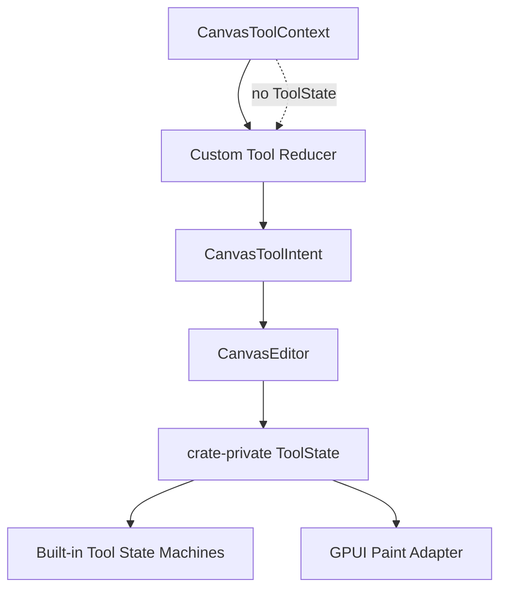

# refactor: Hide Canvas Internal Tool State

## Summary

This plan removes internal built-in tool state from the public canvas API. Custom tools keep the public `CanvasToolIntent` vocabulary, while `ToolState` becomes an internal editor/session implementation detail used by built-in tools and the GPUI paint adapter.

---

## Problem Frame

The previous release-surface pass made `CanvasToolEffect` crate-private and moved custom tools onto `CanvasToolIntent`. That fixed the largest custom-tool leak, but `ToolState` is still public through editor state access, custom tool context, paint interaction constructors, and the top-level crate export.

That public enum encodes built-in select, pan, resize, translate, marquee, and connect state branches. If downstream tool authors depend on it, future lasso, text edit, pinch, snap, and richer transform states will be public compatibility problems. The deep Module should be the editor/tool session, not the raw state enum.

---

## Requirements

- R1. `ToolState` must no longer be exported as a public `open_gpui_canvas` API.
- R2. Custom tool reducers must not receive `ToolState` through `CanvasToolContext`.
- R3. GPUI paint internals may still use the internal state snapshot to render selection rectangles, connection previews, and snap guides.
- R4. Public paint APIs must not require callers to construct or match internal built-in states.
- R5. Existing built-in tool behavior and tests must continue to pass.
- R6. README and ADR text must describe custom tools in terms of intent and read-only context, not internal state.

---

## Key Technical Decisions

- KTD1. **Make `ToolState` crate-private:** built-in tool modules and GPUI paint can still use it, but downstream crates cannot match on built-in implementation branches.
- KTD2. **Keep custom context stable and smaller:** `CanvasToolContext` should expose document, viewport, tool, runtime, registry, selection, history, and helper methods, but not the internal tool state.
- KTD3. **Keep paint interaction as a sealed snapshot carrier:** `CanvasPaintInteraction` can keep a private internal state field for editor-backed paint, while public constructors only allow stable inputs such as selection.
- KTD4. **Delete public state injection helpers:** `CanvasPaintModel::with_tool_state`, `CanvasPaintInteraction::tool_state`, and similar state-facing helpers should become crate-private or be removed instead of deprecated.

---

## High-Level Technical Design

The seam keeps custom tools on stable intent and context APIs. Internal state remains available to built-in tools and the GPUI adapter because they live inside the crate.

---

## Implementation Units

### U1. Make ToolState Internal

**Goal:** Remove `ToolState` from the public crate export and make the enum visible only inside the crate.

**Requirements:** R1, R3, R5.

**Dependencies:** None.

**Files:**

- `crates/canvas/src/tool.rs`
- `crates/canvas/src/tool/builtin.rs`
- `crates/canvas/src/tool/select.rs`
- `crates/canvas/src/gpui.rs`
- `crates/canvas/src/lib.rs`

**Approach:** Change `ToolState` visibility to crate-private. Update internal imports to reference `crate::tool::ToolState` where needed. Keep tests inside crate modules using internal state for behavioral assertions.

**Test scenarios:**

- `crates/canvas/src/tool.rs`: built-in select, pan, connect, translate, resize, and cancel tests still pass.
- `crates/canvas/src/gpui.rs`: paint interaction tests still render selection bounds, connection previews, and snap guides from editor-backed snapshots.
- `crates/canvas/src/lib.rs`: top-level public exports no longer include `ToolState`.

**Verification:** The unit is complete when `cargo check -p open-gpui-canvas --all-features` succeeds without public private-type errors.

---

### U2. Remove ToolState From Custom Tool Context

**Goal:** Ensure custom reducers cannot depend on internal built-in state branches.

**Requirements:** R2, R5.

**Dependencies:** U1.

**Files:**

- `crates/canvas/src/tool.rs`
- `crates/canvas/src/persistence/tests.rs`
- `crates/canvas/README.md`
- `docs/adr/0002-open-gpui-canvas-architecture.md`

**Approach:** Remove the `state` field and `state()` accessor from `CanvasToolContext`. Keep `active_custom_tool_id`, `tool`, `selection`, `history`, and hit-test helpers as the supported read-only custom-tool surface.

**Test scenarios:**

- `crates/canvas/src/tool.rs`: custom tool reducer tests still compile and apply `CanvasToolIntent` values.
- `crates/canvas/src/persistence/tests.rs`: persistent custom tool dispatch still logs committed transactions.
- Documentation examples compile conceptually without calling `context.state()`.

**Verification:** The unit is complete when no public custom-tool API exposes `ToolState`.

---

### U3. Seal Paint Interaction State Injection

**Goal:** Keep internal paint overlays working while removing public APIs that require external callers to construct `ToolState`.

**Requirements:** R3, R4, R5.

**Dependencies:** U1.

**Files:**

- `crates/canvas/src/gpui.rs`
- `crates/canvas/src/lib.rs`

**Approach:** Replace public `CanvasPaintInteraction::new(selection, state)` with a public selection-only constructor or default path. Move `tool_state()` and `with_tool_state()` to crate-private visibility. Keep `CanvasPaintModel::from(&CanvasEditor)` as the preferred path for editor-backed interaction snapshots.

**Test scenarios:**

- `crates/canvas/src/gpui.rs`: tests that need interaction states can still use crate-private helpers.
- `crates/canvas/src/gpui.rs`: public default paint model construction still creates an idle interaction snapshot.
- `crates/canvas/src/gpui.rs`: editor-backed paint model still carries transient selection, connection, and snap overlays.

**Verification:** The unit is complete when public paint APIs no longer mention private `ToolState` but existing paint behavior is unchanged.

---

### U4. Update Docs And Plan Status

**Goal:** Align public guidance with the hidden internal tool-state model.

**Requirements:** R6.

**Dependencies:** U1, U2, U3.

**Files:**

- `crates/canvas/README.md`
- `docs/adr/0002-open-gpui-canvas-architecture.md`
- `docs/plans/2026-06-10-002-refactor-canvas-tool-session-plan.md`

**Approach:** Update public docs to say custom tools see read-only editor context and return intents. Mention internal state machine details only as crate-owned implementation.

**Test scenarios:** Test expectation: none -- documentation-only changes are covered by compile and crate tests for U1-U3.

**Verification:** The unit is complete when docs no longer tell custom tool authors to reason about internal `ToolState`.

---

## Scope Boundaries

### Deferred to Follow-Up Work

- Introducing a richer public `CanvasToolSessionSnapshot` enum if external tools later need stable gesture/session categories.
- Moving built-in select/pan/connect states into separate state-node structs.
- Adding lasso, text edit, pinch, or multi-touch states.
- Splitting GPUI adapter files beyond visibility fixes needed by this refactor.

### Outside This Refactor

- Changing built-in tool behavior.
- Changing persistence journal semantics already completed in the prior plan.
- Introducing a plugin trait system for custom tools.

---

## Risks & Dependencies

- **Private type leakage:** making `ToolState` crate-private can surface Rust visibility errors in public methods. Mitigation: convert those methods to crate-private or remove them.
- **Paint test coupling:** tests may use `ToolState` directly. Mitigation: keep crate-local helpers available for tests and paint internals.
- **Downstream API churn:** pre-1.0 external callers that matched `ToolState` will break. Mitigation: this is intentional; the public custom-tool seam is `CanvasToolIntent`.

---

## Sources & Research

- `crates/canvas/src/tool.rs`: current public `ToolState`, `CanvasToolContext`, and editor methods.
- `crates/canvas/src/gpui.rs`: current paint interaction state usage.
- `crates/canvas/src/tool/select.rs` and `crates/canvas/src/tool/builtin.rs`: built-in state machine implementation.
- `docs/adr/0002-open-gpui-canvas-architecture.md`: current decision that custom tools should emit intents instead of mutating editor internals.
