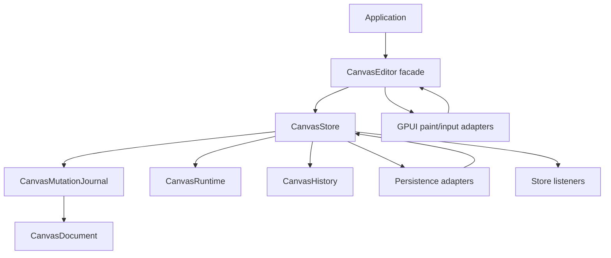

# Refactor Canvas Store Seam

## Summary

Introduce `CanvasStore` as the next deep module for `open-gpui-canvas`. The store becomes the
single seam for document mutation, committed change facts, history, runtime cache sync,
persistence handoff, listeners, and atomic batches. `CanvasEditor` remains the user-facing tool and
GPUI adapter facade, but it stops owning the core mutation pipeline.

---

## Problem Frame

The recent mutation journal work made committed changes more truthful, but `CanvasEditor` still
coordinates too many invariants: document writes, undo/redo stacks, runtime updates, gesture
commits, selection pruning, router/kind registry policy, and persistence helpers. This makes
callers depend on an editor-shaped interface even when they need a store-shaped one.

The architecture review's three candidates are valid, but they have a dependency order. A store
seam should land first because first-class relation/binding records and scoped session records both
need one change feed and one atomic mutation boundary to avoid duplicating history, persistence,
runtime sync, and listener behavior.

---

## Requirements

**Store mutation seam**

- R1. `CanvasStore` owns the canonical `CanvasDocument`, `CanvasRuntime`, `CanvasHistory`,
  `CanvasKindRegistry`, and `CanvasEdgeRouter` mutation path.
- R2. All committed document mutations flow through one store method that returns a committed change
  fact and updates runtime/history consistently.
- R3. Undo, redo, gesture commit, and direct transactions reuse the same prepared mutation path.
- R4. No-op committed mutations do not notify listeners, push history, advance persistence cursors,
  or rebuild runtime caches.

**Change feed and atomicity**

- R5. The store exposes a renderer-neutral change feed for committed record changes, relation
  changes, diffs, source metadata, and history effects.
- R6. Atomic batches either publish one committed store change or publish nothing on failure.
- R7. Listener callbacks observe post-commit state and cannot see half-applied document/runtime
  state.

**Editor and persistence integration**

- R8. `CanvasEditor` delegates core mutation, undo/redo, gesture commit, runtime snapshots, and
  history reads to `CanvasStore`.
- R9. Persistence helpers append logs from store committed changes instead of preparing and applying
  editor mutations directly.
- R10. Existing public editor and persistence behavior remains equivalent for current examples and
  tests.

**Future seams**

- R11. The plan must leave an explicit adapter point for relation/binding side effects without
  forcing first-class binding records into this slice.
- R12. The plan must leave scoped session records as follow-up work; viewport and selection may stay
  editor-facing until the store seam is stable.

---

## Key Technical Decisions

- KTD1. `CanvasStore` is the next active refactor target. The report's relation/binding and session
  record candidates are real, but both depend on a store-level change feed and atomic boundary.
- KTD2. The store owns runtime synchronization. `CanvasRuntime` remains the cache module, but callers
  should not manually remember to sync it after document mutation.
- KTD3. Persistence consumes committed store changes, not editor internals. This keeps redb, Loro,
  rkyv, and memory log adapters behind one durable fact source.
- KTD4. The first listener API is in-process and synchronous. It should be enough for tests,
  persistence adapters, and future side effects without committing to async streams.
- KTD5. Relation/binding side effects are introduced as a narrow store hook boundary only if needed
  to remove duplicate cleanup logic. Full first-class binding records remain a separate plan.
- KTD6. Scoped session records are deferred. Moving viewport, selection, presence, page, camera, and
  pointer state before the store exists would spread the current editor problem across more records.

---

## High-Level Technical Design

The design goal is not to make `CanvasStore` a rendering object. It is a state and mutation module.
The editor and GPUI adapter can still own interaction-specific decisions, but every durable document
change should pass through store commit semantics.

---

## Implementation Units

### U1. Introduce the store core

- **Goal:** Add `CanvasStore` with canonical document/runtime/history ownership and read-only
  snapshot accessors.
- **Requirements:** R1, R2, R4.
- **Dependencies:** None.
- **Files:** `crates/canvas/src/store.rs`, `crates/canvas/src/lib.rs`,
  `crates/canvas/src/tool.rs`, `crates/canvas/src/store/tests.rs` or inline store tests.
- **Approach:** Move store-shaped fields out of `CanvasEditor` behind a new module while keeping
  editor constructors behavior-compatible. Start with direct transaction application and runtime
  sync before moving gesture or persistence paths.
- **Patterns to follow:** `crates/canvas/src/mutation.rs` for prepared committed facts;
  `crates/canvas/src/runtime.rs` for runtime cache sync from committed mutations.
- **Test scenarios:** Creating a store from a document rebuilds runtime; applying a transaction
  updates document and runtime; a no-op transaction returns an empty diff without pushing history;
  schema validation failure leaves document and runtime unchanged.
- **Verification:** Existing editor transaction tests still pass through the new store-backed path.

### U2. Move history and undo/redo into the store

- **Goal:** Make `CanvasStore` own undo/redo stack mutation and expose history status through a
  smaller API.
- **Requirements:** R2, R3, R4, R8.
- **Dependencies:** U1.
- **Files:** `crates/canvas/src/store.rs`, `crates/canvas/src/tool.rs`,
  `crates/canvas/src/persistence/store.rs`, `crates/canvas/src/tool/builtin.rs`.
- **Approach:** Move `CanvasHistory` from editor implementation detail to store implementation
  detail. `CanvasEditor::undo`, `CanvasEditor::redo`, and persistence undo/redo should call store
  methods instead of preparing mutations themselves.
- **Patterns to follow:** Current `CanvasEditor::apply_prepared_undo_mutation` and
  `CanvasEditor::apply_prepared_redo_mutation` behavior, including stale no-op history discard.
- **Test scenarios:** Direct transaction pushes one undo entry; undo and redo update runtime and
  selection pruning through the editor facade; no-op undo/redo entries are discarded; redo clears on
  a new direct transaction.
- **Verification:** Existing `tool::tests::*undo*`, `tool::tests::*redo*`, and persistence undo/redo
  tests remain behavior-equivalent.

### U3. Add committed store changes and listeners

- **Goal:** Add a store-level committed change object and listener API that reports one complete
  post-commit fact per non-empty mutation.
- **Requirements:** R5, R6, R7, R11.
- **Dependencies:** U1, U2.
- **Files:** `crates/canvas/src/store.rs`, `crates/canvas/src/changes.rs`,
  `crates/canvas/src/mutation.rs`, `crates/canvas/src/runtime.rs`.
- **Approach:** Wrap `CanvasCommittedMutation` with store context such as source, history effect,
  and post-commit diff. Listener callbacks receive immutable facts after document/runtime/history
  are synchronized.
- **Patterns to follow:** tldraw `repo-ref/tldraw/packages/store/src/lib/Store.ts` listener and
  history concepts; keep the Rust API simpler and synchronous for now.
- **Test scenarios:** A listener receives one event for one committed transaction; relation-only
  changes notify listeners; no-op changes do not notify; listener order is stable; a failed
  transaction publishes no event.
- **Verification:** Store tests can observe committed record and relation operation batches without
  reading editor internals.

### U4. Rebase persistence on store commits

- **Goal:** Make persistence helpers append logs from store committed changes and stop duplicating
  editor prepare/apply sequencing.
- **Requirements:** R3, R5, R7, R9, R10.
- **Dependencies:** U3.
- **Files:** `crates/canvas/src/persistence/store.rs`,
  `crates/canvas/src/persistence/tests.rs`, `crates/canvas/src/tool.rs`.
- **Approach:** Replace editor-specific persistent apply/undo/redo internals with store commit
  calls that can be logged before state advances. Keep failure behavior: if log append fails, store
  state must not advance.
- **Patterns to follow:** Current persistent tests around store failure, cursor advancement,
  committed record batches, relation batches, and gesture commits.
- **Test scenarios:** Store failure leaves document/history/runtime unchanged; cursor advances only
  after log append and state apply both succeed; persistent undo/redo reuse the prepared store
  mutation; relation-only and relation-pruning changes replay correctly.
- **Verification:** All persistence tests pass without special editor-only mutation paths.

### U5. Move gesture commit through the store

- **Goal:** Make transient gesture begin/update/commit/cancel produce store-level committed facts
  while preserving current editor facade behavior.
- **Requirements:** R3, R6, R7, R8, R10.
- **Dependencies:** U3.
- **Files:** `crates/canvas/src/gesture.rs`, `crates/canvas/src/store.rs`,
  `crates/canvas/src/tool.rs`, `crates/canvas/src/persistence/store.rs`.
- **Approach:** Keep transient gesture state local to editor or a store session helper, but route
  final commit through store atomic commit semantics. Cancel must restore the baseline without
  notifying committed listeners.
- **Patterns to follow:** `CanvasGestureSession` and current public transient transaction intents.
- **Test scenarios:** Gesture updates do not push history or notify committed listeners; commit
  publishes one committed change; cancel restores baseline without history/log/listener changes;
  relation-only gesture commits are preserved.
- **Verification:** Current gesture and persistent gesture tests pass with store-backed commits.

### U6. Narrow relation/binding side-effect preparation

- **Goal:** Prepare the next relation/binding refactor by centralizing cleanup and side-effect
  extension points behind store-owned APIs.
- **Requirements:** R11.
- **Dependencies:** U3.
- **Files:** `crates/canvas/src/store.rs`, `crates/canvas/src/relations.rs`,
  `crates/canvas/src/mutation.rs`, `crates/canvas/src/document.rs`.
- **Approach:** Do not convert parent/group facts into first-class binding records yet. Instead,
  ensure relation cleanup, inverse repair, and relation change facts are all observable through
  store commits, and add the minimal internal hook shape needed for future binding utilities.
- **Patterns to follow:** tldraw `StoreSideEffects` and `BindingUtil` concepts, adapted as Rust
  internal extension seams rather than public plugin APIs in this slice.
- **Test scenarios:** Deleting records still prunes relation facts through one path; relation
  cleanup is visible in store change facts; no caller outside the store needs to manually sync
  history/runtime/persistence after relation changes.
- **Verification:** Relation, mutation, clipboard, gesture, and persistence relation tests remain
  green.

### U7. Update architecture documentation and examples

- **Goal:** Document `CanvasStore` as the mutation/change-feed seam and clarify that scoped session
  records are follow-up work.
- **Requirements:** R10, R11, R12.
- **Dependencies:** U1-U6.
- **Files:** `docs/adr/0002-open-gpui-canvas-architecture.md`, `crates/canvas/README.md`,
  `examples/smoke-native/src/main.rs`, `examples/canvas-notes/src/main.rs`.
- **Approach:** Keep public examples editor-first where that is ergonomic, but describe that the
  editor delegates mutation to store. Avoid promising CRDT, redb, rkyv, binding records, or
  presence until their plans exist.
- **Patterns to follow:** Existing ADR sections that separate renderer-neutral core, GPUI adapter,
  mutation journal, runtime, and persistence.
- **Test scenarios:** Example code still compiles; README examples show the preferred store/editor
  relationship; ADR explains why store precedes binding and session record refactors.
- **Verification:** Example packages compile and documentation references match exported APIs.

---

## Scope Boundaries

### Active Scope

- Introduce `CanvasStore` and move current mutation/history/runtime/persistence coordination behind
  it.
- Preserve current public editor workflows unless a narrower API is clearly better before release.
- Add synchronous in-process listeners and atomic commit semantics.
- Prepare relation/binding side-effect seams only where they remove duplicated cleanup or unblock
  the next plan.

### Deferred to Follow-Up Work

- Convert `CanvasRecordRelations` into first-class relation or binding records with registered
  binding utilities.
- Convert viewport, selection, presence, page, camera, and pointer state into scoped records.
- Add Loro, redb, rkyv, or network sync adapters.
- Add multi-page document behavior or collaborative presence rendering.

---

## Risks & Dependencies

- **Risk:** Moving history and runtime ownership can create subtle duplicate updates. Mitigation:
  land U1 and U2 with characterization tests around existing editor behavior before deleting old
  paths.
- **Risk:** Listener callbacks may tempt callers to mutate recursively. Mitigation: keep first
  listener API post-commit and immutable; defer re-entrant mutation semantics until a concrete need
  exists.
- **Risk:** Persistence failure ordering can regress. Mitigation: preserve current prepare-log-apply
  tests and require store state to remain unchanged when log append fails.
- **Dependency:** The current mutation journal must remain the source of committed diffs, inverses,
  record changes, and relation changes.
- **Dependency:** Runtime cache APIs should stay adapter-owned; the store should call them, not
  duplicate their indexing logic.

---

## Sources & Research

- The architecture review report ranks the `CanvasStore` seam as the top recommendation and marks
  relation/binding records as dependent follow-up work.
- `crates/canvas/src/tool.rs` currently owns document, viewport, tool state, runtime, selection,
  history, and gesture state.
- `crates/canvas/src/persistence/store.rs` prepares and applies editor mutations while also owning
  log append/cursor sequencing.
- `crates/canvas/src/mutation.rs` already provides the committed mutation facts the store should
  reuse.
- `repo-ref/tldraw/packages/store/src/lib/Store.ts` and
  `repo-ref/tldraw/packages/store/src/lib/StoreSideEffects.ts` are useful references for listener,
  history, query, and side-effect boundaries.
- `repo-ref/tldraw/packages/tlschema/src/records/TLBinding.ts` and
  `repo-ref/tldraw/packages/tlschema/src/records/TLPageState.ts` support the follow-up direction,
  but should not be copied into this slice before the store seam exists.
