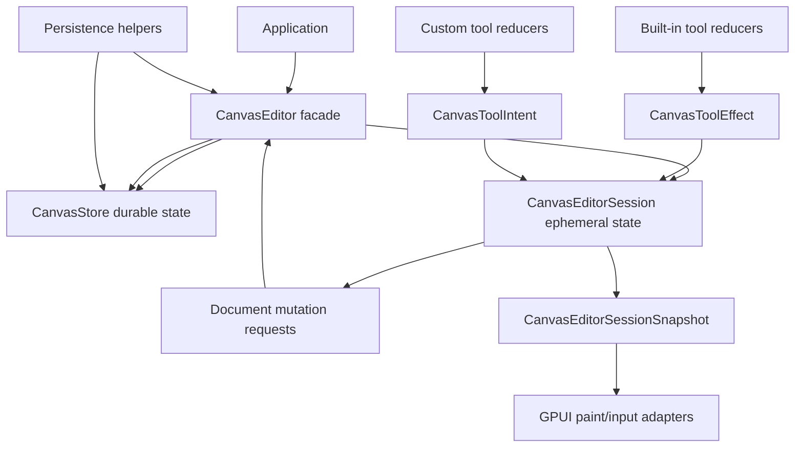

# Refactor Canvas Editor Session Seam

## Summary

Deepen the `CanvasEditor` boundary by moving viewport, selection, active tool state, and gesture
lifecycle into a crate-owned session module. `CanvasEditor` remains the public facade over
`CanvasStore` plus session state, but durable store mutation and ephemeral interaction state stop
sharing one implementation body.

---

## Problem Frame

The latest architecture review correctly identifies `CanvasEditor` as the next thick seam. The
previous refactors hid `ToolState`, introduced public transient transaction intents, and moved
durable document mutation into `CanvasStore`, but `CanvasEditor` still owns store delegation,
selection pruning, viewport mutation, tool switching, gesture baseline management, clipboard and
z-order commands, built-in tool dispatch, custom tool dispatch, and persistence-facing gesture
helpers.

This is not a release-blocking correctness issue, but it is the next leverage point before adding
lasso, text edit, multi-touch/pinch, snapping policy, richer overlays, scoped page state, or
collaboration. The right next refactor is not to expose more public state; it is to make the
editor's session runtime a deep internal module.

---

## Requirements

**Session Ownership**

- R1. Move editor-scoped state ownership for viewport, active tool, internal tool state, selection,
  and active gesture into a dedicated session module.
- R2. Keep `CanvasEditor` as the stable public facade for applications, examples, GPUI adapters,
  persistence helpers, and custom tool dispatch.
- R3. Preserve current editor behavior for selection pruning, tool switching, gesture
  begin/update/commit/cancel, undo/redo selection retention, and kind-registry resets.

**Tool And Gesture Flow**

- R4. Route built-in tool effects and public custom tool intents through one session effect
  application path before durable document changes enter `CanvasStore`.
- R5. Keep `ToolState`, `CanvasToolEffect`, and gesture baseline details crate-private; custom
  tools continue to use `CanvasToolIntent` and read-only `CanvasToolContext`.
- R6. Make gesture lifecycle ownership local enough that future lasso/text/pinch states can be
  added without growing `CanvasEditor` method branches.

**Adapter And Persistence Integration**

- R7. GPUI paint snapshots receive session interaction state through a stable crate-owned snapshot,
  not by reaching through editor fields one at a time.
- R8. Persistence helpers keep their log-before-apply guarantees while depending only on editor
  facade methods or store helpers, not on session internals.
- R9. Documentation explains `CanvasStore` as durable state and the session module as ephemeral
  interaction state.

---

## Key Technical Decisions

- KTD1. **Introduce `CanvasEditorSession` as crate-private state owner:** The session owns viewport,
  active `CanvasTool`, internal `ToolState`, `CanvasSelection`, and optional
  `CanvasGestureSession`. This follows tldraw's StateNode lesson at the boundary level without
  copying its React or DOM rendering model.
- KTD2. **Keep `CanvasEditor` as the only public editor object:** Downstream applications should not
  receive a second mutable object for normal canvas editing. The public facade delegates to
  `CanvasStore` for durable changes and to the session for ephemeral changes.
- KTD3. **Apply effects through session-owned semantics:** Selection, viewport, state, and gesture
  effects belong to the session; document-changing effects become explicit store requests handled by
  the editor facade. This keeps log-before-apply persistence and listener semantics on `CanvasStore`.
- KTD4. **Use snapshot handoff for rendering:** GPUI should consume an immutable interaction
  snapshot derived from the session. It should not hold mutable session references or require public
  construction of internal tool states.
- KTD5. **Defer document mutation rules and persistence core splitting:** The review's document
  rules and persistence orchestration seams are valid, but both are easier after the editor session
  no longer owns unrelated interaction branches.

---

## High-Level Technical Design

The split is ownership-oriented. `CanvasStore` owns records, history, runtime cache, committed
change facts, and listeners. `CanvasEditorSession` owns transient interaction state and computes
what durable mutation, if any, should be handed to the store. `CanvasEditor` stays as the integration
facade that has access to both sides.

---

## Implementation Units

### U1. Introduce the Session Module

- **Goal:** Add a crate-private `CanvasEditorSession` module and move the raw editor-scoped fields
  into it while preserving public editor accessors.
- **Requirements:** R1, R2, R3.
- **Dependencies:** None.
- **Files:**
  - `crates/canvas/src/session.rs`
  - `crates/canvas/src/lib.rs`
  - `crates/canvas/src/tool.rs`
  - `crates/canvas/src/tool/builtin.rs`
  - `crates/canvas/src/tool/select.rs`
- **Approach:** Move viewport, active tool, internal state, selection, and gesture storage behind a
  session struct. `CanvasEditor` should keep delegating `viewport()`, `tool()`, `selection()`, and
  crate-private state accessors so existing call sites continue to compile. Avoid changing behavior
  in this unit; this is a structural move.
- **Execution note:** Characterization-first. Keep existing editor and GPUI tests green before
  changing effect semantics.
- **Patterns to follow:** `crates/canvas/src/store.rs` for moving ownership behind a deep module
  while keeping editor-facing accessors; `crates/canvas/src/gpui/model.rs` for immutable snapshot
  handoff.
- **Test scenarios:**
  - `crates/canvas/src/tool.rs`: default editor still starts with select tool, idle state, empty
    selection, default viewport, and empty gesture state.
  - `crates/canvas/src/tool.rs`: existing selection, pan, connect, resize, translate, undo, redo,
    and tool registry tests remain behavior-equivalent.
  - `crates/canvas/src/gpui/model.rs`: `CanvasPaintModel::from(&CanvasEditor)` still captures the
    current selection and internal tool-state snapshot.
- **Verification:** The unit is complete when `CanvasEditor` no longer stores the session fields
  directly and no public API changes are required.

### U2. Move Session-Only Effects Into the Session

- **Goal:** Make selection, viewport, tool-state, and tool-switch effects session-owned instead of
  editor-owned branches.
- **Requirements:** R1, R3, R4, R5.
- **Dependencies:** U1.
- **Files:**
  - `crates/canvas/src/session.rs`
  - `crates/canvas/src/tool.rs`
  - `crates/canvas/src/tool/builtin.rs`
  - `crates/canvas/src/tool/select.rs`
  - `crates/canvas/src/persistence/tests.rs`
- **Approach:** Split effect application into session-only effects and durable mutation requests.
  The session should own selection retention against a provided document, viewport panning,
  tool-state replacement, and active tool switching. Effects that create document transactions
  should be returned to `CanvasEditor` for store application.
- **Execution note:** Test-first for effect routing cases that currently cross editor and session
  state, especially tool switching and selection pruning.
- **Patterns to follow:** `CanvasToolIntent` and `CanvasToolEffect` mapping in `crates/canvas/src/tool.rs`;
  tldraw `StateNode` transition ownership in `repo-ref/tldraw/packages/editor/src/lib/editor/tools/StateNode.ts`.
- **Test scenarios:**
  - `crates/canvas/src/tool.rs`: applying `SetSelection`, `ReplaceSelection`, `AddSelection`,
    `RemoveSelection`, `ToggleSelection`, and `ClearSelection` mutates session selection and prunes
    records missing from the current document.
  - `crates/canvas/src/tool.rs`: applying `PanViewport` and `SetViewport` changes only session
    viewport and does not push store history.
  - `crates/canvas/src/tool.rs`: switching tools cancels an active gesture, restores the baseline,
    sets idle state, and changes the active tool.
  - `crates/canvas/src/persistence/tests.rs`: persistent public tool intents still produce one log
    entry for committed transient transactions and no log entry for session-only effects.
- **Verification:** The unit is complete when session-only effects can be tested without matching
  on `CanvasEditor` fields.

### U3. Localize Gesture Lifecycle Under the Session

- **Goal:** Move gesture baseline ownership, implicit begin behavior, commit preparation, and cancel
  transaction creation behind the session seam.
- **Requirements:** R3, R4, R6, R8.
- **Dependencies:** U1, U2.
- **Files:**
  - `crates/canvas/src/session.rs`
  - `crates/canvas/src/gesture.rs`
  - `crates/canvas/src/tool.rs`
  - `crates/canvas/src/persistence/store.rs`
  - `crates/canvas/src/persistence/tests.rs`
- **Approach:** Keep `CanvasGestureSession` focused on baseline diffing, but let
  `CanvasEditorSession` decide when a gesture exists, when an implicit gesture should be created,
  and when it should be cleared. Durable gesture commits still hand a prepared mutation to
  `CanvasStore`; transient updates still apply through the editor/store transient path.
- **Execution note:** Characterization-first around rollback and persistent commit failure, because
  these are the highest-risk behavior-preservation cases.
- **Patterns to follow:** `crates/canvas/src/gesture.rs` for baseline diffing;
  `crates/canvas/src/store.rs` for prepared commit application;
  `crates/canvas/src/persistence/store.rs` for log-before-apply sequencing.
- **Test scenarios:**
  - `crates/canvas/src/tool.rs`: repeated begin gesture calls preserve the first baseline.
  - `crates/canvas/src/tool.rs`: transient update without an explicit begin creates an implicit
    baseline and can still commit or cancel correctly.
  - `crates/canvas/src/tool.rs`: cancel restores document, runtime hit tests, selection, and idle
    state without pushing history.
  - `crates/canvas/src/persistence/tests.rs`: append failure during persistent gesture commit leaves
    active gesture retryable and does not advance cursor or history.
- **Verification:** The unit is complete when `CanvasEditor` no longer directly owns or mutates
  `Option<CanvasGestureSession>`.

### U4. Shrink Built-In Tool Reducer Coupling

- **Goal:** Stop built-in select/pan/connect reducers from requiring a full `CanvasEditor`
  reference.
- **Requirements:** R4, R5, R6.
- **Dependencies:** U1, U2.
- **Files:**
  - `crates/canvas/src/session.rs`
  - `crates/canvas/src/tool.rs`
  - `crates/canvas/src/tool/builtin.rs`
  - `crates/canvas/src/tool/select.rs`
  - `crates/canvas/src/geometry_facts.rs`
- **Approach:** Introduce a crate-private reducer context that exposes only what reducers need:
  document, runtime, viewport, selection, tool state, router, kind registry, and geometry helper
  methods. Reducers should still return `CanvasToolEffect`; they should not mutate session or store
  directly.
- **Execution note:** Characterization-first. This unit changes call boundaries, not intended tool
  behavior.
- **Patterns to follow:** Public `CanvasToolContext` for a small read-only custom-tool surface;
  `CanvasGeometryFacts` for shared geometry lookup instead of duplicating hit-test logic.
- **Test scenarios:**
  - `crates/canvas/src/tool.rs`: select tool delete, shift-click, box select, translation, resize,
    snap, cancel, and locked-record behavior remain unchanged.
  - `crates/canvas/src/tool.rs`: pan tool and connect tool tests remain unchanged, including handle
    role restrictions and locked endpoint behavior.
  - `crates/canvas/src/tool.rs`: custom reducers still receive the public `CanvasToolContext` and
    cannot access internal tool state.
- **Verification:** The unit is complete when `BuiltInCanvasToolReducer::handle_event` no longer
  accepts `&CanvasEditor`.

### U5. Add Session Snapshots For Paint And Persistence Boundaries

- **Goal:** Provide immutable session snapshots for GPUI paint and keep persistence helpers away
  from session internals.
- **Requirements:** R7, R8, R9.
- **Dependencies:** U1, U2, U3.
- **Files:**
  - `crates/canvas/src/session.rs`
  - `crates/canvas/src/gpui/model.rs`
  - `crates/canvas/src/gpui/frame.rs`
  - `crates/canvas/src/persistence/store.rs`
  - `crates/canvas/README.md`
  - `docs/adr/0002-open-gpui-canvas-architecture.md`
  - `docs/plans/2026-06-10-015-refactor-canvas-editor-session-seam-plan.md`
- **Approach:** Add a crate-private session snapshot for selection, internal tool state, viewport,
  and transient overlay inputs. `CanvasPaintModel::from(&CanvasEditor)` should use that snapshot.
  Persistence helpers should keep calling editor facade methods for gesture preparation and
  application; they should not read session fields directly.
- **Patterns to follow:** `CanvasPaintModel` snapshot construction in `crates/canvas/src/gpui/model.rs`;
  `CanvasStoreChange` snapshot pattern in `crates/canvas/src/store.rs`.
- **Test scenarios:**
  - `crates/canvas/src/gpui/frame.rs`: selection bounds, transform handles, snap guides, and
    connection preview still render from editor-backed paint snapshots.
  - `crates/canvas/src/gpui/model.rs`: paint snapshots remain immutable after later editor/session
    mutation.
  - `crates/canvas/src/persistence/tests.rs`: persistent helper tests still cover direct
    transaction, undo, redo, gesture commit, custom tool intent, and retry-after-append-failure.
  - Documentation examples describe store/session separation without exposing internal session
    types as public API.
- **Verification:** The unit is complete when GPUI and persistence compile without reaching into
  session storage and docs explain the new boundary.

---

## Scope Boundaries

### Active Scope

- Split editor-owned ephemeral state into a crate-private session module.
- Preserve current public `CanvasEditor`, `CanvasToolIntent`, `CanvasToolContext`, `CanvasStore`,
  persistence helper, and GPUI adapter behavior.
- Keep built-in tools returning effect values rather than mutating store or session directly.
- Update docs and tests to describe the store/session split.

### Deferred to Follow-Up Work

- Deepen `CanvasDocument` into a more passive record set with mutation rules concentrated in the
  journal/rules seam.
- Split durable persistence core from editor/store orchestration helpers.
- Add first-class scoped records for viewport, selection, page, presence, camera, or pointer state.
- Add lasso, text edit, pinch, multi-touch, or richer snapping behavior.
- Introduce public session-state categories for downstream tools; the current plan keeps the session
  crate-private.

### Outside This Refactor

- Changing canvas document serialization.
- Adding redb, Loro, `rkyv`, or network collaboration adapters.
- Replacing the current built-in tool behavior.
- Rewriting GPUI paint into per-record elements.

---

## Risks & Dependencies

- **Behavioral drift in interaction branches:** Moving state ownership can subtly change cancel,
  commit, selection retention, or tool-switch order. Mitigation: keep characterization tests green
  before each extraction and add targeted tests where boundaries become explicit.
- **Borrowing pressure between store and session:** `CanvasEditor` must borrow durable store state
  and mutable session state without introducing clone-heavy or unsafe workarounds. Mitigation:
  prefer read-only context snapshots and explicit store requests over passing `&mut CanvasEditor`
  into reducers.
- **Paint coupling to internal state:** GPUI still needs internal state for overlays. Mitigation:
  keep the state crate-private and pass immutable snapshots into paint frame construction.
- **Persistence retry semantics:** Gesture commit failure must remain retryable. Mitigation: preserve
  log-before-apply tests and ensure session clears active gesture only after store commit succeeds or
  no-op commit is resolved.

---

## System-Wide Impact

This refactor changes ownership boundaries rather than user-visible behavior. The main affected
parties are crate maintainers, custom tool authors, and future adapter authors. Maintainers get a
smaller editor facade; custom tool authors keep the existing intent/context API; persistence and
collaboration work gets a clearer distinction between durable record mutation and ephemeral
interaction state.

---

## Sources & Research

- Architecture review report from 2026-06-10: top recommendation is to deepen the `CanvasEditor`
  session seam before document mutation rules or persistence orchestration.
- `crates/canvas/src/tool.rs`: current `CanvasEditor`, `ToolState`, `CanvasToolEffect`,
  `CanvasToolIntent`, selection, gesture, event dispatch, and command helpers.
- `crates/canvas/src/gesture.rs`: current baseline diff and prepared gesture commit logic.
- `crates/canvas/src/store.rs`: durable store mutation, history, runtime sync, listeners, and
  prepared mutation application.
- `crates/canvas/src/persistence/store.rs`: current persistent editor/store helper surface.
- `crates/canvas/src/gpui/model.rs` and `crates/canvas/src/gpui/frame.rs`: current interaction
  snapshot and paint-frame consumption.
- `repo-ref/tldraw/packages/editor/src/lib/editor/tools/StateNode.ts`: reference for keeping tool
  state transitions behind a session/state-node boundary.
- `repo-ref/tldraw/packages/store/src/lib/StoreSideEffects.ts`: reference for separating store
  side effects from editor session state.
