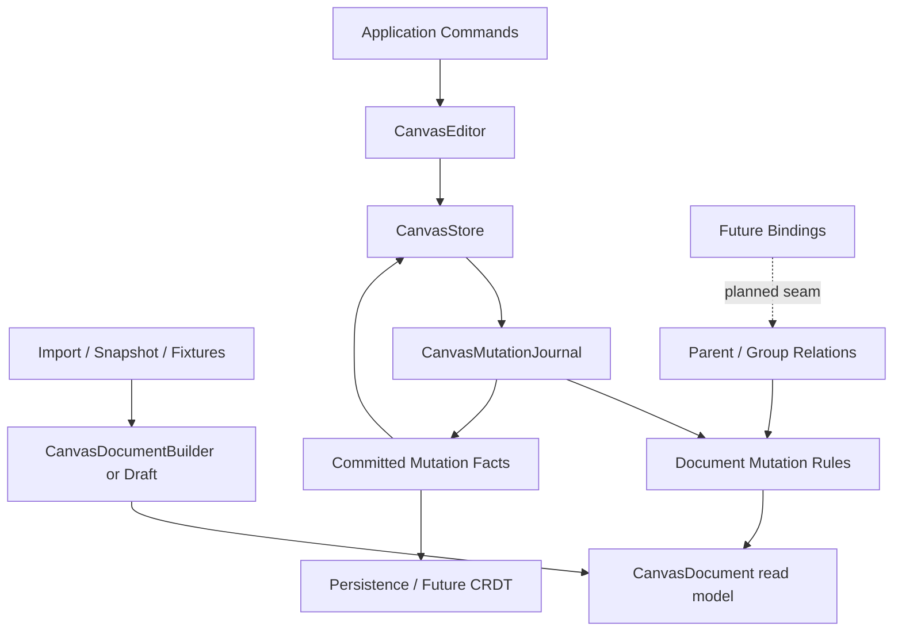

# Refactor Canvas Document Mutation Discipline

## Summary

Tighten the `CanvasDocument` write boundary so production mutations flow through the mutation
journal, while construction, import, fixtures, and low-level rule tests use an explicit draft or
builder path. This follows the previous store and editor-session refactors: durable application
state belongs to `CanvasStore`, ephemeral interaction belongs to `CanvasEditorSession`, and raw
record writes should not remain a crate-wide escape hatch.

---

## Problem Frame

The high-risk public-field bypass has already been addressed: `CanvasDocument` record collections,
metadata, and relations are private fields with read-only accessors. The remaining risk is subtler.
`CanvasDocument` still owns both the canonical read model and the low-level mutation rules used by
the journal. Its direct record helpers are `pub(crate)`, so any crate module can bypass
`CanvasMutationJournal`, `CanvasStoreChange`, history, runtime sync, persistence logging, and
future CRDT translation if those helpers drift into production code.

The right next refactor is not to remove `CanvasDocument` as a standalone model. A document should
still be useful for parsing, validation, import/export, and offline transformation. The goal is to
make the write modes explicit: journaled semantic mutation for product state, and scoped draft
mutation for construction and rule internals.

---

## Requirements

**Mutation Discipline**

- R1. Keep `CanvasDocument` record storage private and preserve its existing read APIs.
- R2. Prevent production modules from using raw insert/update/remove/relation helpers as a
  crate-wide mutation bypass.
- R3. Keep public document transaction APIs journal-backed, including inverse, relation pruning,
  kind-registry validation, and committed record/relation change facts.
- R4. Preserve `CanvasStore` as the durable application mutation boundary for runtime, history,
  listeners, and persistence.

**Construction And Import**

- R5. Provide an explicit construction path for snapshots, JSON Canvas import, tests, and fixtures
  that need to assemble a document without pretending each step is a committed user mutation.
- R6. Make construction-time relation validation and pruning reuse the same rules as journaled
  transactions.

**Relationship Roadmap**

- R7. Keep parent/group relations as first-class document facts, not payload conventions.
- R8. Define the next binding seam for edge bindings, frame containment, group membership, layout
  ownership, and future mind-map hierarchy without adding CRDT or layout behavior in this refactor.

---

## Key Technical Decisions

- KTD1. **Preserve `CanvasDocument` as a standalone model:** Removing public transaction APIs would
  make import/export and pure model tests awkward. The public methods that remain should commit via
  the journal instead of raw record helpers.
- KTD2. **Move raw record writes behind a narrower rules/draft module:** Rust privacy can enforce
  this if the document implementation is split into a module tree where raw helpers are
  `pub(super)` or private to mutation rules.
- KTD3. **Introduce explicit construction vocabulary:** A builder or draft type should make it
  obvious when code is assembling a document rather than publishing a semantic mutation.
- KTD4. **Defer binding records until the relation boundary is named:** Parent/group relations are
  already useful. The next step is to document and prepare the seam, not to add a half-designed
  binding system before a concrete canvas feature exercises it.

---

## High-Level Technical Design

The module boundary should encode intent. Construction code can build a valid document efficiently.
Product code should not reach raw record helpers; it should submit transactions and consume committed
mutation facts.

---

## Implementation Units

### U1. Audit And Characterize Current Write Paths

- **Goal:** Pin down every non-test use of raw `CanvasDocument` mutation helpers and classify it as
  construction, import, journal rule, or production mutation.
- **Requirements:** R1, R2, R4.
- **Files:**
  - `crates/canvas/src/document.rs`
  - `crates/canvas/src/json_canvas.rs`
  - `crates/canvas/src/schema.rs`
  - `crates/canvas/src/gesture.rs`
  - `crates/canvas/src/gpui.rs`
  - `crates/canvas/src/test_support.rs`
- **Approach:** Keep behavior unchanged. Add or adjust characterization tests where raw writes are
  being used for more than fixture setup, especially JSON Canvas import and snapshot loading.
- **Execution note:** Characterization-first. Do not narrow visibility until the intended write path
  for each caller is known.
- **Test scenarios:**
  - Snapshot loading still normalizes nodes, shapes, edges, metadata, and relations.
  - JSON Canvas import still rejects invalid edge endpoints and duplicate node IDs.
  - Existing mutation journal tests still observe incident edge removal and relation pruning.
- **Verification:** The unit is complete when every raw helper caller has a recorded classification
  and the current behavior is covered by tests before visibility changes.

### U2. Extract Document Mutation Rules Behind Module Privacy

- **Goal:** Move raw command application, inverse derivation, relation pruning, and integrity checks
  behind a narrower document rules module.
- **Requirements:** R2, R3, R6.
- **Files:**
  - `crates/canvas/src/document.rs`
  - `crates/canvas/src/mutation.rs`
  - `crates/canvas/src/lib.rs`
- **Approach:** Convert `document.rs` to a module tree if needed so low-level record helpers can be
  private or `pub(super)` instead of `pub(crate)`. Keep re-exports stable from `lib.rs`.
- **Patterns to follow:** `crates/canvas/src/session.rs` for a crate-private deep module behind a
  stable facade; `crates/canvas/src/store.rs` for prepared mutation ownership.
- **Test scenarios:**
  - `CanvasMutationJournal::prepare_with_kind_registry` still returns inverse transactions that
    restore records and pruned relations.
  - Failed document transactions leave the original document unchanged.
  - No non-rules module can call raw insert/update/remove helpers.
- **Verification:** The unit is complete when raw record helpers are no longer crate-wide APIs and
  production code compiles through journal/store/document transaction entry points.

### U3. Add An Explicit Construction Path

- **Goal:** Replace fixture/import raw helper usage with an explicit builder or draft API that
  validates through the same document rules before producing a `CanvasDocument`.
- **Requirements:** R5, R6.
- **Files:**
  - `crates/canvas/src/document.rs`
  - `crates/canvas/src/json_canvas.rs`
  - `crates/canvas/src/test_support.rs`
  - `crates/canvas/src/clipboard.rs`
  - `crates/canvas/src/gpui.rs`
- **Approach:** Add a small construction type only if transaction-based setup creates noise or
  wrong semantics. Prefer transaction construction when the code is modeling an edit; prefer builder
  construction when the code is loading or creating an initial document.
- **Test scenarios:**
  - Builder-created documents validate endpoints, duplicate IDs, and duplicate relation facts.
  - Snapshot and JSON Canvas import use the construction path without emitting store changes.
  - Tests that model user edits continue to use transactions or editor/store APIs.
- **Verification:** The unit is complete when construction/import code no longer depends on
  crate-wide raw helpers.

### U4. Name The Relationship And Binding Seam

- **Goal:** Prepare first-class binding work without prematurely adding layout or CRDT behavior.
- **Requirements:** R7, R8.
- **Files:**
  - `crates/canvas/src/relations.rs`
  - `crates/canvas/src/changes.rs`
  - `docs/adr/0002-open-gpui-canvas-architecture.md`
  - `crates/canvas/README.md`
- **Approach:** Document the difference between structural relations, future bindings, and derived
  runtime facts. Add narrow type or doc changes only if they reduce ambiguity in existing APIs.
- **Test scenarios:**
  - Existing parent and group relation tests still cover deduplication, duplicate parent rejection,
    pruning, inverse restoration, and operation batch order.
  - No new binding type is exposed without tests proving its mutation and inverse behavior.
- **Verification:** The unit is complete when the code and docs make clear where edge bindings,
  containment, layout ownership, and hierarchy should land next.

### U5. Update Docs And Release Notes For The Boundary

- **Goal:** Make the store/session/document responsibilities understandable to crate users before
  0.1 consumers build on accidental write paths.
- **Requirements:** R1, R2, R4, R5.
- **Files:**
  - `crates/canvas/README.md`
  - `docs/adr/0002-open-gpui-canvas-architecture.md`
  - `docs/plans/2026-06-10-016-refactor-canvas-document-mutation-discipline-plan.md`
- **Approach:** Document `CanvasStore` as the durable application boundary, `CanvasEditorSession` as
  ephemeral interaction state, `CanvasDocument` as the canonical read model plus journal-backed
  transaction target, and builders/drafts as construction-only paths.
- **Test scenarios:**
  - Rustdoc and README examples compile or remain clearly illustrative.
  - Public docs do not recommend direct raw record mutation for application editing.
- **Verification:** The unit is complete when docs and examples no longer imply that applications
  should mutate document internals or construction helpers directly.

---

## Scope Boundaries

### Active Scope

- Narrow raw document mutation visibility.
- Keep journal-backed transaction APIs working.
- Add construction/draft vocabulary only where it removes real ambiguity.
- Clarify the relation/binding roadmap in code or docs.

### Deferred To Follow-Up Work

- Implement edge binding records, frame containment behavior, group editing tools, or layout
  ownership semantics.
- Add Loro, redb, or `rkyv` adapters.
- Convert viewport, selection, presence, page, camera, or pointer state into scoped records.
- Rewrite JSON Canvas import/export format behavior.

### Outside This Refactor

- Removing `CanvasDocument` as a standalone model.
- Replacing `CanvasStore` or `CanvasEditor` public facades.
- Adding new user-visible canvas editing features.

---

## Risks & Dependencies

- **Fixture churn:** Many tests use raw document setup. Mitigation: classify setup code first, then
  use helper builders instead of noisy transaction boilerplate.
- **Privacy refactor blast radius:** Converting `document.rs` into a module tree can create import
  churn. Mitigation: preserve `crate::document::*` re-exports and avoid renaming public types.
- **Semantic confusion between import and edit:** Imports should not create undo history, while
  edits should. Mitigation: keep construction APIs separate from store/editor mutation APIs.
- **Premature binding design:** A binding model designed without a feature slice may overfit.
  Mitigation: name the seam and defer concrete records until a canvas feature exercises them.

---

## System-Wide Impact

This refactor reduces the chance that future persistence, CRDT, runtime, or tool work accidentally
observes partial document state. It also makes the codebase easier to explain: applications edit
through `CanvasEditor` or `CanvasStore`, import paths build a valid `CanvasDocument`, and the
mutation journal remains the single semantic fact source for committed changes.

---

## Sources & Research

- `crates/canvas/src/document.rs`: current private record fields, read APIs, transaction entry
  points, and low-level raw helpers.
- `crates/canvas/src/mutation.rs`: current committed mutation fact source and relation inverse
  completion.
- `crates/canvas/src/store.rs`: durable store mutation, history, runtime sync, and listener
  boundary.
- `crates/canvas/src/relations.rs`: parent/group relation facts and existing deduplication helpers.
- Prior plan `docs/plans/2026-06-10-015-refactor-canvas-editor-session-seam-plan.md`: establishes
  the store/session split this document builds on.
