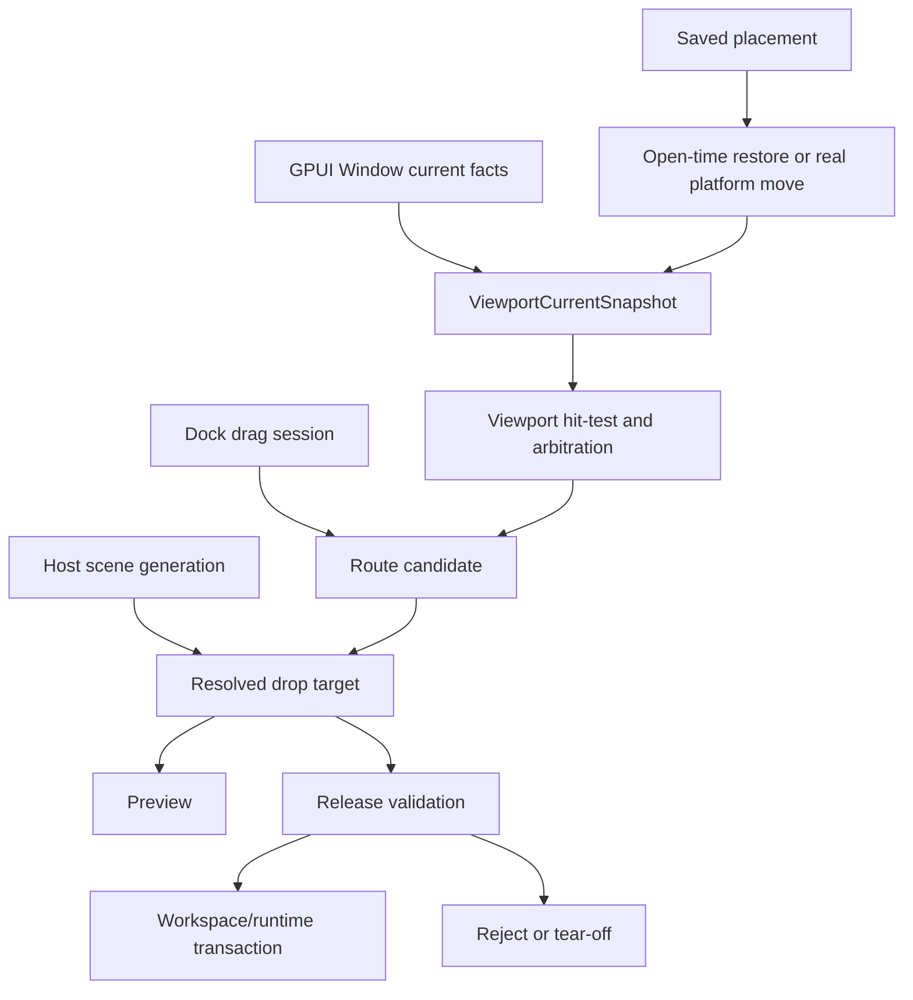
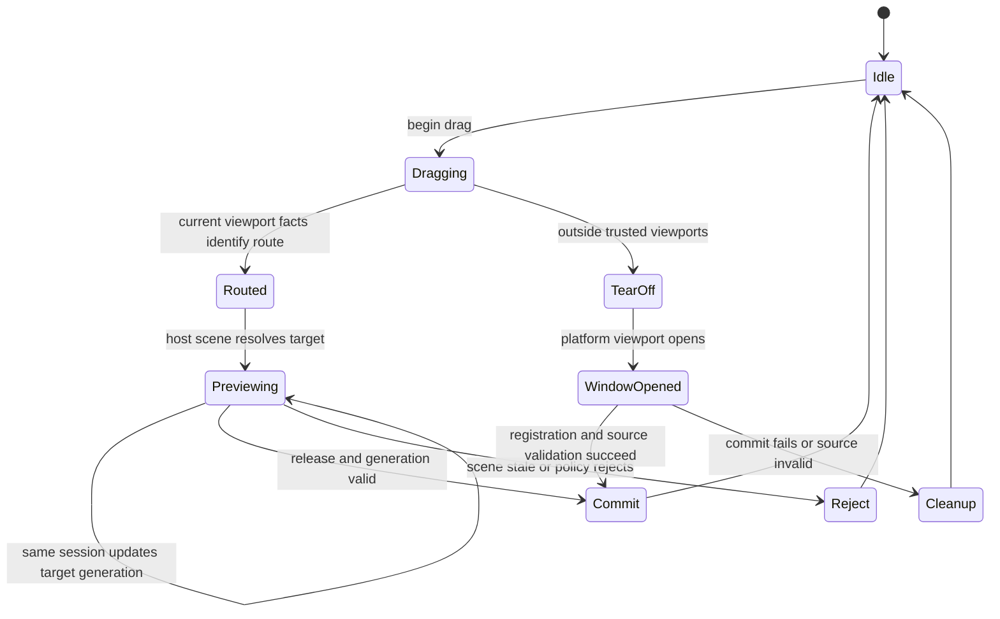
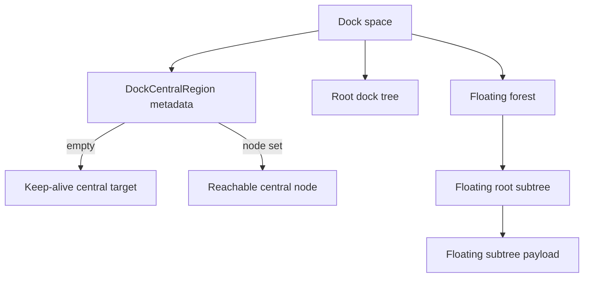

# refactor: Align docking multi-viewport with ImGui semantics

## Summary

Refactor `open-gpui-docking` so multi-viewport docking follows Dear ImGui's docking semantics at the user-observable level while preserving ADR 0002's GPUI ownership boundary. The plan fixes platform-window fact handling, drag-session authority, preview/commit agreement, tear-off lifecycle, drop geometry, central/floating dock invariants, close lifecycle, and the test matrix that guards those behaviors.

---

## Problem Frame

The current implementation has the right broad architecture: `DockGraph` remains pure, rendered hosts publish drop facts, viewport runtime owns platform-window mappings, and drag/drop commits go through transaction modules. The issue is that several semantic contracts are still weaker than Dear ImGui's docking branch. Some code paths use restore placement as current OS window facts, route preview and release recompute targets independently, tear-off happens after release instead of carrying drag offset and source geometry, and central/floating/close behavior can lose DockNode-like invariants.

This is not a request to port Dear ImGui's immediate-mode `DockContext`. The goal is semantic parity where users and application code can rely on ImGui-like behavior: viewport hit-testing uses current window facts, the target preview is the target committed, central regions keep identity, dragging a floating host title moves the whole subtree, closing a viewport respects panel lifecycle, and tests cover the edge cases instead of only proving that a preview exists.

---

## Requirements

**Viewport facts and routing**

- R1. Routing and hit-testing must use the current platform window rectangle, display id, and host bounds, not persisted restore placement.
- R2. Saved placement must be applied only when it can move or initialize real GPUI windows; runtime snapshots must not pretend an OS window moved when it did not.
- R3. Source-only releases must use a drag-session-scoped hovered viewport signal; stale hovered-window state from prior drags must never affect routing.
- R4. When hovered/topmost viewport information is unavailable or contradictory, known-viewport commits must fail closed instead of relying only on registered rectangles.

**Drag, preview, and commit**

- R5. A drag session must carry the authoritative route candidate, resolved host-scene generation, payload identity, drag offset, and source geometry needed for commit validation.
- R6. Preview and commit must agree on the same resolved target or explicitly reject the release when the target scene changed.
- R7. Tear-off must preserve drag offset and source size; release position must not become the new window's top-left corner by default.
- R8. Failed or cancelled tear-off completion after a platform window opens must close or otherwise retire that window before unregistering runtime ownership.

**Docking geometry and DockNode invariants**

- R9. Leaf and root drop resolution must use ImGui-style center/edge drop boxes with anti-flicker behavior instead of a full edge band.
- R10. Root and outer-edge docking must resolve from root/parent bounds without requiring the pointer to also hit a leaf.
- R11. Empty central regions must remain central when content is opened or dropped into them; policy, layout, preview, and commit must share that central identity.
- R12. Dragging a floating host title must move, tear off, or merge the whole floating subtree, not only the first tabs stack found inside it.

**Lifecycle and compatibility**

- R13. Platform viewport close must respect panel close/lifecycle policy before unregistering or hiding docked content.
- R14. Class/filter metadata must allow applications to express dock compatibility without weakening default unclassed behavior.
- R15. Display restore must validate current displays and work areas, clamp or recenter invalid bounds, and preserve monitor information when available.
- R16. Window-close cleanup must be installed by the runtime path itself or made impossible to forget through the public API.

**Verification**

- R17. Tests must lock the semantic matrix: current vs. restore bounds, stale hovered state, preview/commit generation mismatch, tear-off offset, root-edge without leaf hit, empty central recovery, floating subtree drag, close lifecycle, class filters, and display clamp.
- R18. The native docking example must remain the manual dogfood surface for physical multi-window behavior after automated tests pass.

---

## Scope Boundaries

In scope:

- Internal `open-gpui-docking` runtime, resolver, transaction, rendering, policy, and test modules needed to make the above semantics coherent.
- Public docking API adjustments where the current shape lets callers bypass required runtime cleanup or class compatibility.
- The native example and verification documentation needed to dogfood the refactor.

Deferred to follow-up work:

- Full backend parity for every platform-specific window flag, DPI mode, no-input/no-focus-on-appearing behavior, and taskbar decoration rule.
- Import/export compatibility with Dear ImGui `.ini` settings.
- Rich tab chrome unrelated to semantic correctness, such as dirty indicators, overflow menus, keyboard tab switchers, and close-all menus.
- Accessibility traversal polish beyond preserving GPUI as the focus authority.

Out of scope:

- Porting Dear ImGui's immediate-mode `DockContext`, request queue internals, or backend callback model.
- Moving docking into `crates/gpui`.
- Storing GPUI `WindowHandle`, `Entity`, `AnyView`, `FocusHandle`, hovered-window state, or transient drag-session state in `DockGraph` or serialized `DockLayout`.
- Replacing GPUI as the platform window, input, or focus authority.

---

## Key Technical Decisions

- KTD1. **Separate current window facts from placement:** Current rectangles, display ids, and host bounds become the only inputs to routing. Placement remains a serializable restore intent used at open time or after a real platform move succeeds.
- KTD2. **Make drag session the delivery authority:** A drag session owns the latest route candidate and resolved host-scene identity. Release consumes that candidate after validating it is still current instead of recomputing an unrelated target.
- KTD3. **Fail closed on untrusted viewport arbitration:** If the runtime cannot prove the pointer is over the topmost intended GPUI viewport, the release should tear off or reject rather than dock into a stale or covered window.
- KTD4. **Keep ImGui geometry semantics, not ImGui architecture:** Drop boxes, root/outer handling, central behavior, and floating-host movement mirror ImGui outcomes, but GPUI retained rendering and transaction boundaries stay intact.
- KTD5. **Treat central region as durable dock-space metadata:** Empty central targets and later content insertion must update `DockCentralRegion.node` instead of degrading central content into an ordinary root.
- KTD6. **Introduce class metadata as policy, not a hard migration:** Default panels stay unclassed and dockable; applications can opt into class ids, host compatibility, and platform hints where needed.
- KTD7. **Close windows only through lifecycle-aware runtime gates:** Platform close, panel close, merge-back, retain-layout, and prevent-close use one policy path so non-closable panels cannot disappear through a platform-window shortcut.

---

## Phased Delivery

- Phase 1 fixes the platform and drag-session authorities: current viewport facts, placement separation, trusted arbitration, and preview/commit delivery.
- Phase 2 replaces user-visible docking semantics: tear-off geometry, ImGui-style drop boxes, root outer docking, central identity recovery, and floating subtree payloads.
- Phase 3 hardens lifecycle and policy: viewport close, focus transfer, automatic cleanup subscription, and class compatibility.
- Phase 4 removes stale authorities and proves behavior through native dogfood, documentation, and deletion tests.

---

## High-Level Technical Design

---

## Implementation Units

### U1. Current Viewport Facts And Placement Separation

**Goal:** Make current OS window facts the sole authority for routing while keeping placement as restore intent.

**Requirements:** R1, R2, R15

**Dependencies:** None

**Files:**

- `crates/gpui_docking/src/viewport.rs`
- `crates/gpui_docking/src/viewport_registry.rs`
- `crates/gpui_docking/src/viewport_coordinates.rs`
- `crates/gpui_docking/src/viewport_runtime.rs`
- `crates/gpui_docking/src/viewport_runtime_handle.rs`
- `crates/gpui_docking/src/viewport_placement.rs`
- `crates/gpui_docking/src/viewport_placement_adapter.rs`
- `crates/gpui_docking/src/viewport_placement_options.rs`
- `crates/gpui_docking/src/viewport_placement_validation.rs`
- `crates/gpui_docking/src/host_viewport_drop.rs`
- `crates/gpui_docking/src/host_viewport_runtime_tests.rs`
- `crates/gpui_docking/src/host_viewport_runtime_handle_tests.rs`
- `crates/gpui_docking/src/host_viewport_tests.rs`

**Approach:** Split the stored viewport state into current facts and restore placement. `publish_viewport_host_scene_interaction` and `screen_to_host` should read current window bounds from GPUI's active window state, while placement export/import remains serializable. `apply_placement` should either be open-time-only or perform a real platform move before updating snapshots. Display id should refresh from the current window display when host scenes publish.

**Execution note:** Add characterization tests for the current windowed path before changing snapshot shape, then add maximized/fullscreen/restore-bound tests around the new facts model.

**Patterns to follow:** `viewport_coordinates.rs` current conversion tests, `viewport_placement.rs` export/import tests, and ADR 0002's graph/runtime separation.

**Test scenarios:**

- A maximized or fullscreen viewport uses its current screen rectangle for `screen_to_host`, not its restore rectangle.
- `window_screen_position` adds the current window origin and host-local offset exactly once.
- Exported placement preserves restore bounds without changing routing facts.
- Applying placement to a registered live viewport either performs a real move or returns an outcome that does not alter current routing facts.
- Host scene publication refreshes display id when the window moves to another display.
- Restoring placement with a missing display id falls back to a visible display and clamps bounds to the work area.

**Verification:** Cross-viewport hit tests still pass for windowed viewports and newly cover maximized, fullscreen, stale placement, and missing-display cases.

### U2. Drag Session Route Authority

**Goal:** Bind preview and release to the same drag-session route and host-scene generation.

**Requirements:** R3, R5, R6

**Dependencies:** U1

**Files:**

- `crates/gpui_docking/src/interaction.rs`
- `crates/gpui_docking/src/drop_runtime.rs`
- `crates/gpui_docking/src/drop_preview.rs`
- `crates/gpui_docking/src/host_interactions.rs`
- `crates/gpui_docking/src/host_render_actions.rs`
- `crates/gpui_docking/src/host_viewport_drop.rs`
- `crates/gpui_docking/src/viewport_drop_route.rs`
- `crates/gpui_docking/src/viewport_drop_scene.rs`
- `crates/gpui_docking/src/viewport_runtime.rs`
- `crates/gpui_docking/src/viewport_runtime_handle.rs`
- `crates/gpui_docking/src/host_interaction_tests.rs`
- `crates/gpui_docking/src/host_viewport_runtime_tests.rs`
- `crates/gpui_docking/src/host_viewport_runtime_handle_tests.rs`

**Approach:** Extend the runtime drag session with route identity, host scene generation, resolved target fingerprint, and drag offset/source bounds. Preview updates replace the session candidate; release validates and consumes it. If the target host scene changed or the session candidate does not match the release payload, the release rejects or recomputes only through an explicitly marked recovery path that cannot contradict the preview.

**Execution note:** Start with failing tests that prove today's preview/commit divergence, then make the session candidate authoritative.

**Patterns to follow:** Existing `DockRuntimeDragSession` identity checks and `DockViewportHostSceneFrame` generation checks.

**Test scenarios:**

- Preview over a destination leaf stores the destination scene generation and target fingerprint.
- Release after no scene change commits the same target that preview rendered.
- Release after the destination scene generation changes rejects without graph mutation.
- Release after payload identity changes rejects as a stale drag session.
- Source-only release without a current drag-session candidate cannot reuse a prior preview.
- Route preview clearing also clears or invalidates the session candidate.

**Verification:** There is one route/target delivery path from preview to commit, and tests no longer accept target recomputation that can disagree with preview.

### U3. Trusted Hovered Viewport Arbitration

**Goal:** Prevent stale or covered viewport signals from steering source-only releases.

**Requirements:** R3, R4

**Dependencies:** U1, U2

**Files:**

- `crates/gpui_docking/src/viewport_platform_signals.rs`
- `crates/gpui_docking/src/viewport_target.rs`
- `crates/gpui_docking/src/viewport_target_context.rs`
- `crates/gpui_docking/src/viewport_target_resolver.rs`
- `crates/gpui_docking/src/viewport_runtime.rs`
- `crates/gpui_docking/src/host_viewport_drop.rs`
- `crates/gpui_docking/src/host_viewport_runtime_tests.rs`
- `crates/gpui_docking/src/host_viewport_matrix_tests.rs`

**Approach:** Scope `last_hovered_window` to the active drag session and clear it on begin, finish, cancel, or rejected route. Add a trust level to platform signals so hovered-window id, active-window id, window stack, and registered rectangle hits are not treated equally. Known-viewport commit requires a trusted hovered/topmost match or a same-window hovered-host event; otherwise it rejects or becomes a tear-off candidate.

**Patterns to follow:** Dear ImGui `FindHoveredViewportFromPlatformWindowStack` and current `DockViewportTargetContext` priority ordering.

**Test scenarios:**

- A completed drag clears `last_hovered_window`.
- Starting a new drag cannot inherit the prior drag's hovered window.
- A source-only release over overlapping viewports uses the drag-session hovered window when it still contains the release position.
- A stale hovered window that no longer contains the release position is ignored.
- A registered viewport covered by another GPUI window is not selected without topmost evidence.
- Deterministic fallback remains available for tests and unsupported platforms but is marked lower trust.

**Verification:** Overlap and stale-hover tests prove viewport routing fails closed when the runtime lacks a current topmost signal.

### U4. Tear-Off Lifecycle And Window Cleanup

**Goal:** Make tear-off preserve drag geometry and clean up platform windows on all non-completed outcomes.

**Requirements:** R7, R8, R18

**Dependencies:** U1, U2, U3

**Files:**

- `crates/gpui_docking/src/viewport_tear_off.rs`
- `crates/gpui_docking/src/viewport_drop_route.rs`
- `crates/gpui_docking/src/viewport_runtime.rs`
- `crates/gpui_docking/src/viewport_runtime_handle.rs`
- `crates/gpui_docking/src/host_outside_release.rs`
- `crates/gpui_docking/src/host_viewport_drop.rs`
- `crates/gpui_docking/src/drop_preview.rs`
- `crates/gpui_docking/src/host_viewport_runtime_tests.rs`
- `crates/gpui_docking/src/host_viewport_runtime_handle_tests.rs`
- `examples/docking-native/src/main.rs`

**Approach:** Derive tear-off bounds from source payload geometry and drag offset. The fallback window size is used only when source geometry is unavailable. After `open_window`, every cancelled, missing, duplicate-after-open, source-moved, or commit-failed completion path must close or retire the opened window before unregistering runtime mappings. The outcome type should expose enough status for tests and dogfood UI to distinguish cleanup from graph mutation.

**Technical design:** A release outside trusted registered viewports becomes a `TearOffCandidate` route carrying source bounds and offset. Completion follows `open -> register -> validate source -> commit -> activate`; failures follow `open -> register if needed -> cleanup window -> unregister runtime`.

**Patterns to follow:** Current pending tear-off state machine and Dear ImGui's `StartMouseMovingWindowOrNode` drag-offset behavior.

**Test scenarios:**

- Releasing outside all viewports creates a new window whose top-left is `release_position - drag_offset`.
- Tear-off preserves source payload size when source bounds are known.
- Commit failure after window registration closes or retires the newly opened window.
- Source missing or moved after open does not leave an unmanaged empty `DockHost` window.
- Duplicate pending tear-off does not open another platform window.
- Disabled platform viewport policy rejects before opening a window.
- Native dogfood still supports outside-window release polling on platforms with button-state support.

**Verification:** Tear-off tests assert both graph state and platform-window cleanup state for every non-completed outcome.

### U5. ImGui-Style Drop Geometry And Root Outer Docking

**Goal:** Replace eager edge-band splitting with ImGui-like drop boxes and independent root/outer resolution.

**Requirements:** R9, R10, R17

**Dependencies:** U2

**Files:**

- `crates/gpui_docking/src/geometry.rs`
- `crates/gpui_docking/src/drop_target.rs`
- `crates/gpui_docking/src/drop_preview.rs`
- `crates/gpui_docking/src/drop_runtime.rs`
- `crates/gpui_docking/src/viewport_drop_scene.rs`
- `crates/gpui_docking/src/host_interaction_tests.rs`
- `crates/gpui_docking/src/host_render_tests.rs`

**Approach:** Add a drop-box geometry model that computes center and side hit boxes separately from final preview/future-node bounds. Leaf inner drops use the 5-way box model; root/outer drops can resolve from root bounds even when the pointer is in a gutter, empty central area, or non-leaf parent edge. Keep split fraction/preview computation centralized in `geometry.rs`.

**Execution note:** Add geometry tests that fail under the current edge-band model before replacing resolver behavior.

**Patterns to follow:** Dear ImGui `DockNodeCalcDropRectsAndTestMousePos`, `DockNodePreviewDockSetup`, and current split preview helpers in `geometry.rs`.

**Test scenarios:**

- Pointer near a leaf edge but outside the side drop box stays center or no-drop according to ImGui-style thresholds.
- Diagonal movement near box corners does not flicker between adjacent sides.
- Center box resolves to `LeafCenter`.
- Side boxes resolve to `InnerEdge` with preview bounds matching the eventual split.
- Root outer edge resolves when the pointer is inside root bounds but outside all leaf bounds.
- Root that is currently a leaf still supports outer-edge docking when policy allows it.
- Root edge and inner edge produce distinct preview source/kind values.

**Verification:** Resolver tests prove drop target selection no longer depends on the broad edge band and root edge no longer requires a leaf hit.

### U6. Central Region Identity Recovery

**Goal:** Preserve central-region identity when empty central spaces receive content.

**Requirements:** R11, R17

**Dependencies:** U5

**Files:**

- `crates/gpui_docking/src/graph.rs`
- `crates/gpui_docking/src/graph_mutation.rs`
- `crates/gpui_docking/src/graph_space_validation.rs`
- `crates/gpui_docking/src/workspace_move_transaction.rs`
- `crates/gpui_docking/src/workspace_transaction.rs`
- `crates/gpui_docking/src/drop_scene_fact.rs`
- `crates/gpui_docking/src/drop_target.rs`
- `crates/gpui_docking/src/host_render_session.rs`
- `crates/gpui_docking/src/render.rs`
- `crates/gpui_docking/src/layout.rs`
- `crates/gpui_docking/src/graph_validation_tests.rs`
- `crates/gpui_docking/src/layout_tests.rs`
- `crates/gpui_docking/src/host_interaction_tests.rs`

**Approach:** Add an explicit empty-central target or central marker that survives resolver, transaction, graph mutation, and layout export. Moving or opening content into an empty keep-alive central region must set `DockCentralRegion.node` to the new reachable node. Empty-root checks must distinguish root/central emptiness from in-window floating containers.

**Patterns to follow:** Current `DockCentralRegion` metadata model and Dear ImGui central-node propagation during split/merge.

**Test scenarios:**

- Dropping into an empty central region creates a central node and sets `DockCentralRegion.node`.
- Opening an item into an empty central dockspace preserves central metadata.
- Exporting and importing layout preserves the recovered central node.
- Central dock-over disabled rejects center/tab-bar drops but still allows allowed edge splits.
- A dockspace with no root/central content but with floating overlays still accepts a root/central open or drop.
- Empty central passthrough remains transparent only according to central policy.

**Verification:** Central-region tests assert graph metadata, layout export, resolver target flags, and rendered host behavior agree.

### U7. Floating Subtree Drag Payload

**Goal:** Dragging a floating title bar moves the whole floating dock tree.

**Requirements:** R12, R17

**Dependencies:** U2, U5

**Files:**

- `crates/gpui_docking/src/drag.rs`
- `crates/gpui_docking/src/render_floating.rs`
- `crates/gpui_docking/src/host_render_session.rs`
- `crates/gpui_docking/src/workspace_floating_transaction.rs`
- `crates/gpui_docking/src/workspace_move_transaction.rs`
- `crates/gpui_docking/src/workspace_transaction.rs`
- `crates/gpui_docking/src/viewport_tear_off.rs`
- `crates/gpui_docking/src/viewport_runtime.rs`
- `crates/gpui_docking/src/host_floating_tests.rs`
- `crates/gpui_docking/src/host_interaction_tests.rs`
- `crates/gpui_docking/src/host_viewport_runtime_tests.rs`

**Approach:** Add a drag payload variant for floating subtrees or floating containers. Title-bar drag should carry the floating root, not `first_tabs_in_subtree`. Transaction code projects that payload to local merge, root split, cross-viewport move, or tear-off while preserving the subtree's tab stacks, splits, active tabs, and bounds.

**Patterns to follow:** Existing whole-tabs payload handling and Dear ImGui host-window drag behavior.

**Test scenarios:**

- Dragging a floating container with one tabs stack preserves current behavior.
- Dragging a floating container with a split subtree moves all child tab stacks.
- Dropping a floating subtree into a leaf merges or splits according to resolved target.
- Dragging a floating subtree across viewports preserves item order, split structure, and active tabs.
- Tearing off a floating subtree opens a new viewport with the full subtree.
- Source floating container is removed only after the target commit succeeds.

**Verification:** No production title-bar drag path calls `first_tabs_in_subtree` to determine payload identity.

### U8. Lifecycle-Aware Viewport Close And Focus

**Goal:** Make platform close, panel close, merge-back, retain-layout, and focus restoration one coherent runtime policy.

**Requirements:** R13, R16, R18

**Dependencies:** U1, U2, U4, U7

**Files:**

- `crates/gpui_docking/src/panel.rs`
- `crates/gpui_docking/src/panel_catalog.rs`
- `crates/gpui_docking/src/panel_registry.rs`
- `crates/gpui_docking/src/workspace_panel_lifecycle.rs`
- `crates/gpui_docking/src/viewport_close.rs`
- `crates/gpui_docking/src/viewport_close_gate.rs`
- `crates/gpui_docking/src/viewport_runtime.rs`
- `crates/gpui_docking/src/viewport_runtime_handle.rs`
- `crates/gpui_docking/src/host.rs`
- `crates/gpui_docking/src/host_interactions.rs`
- `crates/gpui_docking/src/workspace_panel_lifecycle_tests.rs`
- `crates/gpui_docking/src/host_viewport_runtime_tests.rs`
- `crates/gpui_docking/src/host_viewport_runtime_handle_tests.rs`
- `examples/docking-native/src/main.rs`

**Approach:** Before platform close is allowed, inspect the docked content in that viewport and apply panel lifecycle policy. Make `observe_window_closed` an internal runtime subscription or a required construction invariant so consumers cannot forget cleanup. After close-tab, dock-back, or tear-off commits, request focus for the surviving selected item through GPUI rather than keeping a parallel focus table.

**Patterns to follow:** Current `DockViewportClosePolicy`, panel lifecycle transaction tests, and ADR 0002's GPUI focus boundary.

**Test scenarios:**

- Closing a viewport containing a non-closable panel is vetoed or routed to merge-back according to policy.
- Retain-layout close unregisters runtime mapping only after lifecycle policy allows the close.
- Merge-back close preserves selected item and requests focus in the fallback viewport.
- Closing the active tab selects and focuses the next surviving tab.
- Closing the last tab clears or transfers focus without leaving focus on a removed view.
- Runtime-opened windows receive close cleanup without application code calling a separate observer.

**Verification:** Native example and runtime-handle tests prove cleanup happens through the runtime path and panel lifecycle cannot be bypassed by OS close.

### U9. Dock Class Compatibility Policy

**Goal:** Add optional ImGui-like docking class metadata for compatibility and host restrictions.

**Requirements:** R14, R17

**Dependencies:** U5, U6, U7

**Files:**

- `crates/gpui_docking/src/panel.rs`
- `crates/gpui_docking/src/panel_catalog.rs`
- `crates/gpui_docking/src/panel_registry.rs`
- `crates/gpui_docking/src/policy.rs`
- `crates/gpui_docking/src/drop_target.rs`
- `crates/gpui_docking/src/workspace_move_validation.rs`
- `crates/gpui_docking/src/graph_op_validation.rs`
- `crates/gpui_docking/src/controller.rs`
- `crates/gpui_docking/src/builder.rs`
- `crates/gpui_docking/src/controller_builder_tests.rs`
- `crates/gpui_docking/src/host_interaction_tests.rs`
- `crates/gpui_docking/src/workspace_move_tests.rs`

**Approach:** Introduce class metadata on panel descriptors and optional dockspace/host policy. Default unclassed panels remain compatible. Resolver preview and commit validation both enforce the same class rules so rejected previews cannot commit through another path. Keep advanced platform hints separate from basic dock compatibility if they are added later.

**Patterns to follow:** Dear ImGui `ImGuiWindowClass` compatibility filtering and existing policy validation style in `policy.rs`.

**Test scenarios:**

- Unclassed panels dock into unclassed hosts by default.
- A classed panel docks into an allowed host.
- A classed panel over an incompatible target shows a rejected preview.
- Commit validation rejects class-incompatible drops even if preview was stale.
- Tabs-stack and floating-subtree payloads fail if any member is incompatible with the target.
- Builder/API tests prove applications can opt into class metadata without breaking existing descriptors.

**Verification:** Compatibility filtering is enforced at both resolver and transaction layers with default backward-compatible behavior.

### U10. Native Dogfood And Verification Matrix

**Goal:** Keep automated and manual verification aligned with the new semantic contracts.

**Requirements:** R17, R18

**Dependencies:** U1, U2, U3, U4, U5, U6, U7, U8, U9

**Files:**

- `examples/docking-native/src/main.rs`
- `crates/gpui_docking/src/host_viewport_matrix_tests.rs`
- `crates/gpui_docking/src/host_viewport_runtime_tests.rs`
- `crates/gpui_docking/src/host_viewport_runtime_handle_tests.rs`
- `crates/gpui_docking/src/host_interaction_tests.rs`
- `crates/gpui_docking/src/host_render_tests.rs`
- `docs/verification.md`
- `docs/architecture/docking-architecture-audit-20260609.md`
- `docs/adr/0002-docking-gpui-integration.md`

**Approach:** Update the native example to expose the new edge cases: maximized/restore placement diagnostics, stale-route rejection, tear-off offset, root-edge target, empty central recovery, floating-subtree drag, lifecycle-aware close, class-compatible and incompatible targets, and display clamp. Documentation should distinguish automated GPUI TestApp coverage from physical native-window dogfood.

**Test scenarios:**

- Automated tests cover every requirement in this plan at the narrowest useful layer.
- Native example can manually verify cross-window dock-back, outside-window tear-off, merge-back close, class rejection, and central passthrough.
- Documentation lists the manual checklist with expected outcomes and known platform limitations.
- Architecture audit no longer claims ImGui parity for semantics still deferred to backend-specific follow-up.

**Verification:** The docking smoke commands in `docs/verification.md` remain valid, and manual dogfood has a checklist for every behavior CI cannot prove.

### U11. Deletion And Public Surface Stabilization Pass

**Goal:** Remove compatibility paths and stabilize the smaller set of authorities after the refactor.

**Requirements:** R2, R5, R6, R16, R17

**Dependencies:** U1, U2, U3, U4, U5, U6, U7, U8, U9, U10

**Files:**

- `crates/gpui_docking/src/lib.rs`
- `crates/gpui_docking/src/controller.rs`
- `crates/gpui_docking/src/viewport_runtime_handle.rs`
- `crates/gpui_docking/src/viewport_placement_adapter.rs`
- `crates/gpui_docking/src/drop_runtime.rs`
- `crates/gpui_docking/src/drop_preview.rs`
- `crates/gpui_docking/src/drop_target.rs`
- `crates/gpui_docking/src/host_interactions.rs`
- `crates/gpui_docking/src/render_floating.rs`
- `crates/gpui_docking/src/host_interaction_tests.rs`
- `crates/gpui_docking/src/host_viewport_runtime_tests.rs`
- `crates/gpui_docking/src/host_viewport_runtime_handle_tests.rs`
- `crates/gpui_docking/src/host_viewport_matrix_tests.rs`
- `crates/gpui_docking/src/workspace_move_tests.rs`

**Approach:** Delete old tab-only preview helpers, context-free viewport target shortcuts, fake placement-apply behavior, and public APIs that let applications create runtime-backed windows without cleanup. Keep compatibility only where it is backed by tests and does not create a second authority.

**Test scenarios:**

- No production code uses tab-only preview projection after resolved-target previews land.
- No public runtime path can open a viewport without installing close cleanup.
- No source-only release path can commit without a drag-session candidate or trusted current route.
- Removed helper APIs have replacement tests through the new authorities.

**Verification:** The docking crate builds and tests without stale helper paths, and public docs point users to the runtime-backed construction path.

---

## Acceptance Examples

- AE1. Given a maximized viewport with a restore rectangle elsewhere, when a tab is released over the visible maximized window, then routing uses the visible current rectangle and commits to that viewport.
- AE2. Given preview resolved against a destination host scene, when that scene generation changes before release, then release rejects instead of committing a different target.
- AE3. Given a previous drag hovered a secondary viewport, when a later source-only release lacks a current hovered signal, then the previous hovered window is not reused.
- AE4. Given a tab is torn off from a title position that is not the tab's top-left corner, when the new viewport opens, then the tab appears under the same drag offset rather than jumping to the release point.
- AE5. Given a split dockspace has a gutter or empty root-edge area, when the pointer is over a valid outer drop box, then root-edge docking resolves even without a leaf hit.
- AE6. Given an empty central region is kept alive, when content is dropped into it, then `DockCentralRegion.node` points at the new central node and central policy still applies.
- AE7. Given a floating container contains a split subtree, when its title bar is dragged into another viewport, then the whole subtree moves and the source floating container is removed only after commit succeeds.
- AE8. Given a detached viewport contains a non-closable panel, when the platform window close button is pressed, then lifecycle policy prevents hiding that panel through runtime cleanup.
- AE9. Given a classed panel is dragged over an incompatible target, when preview and release run, then both reject through the same class policy.
- AE10. Given saved placement references a missing display, when restoring the viewport, then bounds are clamped or recentered onto a current visible display.

---

## System-Wide Impact

This refactor touches every layer involved in rendered docking: graph metadata, resolver geometry, runtime viewport mapping, panel lifecycle, native example dogfood, and public runtime construction. The key containment boundary remains ADR 0002: graph and layout stay serializable, while platform windows and focus stay GPUI-owned.

Application developers may see API changes around viewport runtime setup, close observation, placement application, and optional class metadata. Those changes are intentional if they remove footguns that currently allow stale routing or forgotten cleanup.

---

## Risks And Dependencies

- GPUI may not expose enough current-window or topmost-window data on every backend. The plan should fail closed and document backend limitations rather than silently guessing.
- Making preview/commit share one target may reveal stale-scene timing bugs that existing tests masked. Characterization-first work in U2 reduces that risk.
- Tear-off cleanup may require a GPUI window-close primitive if an opened window must be programmatically retired after commit failure.
- Class compatibility can become too restrictive if defaults are wrong. Default-unclassed compatibility and dual-layer tests are required.
- Public API cleanup may break example or downstream code. Keep migration notes in `lib.rs` docs and native example changes.
- Physical native-window behavior cannot be fully proven by TestApp tests. Manual dogfood remains required after automated checks.

---

## Open Questions

- Whether GPUI already exposes a reliable current-window rectangle for maximized/fullscreen windows must be confirmed during U1 implementation; if it does not, U1 must add a small GPUI-side primitive before changing docking routing.
- Whether GPUI can programmatically close a just-opened runtime window after tear-off commit failure must be confirmed during U4; if it cannot, U4 must introduce a safe retire/hidden-window fallback and document the limitation.
- Whether topmost viewport evidence can be obtained on every supported backend must be confirmed during U3; unsupported backends must keep deterministic tests but avoid claiming trusted known-viewport commit.

---

## Documentation And Operational Notes

- Update `docs/adr/0002-docking-gpui-integration.md` only where the refactor changes runtime responsibilities, not to re-litigate ADR boundaries.
- Update `docs/architecture/docking-architecture-audit-20260609.md` after implementation to distinguish shipped semantic parity from deferred backend parity.
- Update `docs/verification.md` with the new manual dogfood checklist and platform-specific known limits.
- Focused verification should include docking crate tests, docking-native rendered tests, formatting, and workspace compile checks before final integration.

---

## Sources And Research

- Prior plan: `docs/plans/2026-06-09-016-feat-imgui-like-multiviewport-docking-plan.md`.
- Architecture boundary: `docs/adr/0002-docking-gpui-integration.md`.
- Current audit and dogfood surface: `docs/architecture/docking-architecture-audit-20260609.md`, `docs/verification.md`, and `examples/docking-native/src/main.rs`.
- Current implementation areas: `crates/gpui_docking/src/viewport_runtime.rs`, `crates/gpui_docking/src/viewport_runtime_handle.rs`, `crates/gpui_docking/src/viewport_coordinates.rs`, `crates/gpui_docking/src/host_viewport_drop.rs`, `crates/gpui_docking/src/drop_target.rs`, `crates/gpui_docking/src/geometry.rs`, `crates/gpui_docking/src/graph.rs`, `crates/gpui_docking/src/render_floating.rs`, and `crates/gpui_docking/src/viewport_close.rs`.
- Dear ImGui reference: `repo-ref/imgui/imgui.cpp`, `repo-ref/imgui/imgui_internal.h`, and `repo-ref/imgui/imgui.h`, especially viewport new-frame/update, hovered viewport selection, drag undock, drop preview setup, central-node propagation, and `ImGuiWindowClass` filtering.
